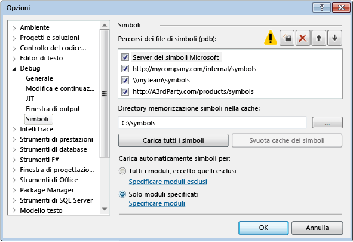
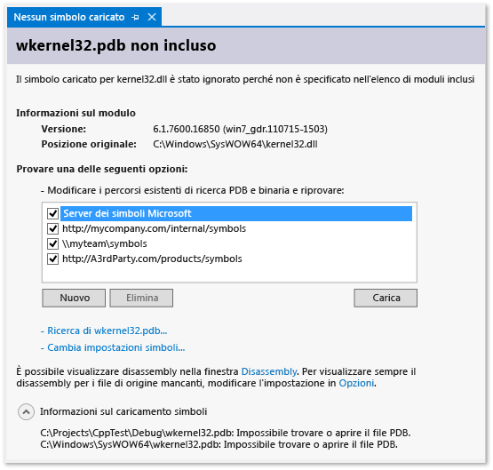

# Specifica di file di simboli con estensione pdb) e di file di origine nel debugger di Visual Studio
[!INCLUDE[vs2017banner](../code-quality/includes/vs2017banner.md)]

Un file di database di programma \(con estensione pdb\), denominato anche file di simboli, esegue il mapping degli identificatori creati nei file di origine per classi, metodi e altro codice agli identificatori utilizzati nei file eseguibili compilati del progetto. Il file con estensione pdb esegue inoltre il mapping delle istruzioni nel codice sorgente alle istruzioni di esecuzione nei file eseguibili. Il debugger utilizza queste informazioni per stabilire due informazioni chiave: il file di origine e il numero di riga visualizzati nell'IDE di Visual Studio e la posizione del file eseguibile in corrispondenza della quale arrestare l'esecuzione quando si imposta un punto di interruzione. Un file di simboli contiene anche il percorso originale dei file di origine e, facoltativamente, il percorso di un server di origine da cui è possibile recuperare i file di origine.  
  
 Quando si esegue il debug di un progetto nell'IDE di Visual Studio, il debugger conosce la posizione predefinita dei file con estensione pdf e i file di origine per il codice. Se si desidera eseguire il debug del codice al di fuori del codice sorgente del progetto, ad esempio il codice di Windows o di terze parti chiamato dal progetto, è necessario specificare il percorso del file con estensione pdb \(e, facoltativamente, i file di origine del codice esterno\) e tali file devono corrispondere esattamente alla compilazione dei file eseguibili.  
  
 Prima di Visual Studio 2012, per eseguire il debug del codice gestito in un dispositivo remoto era necessario che i file di simboli fossero presenti nel computer remoto. Questo tipo di operazione non è più così complesso. Tutti i file di simboli devono trovarsi nel computer locale o in un percorso specificato nella pagina **Strumenti \/ Opzioni \/ Debug \/ Simboli**.  
  
##   Percorsi in cui il debugger cerca i file con estensione pdb  
  
1.  Percorso specificato nella DLL o nel file eseguibile.  
  
     Per impostazione predefinita, se è stata eseguita la compilazione di una DLL o di un file eseguibile nel computer in uso, il linker inserisce il percorso completo e il nome del file associato con estensione pdb all'interno della DLL o del file eseguibile. Il debugger verifica in primo luogo se il file di simboli è presente nel percorso specificato nella DLL o nel file eseguibile. Ciò è utile in quanto si hanno sempre a disposizione simboli per il codice compilato nel computer in uso.  
  
2.  File con estensione pdb che potrebbero essere presenti nella stessa cartella della DLL o del file eseguibile.  
  
3.  Qualsiasi cartella della cache di simboli locale.  
  
4.  Qualsiasi percorso e server di simboli di rete, Internet o locali specificati, ad esempio il server di simboli Microsoft se abilitato.  
  
###   Motivi per cui i file di simboli devono corrispondere esattamente ai file eseguibili  
 Il debugger caricherà solo un file con estensione pdb per un file eseguibile che corrisponde esattamente al file pdb creato alla compilazione del file eseguibile \(il file pdb deve essere l'originale o una copia del file pdb originale\). Poiché il compilatore è ottimizzato per la velocità di compilazione, oltre all'attività principale di creazione di codice corretto ed efficiente, il layout effettivo di un file eseguibile può cambiare anche se il codice non è cambiato. Per altre informazioni, vedere il post del blog sulla [necessità di creare una corrispondenza esatta tra i file di simboli del debugger e i file binari con cui sono stati creati](https://blogs.msdn.microsoft.com/jimgries/2007/07/06/why-does-visual-studio-require-debugger-symbol-files-to-exactly-match-the-binary-files-that-they-were-built-with/).  
  
###   Specificare i percorsi dei simboli e il comportamento di caricamento  
 Quando si esegue il debug di un progetto nell'IDE di Visual Studio, il debugger carica automaticamente i file di simboli presenti nella directory del progetto. È possibile specificare percorsi di ricerca alternativi e server di simboli per Microsoft, Windows o i componenti di terze parti in **Strumenti \/ Opzioni \/ Debug \/ Simboli**. È anche possibile indicare moduli specifici per cui il debugger deve caricare automaticamente i simboli. È quindi possibile modificare queste impostazioni manualmente durante il debug.  
  
1.  In Visual Studio aprire la pagina **Strumenti \/ Opzioni \/ Debug \/ Simboli**.  
  
       
  
2.  Scegliere l'icona  della cartella. Nella casella **Percorsi dei file di simboli \(pdb\)** verrà visualizzato un testo modificabile.  
  
3.  Digitare l'URL o il percorso della directory del server di simboli o il percorso del simbolo. La funzione di completamento delle istruzioni facilita l'individuazione del formato corretto.  
  
4.  Per migliorare le prestazioni di caricamento dei simboli, digitare il percorso di una directory locale in cui i server di simboli possono copiare i simboli nella casella **Directory memorizzazione simboli nella cache**.  
  
    > [!NOTE]
    >  Non inserire la cache dei simboli in una cartella protetta, ad esempio la cartella C:\\Windows o una delle relative sottocartelle. Usare invece una cartella di lettura e scrittura.  
  
 **Specificare il comportamento di caricamento dei simboli**  
  
 È possibile specificare i file da caricare automaticamente dai percorsi della casella **Percorsi dei file di simboli \(pdb\)** all'avvio del debug. I file di simboli nella directory del progetto vengono sempre caricati.  
  
1.  Scegliere **Tutti i moduli, eccetto quelli esclusi** per caricare tutti i simboli per tutti i moduli, tranne quelli specificati alla scelta del collegamento **Specificare moduli esclusi**.  
  
2.  Scegliere l'opzione **Solo moduli specificati**, quindi scegliere **Specificare moduli** per elencare i moduli dei file di simboli che si desidera caricare automaticamente. I file di simboli per altri moduli vengono ignorati.  
  
 **Specificare opzioni dei simboli aggiuntive**  
  
 È anche possibile impostare le opzioni seguenti nella pagina **Strumenti \/ Opzioni \/ Debug \/ Simboli**:  
  
 **Avvisa se non vi sono simboli all'avvio \(solo nativo\)**  
  
 Se questa opzione è selezionata, viene visualizzata una finestra di dialogo di avviso ogni volta che si tenta di eseguire il debug di un programma per il quale non sono disponibili le informazioni sui simboli.  
  
 **Carica esportazioni DLL**  
  
 Se questa opzione è selezionata, vengono caricate le tabelle di esportazione DLL. Le informazioni sui simboli delle tabelle di esportazione DLL possono essere utili se si lavora con messaggi Windows, routine Windows \(WindowProc\), oggetti COM, marshalling o qualsiasi DLL per cui non sono disponibili simboli. La lettura di informazioni di esportazione DLL comporta del sovraccarico. Pertanto questa funzionalità è disattivata per impostazione predefinita.  
  
 Per visualizzare i simboli disponibili nella tabella di esportazione di una DLL, utilizzare `dumpbin /exports`. I simboli sono disponibili per tutte le DLL di sistema a 32 bit. Leggendo l'output di `dumpbin /exports`, è possibile visualizzare il nome esatto della funzione, compresi i caratteri non alfanumerici. Ciò risulta utile per impostare un punto di interruzione su una funzione. I nomi di funzione delle tabelle di esportazione DLL possono apparire troncati in altri punti del debugger. Le chiamate sono elencate nell'ordine di chiamata, con la funzione corrente \(al più alto livello di annidamento\) all'inizio dell'elenco. Per altre informazioni, vedere [dumpbin \/exports](/visual-cpp/build/reference/dash-exports).  
  
###   Usare i server di simboli per trovare i file di simboli che non sono presenti nel computer locale  
 [!INCLUDE[vsprvs](../code-quality/includes/vsprvs_md.md)] può scaricare i file di simboli di debug dai server di simboli che implementano il protocollo symsrv.[Visual Studio Team Foundation Server](../Topic/Index%20and%20publish%20symbol%20data.md) e gli [strumenti di debug per Windows](http://msdn.microsoft.com/library/windows/hardware/ff551063\(v=VS.85\).aspx) sono due componenti che implementano i server di simboli. Specificare i server di simboli da utilizzare nella finestra di dialogo **Opzioni** di Visual Studio.  
  
 I server di simboli utilizzabili includono i seguenti:  
  
 **Server dei simboli pubblici Microsoft**  
  
 Per eseguire il debug di un arresto anomalo del sistema che si verifica durante una chiamata a una DLL di sistema o a una libreria di terze parti, spesso sono necessari file con estensione pdb del sistema contenenti i simboli per DLL, file EXE e driver di dispositivo di Windows. È possibile ottenere questi simboli dai server dei simboli pubblici Microsoft. I server dei simboli pubblici Microsoft forniscono simboli per i sistemi operativi Windows, oltre a MDAC, IIS, ISA e [!INCLUDE[dnprdnshort](../code-quality/includes/dnprdnshort_md.md)].  
  
 Per utilizzare i server di simboli Microsoft, scegliere **Opzioni e impostazioni** dal menu **Debug**, quindi scegliere **Simboli**. Selezionare **Server dei simboli Microsoft**.  
  
 **Server di simboli in una rete interna o nel computer locale**  
  
 Il team o la società può creare server di simboli per i propri prodotti e come cache dei simboli provenienti da origini esterne. Nel computer potrebbe essere presente un server di simboli. È possibile immettere il percorso dei server di simboli sotto forma di URL o di percorso nella pagina **Debug**\/**Simboli** della finestra di dialogo **Opzioni** di Visual Studio.  
  
 **Server di simboli di terze parti**  
  
 I provider di terze parti di librerie e applicazioni Windows possono fornire accesso al server di simboli su Internet. L'URL di questi server di simboli, inoltre, viene immesso nella pagina **Debug**\/**Simboli**.  
  
> [!NOTE]
>  Se si usa un server di simboli diverso dai server di simboli pubblici Microsoft, accertarsi che il server di simboli e il relativo percorso siano attendibili. Poiché i file di simboli possono contenere codice eseguibile arbitrario, è possibile che l'utente venga esposto a rischi di sicurezza.  
  
###   Individuare e caricare i simboli durante il debug  
 Quando il debugger è in modalità di interruzione, è possibile caricare i simboli per un modulo precedentemente escluso dalle opzioni del debugger o non trovato dal compilatore. È possibile caricare i simboli dai menu di scelta rapida delle finestre Stack di chiamate, Moduli, Variabili locali, Auto e tutte le finestre Espressioni di controllo. Se il debugger interrompe il codice per cui non sono disponibili file di simboli o di origine, viene visualizzata una finestra del documento. Qui è possibile trovare informazioni sui file mancanti e intraprendere azioni per individuarli e caricarli.  
  
 **Individuare i simboli con pagine del documento Nessun simbolo caricato**  
  
 Per il debugger esistono vari modi per interrompere il codice per cui non sono disponibili simboli:  
  
1.  Esecuzione di istruzioni nel codice.  
  
2.  Interruzione del codice da un punto di interruzione o un'eccezione.  
  
3.  Passaggio a un thread differente.  
  
4.  Modifica dello stack frame facendo doppio clic su un frame nella finestra Stack di chiamate.  
  
 Quando si verifica uno di questi eventi, nel debugger viene visualizzata la pagina **Nessun simbolo caricato** per consentire l'individuazione e il caricamento dei simboli necessari.  
  
   
  
-   Per modificare i percorsi di ricerca, scegliere un percorso non selezionato o scegliere **Nuovo** e immettere un nuovo percorso. Scegliere **Carica** per cercare nuovamente i percorsi e per caricare il file di simboli se viene trovato.  
  
-   Scegliere **Ricerca di***nome eseguibile***...** per eseguire l'override di tutte le opzioni dei simboli e ripetere i percorsi di ricerca. Il file di simboli viene caricato se viene trovato. In alternativa, viene visualizzato Esplora file per selezionare manualmente il file di simboli.  
  
-   Scegliere **Cambia impostazioni simboli...** per visualizzare la pagina **Debug**\/**Simboli** della finestra di dialogo Opzioni di Visual Studio.  
  
-   Scegliere **visualizza disassembly** per visualizzare il disassembly in una nuova finestra una volta soltanto.  
  
-   Per visualizzare sempre il disassembly quando i file di origine o di simboli non vengono trovati, scegliere il collegamento **Finestra di dialogo Opzioni** e selezionare sia **Attiva debug a livello di indirizzo** sia **Mostra disassembly se l'origine non è disponibile**.  
  
       
  
 **Modificare le opzioni dei simboli dal menu di scelta rapida**  
  
 In modalità di interruzione è possibile trovare e caricare i simboli per gli elementi visualizzati nelle finestre Stack di chiamate, Moduli, Variabili locali, Auto e in tutte le finestre Espressioni di controllo. Selezionare un elemento nella finestra, aprire il menu di scelta rapida e scegliere una delle opzioni seguenti:  
  
|Opzione|Descrizione|  
|-------------|-----------------|  
|**Carica simboli**|Tenta di caricare i simboli dai percorsi specificati nella pagina **Debug**\/**Simboli** della finestra di dialogo **Opzioni**. Se il file di simboli non viene trovato, si apre Esplora file per consentire di specificare un nuovo percorso per la ricerca.|  
|**Informazioni sul caricamento simboli**|Vengono fornite informazioni che mostrano il percorso di un file di simboli caricato o i percorsi cercati se il file non è stato trovato dal debugger.|  
|**Impostazioni simboli...**|Viene visualizzata la pagina **Debug**\/**Simboli** della finestra di dialogo **Opzioni** di Visual Studio.|  
|**Caricare sempre automaticamente**|Aggiunge il file di simboli all'elenco di file caricati automaticamente dal debugger.|  
  
###   Impostare le opzioni del compilatore per i file di simboli  
 Quando si compila il progetto dall'IDE di Visual Studio e si utilizza la configurazione di compilazione **Debug** standard, i compilatori C\+\+ e gestiti creano i file di simboli appropriati per il codice. È inoltre possibile impostare le opzioni del compilatore sulla riga di comando per creare i file di simboli.  
  
 **Opzioni di C\+\+**  
  
 Un file di database di programma \(con estensione pdb\) contiene le informazioni relative al debug e allo stato del progetto che consentono il collegamento incrementale di una configurazione di debug del programma. Un file con estensione pdb viene creato quando si esegue una compilazione con [\/ZI o \/Zi](/visual-cpp/build/reference/z7-zi-zi-debug-information-format) \(per C\/C\+\+\).  
  
 In [!INCLUDE[vcprvc](../code-quality/includes/vcprvc_md.md)] l'opzione [\/Fd](/visual-cpp/build/reference/fd-program-database-file-name) assegna un nome al file con estensione pdb creato dal compilatore. Quando si crea un progetto in [!INCLUDE[vsprvs](../code-quality/includes/vsprvs_md.md)] con le procedure guidate, l'opzione **\/Fd** viene impostata in modo da creare un file con estensione pdb denominato *project*.pdb.  
  
 Se l'applicazione C\/C\+\+ viene compilata usando un makefile e si specifica **\/ZI** o **\/Zi** senza **\/Fd**, vengono generati due file con estensione pdb:  
  
-   VC*x*.pdb, dove *x* rappresenta la versione di Visual C\+\+, ad esempio VC11.pdb. In questo file, disponibile nella stessa directory in cui si trova il makefile del progetto, vengono memorizzate tutte le informazioni di debug relative ai singoli file OBJ.  
  
-   project.pdb   In questo file vengono archiviate tutte le informazioni di debug relative al file con estensione exe. Per C\/C\+\+, questo file si trova nella sottodirectory \\debug.  
  
 Ogni volta che crea un file OBJ, il compilatore C\/C\+\+ unisce le informazioni di debug nel file VC*x*.pdb. Queste includono informazioni sui tipi ma non sui simboli, quali le definizioni delle funzioni. Pertanto, anche se ogni file di origine include file di intestazione comuni, ad esempio \<windows.h\>, i typedef di tali intestazioni vengono archiviati solo una volta, anziché in ogni file OBJ.  
  
 Il linker crea il file project.pdb contenente informazioni di debug relative al file EXE del progetto. Il file project.pdb contiene non solo le informazioni sui tipi disponibili nel file VC*x*.pdb, ma tutte le informazioni di debug, inclusi i prototipi di funzione. Entrambi i file con estensione pdb supportano gli aggiornamenti incrementali. Il linker incorpora inoltre il percorso del file con estensione pdb nel file con estensione exe o dll creato.  
  
 Il debugger di [!INCLUDE[vsprvs](../code-quality/includes/vsprvs_md.md)] utilizza il percorso del file pdb specificato nel file con estensione exe o dll per trovare il file project.pdb. Se il file con estensione pdb non viene trovato in tale percorso oppure se il percorso non è valido, ad esempio perché il progetto è stato spostato in un altro computer, il debugger cerca nel percorso contenente il file exe i percorsi di simboli specificati nella finestra di dialogo **Opzioni** \(cartella **Debug**, nodo **Simboli**\). Il debugger non carica un file con estensione pdb che non corrisponde al file eseguibile sottoposto a debug. Se non viene trovato alcun file con estensione pdb, viene visualizzata una finestra di dialogo **Trova simboli** che consente di cercare simboli o aggiungere altri percorsi al percorso di ricerca.  
  
 **Opzioni di .NET Framework**  
  
 Un file di database di programma \(con estensione pdb\) contiene le informazioni relative al debug e allo stato del progetto che consentono il collegamento incrementale di una configurazione di debug del programma. Un file con estensione pdb viene creato quando si compila con **\/debug**. È possibile compilare applicazioni con **\/debug:full** o **\/debug:pdbonly**. Se si usa l'opzione di compilazione **\/debug:full**, verrà generato codice di cui è possibile effettuare il debug. Se si usa l'opzione di compilazione **\/debug:pdbonly**, vengono generati file con estensione pdb ma non l'attributo `DebuggableAttribute`, che indica al compilatore JIT che sono disponibili informazioni di debug. Usare **\/debug:pdbonly** per generare file con estensione pdb per una build di rilascio che non si vuole sottoporre a debug. Per altre informazioni, vedere [\/debug \(Emit Debugging Information\)](/dotnet/csharp/language-reference/compiler-options/debug-compiler-option) o [\/debug](/dotnet/visual-basic/reference/command-line-compiler/debug).  
  
 Il debugger di [!INCLUDE[vsprvs](../code-quality/includes/vsprvs_md.md)] utilizza il percorso del file pdb specificato nel file con estensione exe o dll per trovare il file project.pdb. Se il file con estensione pdb non viene trovato in tale percorso oppure se il percorso non è valido, viene eseguita una ricerca nel percorso contenente il file EXE e quindi nei percorsi di simboli specificati nella finestra di dialogo **Opzioni**. Questo percorso in genere corrisponde alla cartella **Debug** del nodo **Simboli**. Il debugger non carica un file con estensione pdb che non corrisponde al file eseguibile sottoposto a debug. Se non viene trovato alcun file con estensione pdb, viene visualizzata una finestra di dialogo **Trova simboli** che consente di cercare simboli o aggiungere altri percorsi al percorso di ricerca.  
  
 **Applicazioni Web**  
  
 Il file di configurazione dell'applicazione \(Web.config\) deve essere impostato sulla modalità debug. Tramite la modalità di debug, ASP.NET genera simboli per i file generati dinamicamente e il debugger si collega all'applicazione ASP.NET. Visual Studio configura automaticamente questa impostazione quando si avvia il debug, se il progetto è stato creato dal modello dei progetti Web.  
  
##   Individuare i file di origine  
  
###   Percorsi in cui il debugger cerca i file di origine  
 Il debugger cerca i file di origine nei seguenti percorsi:  
  
1.  File aperti nell'IDE dell'istanza di Visual Studio che ha avviato il debugger.  
  
2.  File nella soluzione aperta nell'istanza di Visual Studio.  
  
3.  Directory specificate nella pagina **Proprietà comuni**\/**Esegui debug dei file di origine** nelle proprietà della soluzione. In **Esplora soluzioni** selezionare il nodo della soluzione e selezionare **Proprietà**. \)  
  
4.  Informazioni di origine del file con estensione pdb del modulo. Può essere il percorso del file di origine alla compilazione del modulo o un comando a un server di origine.  
  
###   Individuare e caricare i file di origine con le pagine Nessuna origine\/Nessun simbolo caricato  
 Quando il debugger interrompe l'esecuzione in un percorso in cui il file di origine non è disponibile, visualizza le pagine **Nessuna origine caricata** o **Nessun simbolo caricato** che possono agevolare l'individuazione del file di origine. La pagina **Nessun simbolo caricato** viene visualizzata quando non viene trovato un file di simboli \(con estensione pdb\) per il file eseguibile per completare la ricerca. Nella pagina Nessun simbolo sono presenti opzioni per la ricerca del file. Se il file con estensione pdb viene trovato dopo l'esecuzione di una delle opzioni e il file di origine viene recuperato utilizzando le informazioni contenute nel file dei simboli, viene visualizzata l'origine. In caso contrario, viene visualizzata una pagina **Nessuna origine caricata** per descrivere il problema. Nella pagina vengono visualizzati collegamenti di opzione che consentono di eseguire azioni al fine di risolvere il problema.  
  
###   Aggiungere i percorsi di ricerca dei file di origine a una soluzione  
 È possibile specificare una rete o directory locali in cui cercare i file di origine.  
  
1.  In Esplora soluzioni selezionare la soluzione, quindi scegliere **Proprietà** dal menu di scelta rapida.  
  
2.  Nel nodo **Proprietà comuni** scegliere **Esegui debug dei file di origine**.  
  
3.  Fare clic sull’icona  della cartella. Nell'elenco **Directory contenenti codice sorgente** viene visualizzato testo modificabile.  
  
4.  Aggiungere il percorso che si desidera cercare.  
  
 Si noti che la ricerca viene eseguita solo nella directory specificata. È necessario aggiungere voci per qualsiasi sottodirectory da cercare.  
  
###   Usare i server di origine  
 Quando il codice sorgente non è disponibile nel computer locale oppure il file con estensione pdb non corrisponde al codice sorgente, è possibile usare il server di origine per eseguire il debug di un'applicazione. Il server di origine riceve richieste di file e restituisce i file effettivi. Questo server viene eseguito tramite un file DLL denominato srcsrv.dll. Il server di origine legge il file con estensione pdb dell'applicazione, che contiene i puntatori al repository del codice sorgente nonché alcuni comandi utilizzati per recuperare il codice sorgente dal repository. È possibile limitare i comandi che è consentito eseguire dal file con estensione pdb dell'applicazione specificando i comandi consentiti all'interno di un file srcsrv.ini, che deve essere inserito nella stessa directory dei file srcsrv.dll e devenv.exe.  
  
> [!IMPORTANT]
>  Poiché è possibile incorporare i comandi arbitrari nel file pdb dell'applicazione, assicurarsi di inserire nel file srcsrv.ini solo quelli da eseguire. Eventuali tentativi di eseguire un comando non presente nel file srcsvr.ini causerà la visualizzazione di una finestra di dialogo di conferma. Per altre informazioni, vedere [Avviso di sicurezza: il debugger deve eseguire un comando non attendibile](../debugger/security-warning-debugger-must-execute-untrusted-command.md). Poiché non viene eseguita alcuna convalida sui parametri dei comandi, prestare attenzione nell'utilizzare i comandi attendibili. Se ad esempio si considera attendibile il file cmd.exe, un utente malintenzionato potrebbe specificare parametri in grado di rendere dannoso il comando.  
  
 **Per abilitare l'utilizzo di un server di origine**  
  
1.  Verificare di avere rispettato i requisiti di sicurezza descritti nella sezione precedente.  
  
2.  Scegliere **Opzioni** dal menu **Strumenti**.  
  
     Verrà visualizzata la finestra di dialogo **Opzioni**.  
  
3.  Nel nodo **Debug** scegliere **Generale**.  
  
4.  Selezionare la casella di controllo **Attiva il supporto del server di origine**.  
  
       
  
5.  \(Facoltativo\) Scegliere le opzioni figlio desiderate.  
  
     Si noti che sia **Consenti server origine per assembly parzialmente attendibili \(solo gestito\)** che **Esegui sempre comandi del server di origine non attendibili senza chiedere conferma** possono aumentare i rischi di sicurezza descritti.  
  
## Vedere anche  
 [Modifiche nel caricamento remoto dei simboli .NET in Visual Studio 2012 e 2013](http://blogs.msdn.com/b/visualstudioalm/archive/2013/10/16/net-remote-symbol-loading-changes-in-visual-studio-2012-and-2013.aspx)