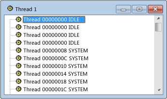

# Threads View
[!INCLUDE[vs2017banner](../code-quality/includes/vs2017banner.md)]

Nella visualizzazione thread vengono elencati in modo completo tutti i thread associati alle finestre del sistema.  Vengono visualizzati l'ID del thread e il nome del modulo per ogni thread.  I processi non sono inclusi, tuttavia si può individuare facilmente il processo a cui appartiene un thread selezionato.  
  
## Procedure  
  
#### Per aprire la visualizzazione thread  
  
1.  Scegliere **Thread** dal menu **Spy**.  
  
   
Visualizzazione Thread di Spy\+\+  
  
 Nella figura precedente viene mostrata la visualizzazione thread.  
  
## Argomenti della sezione  
 [Ricerca di un thread nella visualizzazione thread](../debugger/how-to-search-for-a-thread-in-threads-view.md)  
 Viene illustrato come individuare un thread specifico nella visualizzazione thread.  
  
 [Visualizzazione delle proprietà del thread](../debugger/how-to-display-thread-properties.md)  
 Viene illustrato come visualizzare ulteriori informazioni su un thread.  
  
## Sezioni correlate  
 [Visualizzazioni di Spy\+\+](../debugger/spy-increment-views.md)  
 Vengono illustrate le visualizzazioni struttura ad albero di Spy\+\+ relative a finestre, messaggi, processi e thread.  
  
 [Utilizzo di Spy\+\+](../debugger/using-spy-increment.md)  
 Vengono illustrati lo strumento Spy\+\+ e il relativo utilizzo.  
  
 [Finestra di dialogo Ricerca thread](../debugger/thread-search-dialog-box.md)  
 Utilizzata per individuare il nodo relativo a un thread specifico nella visualizzazione thread.  
  
 [Finestra di dialogo Proprietà thread](../debugger/message-properties-dialog-box.md)  
 Vengono visualizzate le proprietà di un thread selezionato nella visualizzazione thread o messaggi.  
  
 [Riferimenti per Spy\+\+](../debugger/spy-increment-reference.md)  
 Sono incluse le sezioni in cui vengono descritti tutti i menu e le finestre di dialogo di Spy\+\+.