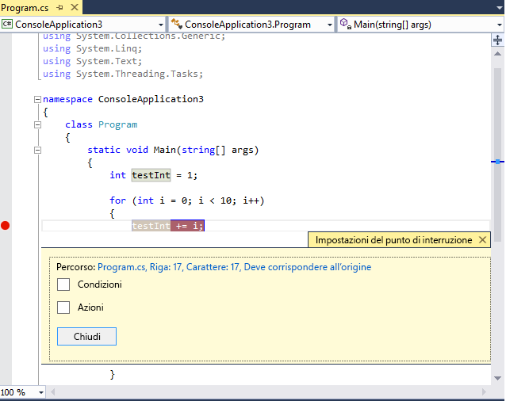
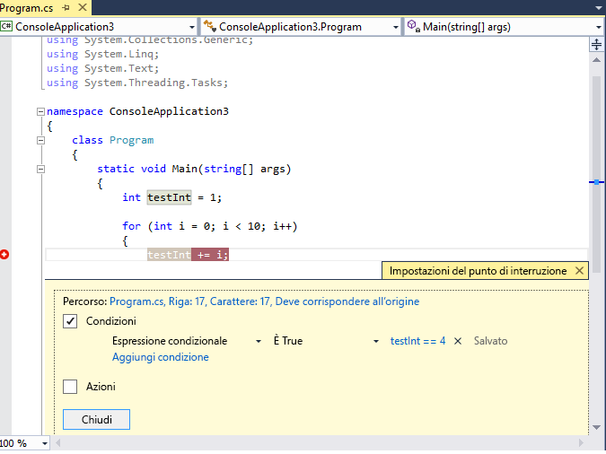
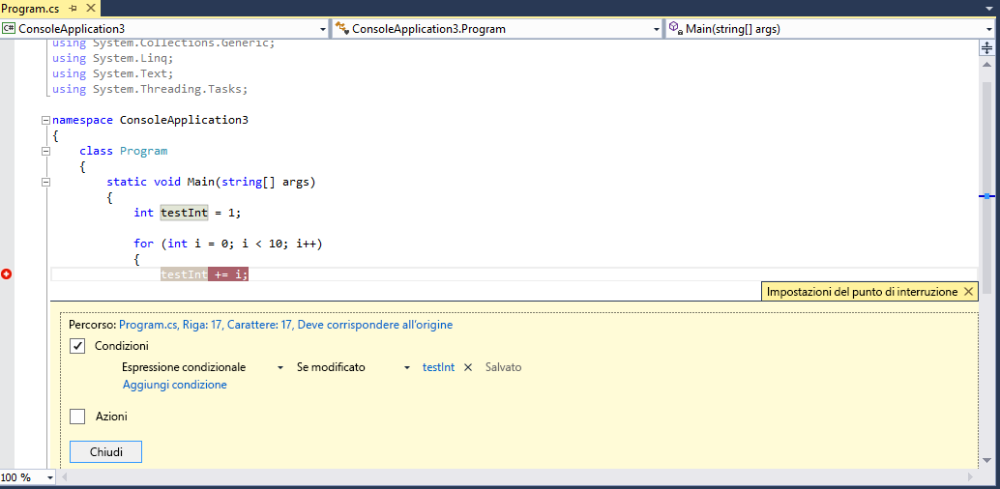
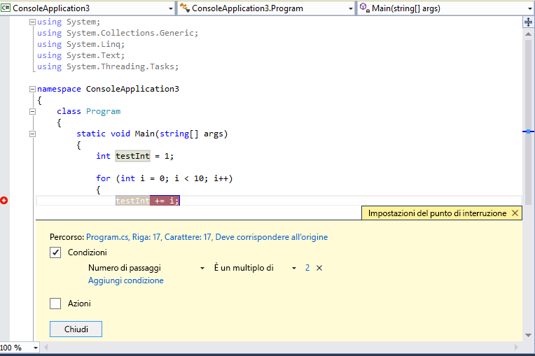

# Uso di punti di interruzione
[!INCLUDE[vs2017banner](../code-quality/includes/vs2017banner.md)]

È possibile impostare i punti di interruzione quando si desidera arrestare l'esecuzione del debugger, ad esempio per visualizzare lo stato delle variabili di codice o per esaminare lo stack di chiamate. I punti di interruzione rappresentano una delle tecniche di debug più importanti nella casella degli strumenti dello sviluppatore.  
  
##  <a name="BKMK_Overview"></a> Impostazione di un punto di interruzione di funzione nel codice sorgente  
 È possibile impostare un punto di interruzione di funzione nel codice sorgente facendo clic sul margine sinistro di un file di codice sorgente o posizionando il cursore su una riga di codice e premendo F9. Il punto di interruzione viene visualizzato come un punto rosso nel margine sinistro ed anche la riga di codice risulta colorata:  
  
   
  
 Quando si esegue questo codice nel debugger, l'esecuzione viene interrotta ogni volta che viene raggiunto il punto di interruzione, prima che venga eseguito il codice su tale riga. La riga di codice sorgente è di colore giallo:  
  
   
  
 A questo punto il valore di `testInt` è ancora 1.  
  
 È possibile esaminare lo stato corrente dell'applicazione, inclusi i valori delle variabili e lo stack di chiamate. Per altre informazioni sullo stack di chiamate, vedere [Procedura: utilizzare la finestra Stack di chiamate](../debugger/how-to-use-the-call-stack-window.md).  
  
 È possibile impostare un punto di interruzione in qualsiasi riga di codice eseguibile. Ad esempio, nel codice C\# sopra riportato è possibile impostare un punto di interruzione nella dichiarazione di variabile, nel ciclo `for` o in qualsiasi codice all'interno del ciclo `for`, ma non è possibile impostare un punto di interruzione nello spazio dei nomi, nelle dichiarazioni di classe o nella firma del metodo.  
  
##  <a name="BKMK_Set_a_breakpoint_in_a_source_file"></a> Impostazione di altri tipi di punti di interruzione  
 È possibile anche impostare i punti di interruzione nello stack di chiamate, nella finestra Disassembly e nel codice C\+\+ nativo, in una condizione dati o in un indirizzo di memoria.  
  
## Impostazione di un punto di interruzione nella finestra Stack di chiamate  
 È possibile interrompere l'esecuzione in corrispondenza dell'istruzione o della riga restituita da una funzione chiamante impostando un punto di interruzione nella finestra **Stack di chiamate**. Per altre informazioni sullo stack di chiamate, vedere [Procedura: utilizzare la finestra Stack di chiamate](../debugger/how-to-use-the-call-stack-window.md). L'esecuzione del debugger deve essere stata interrotta.  
  
1.  Avviare il debug dell'applicazione e attendere che l'esecuzione venga interrotta \(ad esempio, in un punto di interruzione\). Aprire la finestra **Stack di chiamate** \(**Debug\/Windows\/Stack di chiamate** o **CTRL\+ALT\+C**\).  
  
2.  Fare clic con il pulsante destro del muse sulla funzione di chiamata e quindi selezionare **Punto di interruzione\/Inserisci punto di interruzione** oppure usare semplicemente il tasto di scelta rapida **F9**.  
  
3.  Sul margine sinistro dello stack di chiamate, accanto al nome della chiamata di funzione, verrà visualizzato il simbolo del punto di interruzione.  
  
 Nella finestra **Punti di interruzione**, il punto di interruzione dello stack di chiamate viene visualizzato come indirizzo con una posizione di memoria corrispondente alla successiva istruzione eseguibile nella funzione. Il debugger interrompe l'esecuzione in corrispondenza dell'istruzione.  
  
 Per rilevare visivamente i punti di interruzione durante l'esecuzione del codice, vedere [Mappare i metodi sullo stack di chiamate durante il debug](../debugger/map-methods-on-the-call-stack-while-debugging-in-visual-studio.md).  
  
## Impostazione di un punto di interruzione nella finestra Disassembly  
 Per impostare un punto di interruzione in corrispondenza di un'istruzione di assembly, è necessario che il debugger sia in modalità di interruzione.  
  
1.  Avviare il debug dell'applicazione e attendere che l'esecuzione venga interrotta \(ad esempio, in un punto di interruzione\). Aprire la finestra **Disassembly** \(**Debug\/Windows\/Disassembly** o **CTRL\+ALT\+D**\).  
  
2.  Fare clic sul margine sinistro dell'istruzione che si desidera interrompere o impostare il cursore nell'istruzione e premere **F9**.  
  
## Impostazione di un punto di interruzione dei dati \(solo C\+\+ nativo\)  
 I punti di interruzione dei dati interrompono l'esecuzione quando un valore archiviato in un indirizzo di memoria specificato viene modificato. Se il valore viene letto ma non modificato, l'esecuzione non viene interrotta. Per impostare i punti di interruzione dei dati, è necessario che il debugger sia in modalità di interruzione.  
  
1.  Avviare il debug dell'applicazione e attendere che venga raggiunto un punto di interruzione. Nel menu **Debug** scegliere **Nuovo punto di interruzione\/Punto di interruzione dei dati** \(o aprire la finestra **Punti di interruzione** e scegliere **Nuovo\/Punto di interruzione dei dati**.  
  
2.  Nella casella **Indirizzo** digitare un indirizzo di memoria o un'espressione che restituisca un indirizzo di memoria. Ad esempio, digitare `&avar` per eseguire l'interruzione quando viene modificato il contenuto della variabile `avar`.  
  
3.  Nell'elenco a discesa **Conteggio byte** selezionare il numero di byte che si desidera controllare tramite il debugger. Ad esempio, se si seleziona **4**, il debugger controllerà i quattro byte a partire da `&avar` e si interromperà se viene modificato il valore di uno di questi byte.  
  
 Tenere presente che i punti di interruzione dei dati dipendono dall'applicabilità di indirizzi di memoria specifici.  
  
-   L'indirizzo di una variabile cambia da una sessione di debug a quella successiva. I punti di interruzione dei dati vengono disabilitati automaticamente alla fine di ogni sessione di debug.  
  
-   Se si imposta un punto di interruzione dei dati in una variabile locale, il punto di interruzione resta abilitato quando la funzione termina, ma l'indirizzo di memoria non è più applicabile e il comportamento del punto di interruzione è imprevedibile. Se si imposta un punto di interruzione dei dati su una variabile locale, è consigliabile rimuoverlo o disabilitarlo prima che la funzione termini.  
  
 I punti di interruzione dei dati non funzionano nei seguenti casi:  
  
-   Un processo di cui non viene eseguito il debug scrive nella posizione di memoria  
  
-   La posizione di memoria è condivisa tra due o più processi  
  
-   La posizione di memoria viene aggiornata all'interno del kernel. Ad esempio, se passata alla funzione `ReadFile` di Windows a 32 bit, la memoria viene aggiornata dalla modalità kernel e il debugger non viene interrotto durante la scrittura nella memoria.  
  
## Impostazione di un punto di interruzione con un indirizzo di memoria \(solo C\+\+ nativo\)  
 È possibile anche usare l'indirizzo di un oggetto per impostare un punto di interruzione in un metodo chiamato per un'istanza specifica di una classe.  Di seguito è riportato un esempio:  
  
 Si consideri ad esempio un oggetto di tipo `my_class` con l'indirizzo, è possibile impostare un punto di interruzione della funzione in un metodo denominato  `my_method` chiamato da tale istanza.  
  
1.  Impostare un punto di interruzione dopo la creazione dell'istanza della classe.  
  
2.  Trovare l'indirizzo dell'istanza \(ad esempio `0xcccccccc`\).  
  
3.  Fare clic su **Debug\/Nuovo punto di interruzione\/Punto di interruzione della funzione** \(o **ALT\+F9, B**\).  
  
4.  Aggiungere il testo seguente nella casella **Nome funzione**:  
  
    ```cpp  
    ((my_class *) 0xcccccccc)->my_method  
    ```  
  
##  <a name="BKMK_Specify_advanced_properties_of_a_breakpoint_"></a> Gestione di punti di interruzione  
 È possibile usare la finestra **Punti di interruzione** \(**Debug\/Windows\/Punti di interruzione** o **CTRL\+ALT\+B**\) per visualizzare tutti i punti di interruzione impostati nella soluzione:  
  
   
  
 La finestra **Punti di interruzione** costituisce tuttavia una posizione centrale da cui gestire tutti i punti di interruzione, che può essere particolarmente utile per una soluzione di grandi dimensioni o per uno scenario di debug complesso in cui i punti di interruzione sono cruciali. Se è necessario salvare o condividere lo stato e la posizione di un set di punti di interruzione, è possibile esportare e importare i punti di interruzione unicamente dalla finestra **Punti di interruzione**.  
  
##  <a name="BKMK_Specify_a_breakpoint_condition_using_a_code_expression"></a> Punti di interruzione avanzati  
  
## Condizioni punto di interruzione  
 È possibile controllare dove e quando un punto di interruzione viene eseguito impostando le condizioni.  
  
1.  Fare clic con il pulsante destro del mouse sul punto di interruzione o passare il mouse sul punto di interruzione e scegliere l'icona di impostazioni.  
  
2.  Nel menu di scelta rapida, selezionare **Condizioni**. Viene visualizzata la finestra **Impostazioni del punto di interruzione**:  
  
   
  
 Quando si seleziona la casella **Condizioni**, la finestra si espande per visualizzare i diversi tipi di condizioni.  
  
 **Espressione condizionale:** quando si seleziona Espressione condizionale, è possibile scegliere due condizioni: **È true** e **Se modificato**. Scegliere **È true** se si desidera interrompere l'esecuzione quando l'espressione viene soddisfatta, oppure scegliere **Se modificato** se si desidera interrompere l'esecuzione quando il valore dell'espressione è cambiato.  
  
 Nell'esempio seguente il punto di interruzione viene impostato in modo che venga raggiunto solo quando il valore di `testInt` è **4**:  
  
   
  
 Nell'esempio seguente il punto di interruzione viene impostato in modo che venga raggiunto solo quando il valore di `testInt` viene modificato:  
  
   
  
 Il comportamento del campo Se modificato è diverso per i diversi linguaggi di programmazione. Se si sceglie **Se modificato** per il codice nativo, la prima valutazione della condizione non viene considerata una modifica dal debugger, pertanto il punto di interruzione non viene raggiunto alla prima valutazione. Se si sceglie **Se modificato** per il codice gestito, il punto di interruzione viene raggiunto alla prima valutazione dopo la selezione di **Se modificato**.  
  
 Se si imposta una condizione del punto di interruzione con sintassi non valida, viene visualizzato un messaggio di avviso. Se viene specificata una condizione del punto di interruzione con sintassi valida ma con semantica non valida, viene visualizzato un messaggio di avviso la prima volta che si raggiunge il punto di interruzione. In entrambi i casi, il debugger interrompe l'esecuzione quando si raggiunge il punto di interruzione non valido. Il punto di interruzione viene ignorato solo se la condizione è valida e restituisce `false`.  
  
 La condizione può essere una qualsiasi espressione valida riconosciuta dal debugger. Per altre informazioni sulle espressioni valide, vedere [Espressioni nel debugger](../debugger/expressions-in-the-debugger.md).  
  
## Uso di ID oggetto in condizioni del punto di interruzione \(C\# e F\#\)  
 Possono esistere situazioni in cui si vuole osservare il comportamento di un oggetto specifico, ad esempio si potrebbe voler scoprire perché un oggetto è stato inserito più volte in una raccolta. In C\# e F\# è possibile creare ID oggetto per istanze specifiche dei [tipi riferimento](/dotnet/csharp/language-reference/keywords/reference-types) e usarle nelle condizioni del punto di interruzione. L'ID oggetto viene generato dai servizi di debug di Common Language Runtime \(CLR\) e associato all'oggetto.  Per creare un ID oggetto, procedere come segue:  
  
1.  Impostare un punto di interruzione nel codice dopo la creazione dell'oggetto.  
  
2.  Avviare il debug e quando l'esecuzione si arresta nel punto di interruzione, trovare il punto di interruzione nella finestra **Variabili locali**, fare clic con il pulsante destro del mouse su di esso e scegliere **Crea ID oggetto**.  
  
     Nella finestra **Variabili locali** verrà visualizzato il simbolo **$** insieme a un numero. Si tratta dell'ID oggetto.  
  
3.  Aggiungere un nuovo punto di interruzione condizionale nella posizione da analizzare, ad esempio il momento in cui l'oggetto viene aggiunto alla raccolta.  
  
4.  Usare l'ID oggetto nel campo Espressione condizionale. Ad esempio, se c'è una variabile `item` che fa riferimento all'oggetto da aggiungere alla raccolta, inserire **item \=\= $n**, dove **n** è il numero ID dell'oggetto.  
  
     L'esecuzione si interromperà in corrispondenza del punto in cui l'oggetto deve essere aggiunto alla raccolta.  
  
 Se in un secondo momento si vuole eliminare l'ID oggetto, fare doppio con il pulsante destro del mouse nella finestra **Variabili locali** e scegliere **Elimina ID oggetto**.  
  
 Notare che gli ID oggetto creano riferimenti deboli e non impediscono all'oggetto di essere sottoposto a Garbage Collection. Sono validi solo per la sessione di debug corrente.  
  
## Numero di passaggi  
 Se si ritiene che un ciclo nel codice inizi a presentare un comportamento errato dopo alcune iterazioni, è possibile impostare un punto di interruzione per arrestare l'esecuzione dopo un numero specificato di passaggi alla riga di codice associata, anziché premere ripetutamente **F5** per raggiungere il livello di iterazione.  
  
 Nella finestra **Impostazioni del punto di interruzione** impostare la condizione su **Numero di passaggi**. È quindi possibile specificare il numero di iterazioni. Nell'esempio seguente il punto di interruzione viene impostato in modo che venga raggiunto con qualsiasi altra iterazione:  
  
   
  
## Filtro  
 È possibile limitare un punto di interruzione da attivare solo su dispositivi specificati o in thread e processi specificati.  
  
 Nella finestra **Impostazioni del punto di interruzione** impostare la condizione su **Filtro**. Immettere una o più delle espressioni seguenti.  
  
-   MachineName \= "name"  
  
-   ProcessId \= value  
  
-   ProcessName \= "name"  
  
-   ThreadId \= value  
  
-   ThreadName \= "name"  
  
 Racchiudere i valori String tra virgolette doppie. È possibile combinare clausole usando `&` \(AND\), `||` \(OR\), `!` \(NOT\) e le parentesi.  
  
##  <a name="BKMK_Print_to_the_Output_window_with_tracepoints"></a> Azioni dei punti di interruzione e punti di analisi  
 Un punto di analisi è un punto di interruzione che visualizza un messaggio nella finestra Output. Un punto di analisi può fungere da istruzione di analisi temporanea nel linguaggio di programmazione.  
  
 Nella finestra **Impostazioni del punto di interruzione** selezionare la casella **Azioni**. Scegliere **Registra un messaggio nella finestra di output** nel gruppo **Azione**. È possibile visualizzare una stringa generica, ad esempio **Questo è un test**. Per includere il valore di una variabile o espressione, racchiuderlo tra parentesi graffe.  
  
 Per interrompere l'esecuzione quando viene raggiunto il punto di analisi, deselezionare la casella di controllo **Continua esecuzione**. Se l'opzione **Continua esecuzione** è selezionata, l'esecuzione non viene interrotta. In entrambi i casi, il messaggio viene visualizzato.  
  
 È possibile usare le seguenti parole chiave speciali nel **Messaggio**.  
  
|||  
|-|-|  
|**$ADDRESS**|Istruzione corrente|  
|**$CALLER**|Scegliere il nome della funzione|  
|**$CALLSTACK**|Stack di chiamate|  
|**$FUNCTION**|Nome della funzione corrente|  
|**$PID**|ID processo|  
|**$PNAME**|Nome processo|  
|**$TID**|ID thread|  
|**$TNAME**|Nome thread|  
|**$TICK**||  
|**$TNAME**||  
  
##  <a name="BKMK_Set_a_breakpoint_at_a_function_return_in_the_Call_Stack_window"></a> Etichette dei punti di interruzione  
 Le etichette dei punti di interruzione sono usate solo nella finestra **Punti di interruzione** per ordinare e filtrare l'elenco dei punti di interruzione. Per aggiungere un'etichetta a un punto di interruzione, scegliere la riga del punto di interruzione, quindi scegliere **Etichetta** dal menu di scelta rapida.  
  
## Esportare e importare punti di interruzione  
 È possibile esportare un punto di interruzione in un file XML facendo clic con il pulsante destro del mouse sul punto di interruzione e selezionando **Esporta**. Il file viene salvato per impostazione predefinita nella directory della soluzione. Per importare i punti di interruzione, aprire la finestra **Punti di interruzione** \(**CTRL\+ALT\+B**\) e nella barra degli strumenti fare clic sulla freccia rivolta verso destra \(la descrizione comando è **Importa i punti di interruzione da un file**\).  
  
## Risolvere problemi relativi ai punti di interruzione  
  
### Un punto di interruzione è stato eliminato ma si continua a raggiungerlo quando si avvia nuovamente il debug  
 Se un punto di interruzione è stato eliminato durante il debug, in alcuni casi è possibile raggiungerlo nuovamente la volta successiva che si avvia il debug. Per evitare di raggiungere il punto di interruzione, accertarsi che tutte le istanze del punto di interruzione vengano rimosse dalla finestra **Punti di interruzione**.  
  
### Il debugger non è in grado di individuare la versione corretta del file di origine di un punto di interruzione  
 Se un file di origine è stato modificato e l'origine non corrisponde più al codice di cui si esegue il debug, il debugger potrebbe non essere in grado di individuare il file di origine corrispondente a un punto di interruzione, sebbene tale file esista.  
  
1.  Per fare in modo che Visual Studio visualizzi un codice sorgente che non corrisponde alla versione sottoposta a debug, scegliere **Debug\/Opzioni e impostazioni**. Nella pagina **Debug\/Generale** deselezionare l'opzione **Richiedi corrispondenza esatta dei file di origine con la versione originale**.  
  
2.  È inoltre possibile associare il punto di interruzione al file di origine. Selezionare il punto di interruzione e scegliere **Condizioni** dal menu di scelta rapida. Selezionare **Il codice sorgente può essere diverso dalla versione originale** nella finestra di dialogo **Impostazioni del punto di interruzione**.  
  
### I punti di interruzione non funzionano in una DLL  
 Non è possibile impostare un punto di interruzione in un file di origine se le informazioni di debug per il modulo in cui si trova il codice non sono state caricate dal debugger. Uno dei sintomi è la visualizzazione di messaggi quali **Impossibile impostare il punto di interruzione**. Nella posizione relativa al punto di interruzione appare un'icona di interruzione di avviso. Tali punti di interruzioni di avviso, tuttavia, si trasformano in punti di interruzione effettivi al caricamento del codice. Per altre informazioni sul caricamento dei simboli, vedere [Specifica di file di simboli \(con estensione pdb\) e di origine](../debugger/specify-symbol-dot-pdb-and-source-files-in-the-visual-studio-debugger.md).  
  
## Vedere anche  
 [Spostarsi nel codice con il Debugger](../debugger/navigating-through-code-with-the-debugger.md)