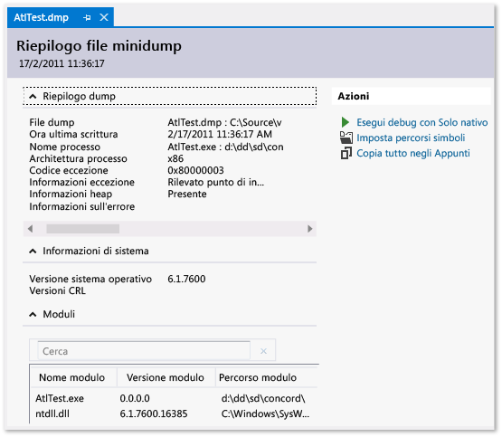

# Utilizzo di file dump per eseguire il debug di applicazioni arrestate in modo anomalo e bloccate in Visual Studio
[!INCLUDE[vs2017banner](../code-quality/includes/vs2017banner.md)]

File dump con o senza heap; creare un file dump; aprire un file dump; individuare i file binari, i file pdb e il file di origine di un file dump.  
  
##   Sommario  
 [Definizione di un file dump](#BKMK_What_is_a_dump_file_)  
  
 [File dump, con o senza heap](#BKMK_Dump_files__with_or_without_heaps)  
  
 [Requisiti e limitazioni](#BKMK_Requirements_and_limitations)  
  
 [Creare un file dump](#BKMK_Create_a_dump_file)  
  
 [Aprire un file dump](#BKMK_Open_a_dump_file)  
  
 [Individuare i file binari, i file di simboli (con estensione pdb) e i file di origine](#BKMK_Find_binaries__symbol___pdb__files__and_source_files)  
  
##   Definizione di un file dump  
 Un *file dump* rappresenta uno snapshot di un'app al momento in cui viene creato.  Indica il processo in esecuzione e i moduli caricati.  Se il dump è stato salvato con informazioni heap, contiene uno snapshot delle attività svolte nella memoria dell'app in quel momento.  L'apertura di un file dump con un heap in Visual Studio è simile all'arresto in corrispondenza di un punto di interruzione in una sessione di debug.  Sebbene non sia possibile continuare l'esecuzione, è possibile esaminare gli stack, i thread e i valori delle variabili dell'app al momento in cui si è verificato il dump.  
  
 I dump vengono utilizzati principalmente per il debug di problemi che si verificano nei computer a cui lo sviluppatore non ha accesso.  Ad esempio, è possibile utilizzare un file dump del computer di un cliente quando non è possibile riprodurre nel proprio computer il blocco o l'arresto anomalo avvenuto nel computer del cliente.  I dump vengono inoltre creati dai tester per salvare i dati relativi a un arresto anomalo o un blocco per eseguire altre verifiche nel computer di test.  Il debugger di Visual Studio può salvare i file dump per il codice gestito o nativo.  Il debugger può caricare i file dump creati da Visual Studio o da altri programmi che salvano i file in formato *minidump*.  
  
  [Sommario](#BKMK_Contents)  
  
##   File dump, con o senza heap  
 È possibile creare file dump con o senza informazioni heap.  
  
-   I **file dump con heap** contengono uno snapshot della memoria dell'app.  Sono inclusi i valori delle variabili al momento della creazione del dump.  Se si carica un file dump salvato con un heap, Visual Studio potrà caricare i simboli anche se il file binario dell'applicazione non è disponibile.  Visual Studio salva inoltre i file binari dei moduli nativi caricati nel file dump, che possono semplificare il debug.  
  
-   I **file dump senza heap** sono molto più piccoli dei dump contenenti informazioni sull'heap.  Il debugger deve tuttavia caricare i file binari dell'app per trovare informazioni sui simboli.  I file binari devono corrispondere esattamente ai file binari utilizzati alla creazione del dump.  Solo i valori delle variabili dello stack vengono salvati nei file dump senza dati dell'heap.  
  
  [Sommario](#BKMK_Contents)  
  
##   Requisiti e limitazioni  
  
-   Il debug di file dump del codice ottimizzato può generare confusione.  Ad esempio, l'incorporamento di funzioni del compilatore può comportare stack di chiamate imprevisti e altre ottimizzazioni potrebbero modificare la durata delle variabili.  
  
-   Il debug dei file dump di computer a 64 bit deve essere eseguito in un'istanza di Visual Studio in esecuzione in un computer a 64 bit.  
  
-   Nelle versioni di Visual Studio precedenti a VS 2013, i dump delle app a 32 bit eseguite in computer a 64 bit raccolti da alcuni strumenti \(ad esempio Gestione attività e WinDbg a 64 bit\) potrebbero non essere aperti in Visual Studio.  In VS 2013 questa limitazione è stata eliminata.  
  
-   Visual Studio può eseguire il debug dei file dump delle app native di dispositivi ARM.  Visual Studio può inoltre eseguire il debug dei file dump di app gestite di dispositivi ARM, ma solo nel debugger nativo.  
  
-   Per eseguire il debug di file dump in [modalità kernel](http://msdn.microsoft.com/library/windows/hardware/ff551880.aspx) in Visual Studio 2013, scaricare la [Versione per Windows 8.1 degli strumenti di debug per Windows](http://msdn.microsoft.com/windows/hardware/gg463009).  Vedere la pagina relativa al [debug del kernel in Visual Studio](http://msdn.microsoft.com/library/windows/hardware/jj149675.aspx).  
  
-   Visual Studio non può eseguire il debug di file dump salvati nel formato dump precedente noto come [dump completo in modalità utente](http://msdn.microsoft.com/library/windows/hardware/ff545506.aspx).  Si noti che un dump completo in modalità utente non corrisponde a un dump con heap.  
  
-   Per eseguire il debug con [SOS.dll \(SOS Debugging Extension\)](../Topic/SOS.dll%20\(SOS%20Debugging%20Extension\).md) in Visual Studio, è necessario installare gli Strumenti di debug per Windows che fanno parte di Windows Driver Kit \(WDK\).  Vedere [Windows 8.1 Preview: scaricare kit, bit e strumenti](http://msdn.microsoft.com/library/windows/hardware/bg127147.aspx).  
  
  [Sommario](#BKMK_Contents)  
  
##   Creare un file dump  
 Per creare un file dump con Visual Studio:  
  
-   Durante il debug di un processo in Visual Studio, è possibile salvare un file dump quando il debugger è stato arrestato in corrispondenza di un'eccezione o di un punto di interruzione.  Scegliere **Salva dump con nome**, **Debug**.  Nell'elenco **Salva come tipo** della finestra di dialogo **Salva dump con nome**, è possibile selezionare **Minidump** o **Minidump con heap** \(impostazione predefinita\).  
  
-   Con [Debug JIT](../debugger/just-in-time-debugging-in-visual-studio.md) abilitato, è possibile connettere il debugger a un processo arrestatosi in modo anomalo all'esterno del debugger e salvare un file dump.  Vedere [Connessione a processi in esecuzione](../debugger/attach-to-running-processes-with-the-visual-studio-debugger.md)Connessione a processi in esecuzione con il debugger di Visual Studio  
  
 È inoltre possibile creare file dump con qualsiasi programma che supporta il formato di minidump di Windows.  Ad esempio, tramite l'utilità della riga di comando **Procdump** di [Windows Sysinternals](http://technet.microsoft.com/sysinternals/default) è possibile creare file dump di arresto anomalo del processo basati su trigger o su richiesta.  Per ulteriori informazioni sull'utilizzo di altri strumenti per la creazione di file dump, vedere [Requisiti e limitazioni](../debugger/using-dump-files.md#BKMK_Requirements_and_limitations).  
  
  [Sommario](#BKMK_Contents)  
  
##   Aprire un file dump  
  
1.  In Visual Studio scegliere **File**, **Apri**, **File**.  
  
2.  Individuare e selezionare il file dump nella finestra di dialogo **Apri file**.  Il file dump in genere ha l'estensione dmp.  Scegliere quindi **OK**.  
  
3.  Verrà visualizzata la finestra **Riepilogo file dump**.  In questa finestra è possibile visualizzare informazioni di riepilogo sul debug del file dump, impostare il percorso dei simboli, avviare il debug e copiare le informazioni di riepilogo negli Appunti.  
  
       
  
4.  Per avviare il debug, andare alla sezione **Azioni** e scegliere **Esegui debug con Solo nativo** o **Esegui debug con misto**.  
  
##   Individuare i file binari, i file di simboli \(con estensione pdb\) e i file di origine  
 Per utilizzare le funzionalità complete di Visual Studio per eseguire il debug di un file dump, è necessario accedere a:  
  
-   File exe per cui il dump è stato creato e altri file binari \(DLL e così via\) utilizzati nel processo del dump.  
  
     Se si esegue il debug di un dump con dati dell'heap, Visual Studio può ovviare alla mancanza dei file binari per alcuni moduli, ma deve disporre dei file binari per un numero sufficiente di moduli per generare stack di chiamate validi.  Visual Studio include i moduli nativi in un file dump con heap.  
  
-   File di simboli \(con estensione pdb\) per il file con estensione exe e altri binari.  
  
-   File di origine dei moduli a cui si è interessati.  
  
     I file eseguibili e i file con estensione pdb devono corrispondere esattamente alla versione e alla compilazione dei file utilizzati alla creazione del dump.  
  
     È possibile eseguire il debug utilizzando il disassembly dei moduli se non è possibile trovare i file di origine.  
  
 **Percorsi di ricerca predefiniti per i file eseguibili**  
  
 Visual Studio esegue automaticamente la ricerca di questi percorsi per i file eseguibili che non sono inclusi nel file dump:  
  
1.  Directory che contiene il file dump.  
  
2.  Il percorso del modulo specificato nel file dump.  Si tratta del percorso del modulo nel computer in cui è stato recuperato il dump.  
  
3.  Percorsi di simboli specificati nella pagina **Debug**, **Opzioni**, **Simboli** della finestra di dialogo **Strumenti**, **Opzioni** di Visual Studio.  È possibile aggiungere più posizioni per effettuare la ricerca in questa pagina.  
  
 **Utilizzo delle pagine Nessun binario \/ Nessun simbolo \/ Nessuna origine**  
  
 Se Visual Studio non è in grado di trovare i file necessari per eseguire il debug di un modulo nel dump, viene visualizzata una pagina appropriata \(**Nessun file binario trovato**, **Nessun simbolo trovato** o **Nessuna origine trovata**\).  Queste pagine forniscono informazioni dettagliate sulla causa del problema e vengono forniti collegamenti ad azioni che consentono di identificare il percorso corretto dei file.  Vedere [Specifica di file di simboli \(con estensione pdb\) e di origine](../debugger/specify-symbol-dot-pdb-and-source-files-in-the-visual-studio-debugger.md).  
  
  [Sommario](#BKMK_Contents)  
  
## Vedere anche  
 [Debug JIT](../debugger/just-in-time-debugging-in-visual-studio.md)   
 [Specifica di file di simboli \(con estensione pdb\) e di origine](../debugger/specify-symbol-dot-pdb-and-source-files-in-the-visual-studio-debugger.md)   
 [Utilizzo di IntelliTrace](../debugger/intellitrace.md)