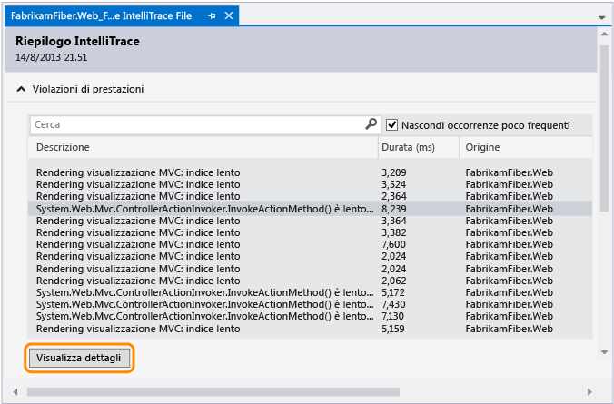
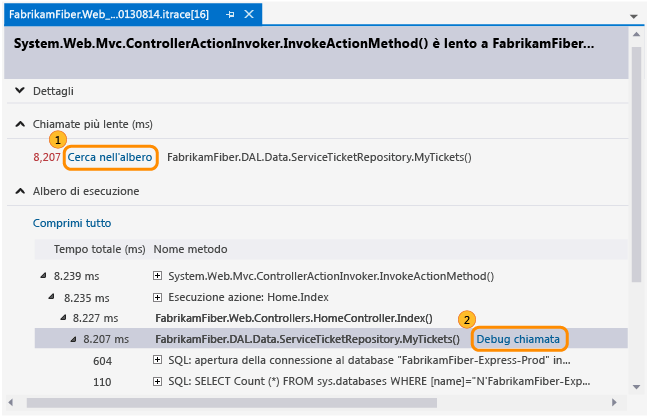
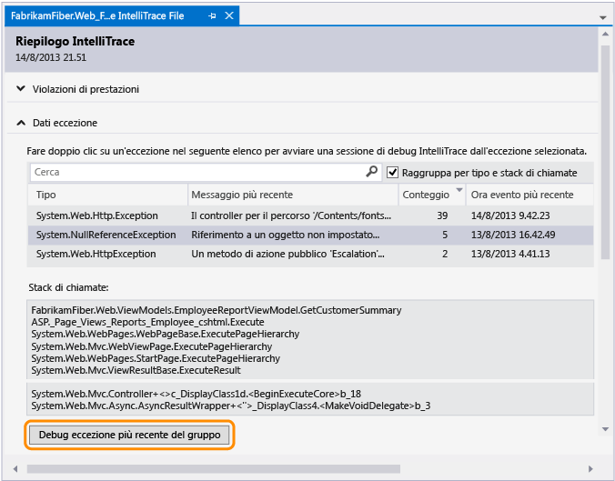
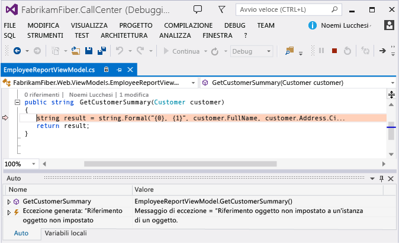
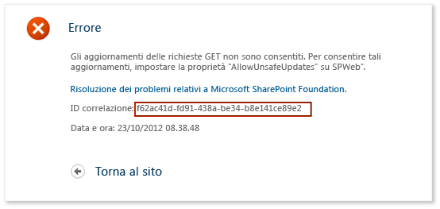
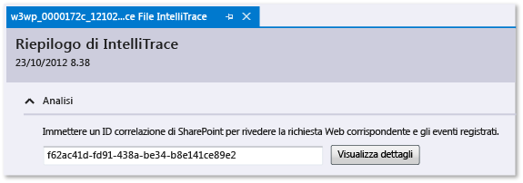
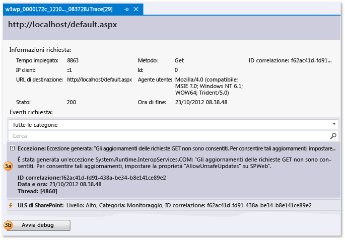
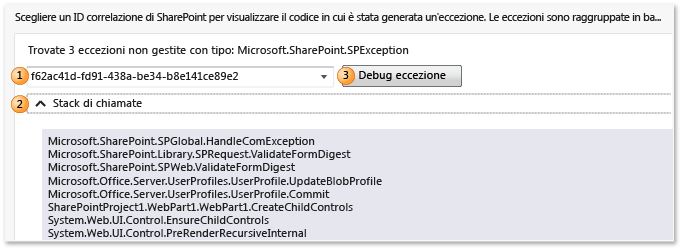

# Uso dei dati di IntelliTrace salvati
[!INCLUDE[vs2017banner](../code-quality/includes/vs2017banner.md)]

Passare a specifici punti nell'esecuzione di un'applicazione quando si avvia il debug da un file di log IntelliTrace \(.iTrace\). Questo file può contenere eventi di prestazioni, eccezioni, thread, passi del test, moduli e altre informazioni di sistema che IntelliTrace ha raccolto durante l'esecuzione dell'applicazione.  
  
 Assicurarsi di disporre degli elementi seguenti:  
  
-   File di origine e file di simboli \(.pdb\) corrispondenti per il codice dell'applicazione. In caso contrario, Visual Studio non consente di risolvere i percorsi di origine e verrà visualizzato il messaggio "Simboli non trovati". Vedere [Specifica di file di simboli \(con estensione pdb\) e di origine](../debugger/specify-symbol-dot-pdb-and-source-files-in-the-visual-studio-debugger.md) e [Diagnosticare i problemi dopo la distribuzione](../debugger/diagnose-problems-after-deployment.md).  
  
-   Visual Studio Enterprise \(ma non edizioni Professional o Community\) in un computer di sviluppo o in un altro computer per aprire i file .iTrace  
  
-   Un file .iTrace da una di queste origini:  
  
    |**Origine**|**Vedere**|  
    |-----------------|----------------|  
    |Una sessione di IntelliTrace in Visual Studio Visual Studio Enterprise \(ma non edizioni Professional o Community\)|[Funzionalità di IntelliTrace](../debugger/intellitrace-features.md)|  
    |Una sessione di test in Microsoft Test Manager. Ciò consente di associare un file .iTrace a un elemento di lavoro Team Foundation Server.|[Raccogliere un maggior numero di dati di diagnostica durante i test manuali](/devops-test-docs/test/collect-more-diagnostic-data-in-manual-tests)|  
    |Microsoft Monitoring Agent, in modalità autonoma o con System Center 2012 R2 Operations Manager, per app Web ASP.NET e applicazioni SharePoint in esecuzione in fase di distribuzione|-   [Diagnosticare i problemi dopo la distribuzione](../debugger/diagnose-problems-after-deployment.md) -   [Novità di System Center 2012 R2 Operations Manager](http://technet.microsoft.com/library/dn249700.aspx)|  
  
##   Selezionare l'operazione da eseguire.  
  
-   [Aprire un log IntelliTrace](#Open)  
  
-   [Leggere il log IntelliTrace](#Understand)  
  
-   [Avviare il debug da un log IntelliTrace](#StartDebugging)  
  
##   Aprire un log IntelliTrace  
 Aprire il file .iTrace in un computer con Visual Studio Enterprise.  
  
-   Fare doppio clic sul file .iTrace all'esterno di Visual Studio oppure aprire il file da Visual Studio.  
  
     \-oppure\-  
  
-   Se il file .iTrace viene associato a un elemento di lavoro Team Foundation Server, seguire questi passaggi nell'elemento di lavoro:  
  
    -   In **Tutti i collegamenti** individuare il file .iTrace. Aprirlo.  
  
         \-oppure\-  
  
    -   In **Passaggi ripetizione bug** scegliere il collegamento **IntelliTrace**.  
  
> [!TIP]
>  Se si chiude il file IntelliTrace durante il debug, è possibile riaprirlo facilmente. Scegliere **IntelliTrace** dal menu **Debug**, quindi selezionare **Mostra riepilogo log**. È inoltre possibile scegliere **Mostra riepilogo log** nella finestra **IntelliTrace**. Questo comando è disponibile solo se si esegue il debug con IntelliTrace.  
  
##   Leggere il log IntelliTrace  
 Alcune delle seguenti sezioni del file .iTrace vengono visualizzate solo se si raccolgono dati da una determinata origine, ad esempio applicazioni Test Manager o SharePoint.  
  
|**Sezione**|**Contiene**|**Origine della raccolta**|  
|-----------------|------------------|--------------------------------|  
|[Violazioni di prestazioni](#Performance)|Eventi di prestazioni con chiamate di funzione che superano la soglia configurata|Microsoft Monitoring Agent, in modalità autonoma o con System Center 2012 R2 Operations Manager, per app Web ASP.NET ospitate in IIS|  
|[Dati eccezione](#ExceptionData)|Eccezioni, incluso lo stack di chiamate completo per ogni eccezione|Tutte le origini|  
|[Analisi](#Analysis)|Solo per applicazioni SharePoint 2010 e SharePoint 2013. Esaminare eventi SharePoint e IntelliTrace, ad esempio eventi del debugger, eventi ULS, eccezioni non gestite e altri dati registrati da Microsoft Monitoring Agent.|Microsoft Monitoring Agent, in modalità autonoma o con System Center 2012 R2 Operations Manager|  
|[Informazioni di sistema](#SystemInfo)|Impostazioni e specifiche del sistema host|Tutte le origini|  
|[Elenco dei thread](#ThreadsList)|Thread eseguiti durante la raccolta|Tutte le origini|  
|[Dati di test](#TestData)|Passaggi di test e relativi risultati da una sessione di test|Gestione test|  
|[Moduli](#Modules)|Moduli caricati dal processo di destinazione nell'ordine di caricamento.|Tutte le origini|  
  
 Di seguito sono indicati alcuni suggerimenti per individuare informazioni in ogni sezione:  
  
-   Per ordinare i dati, selezionare un'intestazione di colonna.  
  
-   Per filtrare i dati, usare la casella di ricerca. La ricerca di testo normale funziona su tutte le colonne, ad eccezione di quelle dell'ora. È inoltre possibile filtrare le ricerche a una determinata colonna con un filtro per colonna. Digitare il nome della colonna senza spazi, due punti \(**:**\) e il valore di ricerca. Usare un punto e virgola \(**;**\) per aggiungere un'altra colonna e un altro valore di ricerca.  
  
     Ad esempio, per trovare gli eventi di prestazioni con la parola "slow" nella colonna **Descrizione**, digitare:  
  
     `Description:slow`  
  
##   Avviare il debug da un log IntelliTrace  
  
###   Violazioni di prestazioni  
 Rivedere gli eventi di prestazioni registrati per l'app. È possibile nascondere gli eventi non frequenti.  
  
##### Per avviare il debug da un evento di prestazioni  
  
1.  In **Violazioni prestazioni** esaminare gli eventi di prestazioni registrati, i relativi tempi di esecuzione totali e altre informazioni sugli eventi. Esaminare ulteriori dettagli sui metodi chiamati durante un evento di prestazioni specifico.  
  
       
  
     È inoltre sufficiente fare doppio clic sull'evento.  
  
2.  Nella pagina dell'evento rivedere i tempi di esecuzione per queste chiamate. Cercare una chiamata lenta nell'albero di esecuzione.  
  
     Le chiamate più lente vengono visualizzate nella specifica sezione in caso di più chiamate, annidate o meno.  
  
3.  Espandere tale chiamata per rivedere tutte le chiamate e i valori di parametri annidati registrati in quel momento.  
  
     Tastiera: per visualizzare o nascondere una chiamata annidata, premere rispettivamente **Freccia DESTRA** o **Freccia SINISTRA**. Per visualizzare e nascondere i valori dei parametri per una chiamata annidata, premere **BARRA SPAZIATRICE**.  
  
     Avviare il debug dalla chiamata.  
  
       
  
     È inoltre sufficiente fare doppio clic sulla chiamata o premere **INVIO**.  
  
     Se il metodo è incluso nel codice dell'applicazione, Visual Studio passa a tale metodo.  
  
       
  
     È possibile esaminare altri valori registrati, lo stack di chiamate, eseguire un'istruzione alla volta nel codice o usare la finestra **IntelliTrace** per [spostarsi in avanti o indietro tra gli altri metodi](../debugger/intellitrace.md) chiamati durante questo evento di prestazioni.  
  
###   Dati eccezione  
 Rivedere le eccezioni generate e registrate per l'app. È possibile raggruppare le eccezioni con lo stesso tipo e stack di chiamate in modo da visualizzare solo l'eccezione più recente.  
  
##### Per avviare il debug da un'eccezione  
  
1.  In **Dati eccezione** esaminare gli eventi di eccezione registrati, i relativi tipi, i messaggi e il momento in cui si sono verificate le eccezioni. Per esaminare il codice in dettaglio, avviare il debug dall'evento più recente in un gruppo di eccezioni.  
  
       
  
     È inoltre sufficiente fare doppio clic sull'evento. Se gli eventi non sono raggruppati, scegliere **Debug evento**.  
  
     Se l'eccezione si è verificata nel codice dell'applicazione, Visual Studio passa a questa posizione.  
  
       
  
     È possibile esaminare altri valori registrati, lo stack di chiamate o usare la finestra **IntelliTrace** per [spostarsi in avanti o indietro tra gli altri eventi registrati](../debugger/intellitrace.md), il codice correlato e i valori registrati in questi specifici momenti.  
  
    |**Colonna**|**Mostra**|  
    |-----------------|----------------|  
    |**Tipo**|Tipo .NET dell'eccezione|  
    |**Messaggio più recente** per eccezioni raggruppate o **Messaggio** per eccezioni non raggruppate|Messaggio fornito dall'eccezione|  
    |**Conteggio** per eccezioni raggruppate|Numero di volte in cui è stata generata l'eccezione|  
    |**ID thread** per eccezioni non raggruppate|ID del thread che ha generato l'eccezione|  
    |**Ora evento più recente** oppure **Ora evento**|Timestamp registrato quando è stata generata l'eccezione|  
    |**Stack di chiamate**|Stack di chiamate per un'eccezione.   Per visualizzare lo stack di chiamate, scegliere un'eccezione dall'elenco. Lo stack di chiamate viene visualizzato sotto l'elenco di eccezioni.|  
  
###   Analisi  
 Diagnosticare problemi con applicazioni SharePoint 2010 e SharePoint 2013 tramite un ID di correlazione SharePoint o esaminare qualsiasi eccezione non gestita individuata da Microsoft Monitoring Agent.  
  
-   Usare un ID di correlazione SharePoint per trovare gli eventi e le richieste web corrispondenti. Scegliere un evento e quindi avviare il debug nel punto e nel momento in cui si è verificato l'evento.  
  
-   Se tramite Microsoft Monitoring Agent sono state trovate eccezioni non gestite, è possibile scegliere un'eccezione e, successivamente, avviare il debug nel punto e nel momento in cui si è verificata l'eccezione.  
  
##### Avviare il debug con un ID correlazione di SharePoint  
  
1.  Copiare l'ID di correlazione SharePoint dalla relativa origine.  
  
     Ad esempio:  
  
       
  
2.  Aprire il file .iTrace, quindi passare ad **Analisi** e immettere l'ID di correlazione SharePoint per esaminare eventi registrati e di richieste Web corrispondenti.  
  
       
  
3.  In **Eventi richiesta** esaminare gli eventi. Partendo dall'alto, gli eventi vengono visualizzati nell'ordine in cui si sono verificati.  
  
    1.  Scegliere un evento per visualizzarne i dettagli.  
  
    2.  Scegliere **Avvia debug** per avviare il debug nel punto in cui si è verificato l'evento.  
  
       
  
 È possibile visualizzare questi tipi di eventi SharePoint insieme agli eventi IntelliTrace:  
  
-   **Eventi di profilo utente**  
  
     Questi eventi si verificano quando SharePoint carica un profilo utente e quando le proprietà del profilo vengono lette o modificate.  
  
-   **Eventi del servizio di registrazione unificato**  
  
     Microsoft Monitoring Agent consente di registrare un subset degli eventi del servizio di registrazione unificato SharePoint e questi campi:  
  
    |**Campo IntelliTrace**|**Campo del servizio di registrazione unificato SharePoint**|  
    |----------------------------|------------------------------------------------------------------|  
    |**Id**|**ID evento**|  
    |**Livello**|**Livello**|  
    |**ID categoria**|**ID categoria**|  
    |**Categoria**|**Categoria**|  
    |**Area**|**Prodotto**|  
    |**Output**|**Messaggio**|  
    |**ID correlazione**|**ID correlazione**|  
  
##### Avviare il debug da un'eccezione non gestita  
  
1.  Scegliere un ID di correlazione SharePoint per un'eccezione. Le eccezioni vengono raggruppate per tipo e stack di chiamate.  
  
2.  \(Facoltativo\) Espandere **Stack di chiamate** per visualizzare lo stack di chiamate per un gruppo di eccezioni.  
  
3.  Scegliere **Debug eccezione** per avviare il debug nel punto e nel momento in cui si è verificata l'eccezione.  
  
       
  
 Per una procedura dettagliata, vedere [Procedura dettagliata: debug di un'applicazione di SharePoint tramite IntelliTrace](../Topic/Walkthrough:%20Debugging%20a%20SharePoint%20Application%20by%20Using%20IntelliTrace.md). Per i tipi di dati registrati dall'agente, vedere [Funzionalità di IntelliTrace](../debugger/intellitrace-features.md).  
  
###   Elenco dei thread  
 Esaminare i thread registrati che sono stati eseguiti nel processo di destinazione. È possibile avviare il debug dal primo evento IntelliTrace valido in un thread selezionato.  
  
##### Per avviare il debug da un thread specifico  
  
1.  In **Elenco dei thread** scegliere un thread.  
  
2.  Nella parte inferiore di **Elenco dei thread** scegliere **Avvia debug**. È inoltre possibile fare doppio clic su un thread.  
  
     Per avviare il debug dall'inizio dell'applicazione, fare doppio clic su **Thread principale**. Vedere [Funzionalità di IntelliTrace](../debugger/intellitrace-features.md).  
  
 I dati dei thread creati dall'utente potrebbero essere più utili di quelli creati da un server e gestiti per applicazioni Web ospitate in IIS.  
  
|**Colonna**|**Mostra**|  
|-----------------|----------------|  
|**ID**|Numero ID del thread|  
|**Nome**|Nome del thread. I thread senza nome vengono visualizzati come "\<Nessun nome\>".|  
|**Ora di inizio**|Ora di creazione del thread|  
|**Ora di fine**|Ora di completamento del thread|  
  
###   Dati di test  
 Esaminare i dati IntelliTrace registrati da Test Manager durante il test dell'app.  
  
##### Per avviare il debug da un passaggio di test specifico  
  
1.  Espandere **Griglia passaggi test**. Scegliere un passaggio di test.  
  
2.  Nella parte inferiore di **Griglia passaggi test** scegliere **Avvia debug**. È inoltre possibile fare doppio clic su un passaggio di test.  
  
     Verrà avviato il debug dal primo evento IntelliTrace valido dopo il passaggio di test selezionato.  
  
     Se sono presenti dati di test, IntelliTrace tenta di risolvere la compilazione di Team Foundation Server associata usata per l'esecuzione del test. Se la compilazione viene trovata, i simboli associati per l'app vengono risolti automaticamente.  
  
|**Campo**|**Mostra**|  
|---------------|----------------|  
|**Sessione test**|Sessioni di test registrate. In genere, ne è presente solo una. Questo elenco è vuoto se sono stati creati dati di test usando un test esplorativo manuale.|  
|**Test case**|Test case della sessione di test selezionata. Questo elenco è vuoto se sono stati creati dati di test usando un test esplorativo manuale.|  
|**Griglia passaggi test**|Passaggi di test registrati con il risultato del test superato o non superato|  
  
###   Informazioni di sistema  
 In questa sezione vengono mostrati i dettagli sul sistema che ha ospitato l'app, ad esempio informazioni sull'hardware, sul sistema operativo, sull'ambiente e sui singoli processi.  
  
###   Moduli  
 In questa sezione vengono mostrati i moduli caricati dal processo di destinazione. I moduli vengono visualizzati nell'ordine di caricamento.  
  
|**Colonna**|**Mostra**|  
|-----------------|----------------|  
|**Nome modulo**|Nome del file di modulo|  
|**Percorso modulo**|Posizione sul disco in cui è stato caricato il modulo|  
|**ID modulo**|Identificatore univoco del modulo specifico della versione, che contribuisce ai file dei simboli \(PDB\) corrispondenti. Vedere [Finding symbol \(.pdb\) files and source files](http://msdn.microsoft.com/it-it/05384c85-d264-4e18-abaa-aa482ab25470).|  
  
### Dove è possibile ottenere altre informazioni?  
 [Uso dell'agente di raccolta autonomo IntelliTrace](../debugger/using-the-intellitrace-stand-alone-collector.md)  
  
 [Funzionalità di IntelliTrace](../debugger/intellitrace-features.md)  
  
 [Raccogliere un maggior numero di dati di diagnostica durante i test manuali](/devops-test-docs/test/collect-more-diagnostic-data-in-manual-tests)  
  
 [Utilizzo di IntelliTrace](../debugger/intellitrace.md)  
  
#### Forum  
 [Debugger di Visual Studio](http://go.microsoft.com/fwlink/?LinkId=262263)  
  
#### Materiale sussidiario  
 [Test per una distribuzione continua con Visual Studio 2012 – Capitolo 6: Casella degli strumenti per test](http://go.microsoft.com/fwlink/?LinkID=255203)