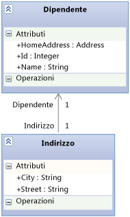

# <a name="using-the-intellitrace-stand-alone-collector"></a>Uso dell'agente di raccolta autonomo IntelliTrace
L' **agente di raccolta autonomo IntelliTrace** consente di raccogliere i dati diagnostici di IntelliTrace per le app nei server di produzione o in altri ambienti senza installare Visual Studio nel computer di destinazione e senza cambiare l'ambiente del sistema di destinazione. L'agente di raccolta autonomo IntelliTrace funziona nelle app Web, SharePoint, WPF e Windows Form. Al termine della raccolta dei dati, eliminare semplicemente l'agente di raccolta per disinstallarlo.  
  
 IntelliTrace in azione: [Raccolta e analisi dei dati IntelliTrace in produzione per il debug (video su Channel 9)](http://go.microsoft.com/fwlink/?LinkID=251851)  
  
> [!NOTE]
>  È anche possibile raccogliere gli stessi dati IntelliTrace per le app Web e SharePoint in esecuzione nei computer remoti usando **Microsoft Monitoring Agent** in modalità **Trace** .  
>   
>  È possibile raccogliere gli eventi relativi alle prestazioni nei dati IntelliTrace eseguendo l'agente in modalità **Monitor** . La modalità**Monitor** ha un impatto minore sulle prestazioni rispetto alla modalità **Traccia** o all' **IntelliTraccia stand-alone collector**. Microsoft Monitoring Agent non modifica l'ambiente del sistema di destinazione quando viene installato. Vedere [tramite Microsoft Monitoring Agent](../debugger/using-the-microsoft-monitoring-agent.md).  
  
 **Requirements**  
  
-   .NET Framework 3.5, 4 o 4.5  
  
-   Visual Studio Enterprise (ma non edizioni Professional o Community) in un computer di sviluppo o in un altro computer per aprire i file .iTrace  
  
    > [!NOTE]
    >  Assicurarsi di salvare i file di simboli (PDB). Per eseguire il debug con IntelliTrace ed eseguire il codice seguendo un'istruzione alla volta sono necessari i file di origine corrispondenti e i file di simboli. Vedere [diagnosticare i problemi dopo la distribuzione](../debugger/diagnose-problems-after-deployment.md).  
  
 **FAQ**  
  
-   [Quali app funzionano con l'agente di raccolta?](#WhatApps)  
  
-   [Come iniziare](#GetStarted)  
  
-   [Come è possibile ottenere il maggior numero possibile di dati senza rallentare l'applicazione?](#Minimizing)  
  
-   [In quali altre posizioni è possibile ottenere i dati IntelliTrace?](#WhereElse)  
  
##  <a name="WhatApps"></a> Quali app funzionano con l'agente di raccolta?  
  
-   App Web ASP.NET ospitate in Internet Information Services (IIS) versione 7.0, 7.5 e 8.0  
  
-   Applicazioni SharePoint 2010 e SharePoint 2013  
  
-   App Windows Presentation Foundation (WPF) e Windows Form.  
  
##  <a name="GetStarted"></a> Come iniziare  
  
1.  [Installare l'agente di raccolta](#BKMK_Install_the_IntelliTrace_Stand_Alone_Collector)  
  
2.  [Impostare autorizzazioni per la directory dell'agente di raccolta](#ConfigurePermissionsRunningCollector)  
  
3.  [Installare i cmdlet di PowerShell IntelliTrace per raccogliere dati per le applicazioni Web o le applicazioni di SharePoint](#BKMK_Set_up_the_IntelliTrace_PowerShell_commandlets)  
  
4.  [Impostare autorizzazioni per la directory di file con estensione iTrace](#BKMK_Create_and_Configure_a_Log_File_Directory)  
  
5.  [Raccogliere i dati da un'applicazione Web o da un'applicazione SharePoint](#BKMK_Collect_Data_from_IIS_Application_Pools)  
  
     -oppure-  
  
     [Raccogliere i dati da un'app gestita](#BKMK_Collect_Data_from_Executables)  
  
6.  [Aprire il file .iTrace in Visual Studio Enterprise](#BKMK_View_IntelliTrace_Log_Files)  
  
##  <a name="BKMK_Install_the_IntelliTrace_Stand_Alone_Collector"></a> Installare l'agente di raccolta  
  
1.  Nel server dell'app, creare la directory dell'agente di raccolta, ad esempio: **C:\IntelliTraceCollector**  
  
2.  Ottenere l'agente di raccolta da Microsoft Download Center o dalla cartella di installazione di Visual Studio 2013 Update 3. [Agente di raccolta IntelliTrace per Visual Studio 2013 Update 4](https://www.microsoft.com/en-us/download/details.aspx?id=44909):  
  
    -   **Area download Microsoft**:  
  
        1.  Accanto a **IntelliTraceCollector.exe**, scegliere **carica**.  
  
        2.  Salvare IntelliTraceCollector.exe nella directory dell'agente di raccolta, ad esempio **C:\IntelliTraceCollector**  
  
        3.  Eseguire IntelliTraceCollector.exe. Il file IntelliTraceCollection.cab viene estratto.  
  
         \- oppure -  
  
    -   **Cartella di installazione di Visual Studio**:  
  
        1.  Copiare IntelliTraceCollection.cab dalla seguente cartella:  
  
             **.. \Microsoft visual Studio 12.0\Common7\IDE\CommonExtensions\Microsoft\IntelliTrace\12.0.0**  
  
        2.  Inserire IntelliTraceCollection.cab nella directory dell'agente di raccolta, ad esempio: **C:\IntelliTraceCollector**  
  
3.  Espandere IntelliTraceCollection.cab:  
  
    1.  Nel server dell'app, aprire una finestra del prompt dei comandi come amministratore.  
  
    2.  Cercare la directory dell'agente di raccolta, ad esempio: **C:\IntelliTraceCollector**  
  
    3.  Usare il comando **expand** , incluso il punto (**.**) alla fine, per espandere IntelliTraceCollection.cab:  
  
         `expand  /f:* IntelliTraceCollection.cab .`  
  
        > [!NOTE]
        >  Il punto (**.**) lascia inalterate le sottocartelle che contengono i piani di raccolta localizzati.  
  
##  <a name="ConfigurePermissionsRunningCollector"></a> Impostare autorizzazioni per la directory dell'agente di raccolta  
  
1.  Nel server dell'app, aprire una finestra del prompt dei comandi come amministratore.  
  
2.  Usare il comando di Windows **icacls** per concedere all'amministratore del server le autorizzazioni complete per la directory dell'agente di raccolta. Ad esempio:  
  
     `icacls "C:\IntelliTraceCollector" /grant "` *\<Domain\AdministratorID >*`":F`  
  
3.  Per raccogliere dati per un'app Web o un'applicazione SharePoint:  
  
    1.  Concedere alla persona che esegue i cmdlet PowerShell di IntelliTrace le autorizzazioni complete per la directory dell'agente di raccolta.  
  
         Ad esempio:  
  
         `icacls "C:\IntelliTraceCollector" /grant "` *\<Dominio\idutente >*`":F`  
  
    2.  Concedere al pool di applicazioni per l'app Web o l'applicazione SharePoint le autorizzazioni di lettura ed esecuzione per la directory dell'agente di raccolta.  
  
         Ad esempio:  
  
        -   Per un'app Web nel pool di applicazioni **DefaultAppPool** :  
  
             `icacls "C:\IntelliTraceCollector" /grant "IIS APPPOOL\DefaultAppPool":RX`  
  
        -   Per un'applicazione SharePoint nel pool di applicazioni **SharePoint - 80** :  
  
             `icacls "C:\IntelliTraceCollector" /grant "IIS APPPOOL\SharePoint - 80":RX`  
  
##  <a name="BKMK_Set_up_the_IntelliTrace_PowerShell_commandlets"></a> Installare i cmdlet di PowerShell IntelliTrace per raccogliere dati per le applicazioni Web o le applicazioni di SharePoint  
  
1.  Nel server dell'app, assicurarsi che PowerShell sia abilitato. Nella maggior parte delle versioni di Windows Server, è possibile aggiungere questa funzionalità nello strumento di amministrazione **Server Manager** .  
  
       
  
2.  Installare i cmdlet PowerShell di IntelliTrace.  
  
    1.  Aprire una finestra di comando PowerShell come amministratore.  
  
        1.  Scegliere **Start**, **Tutti i programmi**, **Accessori**, **Windows PowerShell**.  
  
        2.  Scegliere uno dei passaggi seguenti:  
  
            -   Nei sistemi operativi a 64 bit, aprire il menu di scelta rapida per **Windows PowerShell**. Scegliere **Esegui come amministratore**.  
  
            -   Nei sistemi operativi a 32 bit, aprire il menu di scelta rapida per **Windows PowerShell (x86)**. Scegliere **Esegui come amministratore**.  
  
    2.  Nella finestra di comando PowerShell, usare il comando **Import-Module** per importare **Microsoft.VisualStudio.IntelliTrace.PowerShell.dll**.  
  
         Ad esempio:  
  
         `Import-Module "C:\IntelliTraceCollector\Microsoft.VisualStudio.IntelliTrace.PowerShell.dll"`  
  
##  <a name="BKMK_Create_and_Configure_a_Log_File_Directory"></a> Impostare autorizzazioni per la directory di file con estensione iTrace  
  
1.  Nel server dell'app, creare la directory del file. iTrace, ad esempio: **C:\IntelliTraceLogFiles**  
  
    > [!NOTE]
    >  -   Per evitare di rallentare l'app, scegliere un percorso su un disco ad alta velocità locale non è molto attivo.  
    > -   I file .iTrace e quelli dell'agente di raccolta possono essere inseriti nella stessa posizione. Tuttavia, se si ha un'app Web o un'applicazione SharePoint, verificare che questa posizione non sia all'interno della directory che ospita l'applicazione.  
  
    > [!IMPORTANT]
    >  -   Limitare la directory di file .iTrace solo alle identità che devono lavorare con l'agente di raccolta. Un file .iTrace può contenere informazioni riservate, ad esempio dati degli utenti, database, altri percorsi di origine e stringhe di connessione, perché IntelliTrace è in grado di registrare tutti i dati che passano nei parametri del metodo o come valori restituiti.  
    > -   Assicurarsi che le persone che possono aprire i file .iTrace dispongano delle autorizzazioni per la visualizzazione dei dati riservati. Usare prudenza quando si condividono file .iTrace. Se è necessario concedere l'accesso ad altri, copiare i file in un percorso condiviso sicuro.  
  
2.  Per un'app Web o un'applicazione SharePoint, concedere al pool di applicazioni le autorizzazioni complete per la directory di file .iTrace. È possibile usare il comando Windows **icacls** oppure Esplora risorse (o Esplora file).  
  
     Ad esempio:  
  
    -   Per configurare le autorizzazioni con il comando Windows **icacls** :  
  
        -   Per un'app Web nel pool di applicazioni **DefaultAppPool** :  
  
             `icacls "C:\IntelliTraceLogFiles" /grant "IIS APPPOOL\DefaultAppPool":F`  
  
        -   Per un'applicazione SharePoint nel pool di applicazioni **SharePoint - 80** :  
  
             `icacls "C:\IntelliTraceLogFiles" /grant "IIS APPPOOL\SharePoint - 80":F`  
  
         -oppure-  
  
    -   Per configurare le autorizzazioni con Esplora risorse (o Esplora file):  
  
        1.  Aprire **Proprietà** per directory di file .iTrace.  
  
        2.  Nella scheda **Sicurezza** , scegliere **Modifica**, **Aggiungi**.  
  
        3.  Verificare che **Entità di sicurezza predefinite** sia visualizzato nella casella **Selezionare questo tipo di oggetto** . Se non è disponibile, scegliere **tipi di oggetto** per aggiungerlo.  
  
        4.  Verificare che il computer locale sia visualizzato nella casella **Da questo percorso** . Se non è disponibile, scegliere **percorsi** per modificarlo.  
  
        5.  Nella casella **Immettere i nomi degli oggetti da selezionare** aggiungere il pool di applicazioni per l'app Web o l'applicazione SharePoint.  
  
        6.  Scegliere **Controlla nomi** per risolvere il nome. Scegliere **OK**.  
  
        7.  Verificare che il pool di applicazioni abbia il **Controllo completo**.  
  
##  <a name="BKMK_Collect_Data_from_IIS_Application_Pools"></a> Raccogliere i dati da un'applicazione Web o da un'applicazione SharePoint  
  
1.  Per avviare la raccolta dei dati, aprire una finestra di comando PowerShell come amministratore, quindi eseguire il comando:  
  
     `Start-IntelliTraceCollection``"`  *\<ApplicationPool >* `"`  *\<PathToCollectionPlan >*  *\< FullPathToITraceFileDirectory >*  
  
    > [!IMPORTANT]
    >  Dopo aver eseguito il comando, digitare **Y** per confermare che si vuole iniziare la raccolta dei dati.  
  
     Ad esempio, per raccogliere i dati da un'applicazione SharePoint nel pool di applicazioni **SharePoint - 80** :  
  
     `Start-IntelliTraceCollection "SharePoint - 80" "C:\IntelliTraceCollector\collection_plan.ASP.NET.default.xml" "C:\IntelliTraceLogFiles"`  
  
    |||  
    |-|-|  
    |*ApplicationPool*|Il nome del pool di applicazioni in cui viene eseguita l'applicazione|  
    |*PathToCollectionPlan*|Il percorso di un piano di raccolta, un file XML che configura le impostazioni per l'agente di raccolta.<br /><br /> È possibile specificare un piano fornito insieme all'agente di raccolta. I seguenti piani si applicano alle app Web e alle applicazioni:<br /><br /> -collection_plan.ASP.NET.default.xml<br />     Raccoglie solo gli eventi IntelliTrace e SharePoint, incluse le eccezioni, le chiamate al database e le richieste del server Web.<br />-collection_plan.ASP.NET.trace.xml<br />     Raccoglie le chiamate di funzione e tutti i dati in collection_plan.ASP.NET.default.xml. Questo piano è utile per un'analisi dettagliata, ma può causare un rallentamento dell'app maggiore rispetto a collection_plan.ASP.NET.default.xml.<br /><br /> Per evitare il rallentamento dell'app, personalizzare i piani o creare proprio piano. Per garantire la sicurezza, inserire i piani personalizzati nello stesso percorso sicuro in cui si trovano i file dell'agente di raccolta. Vedere [Creazione e personalizzazione dei piani di raccolta IntelliTrace](http://go.microsoft.com/fwlink/?LinkId=227871) e [Come è possibile ottenere il maggior numero possibile di dati senza rallentare l'applicazione?](#Minimizing) **Nota:** per impostazione predefinita, la dimensione massima del file. iTrace è 100 MB. Quando il file. iTrace raggiunge questo limite, l'agente di raccolta Elimina le voci meno recente del file per liberare spazio per le voci più recenti. Per modificare questo limite, modificare il piano di raccolta `MaximumLogFileSize` attributo. <br /><br /> *Dove si possono trovare le versioni localizzate di questi piani di raccolta?*<br /><br /> I piani localizzati sono disponibili nelle sottocartelle dell'agente di raccolta.|  
    |*FullPathToITraceFileDirectory*|Il percorso completo alla directory di file .iTrace. **Nota sulla sicurezza:** specificare il percorso completo, non un percorso relativo.|  
  
     L'agente di raccolta si collega al pool di applicazioni e avvia la raccolta dei dati.  
  
     *È possibile aprire il file .iTrace in questo momento?* No, il file è bloccato durante la raccolta dei dati.  
  
2.  Riprodurre il problema.  
  
3.  Per creare uno snapshot del file .iTrace, usare questa sintassi:  
  
     `Checkpoint-IntelliTraceCollection``"`  *\<ApplicationPool >*`"`  
  
4.  Per controllare lo stato della raccolta, usare questa sintassi:  
  
     `Get-IntelliTraceCollectionStatus`  
  
5.  Per arrestare la raccolta dei dati, usare questa sintassi:  
  
     `Stop-IntelliTraceCollection``"`  *\<ApplicationPool >*`"`  
  
    > [!IMPORTANT]
    >  Dopo aver eseguito il comando, digitare **Y** per confermare che si vuole arrestare la raccolta dei dati. In caso contrario, l'agente di raccolta potrebbe continuare la raccolta dei dati, il file iTrace resta bloccato o il file potrebbe non contenere dati utili.  
  
6.  [Aprire il file .iTrace in Visual Studio Enterprise](#BKMK_View_IntelliTrace_Log_Files)  
  
##  <a name="BKMK_Collect_Data_from_Executables"></a> Raccogliere i dati da un'app gestita  
  
1.  Per avviare l'app e raccogliere i dati allo stesso tempo, usare questa sintassi:  
  
     *\<FullPathToIntelliTraceCollectorExecutable >* `\IntelliTraceSC.exe launch /cp:`  *\<PathToCollectionPlan >* `/f:`  *\< FullPathToITraceFileDirectoryAndFileName >*  *\<PathToAppExecutableFileAndFileName >*  
  
     Ad esempio, per raccogliere i dati da un'app denominata **MyApp**:  
  
     `C:IntelliTraceCollectorIntelliTraceSC.exe launch /cp:"C:IntelliTraceCollectorcollection_plan.ASP.NET.default.xml" /f:"C:IntelliTraceLogFilesMyApp.itrace" "C:MyAppMyApp.exe"`  
  
    |||  
    |-|-|  
    |*FullPathToIntelliTraceCollectorExecutable*|Il percorso completo al file eseguibile dell'agente di raccolta, IntelliTraceSC.exe|  
    |*PathToCollectionPlan*|Il percorso di un piano di raccolta, un file XML che configura le impostazioni per l'agente di raccolta.<br /><br /> È possibile specificare un piano fornito insieme all'agente di raccolta. I seguenti piani si applicano alle app gestite:<br /><br /> -collection_plan.ASP.NET.default.xml<br />     Raccoglie solo gli eventi IntelliTrace, incluse le eccezioni, le chiamate al database e le richieste del server Web.<br />-collection_plan.ASP.NET.trace.xml<br />     Raccoglie le chiamate di funzione e tutti i dati in collection_plan.ASP.NET.default.xml. Questo piano è utile per un'analisi dettagliata, ma può causare un rallentamento dell'app maggiore rispetto a collection_plan.ASP.NET.default.xml.<br /><br /> Per evitare il rallentamento dell'app, personalizzare i piani o creare proprio piano. Per garantire la sicurezza, inserire i piani personalizzati nello stesso percorso sicuro in cui si trovano i file dell'agente di raccolta. Vedere [Creazione e personalizzazione dei piani di raccolta IntelliTrace](http://go.microsoft.com/fwlink/?LinkId=227871) e [Come è possibile ottenere il maggior numero possibile di dati senza rallentare l'applicazione?](#Minimizing) **Nota:** per impostazione predefinita, la dimensione massima del file. iTrace è 100 MB. Quando il file. iTrace raggiunge questo limite, l'agente di raccolta Elimina le voci meno recente del file per liberare spazio per le voci più recenti. Per modificare questo limite, modificare il piano di raccolta `MaximumLogFileSize` attributo. <br /><br /> *Dove si possono trovare le versioni localizzate di questi piani di raccolta?*<br /><br /> I piani localizzati sono disponibili nelle sottocartelle dell'agente di raccolta.|  
    |*FullPathToITraceFileDirectoryAndFileName*|Il percorso completo alla directory di file .iTrace e il nome del file .iTrace con estensione **.itrace** . **Nota sulla sicurezza:** specificare il percorso completo, non un percorso relativo.|  
    |*PathToAppExecutableFileAndFileName*|Il percorso e il nome file dell'app gestita|  
  
2.  Arrestare la raccolta dei dati uscendo dall'app.  
  
3.  [Aprire il file .iTrace in Visual Studio Enterprise](#BKMK_View_IntelliTrace_Log_Files)  
  
##  <a name="BKMK_View_IntelliTrace_Log_Files"></a> Aprire il file .iTrace in Visual Studio Enterprise  
  
> [!NOTE]
>  Per eseguire il debug con IntelliTrace ed eseguire il codice seguendo un'istruzione alla volta sono necessari i file di origine corrispondenti e i file di simboli. Vedere [diagnosticare i problemi dopo la distribuzione](../debugger/diagnose-problems-after-deployment.md).  
  
1.  Spostare il file .iTrace o copiarlo in un computer con Visual Studio Enterprise (ma non edizioni Professional o Community).  
  
2.  Fare doppio clic sul file .iTrace all'esterno di Visual Studio oppure aprire il file da Visual Studio.  
  
     Visual Studio visualizza la pagina **Riepilogo di IntelliTrace** . Nella maggior parte delle sezioni è possibile esaminare gli eventi o altri elementi, scegliere un elemento e avviare il debug con IntelliTrace nel punto e nell'ora in cui si è verificato l'evento. Vedere [utilizzo dati di IntelliTrace salvato](../debugger/using-saved-intellitrace-data.md).  
  
    > [!NOTE]
    >  Per eseguire il debug con IntelliTrace ed eseguire il codice seguendo un'istruzione alla volta sono necessari i file di origine corrispondenti e i file di simboli nel computer di sviluppo. Vedere [diagnosticare i problemi dopo la distribuzione](../debugger/diagnose-problems-after-deployment.md).  
  
##  <a name="Minimizing"></a> Come è possibile ottenere il maggior numero possibile di dati senza rallentare l'applicazione?  
 IntelliTrace può raccogliere grandi quantità di dati: l'impatto sulle prestazioni dell'app dipende dai dati raccolti da IntelliTrace e dal tipo di codice analizzato. Vedere [Ottimizzazione della raccolta IntelliTrace nei server di produzione](http://go.microsoft.com/fwlink/?LinkId=255233).  
  
 Esistono dei metodi per ottenere la maggior quantità di dati possibile senza rallentare l'app:  
  
-   Eseguire l'agente di raccolta solo quando si ritiene che si è verificato un problema o quando è possibile riprodurre il problema.  
  
     Avviare la raccolta, riprodurre il problema, quindi arrestare la raccolta. Aprire il file .iTrace in Visual Studio Enterprise ed esaminare i dati. Vedere [Aprire il file .iTrace in Visual Studio Enterprise](#BKMK_View_IntelliTrace_Log_Files).  
  
-   Per le app Web e le applicazioni SharePoint, l'agente di raccolta registra i dati per ciascuna app che condivide il pool di applicazioni specificato. Questo potrebbe rallentare le app che condividono lo stesso pool di applicazioni, anche se è possibile specificare solo i mobili per una singola app in un piano di raccolta.  
  
     Per impedire che l'agente di raccolta rallenti le altre app, ospitare ciascuna app nel proprio pool di applicazioni.  
  
-   Esaminare gli eventi nel piano di raccolta per il quale IntelliTrace raccoglie i dati. Modificare il piano di raccolta per disabilitare gli eventi non rilevanti o interessanti.  
  
     Per disabilitare un evento, impostare l'attributo `enabled` per l'elemento `<DiagnosticEventSpecification>` su `false`:  
  
     `<DiagnosticEventSpecification enabled="false">`  
  
     Se l'attributo `enabled` non esiste, l'evento è abilitato.  
  
     *In che modo queste funzionalità migliorano le prestazioni?*  
  
    -   È possibile ridurre il tempo di avvio disabilitando gli eventi non rilevanti per l'app. Ad esempio, disabilitare gli eventi di Windows Workflow nelle app che non lo usano.  
  
    -   È possibile migliorare le prestazioni di avvio e di runtime disabilitando gli eventi del Registro di sistema per le app che accedono al Registro di sistema ma non visualizzano i problemi con le relative impostazioni.  
  
-   Esaminare i moduli nel piano di raccolta per il quale IntelliTrace raccoglie i dati. Modificare il piano di raccolta per includere solo i moduli desiderati:  
  
    1.  Aprire il piano di raccolta. Trovare l'elemento `<ModuleList>` .  
  
    2.  In `<ModuleList>`, impostare l'attributo `isExclusionList` su `false`.  
  
    3.  Usare l'elemento `<Name>` per specificare i singoli moduli con uno degli elementi seguenti: nome file, valore della stringa per includere tutti i moduli il cui nome contiene la stringa specificata oppure chiave pubblica.  
  
     Ad esempio, per raccogliere i dati solo dal modulo Web principale dell'app Web Fabrikam Fiber, creare un elenco come questo visualizzato di seguito:  
  
    ```xml  
    <ModuleList isExclusionList="false">  
       <Name>FabrikamFiber.Web.dll</Name>  
    </ModuleList>  
  
    ```  
  
     Per raccogliere i dati dai moduli il cui nome include "Fabrikam", creare un elenco come questo visualizzato di seguito:  
  
    ```xml  
    <ModuleList isExclusionList="false">  
       <Name>Fabrikam</Name>  
    </ModuleList>  
  
    ```  
  
     Per raccogliere i dati dai moduli specificando i relativi token della chiave pubblica, creare un elenco come questo visualizzato di seguito:  
  
    ```xml  
    <ModuleList isExclusionList="false">  
       <Name>PublicKeyToken:B77A5C561934E089</Name>  
       <Name>PublicKeyToken:B03F5F7F11D50A3A</Name>  
       <Name>PublicKeyToken:31BF3856AD364E35</Name>  
       <Name>PublicKeyToken:89845DCD8080CC91</Name>  
       <Name>PublicKeyToken:71E9BCE111E9429C</Name>  
    </ModuleList>  
  
    ```  
  
     *In che modo queste funzionalità migliorano le prestazioni?*  
  
     Viene ridotta la quantità di informazioni relativa alla chiamata al metodo e gli altri dati di strumentazione raccolti da IntelliTrace quando l'app viene avviata ed eseguita. Questi dati consentono di:  
  
    -   Eseguire il codice seguendo un'istruzione alla volta dopo aver raccolto i dati.  
  
    -   Esaminare i valori passati e restituiti dalle chiamate di funzione.  
  
     *Perché non si sceglie di escludere i moduli, invece?*  
  
     Per impostazione predefinita, i piani di raccolta escludono i moduli impostando l'attributo `isExclusionList` su `true`. Tuttavia, anche escludendo i moduli, è possibile che i dati vengano raccolti da moduli che non corrispondono ai criteri dell'elenco e che potrebbero quindi essere poco rilevanti, ad esempio moduli di terze parti o open source.  
  
-   *Ci sono dati che IntelliTrace non raccoglie?*  
  
     Sì. Per ridurre l'impatto sulle prestazioni, IntelliTrace limita la raccolta dei dati ai valori dei tipi di dati primitivi passati e restituiti dai metodi e ai valori dei tipi di dati primitivi nei campi degli oggetti di primo livello passati e restituiti dai metodi.  
  
     Ad esempio, si supponga di avere una firma del metodo `AlterEmployee` che accetta un numero intero `id` e un oggetto `Employee` `oldemployee`:  
  
     `public Employee AlterEmployee(int id, Employee oldemployee)`  
  
     Il tipo `Employee` ha i seguenti attributi: `Id`, `Name`e `HomeAddress`. Esiste una relazione di associazione tra `Employee` e il tipo `Address` .  
  
       
  
     L'agente di raccolta registra i valori per `id`, `Employee.Id`, `Employee.Name` e l'oggetto `Employee` restituito dal metodo `AlterEmployee` . Tuttavia, l'agente di raccolta non registra le informazioni sull'oggetto `Address` , tranne quelle relative allo stato null o non null. L'agente di raccolta non registra neanche i dati relativi alle variabili locali nel metodo `AlterEmployee` a meno che altri metodi non usino tali variabili come parametri; in questo caso, vengono registrate come parametri del metodo.  
  
##  <a name="WhereElse"></a> In quali altre posizioni è possibile ottenere i dati IntelliTrace?  
  
-   Da una sessione in Visual Studio Enterprise di debug di IntelliTrace, vedere [funzionalità IntelliTrace](../debugger/intellitrace-features.md).  
  
-   Da una sessione di test in Microsoft Test Manager, vedere [Procedura: Raccogliere dati IntelliTrace per agevolare il debug di problemi complessi](http://msdn.microsoft.com/Library/02b6716f-569e-4961-938a-e790a0c74b5c).  
  
## <a name="where-can-i-get-more-information"></a>Dove è possibile ottenere altre informazioni?  
 [Uso dei dati di IntelliTrace salvati](../debugger/using-saved-intellitrace-data.md)  
  
 [IntelliTrace](../debugger/intellitrace.md)  
  
### <a name="blogs"></a>Blog  
 [Uso dell'agente di raccolta autonomo IntelliTrace in remoto](http://go.microsoft.com/fwlink/?LinkId=262277)  
  
 [Creazione e personalizzazione dei piani di raccolta IntelliTrace](http://go.microsoft.com/fwlink/?LinkId=227871)  
  
 [Ottimizzazione della raccolta IntelliTrace nei server di produzione](http://go.microsoft.com/fwlink/?LinkId=255233)  
  
 [Blog di Visual Studio ALM + TFS](http://go.microsoft.com/fwlink/?LinkID=201340)  
  
### <a name="forums"></a>Forum  
 [Debugger di Visual Studio](http://go.microsoft.com/fwlink/?LinkId=262263)  
  
### <a name="videos"></a>Video  
 [Video su Channel 9: Raccolta e analisi dei dati IntelliTrace](http://go.microsoft.com/fwlink/?LinkID=251851)
