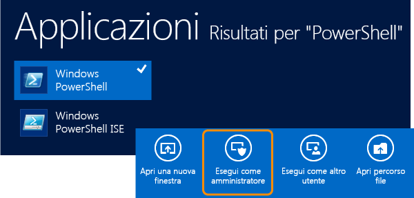
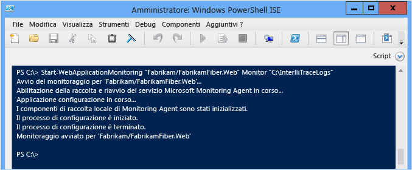
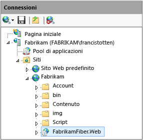

# Uso di Microsoft Monitoring Agent
[!INCLUDE[vs2017banner](../code-quality/includes/vs2017banner.md)]

È possibile monitorare localmente le app Web ASP.NET ospitate su IIS e le applicazioni SharePoint 2010 o 2013 per rilevare errori, problemi relativi alle prestazioni o altri problemi con **Microsoft Monitoring Agent**. È possibile salvare gli eventi di diagnostica dell'agente in un file di log IntelliTrace \(con estensione iTrace\). È quindi possibile aprire il log in Visual Studio Enterprise \(ma non nelle edizioni Professional o Community\) per eseguire il debug dei problemi con tutti gli strumenti di diagnostica di Visual Studio. È anche possibile raccogliere dati relativi a diagnosi e metodi di IntelliTrace eseguendo l'agente in modalità **Traccia**. Microsoft Monitoring Agent può essere integrato con [Application Insights](http://www.visualstudio.com/get-started/find-performance-problems-vs.aspx) e [System Center Operation Manager](http://technet.microsoft.com/library/hh205987.aspx). Microsoft Monitoring Agent non modifica l'ambiente del sistema di destinazione quando viene installato.  
  
> [!NOTE]
>  È anche possibile raccogliere dati relativi a diagnosi e metodi di IntelliTrace per le app Web, SharePoint, WPF e Windows Form nei computer remoti senza modificare l'ambiente di destinazione usando l'**agente di raccolta autonomo IntelliTrace**. L'agente di raccolta autonomo ha un impatto sulle prestazioni maggiore rispetto all'esecuzione di Microsoft Monitoring Agent in modalità **Monitor**. Vedere [Uso dell'agente di raccolta autonomo IntelliTrace](../debugger/using-the-intellitrace-stand-alone-collector.md).  
  
 Se si usa System Center 2012, usare Microsoft Monitoring Agent con Operations Manager per ottenere avvisi relativi ai problemi e creare elementi di lavoro di Team Foundation Server con collegamenti ai log IntelliTrace salvati. Successivamente è possibile assegnare questi elementi di lavoro ad altri per un ulteriore debug. Vedere [Integrazione di Operations Manager con i processi di sviluppo](http://technet.microsoft.com/library/jj614609.aspx) e [Monitoraggio con Microsoft Monitoring Agent](http://technet.microsoft.com/en-us/library/dn465153.aspx).  
  
 Prima di iniziare, verificare di avere a disposizione l'origine e i simboli corrispondenti per il codice compilato e distribuito. In questo modo è possibile passare direttamente al codice dell'applicazione quando si avvia il debug e la navigazione degli eventi di diagnostica nel log IntelliTrace.[Configurare le compilazioni](../debugger/diagnose-problems-after-deployment.md) in modo che Visual Studio possa rilevare e aprire automaticamente l'origine corrispondente per il codice distribuito.  
  
1.  [Passaggio 1: configurazione di Microsoft Monitoring Agent](#SetUpMonitoring)  
  
2.  [Passaggio 2: avvio del monitoraggio dell'applicazione](#MonitorEvents)  
  
3.  [Passaggio 3: salvataggio degli eventi registrati](#SaveEvents)  
  
##  <a name="SetUpMonitoring"></a> Passaggio 1: configurazione di Microsoft Monitoring Agent  
 Configurare l'agente autonomo nel server Web in modo che il monitoraggio locale venga eseguito senza modificare l'applicazione. Se è si usa System Center 2012, vedere [Installazione di Microsoft Monitoring Agent](http://technet.microsoft.com/library/dn465156.aspx).  
  
###  <a name="SetUpStandaloneMMA"></a> Configurare l'agente autonomo  
  
1.  Verificare che:  
  
    -   Il server Web stia eseguendo [versioni supportate di Internet Information Services \(IIS\)](http://technet.microsoft.com/en-us/library/dn465154.aspx).  
  
    -   Nel server Web è disponibile .NET Framework 3.5, 4 o 4.5.  
  
    -   Nel server Web è in esecuzione Windows PowerShell 3.0 o versione successiva.[D: Cosa fare se nel computer è installato Windows PowerShell 2.0?](#PowerShell2)  
  
    -   L'utente ha le autorizzazioni di amministratore per il server Web per eseguire comandi di PowerShell e riciclare il pool di applicazioni all'avvio del monitoraggio.  
  
    -   Qualsiasi versione precedente di Microsoft Monitoring Agent è stata disinstallata.  
  
2.  [Scaricare la versione gratuita di Microsoft Monitoring Agent](http://go.microsoft.com/fwlink/?LinkId=320384) a 32 bit \(**MMASetup\-i386.exe**\) o a 64 bit \(**MMASetup\-AMD64.exe**\) dall'Area download Microsoft nel server Web.  
  
3.  Per avviare l'installazione guidata eseguire il file eseguibile scaricato.  
  
4.  Creare una directory sicura nel server Web dove archiviare i log di IntelliTrace, ad esempio **C:\\IntelliTraceLogs**.  
  
     Assicurarsi di creare questa directory prima di iniziare il monitoraggio. Per evitare il rallentamento dell'app, scegliere una posizione in un disco ad alta velocità locale non troppo attivo.  
  
    > [!IMPORTANT]
    >  I log IntelliTrace possono contenere dati personali e sensibili. Limitare questa directory solo alle identità in cui devono essere usati i file. Controllare i criteri aziendali sulla privacy.  
  
5.  Per eseguire un monitoraggio dettagliato a livello di funzione o per monitorare le applicazioni SharePoint, concedere al pool di applicazioni in cui è ospitata l'applicazione Web o SharePoint le autorizzazioni di lettura e scrittura per la directory dei log IntelliTrace.[D: Come è possibile configurare le autorizzazioni per il pool di applicazioni?](#FullPermissionsITLog)  
  
### Domande e risposte  
  
####  <a name="PowerShell2"></a> D: Cosa fare se nel computer è installato Windows PowerShell 2.0?  
 **R:** Si consiglia di usare PowerShell 3.0. In caso contrario, sarà necessario importare i cmdlet di PowerShell di Microsoft Monitoring Agent ogni volta che si esegue PowerShell. Non sarà neanche possibile accedere al contenuto scaricabile della Guida.  
  
1.  Aprire una finestra del prompt dei comandi **Windows PowerShell ISE** o **Windows PowerShell** come amministratore.  
  
2.  Importare il modulo di PowerShell di Microsoft Monitoring Agent dal percorso di installazione predefinito:  
  
     **PS C:\>Import\-Module "C:\\Program Files\\Microsoft Monitoring Agent\\Agent\\PowerShell\\Microsoft.MonitoringAgent.PowerShell\\Microsoft.MonitoringAgent.PowerShell.dll"**  
  
3.  [Visitare TechNet](http://technet.microsoft.com/systemcenter/default) per ottenere il contenuto della Guida più recente.  
  
####  <a name="FullPermissionsITLog"></a> D: Come è possibile configurare le autorizzazioni per il pool di applicazioni?  
 **R:** Usare il comando **icacls** di Windows o Esplora risorse \(o Esplora file\). Ad esempio:  
  
-   Per configurare le autorizzazioni con il comando Windows **icacls**:  
  
    -   Per un'app Web nel pool di applicazioni **DefaultAppPool**:  
  
         `icacls "C:\IntelliTraceLogs" /grant "IIS APPPOOL\DefaultAppPool":RX`  
  
    -   Per un'applicazione SharePoint nel pool di applicazioni **SharePoint \- 80**:  
  
         `icacls "C:\IntelliTraceLogs" /grant "IIS APPPOOL\SharePoint - 80":RX`  
  
     \-oppure\-  
  
-   Per configurare le autorizzazioni con Esplora risorse \(o Esplora file\):  
  
    1.  Aprire **Proprietà** per la directory dei log IntelliTrace.  
  
    2.  Nella scheda **Sicurezza**, scegliere **Modifica**, **Aggiungi**.  
  
    3.  Assicurarsi che nella casella **Selezionare questo tipo di oggetto** sia visualizzato **Entità di sicurezza predefinite**. Se non è disponibile, scegliere **Tipi di oggetto** per aggiungerlo.  
  
    4.  Verificare che il computer locale sia visualizzato nella casella **Da questo percorso**. Se non è disponibile, scegliere **Percorsi** per modificarlo.  
  
    5.  Nella casella **Immettere i nomi degli oggetti da selezionare** aggiungere il pool di applicazioni per l'app Web o l'applicazione SharePoint.  
  
    6.  Scegliere **Controlla nomi** per risolvere il nome. Scegliere **OK**.  
  
    7.  Verificare che il pool di applicazioni disponga delle autorizzazioni di **lettura ed esecuzione**.  
  
##  <a name="MonitorEvents"></a> Passaggio 2: avvio del monitoraggio dell'applicazione  
 Per avviare il monitoraggio dell'applicazione usare il comando [Start\-WebApplicationMonitoring](http://go.microsoft.com/fwlink/?LinkID=313686) di Windows PowerShell. Se si usa System Center 2012, vedere [Monitoraggio delle applicazioni Web con Microsoft Monitoring Agent](http://technet.microsoft.com/library/dn465157.aspx).  
  
1.  Nel server Web aprire una finestra del prompt dei comandi di **Windows PowerShell** o **Windows PowerShell ISE** come amministratore.  
  
       
  
2.  Eseguire il comando [Start\-WebApplicationMonitoring](http://go.microsoft.com/fwlink/?LinkID=313686) per avviare il monitoraggio dell'applicazione. In questo modo verranno riavviate tutte le applicazioni Web nel server Web.  
  
     Di seguito è riportata la sintassi breve:  
  
     **Start\-WebApplicationMonitoring** *"\<appName\>"* *\<monitoringMode\>* *"\<outputPath\>"* *\<UInt32\>* *"\<collectionPlanPathAndFileName\>"*  
  
     Di seguito è riportato un esempio che usa solo il nome dell'applicazione Web e la modalità **Monitor** semplice:  
  
     **PS C:\\\>Start\-WebApplicationMonitoring "Fabrikam\\FabrikamFiber.Web" Monitor "C:\\IntelliTraceLogs"**  
  
     Di seguito è riportato un esempio che usa il percorso di IIS e la modalità **Monitor** semplice:  
  
     **PS C:\\\>Start\-WebApplicationMonitoring "IIS:\\sites\\Fabrikam\\FabrikamFiber.Web" Monitor "C:\\IntelliTraceLogs"**  
  
     Dopo aver avviato il monitoraggio, Microsoft Monitoring Agent potrebbe essere messo in pausa durante il riavvio delle applicazioni.  
  
       
  
    |||  
    |-|-|  
    |*"\<appName\>"*|Specificare il percorso del sito Web e il nome dell'applicazione Web in IIS. Se si preferisce, è possibile includere anche il percorso di IIS.<br /><br /> *"\<IISWebsiteName\>\\\<IISWebAppName\>"*<br /><br /> \-oppure\-<br /><br /> **"IIS:\\sites** *\\\<IISWebsiteName\>\\\<IISWebAppName\>"*<br /><br /> Questo percorso è disponibile in Gestione IIS. Ad esempio:<br /><br /> <br /><br /> È anche possibile usare i comandi [Get\-WebSite](http://technet.microsoft.com/library/ee807832.aspx) e [Get WebApplication](http://technet.microsoft.com/library/ee790554.aspx).|  
    |*\<monitoringMode\>*|Specificare la modalità di monitoraggio:<br /><br /> <ul><li>**Monitor**: registra dettagli minimi sugli eventi relativi a eccezioni e prestazioni. Questa modalità usa il piano di raccolta predefinito.</li><li>**Trace**: registra dettagli a livello di funzione o monitora le applicazioni SharePoint 2010 e SharePoint 2013 usando il piano di raccolta specificato. In questa modalità l'esecuzione dell'applicazione potrebbe essere più lenta.<br /><br /> <ul><li>[D: Come è possibile configurare le autorizzazioni per il pool di applicazioni?](#FullPermissionsITLog)</li><li>[D: Come è possibile ottenere il maggior numero possibile di dati senza rallentare l'applicazione?](#Minimizing)</li></ul><br />     Questo esempio registra gli eventi per un'applicazione SharePoint ospitata in un sito SharePoint:<br /><br />     **Start\-WebApplicationMonitoring "FabrikamSharePointSite\\FabrikamSharePointApp" Trace "C:\\Program Files\\Microsoft Monitoring Agent\\Agent\\IntelliTraceCollector\\collection\_plan.ASP.NET.default.xml" "C:\\IntelliTraceLogs"**</li><li>**Custom**: registra i dettagli personalizzati usando un piano di raccolta personalizzato specificato. Sarà necessario riavviare il monitoraggio se si modifica il piano di raccolta dopo l'avvio del monitoraggio.</li></ul>|  
    |*"\<outputPath\>"*|Specificare il percorso completo della directory per archiviare i log IntelliTrace. Assicurarsi di creare questa directory prima di iniziare il monitoraggio.|  
    |*\<UInt32\>*|Specificare la dimensione massima per il log IntelliTrace. La dimensione massima predefinita del log IntelliTrace è 250 MB.<br /><br /> Quando viene raggiunto il limite, le voci immesse per prime vengono sovrascritte dall'agente per fare spazio ad altre voci. Per modificare questo limite, usare l'opzione **\-MaximumFileSizeInMegabytes** o modificare l'attributo `MaximumLogFileSize` nel piano di raccolta.|  
    |*"\<collectionPlanPathAndFileName\>"*|Specificare il percorso completo o relativo e il nome file del piano di raccolta. Questo piano è un file con estensione xml con cui vengono configurate le impostazioni dell'agente.<br /><br /> Questi piani vengono inclusi con l'agente e funzionano con le applicazioni Web e SharePoint:<br /><br /> -   **collection\_plan.ASP.NET.default.xml**<br />     Raccoglie solo gli eventi, come eccezioni, eventi di prestazioni, chiamate a database e richieste del server Web.<br />-   **collection\_plan.ASP.NET.trace.xml**<br />     Raccoglie le chiamate a livello di funzione e tutti i dati presenti nel piano di raccolta predefinito. Questo piano è ideale per l'analisi dettagliata, ma l'applicazione potrebbe risultare rallentata.<br /><br /> Nelle sottocartelle dell'agente sono disponibili le versioni localizzate di questi piani. È anche possibile [personalizzare questi piani o crearne di propri](http://go.microsoft.com/fwlink/?LinkId=227871) per evitare di rallentare l'applicazione. Inserire tutti i piani personalizzati nella stessa posizione sicura dell'agente.<br /><br /> [D: Come è possibile ottenere il maggior numero possibile di dati senza rallentare l'applicazione?](#Minimizing)|  
  
     Per altre informazioni sulla sintassi completa e altri esempi, eseguire il comando **get\-help Start\-WebApplicationMonitoring –detailed** o **get\-help Start\-WebApplicationMonitoring –examples**.  
  
3.  Per controllare lo stato di tutte le applicazioni Web monitorate, eseguire il comando [Get\-WebApplicationMonitoringStatus](http://go.microsoft.com/fwlink/?LinkID=313685).  
  
### Domande e risposte  
  
####  <a name="Minimizing"></a> D: Come è possibile ottenere il maggior numero possibile di dati senza rallentare l'applicazione?  
 **R:** con Microsoft Monitoring Agent è possibile raccogliere moltissimi dati e l'impatto sulle prestazioni dell'applicazione dipende dai dati che si sceglie di raccogliere e da come avviene la raccolta. Esistono dei metodi per ottenere la maggior quantità di dati possibile senza rallentare l'app:  
  
-   Per le applicazioni Web e SharePoint, l'agente registra i dati per ogni applicazione in cui è condiviso il pool di applicazioni specificato. Ciò potrebbe rallentare qualsiasi applicazione in cui è condiviso lo stesso pool di applicazioni, anche se è possibile limitare la raccolta ai moduli per una singola applicazione. Per evitare di rallentare le altre applicazioni, inserire ogni applicazione nel proprio pool di applicazioni.  
  
-   Rivedere gli eventi per i quali l'agente raccoglie i dati nel piano di raccolta. Modificare il piano di raccolta per disabilitare gli eventi non rilevanti o interessanti. Ciò può migliorare le prestazioni di avvio e di runtime.  
  
     Per disabilitare un evento, impostare l'attributo `enabled` per l'elemento `<DiagnosticEventSpecification>` su `false`:  
  
     `<DiagnosticEventSpecification enabled="false">`  
  
     Se l'attributo `enabled` non esiste, l'evento è abilitato.  
  
     Ad esempio:  
  
    -   Disabilitare gli eventi di Windows Workflow per le applicazioni che non usano Windows Workflow.  
  
    -   Disabilitare gli eventi del Registro di sistema per le applicazioni che accedono a questo registro, senza tuttavia riscontrare problemi con le relative impostazioni.  
  
-   Rivedere i moduli per i quali l'agente raccoglie i dati nel piano di raccolta. Modificare il piano di raccolta in modo da includere solo i moduli desiderati.  
  
     In questo modo viene ridotta la quantità di informazioni relative alle chiamate ai metodi e altri dati di strumentazione raccolti dall'agente durante l'avvio e l'esecuzione dell'applicazione. Questi dati consentono di scorrere il codice quando si esegue il debug e di rivedere i valori passati e restituiti dalle chiamate di funzione.  
  
    1.  Aprire il piano di raccolta. Trovare l'elemento `<ModuleList>`.  
  
    2.  In `<ModuleList>`, impostare l'attributo `isExclusionList` su `false`.  
  
    3.  Usare l'elemento `<Name>` per specificare i singoli moduli con uno degli elementi seguenti: nome file, valore della stringa per includere tutti i moduli il cui nome contiene la stringa specificata oppure chiave pubblica.  
  
     Questo esempio crea un elenco che raccoglie i dati solo dal modulo principale dell'applicazione Web Fabrikam Fiber:  
  
    ```xml  
    <ModuleList isExclusionList="false"> <Name>FabrikamFiber.Web.dll</Name> </ModuleList>  
  
    ```  
  
     Per raccogliere i dati dai moduli il cui nome include "Fabrikam", creare un elenco come questo visualizzato di seguito:  
  
    ```xml  
    <ModuleList isExclusionList="false"> <Name>Fabrikam</Name> </ModuleList>  
  
    ```  
  
     Per raccogliere i dati dai moduli specificando i relativi token della chiave pubblica, creare un elenco come questo visualizzato di seguito:  
  
    ```xml  
    <ModuleList isExclusionList="false"> <Name>PublicKeyToken:B77A5C561934E089</Name> <Name>PublicKeyToken:B03F5F7F11D50A3A</Name> <Name>PublicKeyToken:31BF3856AD364E35</Name> <Name>PublicKeyToken:89845DCD8080CC91</Name> <Name>PublicKeyToken:71E9BCE111E9429C</Name> </ModuleList>  
  
    ```  
  
     **D: Perché non escludere semplicemente i moduli?**  
  
     **R:** Per impostazione predefinita, i moduli vengono esclusi dai piani di raccolta impostando l'attributo `isExclusionList` su `true`. Tuttavia, in questo modo potrebbero essere comunque raccolti dati da moduli che non soddisfano i criteri dell'elenco o non desiderati, ad esempio moduli di terze parti oppure open\-source.  
  
#### D: Quali valori raccoglie l'agente?  
 **R:** Per ridurre l'impatto sulle prestazioni, l'agente raccoglie solo i valori seguenti:  
  
-   Tipi di dati primitivi che vengono passati e restituiti dai metodi  
  
-   Tipi di dati primitivi nei campi per gli oggetti di livello superiore passati e restituiti dai metodi  
  
 Ad esempio, si supponga di avere una firma del metodo `AlterEmployee` che accetta un numero intero `id` e un oggetto `Employee``oldemployee`:  
  
 `public Employee AlterEmployee(int id, Employee oldemployee)`  
  
 Il tipo `Employee` ha i seguenti attributi: `Id`, `Name` e `HomeAddress`. Esiste una relazione di associazione tra `Employee` e il tipo `Address`.  
  
   
  
 L'agente registra valori per `id`, `Employee.Id`, `Employee.Name` e per l'oggetto `Employee` restituito dal metodo `AlterEmployee`. Tuttavia, l'agente non registra informazioni sull'oggetto `Address`, eccetto se era Null oppure no. L'agente non registra nemmeno i dati sulle variabili locali nel metodo `AlterEmployee`, a meno che non vengano usate da altri metodi come parametri; in questo caso vengono registrate come parametri di metodo.  
  
##  <a name="SaveEvents"></a> Passaggio 3: salvataggio degli eventi registrati  
 Quando si rileva un errore o un problema di prestazioni, salvare gli eventi registrati in un log IntelliTrace. L'agente crea il log solo se sono stati registrati degli eventi. Se si usa System Center 2012, vedere [Monitoraggio delle applicazioni Web con Microsoft Monitoring Agent](http://technet.microsoft.com/library/dn465157.aspx).  
  
### Salvataggio degli eventi registrati continuando il monitoraggio  
 Seguire questa procedura se si vuole creare il log IntelliTrace senza riavviare l'applicazione o arrestare il monitoraggio. L'agente continua il monitoraggio anche in caso di riavvio dell'applicazione o del server.  
  
1.  Nel server Web aprire una finestra del prompt dei comandi di Windows PowerShell come amministratore.  
  
2.  Eseguire il comando [Checkpoint\-WebApplicationMonitoring](http://go.microsoft.com/fwlink/?LinkID=313684) per salvare uno snapshot del log IntelliTrace:  
  
     **Checkpoint\-WebApplicationMonitoring** *"\<IISWebsiteName\>\\\<IISWebAppName\>"*  
  
     \-oppure\-  
  
     **Checkpoint\-WebApplicationMonitoring "IIS:\\sites** *\\\<IISWebsiteName\>\\\<IISWebAppName\>"*  
  
     Ad esempio:  
  
     **PS C:\\\>Checkpoint\-WebApplicationMonitoring "Fabrikam\\FabrikamFiber.Web"**  
  
     \-oppure\-  
  
     **PS C:\\\>Checkpoint\-WebApplicationMonitoring "IIS:\\sites\\Fabrikam\\FabrikamFiber.Web"**  
  
     Per altre informazioni, eseguire il comando **get\-help Checkpoint\-WebApplicationMonitoring –detailed** o **get\-help Checkpoint\-WebApplicationMonitoring –examples**.  
  
3.  Copiare il log in una cartella condivisa sicura, quindi aprirlo da un computer con Visual Studio Enterprise o Professional \(ma non nelle edizioni Professional o Community\).  
  
    > [!IMPORTANT]
    >  Prestare attenzione quando si condividono i log IntelliTrace perché potrebbero contenere dati personali e sensibili. Assicurarsi che chiunque possa accedere a questi log abbia le autorizzazioni necessarie per esaminare questi dati. Controllare i criteri aziendali sulla privacy.  
  
 **Operazione successiva:** [Diagnosticare gli eventi registrati in Visual Studio Enterprise](../debugger/diagnose-problems-after-deployment.md#InvestigateEvents)  
  
### Salvataggio degli eventi registrati e arresto del monitoraggio  
 Seguire questa procedura se si vogliono ottenere informazioni diagnostiche durante la riproduzione di un problema specifico. In questo modo verranno riavviate tutte le applicazioni Web nel server Web.  
  
1.  Nel server Web aprire una finestra del prompt dei comandi di Windows PowerShell come amministratore.  
  
2.  Eseguire il comando [Stop\-WebApplicationMonitoring](http://go.microsoft.com/fwlink/?LinkID=313687) per creare il log IntelliTrace e arrestare il monitoraggio di un'applicazione Web specifica:  
  
     **Stop\-WebApplicationMonitoring** *"\<IISWebsiteName\>\\\<IISWebAppName\>"*  
  
     \-oppure\-  
  
     **Stop\-WebApplicationMonitoring "IIS:\\sites** *\\\<IISWebsiteName\>\\\<IISWebAppName\>"*  
  
     Oppure, per arrestare il monitoraggio di tutte le app Web:  
  
     **Stop\-WebApplicationMonitoring \-All**  
  
     Ad esempio:  
  
     **PS C:\\\>Stop\-WebApplicationMonitoring "Fabrikam\\iFabrikamFiber.Web"**  
  
     \-oppure\-  
  
     **PS C:\\\>Stop\-WebApplicationMonitoring "IIS:\\sites\\Fabrikam\\FabrikamFiber.Web"**  
  
     Per altre informazioni, eseguire il comando **get\-help Stop\-WebApplicationMonitoring –detailed** o **get\-help Stop\-WebApplicationMonitoring –examples**.  
  
3.  Copiare il log in una cartella condivisa sicura, quindi aprirlo da un computer con Visual Studio Enterprise.  
  
 **Operazione successiva:** [Diagnosticare gli eventi registrati in Visual Studio Enterprise](../debugger/diagnose-problems-after-deployment.md#InvestigateEvents)  
  
## Domande e risposte  
  
### D: Dove è possibile ottenere altre informazioni?  
  
#### Blog  
 [Pagina relativa all'introduzione a Microsoft Monitoring Agent](http://blogs.msdn.com/b/visualstudioalm/archive/2013/09/20/introducing-microsoft-monitoring-agent.aspx)  
  
 [Ottimizzazione della raccolta IntelliTrace nei server di produzione](http://go.microsoft.com/fwlink/?LinkId=255233)  
  
#### Forum  
 [Diagnostica di Visual Studio](http://go.microsoft.com/fwlink/?LinkId=262263)