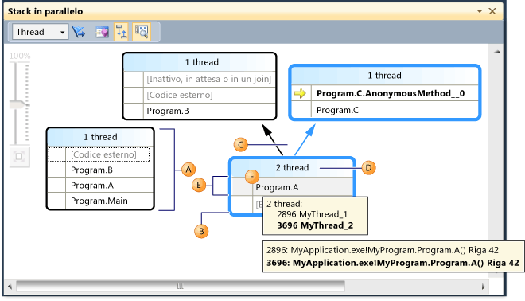
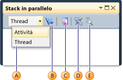
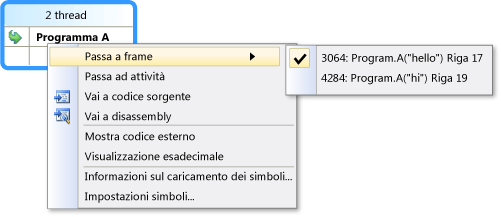
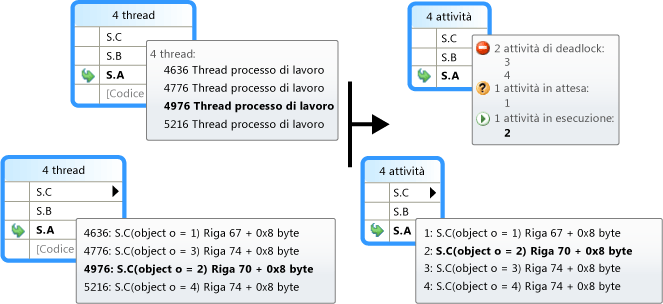
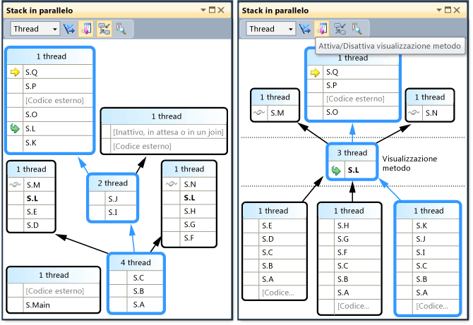

# Utilizzo della finestra Stack in parallelo
[!INCLUDE[vs2017banner](../code-quality/includes/vs2017banner.md)]

La finestra **Stack in parallelo** è utile quando si esegue il debug di applicazioni multithreading.  La **visualizzazione Thread** mostra informazioni sugli stack di chiamate per tutti i thread nell'applicazione.  Consente di navigare tra i thread e gli stack frame nei thread.  Nel codice gestito, **Visualizzazione attività** mostra gli stack di chiamate di oggetti <xref:System.Threading.Tasks.Task?displayProperty=fullName>.  Nel codice nativo, **Visualizzazione attività** mostra gli stack di chiamate di [gruppi di attività](/visual-cpp/parallel/concrt/task-parallelism-concurrency-runtime), [algoritmi paralleli](/visual-cpp/parallel/concrt/parallel-algorithms), [agenti asincroni](/visual-cpp/parallel/concrt/asynchronous-agents) e [attività leggere](/visual-cpp/parallel/concrt/task-scheduler-concurrency-runtime).  
  
## Visualizzazione Thread  
 Nell'illustrazione seguente viene mostrato un thread passato da principale ad A, quindi a B, infine a codice esterno.  Altri due thread sono partiti da codice esterno per poi passare ad A, ma uno dei thread ha proseguito fino a B, quindi a codice esterno, mentre l'altro thread ha proseguito fino a C, quindi ad AnonymousMethod.  
  
   
  
 Nell'illustrazione il percorso di chiamate del thread corrente è evidenziato in blu, mentre lo stack frame attivo è indicato dalla freccia gialla.  È possibile modificare lo stack frame corrente selezionando un metodo diverso nella finestra **Stack in parallelo**.  Ciò potrebbe comportare anche la modifica del thread corrente, a seconda che il metodo selezionato sia già parte del thread corrente o di un altro thread.  Nella tabella seguente vengono descritte le funzionalità principali della finestra **Stack in parallelo** mostrata nell'illustrazione.  
  
|Lettera di riferimento|Nome elemento|Descrizione|  
|----------------------------|-------------------|-----------------|  
|A|Segmento o nodo dello stack di chiamate|Contiene una serie di contesti del metodo per uno o più thread.  Se non vi sono righe della freccia connesse al nodo, questo rappresenta l'intero percorso di chiamate per i thread.|  
|B|Evidenziazione blu|Indica il percorso di chiamate del thread corrente.|  
|C|Righe della freccia|Connettono i nodi per costituire l'intero percorso di chiamate per i thread.|  
|D|Descrizione comandi nell'intestazione del nodo|Mostra l'ID e il nome definito dall'utente di ogni thread il cui percorso di chiamate condivide questo nodo.|  
|E|Contesto del metodo|Rappresenta uno o più stack frame nello stesso metodo.|  
|F|Descrizione comandi nel contesto del metodo|Nella visualizzazione Thread sono visualizzati tutti i thread in una tabella simile alla finestra **Thread**.  Nella visualizzazione Attività sono visualizzate tutte le attività in una tabella simile alla finestra **Attività in parallelo**.|  
  
 Inoltre, la finestra Stack in parallelo visualizza un'icona **Visualizzazione panoramica** nel riquadro principale quando il grafico è troppo grande per essere contenuto nella finestra.  È possibile fare clic sull'icona per visualizzare l'intero grafico nella finestra.  
  
## Icone del contesto del metodo  
 Nella tabella seguente vengono descritte le icone che forniscono informazioni sugli stack frame attivi e correnti:  
  
|||  
|-|-|  
|Icona|Descrizione|  
||Indica che il contesto del metodo contiene lo stack frame attivo del thread corrente.|  
||Indica che il contesto del metodo contiene lo stack frame attivo di un thread non corrente.|  
||Indica che il contesto del metodo contiene lo stack frame corrente.  Il nome del metodo appare in grassetto in tutti i nodi nei quali viene visualizzato.|  
  
## Controlli della barra degli strumenti  
 Nell'illustrazione e nella tabella che seguono sono descritti i controlli disponibili nella barra degli strumenti della finestra Stack in parallelo.  
  
   
  
|Lettera di riferimento|Controllo|Descrizione|  
|----------------------------|---------------|-----------------|  
|A|Casella combinata Thread\/Attività|Consente di passare dalla visualizzazione degli stack di chiamate dei thread alla visualizzazione degli stack di chiamate delle attività e viceversa.  Per ulteriori informazioni, vedere Visualizzazione Attività e Visualizzazione Thread.|  
|B|Mostra solo con contrassegno|Mostra gli stack di chiamate per i thread contrassegnati in altre finestre di debug, come **Thread GPU** ed **Espressione di controllo in parallelo**.|  
|C|Attiva\/Disattiva visualizzazione metodo|Consente di passare dalla Visualizzazione stack alla Visualizzazione metodo e viceversa.  Per ulteriori informazioni, vedere Visualizzazione metodo.|  
|D|Scorrimento automatico a stack frame corrente|Scorre automaticamente il diagramma in modo da visualizzare lo stack frame corrente.  Questa funzionalità è utile quando si modifica lo stack frame corrente da altre finestre o quando si raggiunge un nuovo punto di interruzione nei diagrammi di grandi dimensioni.|  
|E|Attiva\/Disattiva controllo zoom|Mostra o nasconde il controllo zoom.  È inoltre possibile ingrandire premendo CTRL e girando la rotella del mouse, indipendentemente dal fatto che il controllo zoom sia visibile o meno.|  
  
### Voci del menu di scelta rapida  
 Nell'illustrazione e nella tabella che seguono sono descritte le voci del menu di scelta rapida disponibili quando si fa clic con il pulsante destro del mouse su un contesto del metodo in Visualizzazione thread o Visualizzazione attività.  Le ultime sei voci derivano direttamente dalla finestra Stack di chiamate e non introducono nuovi comportamenti.  
  
   
  
|Voce di menu|Descrizione|  
|------------------|-----------------|  
|Flag|Contrassegna l'elemento selezionato.|  
|Rimuovi flag|Rimuove il flag dall'elemento selezionato.|  
|Blocca|Blocca l'elemento selezionato.|  
|Sblocca|Sblocca l'elemento selezionato.|  
|Passa ad attività \(thread\)|Esegue la stessa funzione della casella combinata nella barra degli strumenti, ma conserva lo stesso stack frame evidenziato.|  
|Vai a codice sorgente|Consente di passare al percorso nel codice sorgente che corrisponde allo stack frame sul quale l'utente ha fatto clic con il pulsante destro del mouse.|  
|Passa a frame|Uguale al comando di menu corrispondente nella finestra Stack di chiamate.  Tuttavia, con Stack in parallelo, è possibile che più frame corrispondano a un unico contesto del metodo.  La voce di menu dispone pertanto di sottomenu, ognuno dei quali rappresenta uno stack frame specifico.  Se uno degli stack frame si trova nel thread corrente, verrà selezionato il menu che corrisponde a quello stack frame.|  
|Vai a disassembly|Consente di passare al percorso nella finestra Disassembly che corrisponde allo stack frame sul quale l'utente ha fatto clic con il pulsante destro del mouse.|  
|Mostra codice esterno|Mostra o nasconde il codice esterno.|  
|Visualizzazione esadecimale|Consente di passare dalla visualizzazione decimale a quella esadecimale e viceversa.|  
|Informazioni sul caricamento dei simboli|Consente di visualizzare la finestra di dialogo corrispondente.|  
|Impostazioni simboli|Consente di visualizzare la finestra di dialogo corrispondente.|  
  
## Visualizzazione attività  
 Se l'applicazione utilizza oggetti <xref:System.Threading.Tasks.Task?displayProperty=fullName> \(codice gestito\) o oggetti `task_handle` \(codice nativo\) per esprimere il parallelismo, è possibile utilizzare la casella combinata nella barra degli strumenti della finestra Stack in parallelo per passare a *Visualizzazione attività*.  La visualizzazione Attività mostra gli stack di chiamate delle attività anziché dei thread.  La visualizzazione Attività presenta le seguenti differenze rispetto alla visualizzazione Thread:  
  
-   Gli stack di chiamate dei thread che non eseguono attività non vengono visualizzati.  
  
-   Gli stack di chiamate dei thread che eseguono attività sono visivamente tagliati nella parte superiore e nella parte inferiore per visualizzare i frame più rilevanti che riguardano le attività.  
  
-   Quando più attività si trovano in un unico thread, gli stack di chiamate di tali attività vengono suddivisi in nodi separati.  
  
 Nell'illustrazione seguente vengono mostrate la visualizzazione Attività della finestra Stack in parallelo sulla destra e la corrispondente visualizzazione Thread sulla sinistra.  
  
   
  
 Per vedere l'intero stack di chiamate, tornare semplicemente alla visualizzazione Thread facendo clic con il pulsante destro del mouse su uno stack frame e scegliendo **Passa a thread**.  
  
 Come descritto nella tabella precedente, passando il mouse sul contesto del metodo è possibile visualizzare informazioni aggiuntive.  Nell'immagine seguente sono mostrate le informazioni nella descrizione comandi per la visualizzazione Thread e la visualizzazione Attività.  
  
   
  
## Visualizzazione metodo  
 Dalla visualizzazione Thread o Attività è possibile ruotare il grafico sul metodo corrente facendo clic sull'icona Visualizzazione metodo nella barra degli strumenti.  La visualizzazione metodo mostra immediatamente tutti i metodi in tutti i thread che chiamano o sono chiamati dal metodo corrente.  Nell'illustrazione seguente viene mostrata una visualizzazione Thread e viene illustrato come le stesse informazioni appaiono nella visualizzazione metodo.  
  
   
  
 Passando a un nuovo stack frame, quel metodo diventa il metodo corrente e nella finestra vengono visualizzati tutti i chiamanti e i chiamati per il nuovo metodo.  È possibile che, in conseguenza a ciò, alcuni thread compaiano o scompaiano dalla visualizzazione, a seconda che il metodo sia visualizzato nei relativi stack di chiamate.  Per tornare alla visualizzazione Stack, fare nuovamente clic sul pulsante della barra degli strumenti Visualizzazione metodo.  
  
## Vedere anche  
 [Procedura dettagliata: debug di un'applicazione parallela](../debugger/walkthrough-debugging-a-parallel-application.md)   
 [Nozioni di base sul debugger](../debugger/debugger-basics.md)   
 [Debug del codice gestito](../debugger/debugging-managed-code.md)   
 [Parallel Programming](../Topic/Parallel%20Programming%20in%20the%20.NET%20Framework.md)   
 [Utilizzo della finestra Attività](../debugger/using-the-tasks-window.md)   
 [Procedura dettagliata: debug di un'applicazione parallela](../debugger/walkthrough-debugging-a-parallel-application.md)   
 [Classe attività](../extensibility/debugger/task-class-internal-members.md)