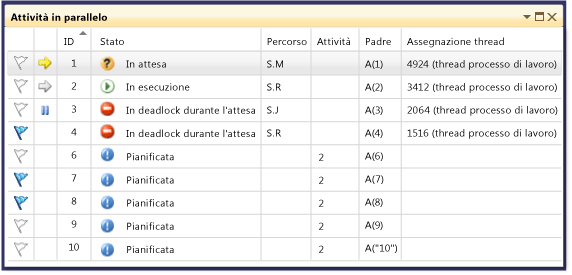
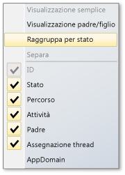
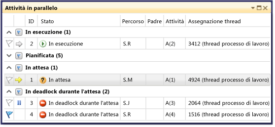
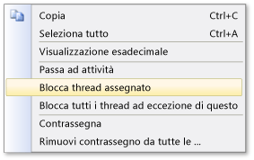

# Utilizzo della finestra Attivit&#224;
[!INCLUDE[vs2017banner](../code-quality/includes/vs2017banner.md)]

La finestra **Attività** è simile alla finestra **Thread**, l'unica differenza è che mostra informazioni sugli oggetti <xref:System.Threading.Tasks.Task?displayProperty=fullName>, [task\_handle](../Topic/task_group%20Class.md) o [WinJS.Promise](http://msdn.microsoft.com/library/windows/apps/br211867.aspx) e non su ogni thread.  Analogamente ai thread, le attività rappresentano operazioni asincrone eseguibili simultaneamente; tuttavia, più attività possono essere eseguite nello stesso thread.  Vedere [Programmazione asincrona in JavaScript \(app Windows Store\)](http://msdn.microsoft.com/library/windows/apps/hh700330.aspx) per altre informazioni.  
  
 Nel codice gestito è possibile utilizzare la finestra **Attività** quando si utilizzano gli oggetti <xref:System.Threading.Tasks.Task?displayProperty=fullName> o con le parole chiave **await** e **async** \(**Await** e **Async** in Visual Basic\).  Per altre informazioni sulle attività nel codice gestito, vedere  [Parallel Programming](../Topic/Parallel%20Programming%20in%20the%20.NET%20Framework.md).  
  
 Nel codice nativo, è possibile utilizzare la finestra **Attività** quando si utilizzano [gruppi di attività](/visual-cpp/parallel/concrt/task-parallelism-concurrency-runtime), [algoritmi paralleli](/visual-cpp/parallel/concrt/parallel-algorithms), [agenti asincroni](/visual-cpp/parallel/concrt/asynchronous-agents) e [attività leggere](/visual-cpp/parallel/concrt/task-scheduler-concurrency-runtime).  Per altre informazioni sulle attività nel codice nativo, vedere [Runtime di concorrenza](/visual-cpp/parallel/concrt/concurrency-runtime).  
  
 In JavaScript è possibile utilizzare la finestra Attività quando si utilizza codice promise .then.  
  
 La finestra **Attività** può essere utilizzata ogni volta che ci si inserisce nel debugger.  È possibile accedere a esso nel menu **Debug** scegliendo **Finestre** e facendo clic su **Attività**.  Nell'illustrazione seguente viene mostrata la finestra **Attività** nella modalità predefinita.  
  
   
  
> [!NOTE]
>  Nel codice gestito, un oggetto <xref:System.Threading.Tasks.Task> con lo stato <xref:System.Threading.Tasks.TaskStatus>, <xref:System.Threading.Tasks.TaskStatus> o <xref:System.Threading.Tasks.TaskStatus> potrebbe non essere visualizzato nella finestra Attività quando i thread gestiti si trovano nello stato sospensione o join.  
  
## Informazioni nelle colonne della finestra Attività  
 Nelle colonne della finestra **Attività** vengono visualizzate le seguenti informazioni.  
  
|Nome colonna|Descrizione|  
|------------------|-----------------|  
|**Flags**|Mostra quali attività sono contrassegnate e consente di impostare o rimuovere un flag per un'attività.|  
|**Icone**|Una freccia gialla indica l'attività corrente.  L'attività corrente è l'attività in primo piano nel thread corrente.   Una freccia bianca indica l'attività di interruzione, vale a dire l'attività corrente al momento della chiamata del debugger.   L'icona di sospensione indica un'attività bloccata dall'utente.  È possibile bloccare e sbloccare un'attività facendovi clic sopra con il pulsante destro del mouse nell'elenco.|  
|**ID**|Numero fornito dal sistema per l'attività.  Nel codice nativo, è l'indirizzo dell'attività.|  
|**Stato**|Stato corrente dell'attività \(pianificata, attiva, in deadlock, in attesa o completata\).  Un'attività pianificata è un'attività che non è stata ancora eseguita, pertanto non dispone ancora di uno stack di chiamate, un thread assegnato o informazioni correlate.   Un'attività attiva è un'attività che stava eseguendo codice prima dell'accesso al debugger.   Un'attività in attesa è un'attività bloccata in quanto sta attendendo la segnalazione di un evento, il rilascio di un blocco o la conclusione di un'altra attività.   Un'attività in deadlock è un'attività in attesa il cui thread è in deadlock con un altro thread.   Passare il mouse sulla cella **Stato** di un'attività in deadlock o in attesa per visualizzare ulteriori informazioni sul blocco. **Warning:**  La finestra **Attività** segnala un deadlock solo per un'attività bloccata che utilizza una primitiva di sincronizzazione supportata da Wait Chain Traversal \(WCT\).  Ad esempio, per un oggetto <xref:System.Threading.Tasks.Task> in deadlock, che utilizza WCT, viene visualizzato il messaggio **In attesa\-In deadlock**.  Per un'attività in deadlock gestita dal runtime di concorrenza, che non utilizza WCT, viene visualizzato il messaggio **In attesa**.  Per altre informazioni su WCT, vedere [Wait Chain Traversal](http://msdn.microsoft.com/library/ms681622\(VS.85\).aspx).|  
|**Ora di inizio**|Ora in cui l'attività è diventata attiva.|  
|**Durata**|Numero di secondi durante i quali l'attività è rimasta attiva.|  
|**Ora di completamento**|Ora in cui l'attività è stata completata.|  
|**Percorso**|Percorso corrente nello stack di chiamate dell'attività.  Passare il mouse su questa cella per visualizzare l'intero stack di chiamate dell'attività.  Le attività pianificate non presentano alcun valore in questa colonna.|  
|**Attività**|Metodo iniziale ed eventuali argomenti passati all'attività quando è stata creata.|  
|**Padre**|ID dell'attività che ha creato questa attività.  Se la cella è vuota significa che l'attività non dispone di un'attività padre.  Questo dato è applicabile ai soli programmi gestiti.|  
|**Assegnazione thread**|ID e nome del thread nel quale viene eseguita l'attività.|  
|**Stato restituito**|Stato dell'attività quando è stata completata.  I valori di stato restituito sono **Operazione riuscita**, **Operazione annullata** ed **Errore**.|  
|**AppDomain**|Dominio applicazione nel quale viene eseguita l'attività, in caso di codice gestito.|  
|**task\_group**|Indirizzo dell'oggetto [task\_group](../Topic/task_group%20Class.md) che ha pianificato l'attività, in caso di codice nativo.  Per gli agenti asincroni e le attività leggere, questa colonna viene impostata su 0.|  
|Processo|ID del processo in cui viene eseguita l'attività.|  
|Stato Async|Per il codice gestito, lo stato dell'attività.  Per impostazione predefinita, questa colonna è nascosta.  Per visualizzarla, aprire il menu di scelta rapida per una delle intestazioni di colonna.  Scegliere **Colonne**, **AsyncState**.|  
  
 Per aggiungere colonne alla visualizzazione, fare clic con il pulsante destro del mouse su un'intestazione di colonna e selezionare le colonne desiderate.  Per rimuovere le colonne, annullare le selezioni. È possibile inoltre riordinare le colonne trascinandole a sinistra o a destra.  Nell'illustrazione seguente viene mostrato il menu di scelta rapida delle colonne.  
  
   
  
## Ordinamento delle attività  
 Per ordinare le attività in base ai criteri delle colonne, fare clic sull'intestazione di colonna.  Ad esempio, facendo clic sull'intestazione di colonna **ID** è possibile ordinare le attività in base all'ID attività: 1, 2, 3, 4, 5 e così via.  Per invertire l'ordine, fare nuovamente clic sull'intestazione.  La colonna di ordinamento e l'ordinamento correnti sono indicati da una freccia nella colonna.  
  
## Raggruppamento delle attività  
 È possibile raggruppare le attività in base a una qualsiasi colonna nella visualizzazione elenco.  Ad esempio, facendo clic con il pulsante destro del mouse sull'intestazione di colonna **Stato** e scegliendo **Raggruppa per stato**, è possibile raggruppare tutte le attività con lo stesso stato.  Tale operazione può risultare utile, ad esempio, per visualizzare rapidamente tutte le attività in attesa, così da concentrarsi sul motivo del blocco.  È possibile inoltre comprimere un gruppo di poco interesse durante la sessione di debug.  Allo stesso modo, è possibile raggruppare in base alle altre colonne.  Per contrassegnare o rimuovere il contrassegno di un gruppo, è sufficiente fare clic sul pulsante accanto all'intestazione del gruppo.  Nell'illustrazione seguente viene mostrata la finestra **Attività** nella modalità raggruppata.  
  
   
  
## Visualizzazione padre\/figlio  
 \(Questa visualizzazione è disponibile solo per codice gestito\). Facendo clic con il pulsante destro del mouse su un'intestazione di colonna e scegliendo **Visualizzazione padre\/figlio**, è possibile impostare l'elenco di attività su una visualizzazione gerarchica nella quale ogni attività figlio è un nodo secondario che può essere visualizzato o nascosto nell'attività padre.  Nell'illustrazione seguente vengono mostrate le attività nella visualizzazione padre\/figlio.  
  
   
  
## Contrassegno delle attività  
 È possibile contrassegnare il thread su cui un'attività è in esecuzione selezionando l'elemento dell'elenco attività e scegliendo **Flag** dal menu di scelta rapida oppure facendo clic sull'icona del flag nella prima colonna.  Se si contrassegnano diverse attività, sarà successivamente possibile ordinare in base alla colonna del contrassegno in modo da portare tutte le attività contrassegnate in cima e potersi concentrare su di esse.  È inoltre possibile utilizzare la finestra **Stack in parallelo** per visualizzare solo le attività con contrassegno.  In questo modo si possono filtrare le attività di poco interesse per il debug.  I contrassegni non vengono salvati in modo permanente tra una sessione di debug e l'altra.  
  
## Blocco e sblocco delle attività  
 Per bloccare il thread nel quale viene eseguita un'attività, fare clic con il pulsante destro del mouse sull'elemento dell'elenco di attività e scegliere **Blocca thread assegnato**.  Se un'attività è già bloccata, il comando è **Sblocca thread assegnato**. Quando si blocca un thread, questo non verrà eseguito nel momento in cui si proseguirà con l'esecuzione del codice dopo il punto di interruzione corrente.  Il comando **Blocca tutti i thread ad eccezione di quello corrente** blocca tutti i thread eccetto quello che esegue l'elemento dell'elenco di attività.  
  
 Nell'illustrazione seguente vengono mostrate le altre voci di menu per ogni attività.  
  
   
  
## Vedere anche  
 [Nozioni di base sul debugger](../debugger/debugger-basics.md)   
 [Debug del codice gestito](../debugger/debugging-managed-code.md)   
 [Parallel Programming](../Topic/Parallel%20Programming%20in%20the%20.NET%20Framework.md)   
 [Runtime di concorrenza](/visual-cpp/parallel/concrt/concurrency-runtime)   
 [Utilizzo della finestra Stack in parallelo](../debugger/using-the-parallel-stacks-window.md)   
 [Procedura dettagliata: debug di un'applicazione parallela](../debugger/walkthrough-debugging-a-parallel-application.md)