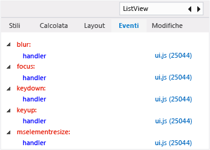

# Visualizzare i listener di eventi DOM
[!INCLUDE[vs2017banner](../code-quality/includes/vs2017banner.md)]

  
  
 Nella scheda **Eventi** di DOM Explorer vengono visualizzati gli eventi associati a un elemento DOM. Ogni nodo principale nella scheda **Eventi** rappresenta un evento con sottoscrittori attivi. Il nodo principale contiene i sottonodi che rappresentano i listener di eventi registrati per l'evento specifico. Oltre a visualizzare i listener di eventi, puoi usare questa scheda per spostarti nel percorso del listener di eventi nel codice JavaScript. Le informazioni contenute in questo argomento sono applicabili alle app di Windows Store compilate con HTML e JavaScript.  
  
 L'elenco nella scheda **Eventi** è dinamico. Se aggiungi un listener di eventi quando l'applicazione è in esecuzione, il nuovo listener verrà visualizzato nella scheda. Per informazioni sull'aggiunta e sulla rimozione di listener di eventi, vedi i [Suggerimenti per la risoluzione dei problemi con i listener di eventi](#Tips) in questo argomento.  
  
> [!NOTE]
>  I listener di eventi per gli elementi di codice che non sono elementi DOM, come `xhr`, non vengono visualizzati nella scheda **Eventi**.  
  
## Visualizzare listener di eventi per elementi DOM  
 Questo esempio mostra un'app di Windows Phone Store. Le funzionalità di DOM Explorer qui descritte sono supportate anche per le app di Windows Store.  
  
#### Per visualizzare i listener di eventi  
  
1.  In Visual Studio crea un'app JavaScript che usa il modello di progetto Applicazione pivot Windows Phone.  
  
2.  Con il modello aperto in Visual Studio seleziona **Emulator 8.1 WVGA 4in 512MB** nell'elenco a discesa sulla barra degli strumenti Debug nel debugger:  
  
       
  
3.  Premi F5 per eseguire l'app in modalità debug.  
  
4.  Nell'app in esecuzione passa all'elemento pivot **Sezione 3**.  
  
5.  Passa a Visual Studio \(ALT\+TAB o F12\).  
  
6.  In DOM Explorer scegli `Find` nell'angolo superiore destro.  
  
7.  Digita `ListView` e premi INVIO.  
  
8.  Se necessario, fai clic sul pulsante **Avanti** per trovare l'elemento `DIV` che rappresenta il controllo `ListView`. Questo elemento ha un valore `data-win-control` di `WinJS.UI.ListView`.  
  
     L'elemento `DIV` dovrebbe ora essere selezionato in DOM Explorer.  
  
9. Scegli la scheda **Eventi** nel riquadro a destra di DOM Explorer.  
  
     Ora puoi visualizzare gli eventi con sottoscrittori attivi per l'elemento `DIV`, come illustrato di seguito.  
  
       
  
10. Per individuare i listener per questi eventi, fai clic sui link dei file JavaScript associati.  
  
11. Per identificare rapidamente i listener per gli elementi padre nella gerarchia DOM, scegli un elemento padre nell'elenco della gerarchia nella parte inferiore di DOM Explorer.  
  
       
  
     La scheda **Eventi** mostra i listener di eventi per qualsiasi elemento scelto nell'elenco della gerarchia.  
  
###  <a name="Tips"></a> Suggerimenti per la risoluzione dei problemi con i listener di eventi  
 In alcuni scenari di app, i listener di eventi devono essere rimossi in modo esplicito tramite [removeEventListener](http://msdn.microsoft.com/library/ie/ff975250\(v=vs.85\).aspx). Usa la scheda **Eventi** di DOM Explorer per verificare se i listener di eventi sono stati rimossi dagli elementi DOM mentre il codice è in esecuzione. Ecco alcuni suggerimenti utili per risolvere questi tipi di problemi:  
  
-   Per le app che usano il modello di navigazione a pagina singola implementato nei [modelli di progetto](http://msdn.microsoft.com/library/windows/apps/hh758331.aspx) di Visual Studio, in genere non è necessario rimuovere i listener di eventi registrati per gli oggetti, come gli elementi DOM, che fanno parte di una pagina. In questo scenario, un elemento DOM e i listener di eventi associati hanno la stessa durata e possono essere sottoposti a Garbage Collection.  
  
-   Se la durata dell'oggetto o dell'elemento DOM è diversa da quella del listener di eventi associato, potrebbe essere necessario chiamare il metodo `removeEventListener`. Se, ad esempio, usi l'evento `window.onresize`, potresti dover rimuovere il listener di eventi se esci dalla pagina in cui gestisci l'evento.  
  
-   Se `removeEventListener` non riesce a rimuovere il listener specificato, potrebbe venire chiamato in un'istanza diversa dell'oggetto. Puoi usare il metodo [Metodo bind \(Function\)](../Topic/bind%20Method%20\(Function\)%20\(JavaScript\).md) per risolvere il problema quando aggiungi il listener.  
  
-   Per rimuovere un listener di eventi aggiunto usando [Metodo bind \(Function\)](../Topic/bind%20Method%20\(Function\)%20\(JavaScript\).md) o una funzione anonima, archivia un'istanza della funzione quando aggiungi il listener. Ecco un metodo per usare questo modello in modo sicuro:  
  
    ```javascript  
    // You could use the following code within the constructor function of an object, or  
    // in the ready function of a PageControl object (Store app).  
    this.storedHandler = this._handlerFunc.bind(this);  
    elem.addEventListener('mouseup', this.storedHandler);  
  
    // In this example, add the following code in the PageControl object's unload function.  
    elem.removeEventListener('mouseup', this.storedHandler);  
  
    ```  
  
     Se usi il codice seguente invece di archiviare un riferimento alla funzione associata, non potrai rimuovere il listener di eventi in modo esplicito:  
  
    ```javascript  
    // Avoid this pattern. No reference to the bound function is available.  
    elem.addEventListener('mouseup', this._handlerFunc.bind(this));  
    ```  
  
-   Non puoi rimuovere un listener di eventi tramite `removeEventListener` se lo hai aggiunto usando l'attributo `obj.on<eventname>`, ad esempio `window.onresize = handlerFunc`.  
  
-   Usa JavaScript Memory Analyzer per [Memoria JavaScript](../profiling/javascript-memory.md) nella tua app. I listener di eventi che devono essere rimossi in modo esplicito potrebbero venire rilevati come perdita di memoria.  
  
## Vedere anche  
 [Guida introduttiva: Eseguire il debug di HTML e CSS](../debugger/quickstart-debug-html-and-css.md)   
 [Eseguire il debug di stili CSS tramite DOM Explorer](../debugger/debug-css-styles-using-dom-explorer.md)   
 [Eseguire il debug del layout usando DOM Explorer](../debugger/debug-layout-using-dom-explorer.md)