# Procedura dettagliata: debug di un&#39;applicazione parallela
[!INCLUDE[vs2017banner](../code-quality/includes/vs2017banner.md)]

In questa procedura dettagliata viene illustrato come utilizzare le finestre **Attività in parallelo** e **Stack in parallelo** per eseguire il debug di un'applicazione parallela.  Queste finestre aiutano a comprendere e a verificare il comportamento di runtime del codice che utilizza [Task Parallel Library \(TPL\)](../Topic/Task%20Parallel%20Library%20\(TPL\).md) o il [Runtime di concorrenza](/visual-cpp/parallel/concrt/concurrency-runtime).  Nella procedura dettagliata viene fornito un esempio di codice con punti di interruzione incorporati.  Una volta interrotta l'esecuzione del codice, viene illustrato come esaminarlo utilizzando le finestre **Attività in parallelo** e **Stack in parallelo**.  
  
 Nella procedura dettagliata vengono spiegate le seguenti attività:  
  
-   Come visualizzare gli stack di chiamate di tutti i thread in un'unica visualizzazione.  
  
-   Come visualizzare l'elenco delle istanze di `System.Threading.Tasks.Task` create nell'applicazione.  
  
-   Come visualizzare gli stack di chiamate reali delle attività anziché dei thread.  
  
-   Come passare al codice dalle finestre **Attività in parallelo** e **Stack in parallelo**.  
  
-   Come le finestre affrontano il ridimensionamento tramite il raggruppamento, lo zoom e altre funzionalità correlate.  
  
## Prerequisiti  
 In questa procedura dettagliata si presuppone che **Just My Code** sia abilitato.  Nel menu **Strumenti** fare clic su **Opzioni**, espandere il nodo **Debug**, selezionare **Generale**, quindi **Abilita Just My Code \(solo gestito\)**.  Se non si imposta questa funzionalità, si può comunque utilizzare la procedura dettagliata, ma è possibile che i risultati differiscano dalle illustrazioni.  
  
## Esempio in C\#  
 Se si utilizza l'esempio in C\#, la procedura dettagliata presuppone inoltre che il codice esterno sia nascosto.  Per attivare o disattivare la visualizzazione del codice esterno, fare clic con il pulsante destro del mouse sull'intestazione della tabella **Nome** nella finestra **Stack di chiamate**, quindi selezionare o deselezionare **Mostra codice esterno**.  Se non si imposta questa funzionalità, si può comunque utilizzare la procedura dettagliata, ma è possibile che i risultati differiscano dalle illustrazioni.  
  
## Esempio in C\+\+  
 Se si utilizza l'esempio in C\+\+, è possibile ignorare i riferimenti al codice esterno contenuti in questo argomento.  Il codice esterno si applica solo all'esempio in C\#.  
  
## Illustrazioni  
 Le illustrazioni contenute in questo argomento sono state registrate in un computer quad core che esegue l'esempio in C\#.  Benché sia possibile utilizzare altre configurazioni per completare questa procedura dettagliata, le illustrazioni potrebbero differire dalle schermate visualizzate sul computer in uso.  
  
## Creazione del progetto di esempio  
 L'esempio di codice riportato in questa procedura dettagliata è relativo a un'applicazione che non esegue alcuna operazione.  L'obiettivo è semplicemente comprendere come utilizzare le finestre degli strumenti per eseguire il debug di un'applicazione parallela.  
  
#### Per creare il progetto di esempio  
  
1.  Scegliere **Nuovo** dal menu **File** di Visual Studio, quindi **Progetto**.  
  
2.  Nel riquadro **Modelli installati** selezionare Visual C\#, Visual Basic o Visual C\+\+.  Per i linguaggi gestiti, assicurarsi che [!INCLUDE[net_v40_short](../code-quality/includes/net_v40_short_md.md)] sia visualizzato nella casella del framework.  
  
3.  Selezionare **Applicazione console**, quindi fare clic su **OK**.  Restare nella configurazione per il debug, ovvero l'impostazione predefinita.  
  
4.  Aprire il file di codice con estensione CPP, CS o VB nel progetto.  Eliminarne il contenuto per creare un file di codice vuoto.  
  
5.  Incollare il seguente codice per il linguaggio selezionato nel file di codice vuoto.  
  
 [!code-cs[Debugger#1](../debugger/codesnippet/CSharp/walkthrough-debugging-a-parallel-application_1.cs)]
 [!code-cpp[Debugger#1](../debugger/codesnippet/CPP/walkthrough-debugging-a-parallel-application_1.cpp)]
 [!code-vb[Debugger#1](../debugger/codesnippet/VisualBasic/walkthrough-debugging-a-parallel-application_1.vb)]  
  
1.  Scegliere **Salva tutto** dal menu **File**.  
  
2.  Scegliere **Ricompila soluzione** dal menu **Compila**.  
  
     Notare che vi sono quattro chiamate a `Debugger.Break` \(`DebugBreak` nell'esempio C\+\+\). Pertanto, non è necessario inserire punti di interruzione; la semplice esecuzione dell'applicazione determinerà fino a quattro interruzioni nel debugger.  
  
## Utilizzo della finestra Stack in parallelo: visualizzazione Thread  
 Scegliere **Avvia debug** dal menu **Debug**.  Attendere che venga raggiunto il primo punto di interruzione.  
  
#### Per visualizzare lo stack di chiamate di un singolo thread  
  
1.  Scegliere **Finestre** dal menu **Debug**, quindi **Thread**.  Ancorare la finestra **Thread** nella parte inferiore di Visual Studio.  
  
2.  Scegliere **Finestre** dal menu **Debug**, quindi fare clic su **Stack di chiamate**.  Ancorare la finestra **Stack di chiamate** nella parte inferiore di Visual Studio.  
  
3.  Fare doppio clic su un thread nella finestra **Thread** per far sì che diventi il thread corrente.  I thread correnti presentano una freccia gialla.  Quando si modifica il thread corrente, il relativo stack di chiamate viene visualizzato nella finestra **Stack di chiamate**.  
  
#### Per esaminare la finestra Stack in parallelo  
  
1.  Scegliere **Finestre** dal menu **Debug**, quindi fare clic su **Stack in parallelo**.  Assicurarsi che **Thread** sia selezionato nella casella nell'angolo superiore sinistro.  
  
     Tramite la finestra **Stack in parallelo** è possibile visualizzare contemporaneamente più stack di chiamate in un'unica visualizzazione.  Nell'illustrazione che segue viene mostrata la finestra **Stack in parallelo** sopra alla finestra **Stack di chiamate**.  
  
     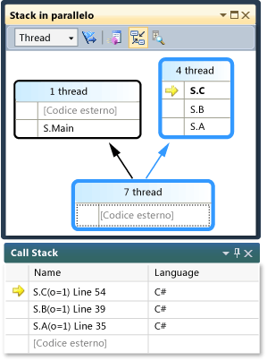  
  
     Lo stack di chiamate del thread principale viene visualizzato in una casella, mentre gli stack di chiamate degli altri quattro thread sono raggruppati in un'altra casella.  I quattro thread vengono raggruppati insieme in quanto i rispettivi stack frame condividono gli stessi contesti del metodo, vale a dire si trovano negli stessi metodi: `A`, `B` e `C`.  Per visualizzare gli ID e i nomi dei thread che condividono la stessa casella, passare il mouse sull'intestazione \(**4 thread**\).  Il thread corrente viene visualizzato in grassetto, come mostrato nell'illustrazione seguente.  
  
       
  
     La freccia gialla indica lo stack frame attivo del thread corrente.  Per ottenere ulteriori informazioni, passarvi sopra il mouse.  
  
     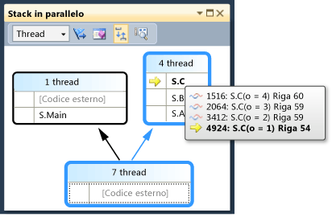  
  
     È possibile impostare i dettagli da visualizzare per gli stack frame \(**Nomi moduli**, **Tipi di parametro**, **Nomi parametri**, **Valori di parametro**, **Numeri di riga** e **Offset dei byte**\) facendo clic con il pulsante destro del mouse nella finestra **Stack di chiamate**.  
  
     Un'evidenziazione blu attorno a una casella indica che il thread corrente è parte di quella casella.  Il thread corrente è inoltre indicato dallo stack frame in grassetto nella descrizione comandi.  Facendo doppio clic sul thread principale nella finestra Thread, si osserverà che l'evidenziazione blu nella finestra **Stack in parallelo** si sposta di conseguenza.  
  
       
  
#### Per riprendere l'esecuzione fino al secondo punto di interruzione  
  
1.  Per riprendere l'esecuzione fino al raggiungimento del secondo punto di interruzione, fare clic su **Continua** nel menu **Debug**.  Nell'illustrazione seguente viene mostrata la struttura ad albero del thread in corrispondenza del secondo punto di interruzione.  
  
     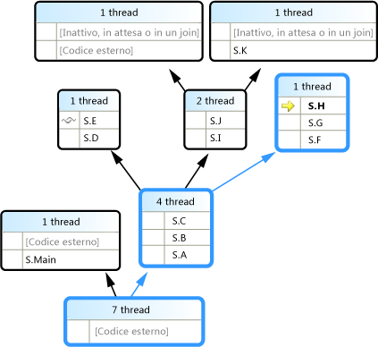  
  
     In corrispondenza del primo punto di interruzione, i quattro thread erano passati tutti dal metodo S.A a S.B e a S.C.  Tale informazione è ancora visibile nella finestra **Stack in parallelo**, ma i quattro thread sono avanzati.  Uno di essi ha proseguito fino a S.D, quindi a S.E.  Un altro ha proseguito fino a S.F, S.G e S.H.  Gli altri due hanno proseguito fino a S.I e S.J, dopo di che uno è passato a S.K mentre l'altro ha proseguito fino al codice esterno non utente.  
  
     È possibile passare il mouse sull'intestazione della casella, ad esempio **1 thread** o **2 thread**, per visualizzare gli ID dei thread.  Passando invece il mouse sugli stack frame, verranno visualizzati gli ID dei thread e altri dettagli sui frame.  L'evidenziazione blu indica il thread corrente, mentre la freccia gialla indica lo stack frame attivo del thread corrente.  
  
     L'icona con i fili \(linee ondulate di colore blu e rosso sovrapposte\) indica gli stack frame attivi dei thread non correnti.  Fare doppio clic su S.B nella finestra **Stack di chiamate** per passare da un frame all'altro.  Nella finestra **Stack in parallelo** lo stack frame corrente del thread corrente è indicato tramite un'icona con una freccia circolare verde.  
  
     Passare da un thread all'altro nella finestra **Thread** e osservare che la visualizzazione nella finestra **Stack in parallelo** viene aggiornata.  
  
     Per passare a un altro thread, o a un altro frame di un altro thread, è possibile utilizzare il menu di scelta rapida nella finestra **Stack in parallelo**.  Ad esempio, fare clic con il pulsante destro del mouse su S.J, scegliere **Passa a frame**, quindi fare clic su un comando.  
  
       
  
     Fare clic con il pulsante destro del mouse su S.C e scegliere **Passa a frame**.  Uno dei comandi presenta un segno di spunta che indica lo stack frame del thread corrente.  È possibile passare a quel frame dello stesso thread \(si sposterà soltanto la freccia verde\) oppure passare all'altro thread \(si sposterà anche l'evidenziazione blu\).  Nell'illustrazione seguente viene mostrato il sottomenu.  
  
       
  
     Quando un contesto del metodo è associato a un unico stack frame, nell'intestazione della casella viene visualizzato **1 thread**; fare doppio clic per passare a esso.  Facendo doppio clic su un contesto del metodo al quale sono associati più frame, verrà visualizzato automaticamente il menu.  Passando il mouse sui contesti del metodo, notare il triangolo nero sulla destra.  Il menu di scelta rapida verrà visualizzato anche facendo clic su quel triangolo.  
  
     Nel caso di applicazioni di grandi dimensioni con molti thread, è possibile concentrarsi su un unico sottoinsieme di thread.  Nella finestra **Stack in parallelo** è possibile visualizzare gli stack di chiamate per i soli thread con contrassegno.  Nella barra degli strumenti fare clic sul pulsante **Mostra solo con contrassegno** accanto alla casella di riepilogo.  
  
     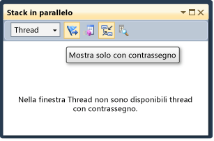  
  
     Dopo di che, nella finestra **Thread** contrassegnare i thread uno a uno per vedere come vengono visualizzati i rispettivi stack di chiamate nella finestra **Stack in parallelo**.  Per contrassegnare i thread, utilizzare il menu di scelta rapida o la prima cella di un thread.  Fare nuovamente clic sul pulsante **Mostra solo con contrassegno** della barra degli strumenti per visualizzare tutti i thread.  
  
#### Per riprendere l'esecuzione fino al terzo punto di interruzione  
  
1.  Per riprendere l'esecuzione fino al raggiungimento del terzo punto di interruzione, fare clic su **Continua** nel menu **Debug**.  
  
     Se più thread si trovano nello stesso metodo ma questo, a sua volta, non si trovava all'inizio dello stack di chiamate, il metodo viene visualizzato in caselle diverse.  Un esempio in corrispondenza del punto di interruzione corrente è S.L, il quale contiene tre thread e viene visualizzato in tre caselle.  Fare doppio clic su S.L.  
  
     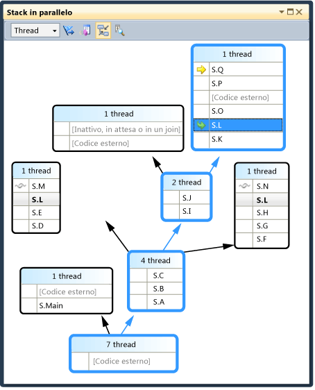  
  
     Si noti che S.L appare in grassetto nelle altre due caselle, così da poter vedere in quali altri punti viene visualizzato.  Per visualizzare quali frame chiamano in S.L e quali sono chiamati da S.L, fare clic sul pulsante **Attiva\/Disattiva visualizzazione metodo** nella barra degli strumenti.  Nell'illustrazione seguente viene mostrata la visualizzazione del metodo della finestra **Stack in parallelo**.  
  
     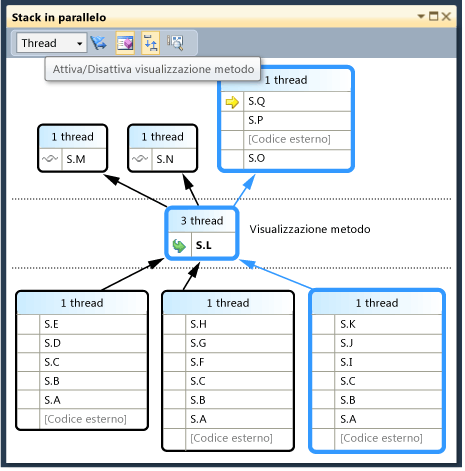  
  
     Si noti come il diagramma sia imperniato sul metodo selezionato e lo abbia posizionato nella propria casella al centro della visualizzazione.  I chiamati e i chiamanti vengono visualizzati nella parte superiore e in quella inferiore.  Fare nuovamente clic sul pulsante **Attiva\/Disattiva visualizzazione metodo** per uscire da questa modalità.  
  
     Il menu di scelta rapida della finestra **Stack in parallelo** presenta inoltre le voci descritte di seguito.  
  
    -   **Visualizzazione esadecimale** consente di scegliere tra il formato decimale e il formato esadecimale dei numeri nelle descrizioni comandi.  
  
    -   **Informazioni sul caricamento dei simboli** e **Impostazioni simboli** consentono di aprire le rispettive finestre di dialogo.  
  
    -   **Vai a codice sorgente** e **Vai a disassembly** consentono di passare al metodo selezionato nell'editor.  
  
    -   **Mostra codice esterno** consente di visualizzare tutti i frame anche se non si trovano nel codice utente.  Provare questa voce per vedere il diagramma espandersi per accogliere i frame aggiuntivi, i quali possono essere disattivati in quanto non si dispone di simboli per tali frame.  
  
     Quando si dispone di diagrammi di grandi dimensioni e si avanza al punto di interruzione successivo, è possibile far sì che la visualizzazione scorra automaticamente fino allo stack frame attivo del thread corrente, vale a dire il thread che per primo ha raggiunto il punto di interruzione.  Nella finestra **Stack in parallelo** assicurarsi che il pulsante **Scorrimento automatico a stack frame corrente** nella barra degli strumenti sia attivato.  
  
     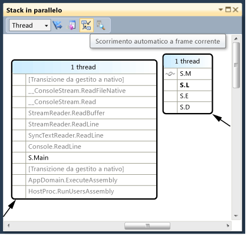  
  
2.  Prima di continuare, nella finestra **Stack in parallelo** scorrere fino in fondo verso sinistra e verso il basso.  
  
#### Per riprendere l'esecuzione fino al quarto punto di interruzione  
  
1.  Per riprendere l'esecuzione fino al raggiungimento del quarto punto di interruzione, fare clic su **Continua** nel menu **Debug**.  
  
     Si noti come la visualizzazione sia scorsa automaticamente fino al punto in questione.  Passare da un thread all'altro nella finestra **Thread** o da uno stack frame all'altro nella finestra **Stack di chiamate** e notare come la visualizzazione scorra sempre automaticamente al frame corretto.  Disattivare l'opzione **Scorrimento automatico a stack frame corrente** e osservare la differenza.  
  
     La **Visualizzazione panoramica** risulta inoltre utile con diagrammi di grandi dimensioni nella finestra **Stack in parallelo**.  Per vedere la **Visualizzazione panoramica**, fare clic sul pulsante tra le barre di scorrimento nell'angolo inferiore destro della finestra, come mostrato nell'illustrazione seguente.  
  
     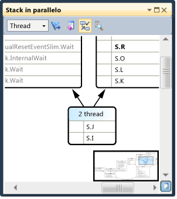  
  
     È possibile spostare il rettangolo per avere una rapida panoramica del diagramma.  
  
     Un altro modo per spostare il diagramma in una direzione qualsiasi è fare clic su un'area vuota del diagramma e trascinarlo nel punto desiderato.  
  
     Per lo zoom avanti e indietro del diagramma, tenere premuto CTRL mentre si muove la rotella del mouse.  In alternativa, fare clic sul pulsante Zoom nella barra degli strumenti, quindi utilizzare lo strumento Zoom.  
  
     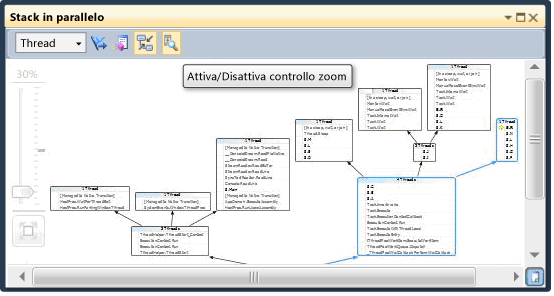  
  
     È inoltre possibile visualizzare gli stack dall'alto verso il basso, anziché dal basso verso l'alto. A tal proposito, fare clic sul menu **Strumenti**, scegliere **Opzioni**, quindi selezionare o deselezionare l'opzione nel nodo **Debug**.  
  
2.  Prima di continuare, fare clic su **Termina debug** nel menu **Debug** per terminare l'esecuzione.  
  
## Utilizzo della finestra Attività in parallelo e della visualizzazione Attività della finestra Stack in parallelo  
 Prima di proseguire, si consiglia di completare le procedure precedenti.  
  
#### Per riavviare l'applicazione fino al raggiungimento del primo punto di interruzione  
  
1.  Nel menu **Debug** fare clic su **Avvia debug** e attendere il raggiungimento del primo punto di interruzione.  
  
2.  Scegliere **Finestre** dal menu **Debug**, quindi **Thread**.  Ancorare la finestra **Thread** nella parte inferiore di Visual Studio.  
  
3.  Scegliere **Finestre** dal menu **Debug**, quindi **Stack di chiamate**.  Ancorare la finestra **Stack di chiamate** nella parte inferiore di Visual Studio.  
  
4.  Fare doppio clic su un thread nella finestra **Thread** per far sì che diventi il thread corrente.  I thread correnti presentano la freccia gialla.  Quando si modifica il thread corrente, le altre finestre vengono aggiornate.  Si esamineranno quindi le attività.  
  
5.  Scegliere **Finestre** dal menu **Debug**, quindi **Attività in parallelo**.  Nell'illustrazione seguente viene mostrata la finestra **Attività in parallelo**.  
  
       
  
     Per ogni attività in esecuzione è possibile visualizzare il relativo ID, restituito dalla proprietà omonima, l'ID e il nome del thread che la esegue e il relativo percorso \(passando il mouse sul percorso viene visualizzata una descrizione comandi con l'intero stack di chiamate\).  Inoltre, nella colonna **Attività** è possibile visualizzare il metodo passato nell'attività, in altre parole il punto iniziale.  
  
     Le colonne possono essere ordinate.  Si noti il glifo di ordinamento che indica la colonna e la direzione di ordinamento.  È anche possibile riordinare le colonne trascinandole a sinistra o a destra.  
  
     La freccia gialla indica l'attività corrente.  Per passare da un'attività all'altra, fare doppio clic su un'attività o utilizzare il menu di scelta rapida.  Quando si passa da un'attività all'altra, il thread sottostante diventa quello corrente e le altre finestre vengono aggiornate.  
  
     Quando si passa manualmente da un'attività a un'altra, la freccia gialla si sposta, ma una freccia bianca continua a mostrare l'attività che ha causato l'interruzione nel debugger.  
  
#### Per riprendere l'esecuzione fino al secondo punto di interruzione  
  
1.  Per riprendere l'esecuzione fino al raggiungimento del secondo punto di interruzione, fare clic su **Continua** nel menu **Debug**.  
  
     In precedenza, nella colonna **Stato** tutte le attività venivano indicate come in esecuzione, ma ora due attività sono in attesa.  Le attività possono essere bloccate per molte ragioni diverse.  Passare il mouse su un'attività in attesa nella colonna **Stato** per conoscere il motivo per cui è bloccata.  Ad esempio, nell'illustrazione seguente, l'attività 3 è in attesa dell'attività 4.  
  
     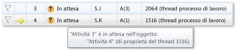  
  
     L'attività 4, a sua volta, è in attesa di un monitoraggio di proprietà del thread assegnato all'attività 2.  
  
     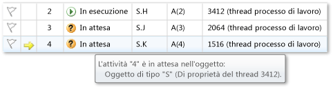  
  
     È possibile contrassegnare un'attività facendo clic sul contrassegno nella prima colonna della finestra **Attività in parallelo**.  
  
     È possibile utilizzare i contrassegni per tenere traccia delle attività tra i vari punti di interruzione nella stessa sessione di debug o per filtrare le attività i cui stack di chiamate vengono visualizzati nella finestra **Stack in parallelo**.  
  
     Quando in precedenza si utilizzava la finestra **Stack in parallelo**, venivano visualizzati i thread dell'applicazione.  Visualizzando nuovamente la finestra **Stack in parallelo**, questa volta si vedranno le attività dell'applicazione.  A tale proposito, selezionare **Attività** nella casella in alto a sinistra.  Nell'illustrazione che segue viene mostrata la visualizzazione Attività.  
  
       
  
     I thread che al momento non eseguono attività non vengono mostrati nella visualizzazione Attività della finestra **Stack in parallelo**.  Inoltre, per i thread che eseguono attività, alcuni stack frame che non sono importanti per le attività vengono filtrati dalla parte superiore e dalla parte inferiore dello stack.  
  
     Visualizzare nuovamente la finestra **Attività in parallelo**.  Fare clic con il pulsante destro del mouse su un'intestazione di colonna qualsiasi per visualizzare un menu di scelta rapida per la colonna.  
  
     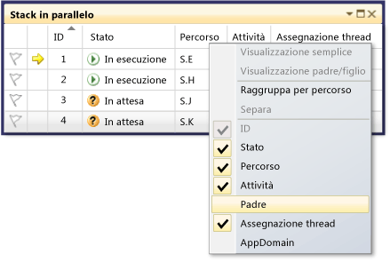  
  
     Il menu di scelta rapida può essere utilizzato per aggiungere o rimuovere colonne.  Ad esempio, la colonna AppDomain non è selezionata, pertanto non viene visualizzata nell'elenco.  Fare clic su **Padre**.  Verrà visualizzata la colonna **Padre** senza valori per le quattro attività.  
  
#### Per riprendere l'esecuzione fino al terzo punto di interruzione  
  
1.  Per riprendere l'esecuzione fino al raggiungimento del terzo punto di interruzione, fare clic su **Continua** nel menu **Debug**.  
  
     Una nuova attività, l'attività 5, è ora in esecuzione mentre l'attività 4 è in attesa.  Per visualizzare il motivo, passare il mouse sull'attività in attesa nella finestra **Stato**.  Nella colonna **Padre**, si noti che l'attività 4 è l'attività padre dell'attività 5.  
  
     Per visualizzare meglio la relazione padre\-figlio, fare clic con il pulsante destro del mouse sull'intestazione di colonna **Padre**, quindi scegliere **Visualizzazione padre\/figlio**.  Si dovrebbe vedere l'illustrazione seguente.  
  
     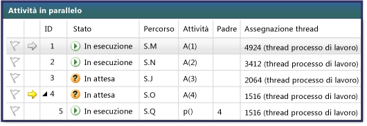  
  
     Si noti che l'attività 4 e l'attività 5 sono in esecuzione nello stesso thread.  Questa informazione non viene visualizzata nella finestra **Thread**; il fatto che appaia qui è un altro vantaggio della finestra **Attività in parallelo**.  A conferma di questo, visualizzare la finestra **Stack in parallelo**.  Assicurarsi di essere nella visualizzazione **Attività**.  Individuare le attività 4 e 5 facendo doppio clic su di esse nella finestra **Attività in parallelo**.  L'evidenziazione blu nella finestra **Stack in parallelo** verrà di conseguenza aggiornata.  È anche possibile individuare le attività 4 e 5 analizzando le descrizioni comandi nella finestra **Stack in parallelo**.  
  
     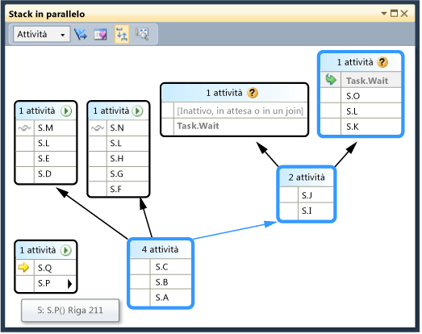  
  
     Fare clic con il pulsante destro del mouse su S.P nella finestra **Stack in parallelo**, quindi scegliere **Passa a thread**.  La finestra passerà alla visualizzazione Thread e verrà visualizzato il thread corrispondente.  È possibile vedere entrambe le attività nello stesso thread.  
  
       
  
     Questo è un altro vantaggio della visualizzazione Attività nella finestra **Stack in parallelo** rispetto alla finestra **Thread**.  
  
#### Per riprendere l'esecuzione fino al quarto punto di interruzione  
  
1.  Per riprendere l'esecuzione fino al raggiungimento del quarto punto di interruzione, fare clic su **Continua** nel menu **Debug**.  Fare clic sull'intestazione di colonna **ID** per ordinare in base all'ID.  Si dovrebbe vedere l'illustrazione seguente.  
  
     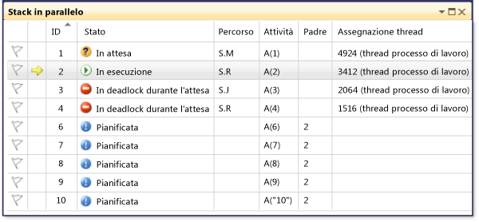  
  
     Essendo stata completata, l'attività 5 non viene più visualizzata.  Se ciò non avviene nel computer in uso e il deadlock non viene visualizzato, avanzare di un passaggio premendo F11.  
  
     Le attività 3 e 4 sono ora in attesa una dell'altra e sono in deadlock.  Vi sono inoltre 5 nuove attività che sono attività figlio dell'attività 2 e vengono ora pianificate.  Le attività pianificate sono attività avviate nel codice ma non ancora eseguite.  Le relative colonne **Percorso** e **Assegnazione thread** sono pertanto vuote.  
  
     Visualizzare nuovamente la finestra **Stack in parallelo**.  L'intestazione di ogni casella presenta una descrizione comandi nella quale sono visualizzati gli ID e i nomi dei thread.  Passare alla visualizzazione Attività nella finestra **Stack in parallelo**.  Passare il mouse su un'intestazione per visualizzare l'ID, il nome e lo stato dell'attività come mostrato nell'illustrazione seguente.  
  
     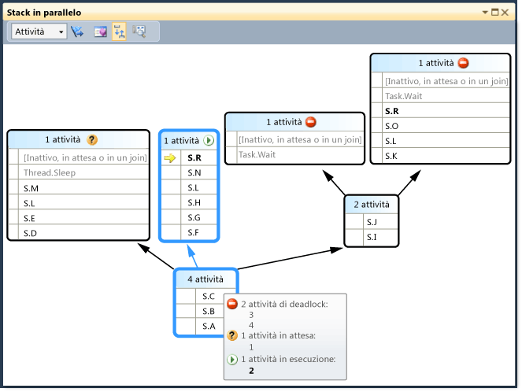  
  
     È possibile raggruppare le attività in base alle colonne.  Nella finestra **Attività in parallelo** fare clic con il pulsante destro del mouse sull'intestazione di colonna **Stato**, quindi scegliere **Raggruppa per stato**.  Nell'illustrazione seguente viene mostrata la finestra **Attività in parallelo** raggruppata in base allo stato.  
  
       
  
     È anche possibile raggruppare in base alle altre colonne.  Raggruppando le attività, è possibile concentrarsi su un sottoinsieme di attività.  Ogni gruppo comprimibile presenta un conteggio degli elementi raggruppati insieme.  È anche possibile contrassegnare rapidamente tutti gli elementi nel gruppo facendo clic sul pulsante **Contrassegna** a destra del pulsante **Comprimi**.  
  
     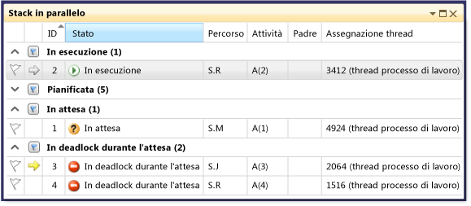  
  
     L'ultima funzionalità della finestra **Attività in parallelo** da esaminare è il menu di scelta rapida che viene visualizzato facendo clic con il pulsante destro del mouse su un'attività.  
  
     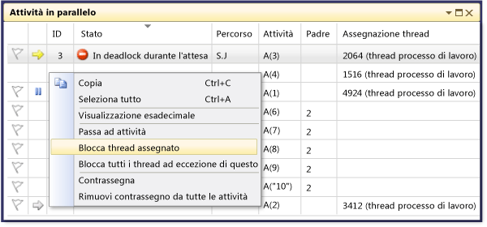  
  
     Il menu di scelta rapida visualizza comandi diversi a seconda dello stato dell'attività.  I comandi possono includere **Copia**, **Seleziona tutto**, **Visualizzazione esadecimale**, **Passa ad attività**, **Blocca thread assegnato**, **Blocca tutti i thread ad eccezione di quello corrente**, **Sblocca thread assegnato** e **Contrassegna**.  
  
     È possibile bloccare il thread sottostante di un'attività o di più attività oppure bloccare tutti i thread a eccezione di quello assegnato.  Nelle finestre **Attività in parallelo** e **Thread**, i thread bloccati vengono rappresentati allo stesso modo, vale a dire da un'icona di *sospensione* blu.  
  
## Riepilogo  
 In questa procedura dettagliata sono state illustrate le finestre del debugger **Attività in parallelo** e **Stack in parallelo**.  Utilizzare queste finestre con progetti reali che a loro volta utilizzano codice multithreading.  È possibile esaminare codice parallelo scritto in C\+\+, C\# o Visual Basic.  
  
## Vedere anche  
 [Debugging Multithreaded Applications](../debugger/walkthrough-debugging-a-parallel-application.md)   
 [Nozioni di base sul debugger](../debugger/debugger-basics.md)   
 [Debug del codice gestito](../debugger/debugging-managed-code.md)   
 [Parallel Programming](../Topic/Parallel%20Programming%20in%20the%20.NET%20Framework.md)   
 [Runtime di concorrenza](/visual-cpp/parallel/concrt/concurrency-runtime)   
 [Utilizzo della finestra Stack in parallelo](../debugger/using-the-parallel-stacks-window.md)   
 [Utilizzo della finestra Attività](../debugger/using-the-tasks-window.md)