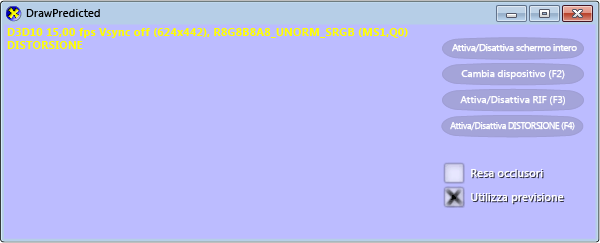
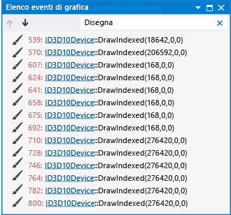
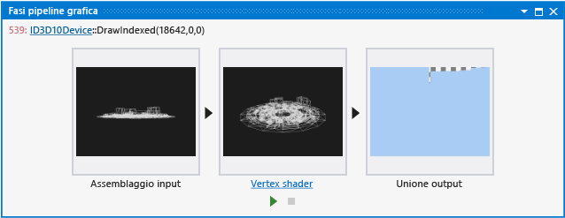
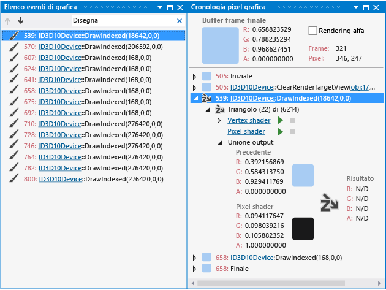
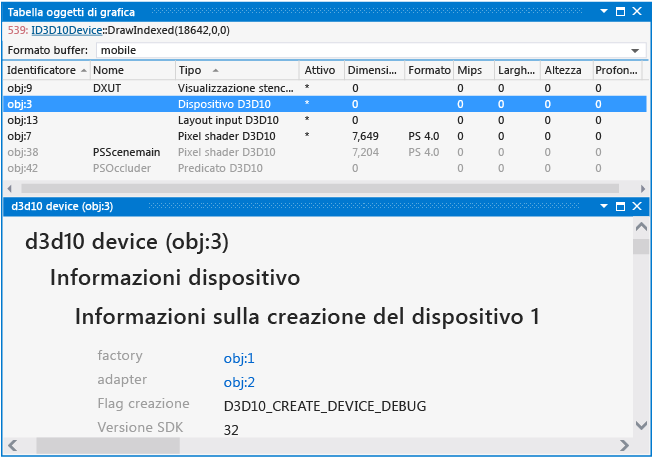
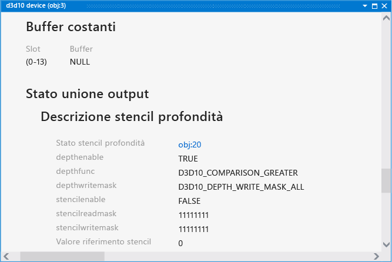

# Procedura dettagliata: oggetti mancanti a causa dello stato del dispositivo
[!INCLUDE[vs2017banner](../code-quality/includes/vs2017banner.md)]

Questa procedura dettagliata descrive come usare Diagnostica grafica di [!INCLUDE[vsprvs](../code-quality/includes/vsprvs_md.md)] per esaminare un problema dovuto a un oggetto mancante a causa della configurazione non corretta dello stato del dispositivo.  
  
 Questa procedura dettagliata illustra come:  
  
-   Usare l'**Elenco eventi di grafica** per individuare le possibili origini del problema.  
  
-   Usare la finestra **Fasi pipeline grafica** per controllare l'effetto delle chiamate dell'API Direct3D `DrawIndexed`.  
  
-   Usare la finestra **Cronologia pixel grafica** per individuare il problema più nello specifico.  
  
-   Controllare lo stato del dispositivo per individuare potenziali problemi o errori di configurazione.  
  
## Scenario  
 Uno dei motivi per cui gli oggetti potrebbero non apparire nelle posizioni previste in un'app 3D è un errore di configurazione del dispositivo di grafica che causa l'esclusione dal rendering degli oggetti. Ad esempio, quando l'ordine dei vertici causa il culling erroneo dei triangoli o quando la funzione di test di profondità causa il rifiuto di tutti i pixel nell'oggetto.  
  
 Nello scenario descritto in questa procedura dettagliata, è stata appena raggiunta la prima tappa cardine dello sviluppo dell'app 3D e si è pronti per testarla per la prima volta. Quando si esegue l'app, tuttavia, sullo schermo viene visualizzata solo l'interfaccia utente. Usando Diagnostica grafica è possibile acquisire il problema in un file di log di grafica in modo da poter eseguire il debug dell'app. Nell'app, il problema si presenta nel modo seguente:  
  
   
  
 Per informazioni su come acquisire i problemi di grafica in un log di grafica, vedere [Cattura informazioni grafica](../debugger/capturing-graphics-information.md).  
  
## Analisi  
 Usando gli strumenti di Diagnostica grafica è possibile caricare il file del log di grafica per esaminare i frame acquisiti durante il test.  
  
#### Per esaminare un frame in un log di grafica  
  
1.  In [!INCLUDE[vsprvs](../code-quality/includes/vsprvs_md.md)] caricare un log di grafica contenente un frame che mostra il modello mancante. Verrà visualizzata una nuova scheda Diagnostica grafica in [!INCLUDE[vsprvs](../code-quality/includes/vsprvs_md.md)]. Nella parte superiore di questa scheda è presente l'output della destinazione di rendering del frame selezionato. Nella parte inferiore è presente **Elenco frame**, che visualizza ogni frame acquisito come immagine di anteprima.  
  
2.  In **Elenco frame** selezionare un frame che dimostra che il modello non è visualizzato. La destinazione di rendering viene aggiornata per riflettere la selezione del frame. In questo scenario la scheda del log di grafica ha un aspetto simile al seguente:  
  
       
  
 Dopo aver selezionato un frame che dimostra il problema, è possibile usare l'**Elenco eventi di grafica** per diagnosticarlo. La finestra **Elenco eventi di grafica** contiene ogni chiamata API Direct3D effettuata per eseguire il rendering del frame attivo, ad esempio chiamate API per configurare lo stato del dispositivo, creare e aggiornare i buffer e disegnare gli oggetti visualizzati nel frame. Molti tipi di chiamate sono interessanti perché spesso \(ma non sempre\) si verifica una modifica corrispondente nella destinazione di rendering quando l'app funziona nel modo previsto, ad esempio le chiamate di disegno, invio, copia o eliminazione. Le chiamate di disegno sono particolarmente interessanti, perché ognuna rappresenta la geometria di cui l'app ha eseguito il rendering \(anche le chiamate di invio possono eseguire il rendering della geometria\).  
  
#### Per assicurarsi che le chiamate di disegno vengano eseguite  
  
1.  Aprire la finestra **Elenco eventi di grafica**. Sulla barra degli strumenti **Diagnostica della grafica** scegliere **Elenco eventi**.  
  
2.  Controllare le chiamate di disegno nell'**Elenco eventi di grafica**. Per semplificare questa operazione, immettere "Draw" nella casella **Cerca** nell'angolo in alto a destra della finestra **Elenco eventi di grafica**. questo modo l'elenco viene filtrato in modo da contenere solo gli eventi nei cui titoli compare "Draw". In questo scenario, si scopre che sono state effettuate diverse chiamate di disegno:  
  
       
  
 Dopo aver appurato che le chiamate di disegno vengono eseguite, è possibile determinare quale di esse corrisponde alla geometria mancante. Poiché è certo che la geometria mancante non viene disegnata nella destinazione di rendering \(in questo caso\), è possibile usare la finestra **Fasi pipeline grafica** per determinare la chiamata di disegno corrispondente alla geometria mancante. La finestra **Fasi pipeline grafica** mostra la geometria inviata a ogni chiamata di disegno, indipendentemente dagli effetti sulla destinazione di rendering. Passando da una chiamata di disegno alla successiva, le fasi della pipeline vengono aggiornate per mostrare la geometria associata a ogni chiamata e l'output della destinazione di rendering viene aggiornato per mostrare lo stato della destinazione di rendering dopo il completamento della chiamata.  
  
#### Per trovare la chiamata di disegno per la geometria mancante  
  
1.  Aprire la finestra **Fasi pipeline grafica**. Sulla barra degli strumenti **Diagnostica della grafica** scegliere **Fasi pipeline**.  
  
2.  Spostarsi tra ogni chiamata di disegno ed esaminare la finestra **Fasi pipeline grafica** per individuare il modello mancante. La fase **Assemblaggio input** mostra i dati del modello non elaborati. La fase **Vertex shader** mostra i dati del modello trasformati. La fase **Pixel shader** mostra l'output del pixel shader. La fase **Unione output** mostra la destinazione di rendering unita di questa chiamata di disegno e di tutte le chiamate di disegno precedenti.  
  
3.  Fermarsi quando si raggiunge la chiamata di disegno che corrisponde al modello mancante. In questo scenario, la finestra **Fasi pipeline grafica** indica che è stato eseguito il rendering della geometria ma che la geometria non è stata visualizzata nella destinazione di rendering:  
  
       
  
 Dopo aver appurato che l'app ha eseguito il rendering della geometria mancante e aver individuato la chiamata di disegno corrispondente, è possibile selezionare una parte dell'output della destinazione di rendering che dovrebbe visualizzare la geometria mancante e quindi usare la finestra **Cronologia pixel grafica** per scoprire perché sono stati esclusi i pixel. La cronologia dei pixel contiene un elenco di ogni chiamata di disegno che potrebbe avere avuto un effetto su un particolare pixel. Ogni chiamata di disegno nella finestra **Cronologia pixel grafica** è identificata da un numero che viene visualizzato anche nella finestra **Elenco eventi di grafica**. Questo è utile per appurare che il pixel dovrebbe visualizzare la geometria mancante e per scoprire perché il pixel è stato escluso.  
  
#### Per determinare perché il pixel è stato escluso  
  
1.  Aprire la finestra **Cronologia pixel grafica**. Scegliere **Cronologia pixel** sulla barra degli strumenti **Diagnostica grafica**.  
  
2.  In base all'anteprima **Pixel shader** selezionare un pixel nell'output del buffer di frame che dovrebbe contenere una parte della geometria mancante. In questo scenario, l'output del pixel shader dovrebbe occupare la maggior parte della destinazione di rendering. Dopo aver selezionato un pixel, la finestra **Cronologia pixel grafica** dovrebbe avere questo aspetto:  
  
       
  
3.  Verificare che il pixel di destinazione di rendering selezionato contenga una parte della geometria abbinando il numero della chiamata di disegno che si sta controllando \(dalla finestra **Elenco eventi di grafica**\) a una delle chiamate di disegno nella finestra **Cronologia pixel grafica**. Se nessuna delle chiamate nella finestra **Cronologia pixel grafica** corrisponde alla chiamata di disegno che si sta controllando, ripetere questi passaggi \(tranne il passaggio 1\) fino a trovare una corrispondenza. In questo scenario, la chiamata di disegno corrispondente è simile alla seguente:  
  
       
  
4.  Quando si individua una corrispondenza, espandere la chiamata di disegno corrispondente nella finestra **Cronologia pixel grafica** e verificare che il pixel sia stato escluso. Ogni chiamata di disegno nella finestra **Cronologia pixel grafica** corrisponde a una o più primitive geometriche \(punti, linee o triangoli\) che intersecano tale pixel come risultato della geometria dell'oggetto corrispondente. Ogni intersezione di questo tipo può contribuire al colore finale del pixel. Una primitiva che viene esclusa perché non supera il test di profondità è rappresentata da un'icona che mostra la lettera Z su una freccia inclinata verso il basso da sinistra a destra.  
  
5.  Espandere una primitiva esclusa per esaminare ulteriormente lo stato che ne ha causato l'esclusione. Nel gruppo **Unione output** spostare il puntatore su **Risultato**. Una descrizione comando indica perché è stata esclusa la primitiva. In questo scenario, l'esame rivela che la primitiva è stata esclusa perché non ha superato il test di profondità e pertanto non ha contribuito al colore finale del pixel.  
  
 Dopo aver determinato che la geometria non viene visualizzata perché le primitive corrispondenti non hanno superato il test di profondità, si potrebbe sospettare che il problema sia correlato a una configurazione non corretta dello stato del dispositivo. Lo stato del dispositivo e altri dati degli oggetti Direct3D possono essere esaminati tramite la **Tabella oggetti di grafica**.  
  
#### Per esaminare lo stato del dispositivo  
  
1.  Aprire la finestra **Tabella oggetti di grafica**. Scegliere **Tabella oggetti** sulla barra degli strumenti **Diagnostica grafica**.  
  
2.  Individuare l'oggetto **Dispositivo D3D10** nella **Tabella oggetti di grafica** e quindi aprire l'oggetto **Dispositivo D3D10**. Verrà aperta una nuova scheda **dispositivo d3d10** in [!INCLUDE[vsprvs](../code-quality/includes/vsprvs_md.md)]. Per semplificare questa operazione, è possibile ordinare la **Tabella oggetti di grafica** in base a **Tipo**:  
  
       
  
3.  Esaminare lo stato del dispositivo visualizzato nella scheda **dispositivo d3d10** per individuare potenziali problemi. Dato che la geometria non è disponibile perché le primitive corrispondenti non hanno superato il test di profondità, è possibile concentrarsi sullo stato del dispositivo, come lo stencil di profondità, che influisce sul test di profondità. In questo scenario, la **Descrizione stencil profondità** \(in **Stato unione output**\) contiene un valore non comune per il membro **depthfunc**, `D3D10_COMPARISON_GREATER`:  
  
       
  
 Dopo aver determinato che la causa del problema di rendering potrebbe essere una funzione di profondità non configurata correttamente, è possibile usare queste informazioni insieme alla conoscenza del codice per individuare la posizione in cui la funzione di profondità è stata impostata in modo non corretto, per poi risolvere il problema. Se non si ha familiarità con il codice, è possibile cercare il problema usando gli indizi raccolti durante il debug, ad esempio, in base alla **Descrizione stencil profondità** in questo scenario, si potrebbero cercare le parole "depth" o "GREATER" nel codice. Dopo aver corretto il codice, ricompilare ed eseguire l'app per verificare che il problema di rendering sia stato risolto:  
  
 