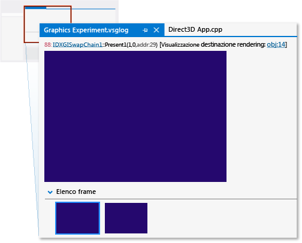
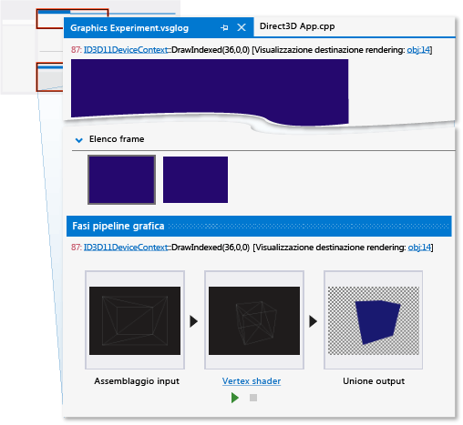
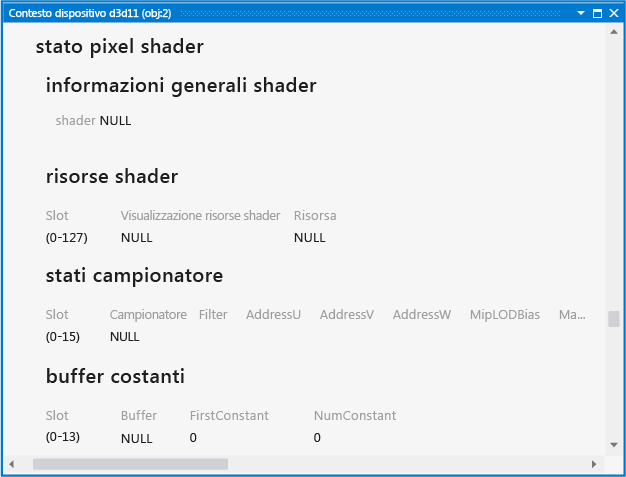
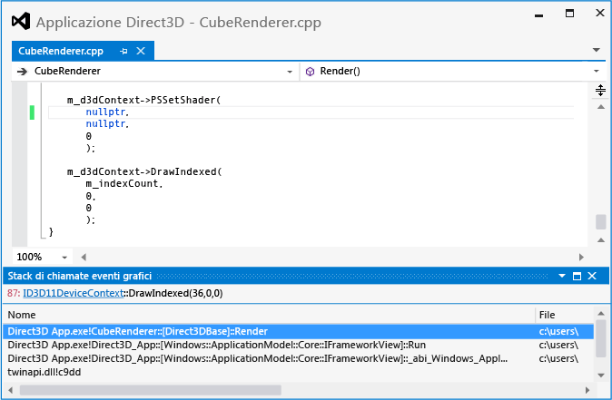

# Procedura dettagliata: oggetti mancanti a causa di una pipeline configurata in modo non corretto
[!INCLUDE[vs2017banner](../code-quality/includes/vs2017banner.md)]

Questa procedura dettagliata descrive come usare gli strumenti della barra degli strumenti Diagnostica della grafica di [!INCLUDE[vsprvs](../code-quality/includes/vsprvs_md.md)] per individuare un problema dovuto a un oggetto mancante a causa di un pixel shader non impostato.  
  
 In questa procedura dettagliata vengono illustrate le attività seguenti:  
  
-   Uso dell'**Elenco eventi di grafica** per individuare le possibili origini del problema.  
  
-   Uso della finestra **Fasi pipeline grafica** per esaminare l'effetto della chiamata dell'API Direct3D `DrawIndexed`.  
  
-   Esame del contesto di dispositivo per confermare la mancata impostazione di una fase degli shader.  
  
-   Uso della finestra **Fasi pipeline grafica** insieme a **Stack di chiamate eventi di grafica** per semplificare l'individuazione del pixel shader non impostato.  
  
## Scenario  
 Quando un oggetto è mancante in un'app 3D, a volte il problema è dovuto alla mancata impostazione di una delle fasi degli shader prima del rendering dell'oggetto. Nelle app con esigenze di rendering semplici, l'origine di questo errore si trova in genere all'interno dello stack di chiamate della chiamata di disegno dell'oggetto. Tuttavia, per motivi di ottimizzazione, alcune app riuniscono in batch gli oggetti che hanno in comune programmi shader, trame o altri dati per ridurre al minimo il sovraccarico prodotto dalle modifiche di stato. In queste app l'origine dell'errore potrebbe essere nascosta nel sistema di batch, anziché trovarsi nello stack di chiamate della chiamata di disegno. Poiché lo scenario di questa procedura dettagliata descrive un'app con esigenze di rendering semplici, l'origine dell'errore si trova nello stack di chiamate.  
  
 Quando in questo scenario l'app viene eseguita per essere testata, il rendering dello sfondo avviene nel modo previsto, ma uno degli oggetti non viene visualizzato. Usando gli strumenti di Diagnostica della grafica, è possibile acquisire il problema in un log di grafica in modo da poter eseguire il debug dell'app. Nell'app, il problema si presenta nel modo seguente:  
  
   
  
## Analisi  
 Utilizzando gli strumenti di diagnostica della grafica, è possibile caricare il documento del log di grafica per controllare i frame acquisiti durante il test.  
  
#### Per esaminare un frame in un log di grafica  
  
1.  In [!INCLUDE[vsprvs](../code-quality/includes/vsprvs_md.md)] caricare un log di grafica contenente un frame che mostra l'oggetto mancante. In [!INCLUDE[vsprvs](../code-quality/includes/vsprvs_md.md)] viene visualizzata una nuova scheda del log di grafica. Nella parte superiore di questa scheda è presente l'output della destinazione di rendering del frame selezionato. Nella parte inferiore è presente **Elenco frame**, che visualizza ogni frame acquisito come immagine di anteprima.  
  
2.  In **Elenco frame** selezionare un frame indicante che l'oggetto non è visualizzato. La destinazione di rendering viene aggiornata per riflettere la selezione del frame. In questo scenario la scheda del log di grafica ha un aspetto simile al seguente:  
  
       
  
 Dopo aver selezionato un frame che mostra il problema, è possibile avviare la diagnosi tramite la funzionalità **Elenco eventi di grafica**. La finestra **Elenco eventi di grafica** contiene ogni chiamata API Direct3D effettuata per eseguire il rendering del frame attivo, ad esempio per configurare lo stato del dispositivo, creare e aggiornare i buffer e disegnare gli oggetti visualizzati nel frame. Molti tipi di chiamate, ad esempio le chiamate di disegno, invio, copia o eliminazione, sono interessanti perché spesso \(ma non sempre\) si verifica una modifica corrispondente nella destinazione di rendering quando l'app funziona nel modo previsto. Le chiamate di disegno sono particolarmente interessanti, perché ognuna rappresenta la geometria di cui l'app ha eseguito il rendering.  
  
 Poiché è certo che la destinazione di rendering non contiene l'oggetto mancante, ma anche che non sembrano essersi verificati altri errori, è possibile usare la finestra **Elenco eventi di grafica** insieme allo strumento **Fasi pipeline grafica** per determinare la chiamata di disegno corrispondente alla geometria dell'oggetto mancante. La finestra **Fasi pipeline grafica** mostra la geometria inviata a ogni chiamata di disegno, indipendentemente dagli effetti sulla destinazione di rendering. Passando da una chiamata di disegno alla successiva, le fasi della pipeline vengono aggiornate per mostrare la geometria associata a ogni chiamata durante il suo passaggio da una fase abilitata all'altra e l'output della destinazione di rendering viene aggiornato per mostrare lo stato della destinazione di rendering dopo il completamento della chiamata.  
  
#### Per trovare la chiamata di disegno per la geometria mancante  
  
1.  Aprire la finestra **Elenco eventi di grafica**. Sulla barra degli strumenti **Diagnostica della grafica** scegliere **Elenco eventi**.  
  
2.  Aprire la finestra **Fasi pipeline grafica**. Sulla barra degli strumenti **Diagnostica della grafica** scegliere **Fasi pipeline**.  
  
3.  Passando da una chiamata di disegno alla successiva nella finestra **Elenco eventi di grafica**, esaminare la finestra **Fasi pipeline grafica** per individuare l'oggetto mancante. Per semplificare questa operazione, immettere "Draw" nella casella **Cerca** nell'angolo in alto a destra della finestra **Elenco eventi di grafica**. questo modo l'elenco viene filtrato in modo da contenere solo gli eventi nei cui titoli compare "Draw".  
  
     Nella finestra **Fasi pipeline grafica** la fase **Assembler input** mostra la geometria dell'oggetto prima che venga trasformata, mentre la fase **Vertex shader** mostra lo stesso oggetto una volta trasformato. In questo scenario notare che la finestra **Fasi pipeline grafica** mostra le fasi **Assembler input** e  **Vertex shader**, ma non la fase **Pixel shader** per una delle chiamate di disegno.  
  
    > [!NOTE]
    >  Se altre fasi della pipeline, ad esempio la fase Hull shader, Domain shader o Geometry shader, elaborano l'oggetto, una di esse potrebbe essere la causa del problema. In genere, il problema è correlato alla prima fase il cui risultato non viene visualizzato o viene visualizzato in modo imprevisto.  
  
4.  Fermarsi quando si raggiunge la chiamata di disegno che corrisponde all'oggetto mancante. In questo scenario la finestra **Fasi pipeline grafica** indica che la geometria è stata inviata alla GPU \(operazione indicata dalla presenza della fase **Assembler input**\) e trasformata \(operazione indicata dalla fase **Vertex shader**\), ma non è visualizzata nella destinazione di rendering perché non sembra essere presente un pixel shader attivo \(condizione indicata dall'assenza della fase **Pixel shader**\). In questo scenario è anche possibile visualizzare la sagoma dell'oggetto mancante nella fase **Merge output**:  
  
       
  
 Dopo aver verificato che l'app ha emesso una chiamata di disegno per la geometria dell'oggetto mancante e aver determinato che la fase Pixel shader è inattiva, è possibile esaminare lo stato del dispositivo per confermare queste conclusioni. È possibile usare la funzionalità **Tabella oggetti grafici** per esaminare il contesto di dispositivo e altri dati dell'oggetto Direct3D.  
  
#### Per esaminare il contesto di dispositivo  
  
1.  Aprire il **contesto di dispositivo d3d11**. Nella finestra **Fasi pipeline grafica** fare clic sul collegamento **ID3D11DeviceContext** che fa parte della chiamata `DrawIndexed` visualizzata nella parte superiore della finestra.  
  
2.  Esaminare lo stato del dispositivo visualizzato nella scheda del **contesto di dispositivo d3d11** per verificare che nessun pixel shader era attivo durante la chiamata di disegno. In questo scenario la voce **Informazioni generali shader**, visualizzata sotto **Stato pixel shader**, indica che lo shader è **NULL**:  
  
       
  
 Dopo aver confermato che il pixel shader è stato impostato su null dall'app, il passaggio successivo consiste nel trovare la posizione del codice sorgente dell'app in cui è impostato lo shader. Per trovare questa posizione, è possibile usare **Elenco eventi di grafica** insieme a **Stack di chiamate eventi di grafica**.  
  
#### Per trovare la posizione in cui è impostato il pixel shader nel codice sorgente dell'app  
  
1.  Individuare la chiamata `PSSetShader` che corrisponde all'oggetto mancante. Nella finestra **Elenco eventi di grafica** immettere "Draw;PSSetShader" nella casella **Cerca** nell'angolo in alto a destra della finestra **Elenco eventi di grafica**. In questo modo, l'elenco verrà filtrato in modo da contenere solo eventi "PSSetShader" e quelli il cui titolo contiene "Draw". Scegliere la prima chiamata `PSSetShader` visualizzata prima della chiamata di disegno dell'oggetto mancante.  
  
    > [!NOTE]
    >  La chiamata `PSSetShader` non verrà visualizzata nella finestra **Elenco eventi di grafica** se non è stata impostata durante questo frame. In genere, questa situazione si verifica solo se viene usato un solo pixel shader per tutti gli oggetti oppure se la chiamata `PSSetShader` è stata involontariamente ignorata durante il frame. In entrambi i casi, è consigliabile cercare nel codice sorgente dell'app le chiamate `PSSetShader` e usare tecniche di debug tradizionali per esaminarne il comportamento.  
  
2.  Aprire la finestra **Stack di chiamate eventi di grafica**. Sulla barra degli strumenti **Diagnostica della grafica** scegliere **Stack di chiamate eventi di grafica**.  
  
3.  Usare lo stack di chiamate per individuare la chiamata `PSSetShader` nel codice sorgente dell'app. Nella finestra **Stack di chiamate eventi di grafica** scegliere la chiamata posizionata più in alto ed esaminare il valore su cui è impostato il pixel shader. Il pixel shader potrebbe essere impostato direttamente su null oppure il valore null potrebbe essere presente a causa di un argomento passato nella funzione o di un altro stato. Se il pixel shader non è impostato direttamente su null, potrebbe essere possibile individuare l'origine del valore null in un altra posizione più in alto nello stack di chiamate. In questo scenario si determina che il pixel shader è impostato direttamente su `nullptr` nella funzione posizionata più in alto, denominata `CubeRenderer::Render`:  
  
       
  
    > [!NOTE]
    >  Se non è possibile individuare l'origine del valore null semplicemente esaminando lo stack di chiamate, è consigliabile impostare un punto di interruzione condizionale nella chiamata `PSSetShader`, in modo che l'esecuzione del programma si interrompa quando il pixel shader è impostato su null. Riavviare quindi l'app in modalità di debug e usare tecniche di debug tradizionali per individuare l'origine del valore null.  
  
 Per correggere il problema, assegnare il pixel shader corretto usando il primo parametro della chiamata API `ID3D11DeviceContext::PSSetShader`.  
  
   
  
 Dopo aver corretto il codice, è possibile ricompilare ed eseguire l'app per verificare che il problema di rendering sia stato risolto:  
  
   
  
## Passaggi successivi