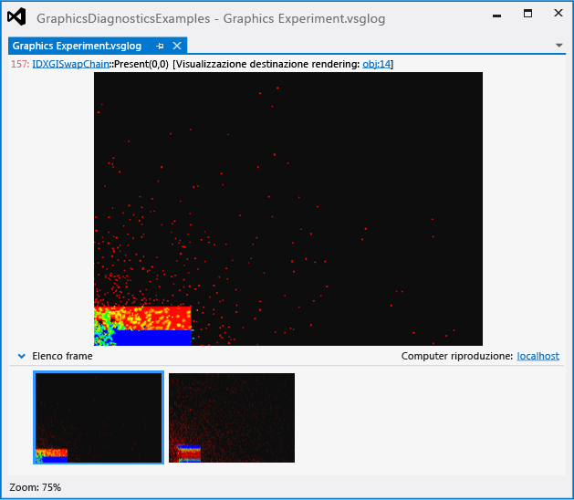
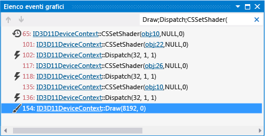
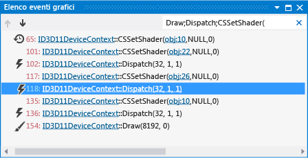

# Procedura dettagliata: utilizzo della diagnostica grafica per eseguire il debug di un compute shader
[!INCLUDE[vs2017banner](../code-quality/includes/vs2017banner.md)]

Questa procedura dettagliata illustra come usare gli strumenti di diagnostica della grafica di Visual Studio per esaminare un compute shader che genera risultati errati.  
  
 In questa procedura dettagliata vengono illustrate le attività seguenti:  
  
-   Uso dell'**Elenco eventi di grafica** per individuare le possibili origini del problema.  
  
-   Uso dello **Stack di chiamate eventi di grafica** per determinare quale compute shader viene eseguito da un evento DirectCompute `Dispatch`.  
  
-   Uso della finestra **Fasi pipeline grafica** e del debugger HLSL per esaminare il compute shader che è l'origine del problema.  
  
## Scenario  
 In questo scenario è stata scritta una simulazione di dinamica del fluidi in cui viene usato DirectCompute per eseguire le parti con calcoli complessi dell'aggiornamento della simulazione.  Quando l'applicazione viene eseguita, il rendering del dataset e l'interfaccia utente sono corretti, ma la simulazione non si comporta come previsto.  Usando Diagnostica grafica, è possibile acquisire il problema in un log di grafica in modo da poter eseguire il debug dell'applicazione.  Nell'app, il problema si presenta nel modo seguente:  
  
   
  
 Per informazioni su come acquisire i problemi di grafica in un log di grafica, vedere [Cattura informazioni grafica](../debugger/capturing-graphics-information.md).  
  
## Analisi  
 È possibile usare gli strumenti di diagnostica della grafica per caricare il file di log di grafica, in modo da poter controllare i frame acquisiti.  
  
#### Per esaminare un frame in un log di grafica  
  
1.  In Visual Studio caricare un log di grafica contenente un frame che mostra i risultati di simulazione errati.  Verrà visualizzata una nuova scheda Diagnostica grafica in Visual Studio.   Nella parte superiore di questa scheda è presente l'output della destinazione di rendering del frame selezionato.  Nella parte inferiore è presente **Elenco frame**, che visualizza un'immagine di anteprima di ogni frame acquisito.  
  
2.  In **Elenco frame** selezionare un frame che indica il comportamento errato di simulazione.  Anche se sembra che l'errore si trovi nel codice di simulazione e non nel codice di rendering, è comunque necessario scegliere un frame poiché gli eventi DirectCompute vengono acquisiti un frame alla volta, insieme agli eventi Direct3D.  In questo scenario la scheda del log di grafica ha un aspetto simile al seguente:  
  
       
  
 Dopo aver selezionato un frame che dimostra il problema, è possibile usare l'**Elenco eventi di grafica** per diagnosticarlo.  L'**Elenco eventi di grafica** contiene un evento per ogni chiamata DirectCompute e API Direct3D effettuata durante il frame attivo, ad esempio le chiamate API per eseguire un calcolo sulla GPU o per eseguire il rendering del dataset o dell'interfaccia utente.  In questo caso, vengono presi in considerazione gli eventi `Dispatch` che rappresentano parti della simulazione eseguita nella GPU.  
  
#### Per trovare l'evento di invio per l'aggiornamento della simulazione  
  
1.  Nella barra degli strumenti **Diagnostica grafica** scegliere **Elenco eventi** per aprire la finestra **Elenco eventi di grafica**.  
  
2.  Controllare l'**Elenco eventi di grafica** per cercare l'evento di disegno tramite cui viene eseguito il rendering del dataset.  Per semplificare questa operazione, immettere `Draw` nella casella **Cerca** nell'angolo superiore destro della finestra **Elenco eventi di grafica**.  questo modo l'elenco viene filtrato in modo da contenere solo gli eventi nei cui titoli compare "Draw".  In questo scenario viene rilevato che si sono verificati questi eventi di disegno:  
  
       
  
3.  Spostarsi in ogni evento di disegno durante la visualizzazione della destinazione di rendering nella scheda del documento di log della grafica.  
  
4.  Arrestare l'operazione quando nella destinazione di rendering viene visualizzato innanzitutto il set di dati di cui è stato eseguito il rendering.  In questo scenario il rendering del dataset viene eseguito nel primo evento di disegno.  L'errore nella simulazione è indicato:  
  
       
  
5.  A questo punto, controllare l'**Elenco eventi di grafica** per cercare l'evento `Dispatch` che aggiorna la simulazione.  Poiché è probabile che la simulazione venga aggiornata prima che venga eseguito il rendering, è possibile concentrarsi prima sugli eventi `Dispatch` che si verificano prima dell'evento di disegno che esegue il rendering dei risultati.  Per semplificare questa procedura, modificare la casella **Cerca** in `Draw;Dispatch;CSSetShader(`.  Questo consente di filtrare l'elenco in modo che contenga anche `Dispatch` e gli eventi `CSSetShader` oltre agli eventi di disegno.  In questo scenario viene rilevato che prima dell'evento di disegno si sono verificati diversi eventi `Dispatch`:  
  
       
  
 Una volta compresi i pochi dei tanti potenziali eventi `Dispatch` che potrebbero corrispondere al problema, è possibile esaminarli in modo più dettagliato.  
  
#### Per determinare quale compute shader esegue una chiamata di invio  
  
1.  Nella barra degli strumenti **Diagnostica grafica** scegliere **Stack di chiamate eventi** per aprire la finestra **Stack di chiamate eventi di grafica**.  
  
2.  A partire dall'evento di disegno tramite cui viene eseguito il rendering dei risultati della simulazione, tornare a ogni evento `CSSetShader` precedente.  Quindi, nella finestra **Stack di chiamate eventi di grafica** scegliere la funzione in primo piano per passare al sito di chiamata.  Nel sito della chiamata, è possibile usare il primo parametro della funzione [CSSetShader](http://msdn.microsoft.com/library/ff476402.aspx) per determinare quale compute shader viene eseguito dall'evento `Dispatch` successivo.  
  
 In questo scenario sono presenti tre coppie di eventi `CSSetShader` e `Dispatch` in ogni frame.  Procedendo in ordine inverso, la terza coppia rappresenta il passaggio di integrazione \(dove le particelle fluide vengono effettivamente spostate\), la seconda coppia rappresenta il passaggio di forza\-calcolo \(dove le forze che influiscono su ogni particella vengono calcolate\) e la prima coppia rappresenta il passaggio di calcolo della densità.  
  
#### Per eseguire il debug del compute shader  
  
1.  Nella barra degli strumenti **Diagnostica grafica** scegliere **Fasi pipeline** per aprire la finestra **Fasi pipeline grafica**.  
  
2.  Selezionare il terzo evento `Dispatch` \(quello che precede immediatamente l'evento di disegno\), quindi nella fase **Compute shader** della finestra **Fasi pipeline grafica** scegliere **Avvia debug**.  
  
       
  
     Il debugger HLSL viene avviato a livello dello shader che esegue l'operazione di integrazione.  
  
3.  Esaminare il codice sorgente del compute shader per il passaggio di integrazione per ricercare l'origine dell'errore.  Quando si usa la diagnostica della grafica per eseguire il debug del codice del compute shader di HLSL, è possibile avanzare nel codice e usare altri strumenti di debug comuni, ad esempio le finestre Espressioni di controllo.  In questo scenario viene determinato che non sembra essere presente alcun errore nel compute shader che esegue il passaggio di integrazione.  
  
       
  
4.  Per arrestare il debug del compute shader, nella barra degli strumenti **Debug** scegliere **Arresta debug** \(tastiera: MAIUSC\+F5\).  
  
5.  Selezionare quindi il secondo evento `Dispatch` e avviare il debug del compute shader come nel passaggio precedente.  
  
       
  
     Il debugger HLSL viene avviato a livello dello shader che calcola le forze che agiscono su ogni particella fluida.  
  
6.  Esaminare il passaggio di calcolo della forza nel codice sorgente del compute shader.  In questo scenario viene determinato che l'origine dell'errore si trova in questo punto.  
  
       
  
 Dopo aver definito la posizione dell'errore, è possibile arrestare il debug e modificare il codice sorgente del compute shader per calcolare correttamente la distanza tra le particelle interattive.  In questo scenario è sufficiente modificare la riga `float2 diff = N_position + P_position;` in `float2 diff = N_position - P_position;`:  
  
   
  
 In questo scenario poiché i compute shader vengono compilati in fase di esecuzione, l'app può essere riavviata solo dopo aver apportato le modifiche per osservare come influiscono sulla simulazione.  Non è necessario ricompilare l'app.  Quando si esegue l'app, si scopre che ora la simulazione funziona correttamente.  
  
 