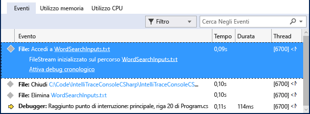

# Procedura dettagliata: Utilizzo di IntelliTrace
[!INCLUDE[vs2017banner](../code-quality/includes/vs2017banner.md)]

È possibile usare IntelliTrace per raccogliere informazioni su eventi o categorie di eventi specifici o su singole chiamate di funzione oltre agli eventi. I passaggi seguenti illustrano come eseguire quest'operazione.  
  
 È possibile utilizzare IntelliTrace in Visual Studio Enterprise edition \(ma non le edizioni Professional o Community\).  
  
##  <a name="GettingStarted"></a> Utilizzo di IntelliTrace con soli eventi  
 È possibile provare a eseguire il debug con soli eventi IntelliTrace. Gli eventi IntelliTrace sono eventi del debugger, eccezioni, eventi .NET Framework e altri eventi di sistema. È possibile attivare o disattivare eventi specifici per il controllo degli eventi che IntelliTrace registra prima di avviare il debug. Per altre informazioni, vedere [Funzionalità di IntelliTrace](../debugger/intellitrace-features.md).  
  
 La procedura seguente illustra come eseguire il debug con soli eventi IntelliTrace:  
  
1.  Attivare l'evento di IntelliTrace per l'accesso ai file. Andare alla pagina **Strumenti \/ Opzioni \/ IntelliTrace \/ Eventi di IntelliTrace** ed espandere la categoria **File**. Selezionare la categoria di eventi **File**. Saranno selezionati tutti gli eventi relativi ai file \(accesso,  chiusura, eliminazione\).  
  
2.  Creare un'applicazione console C\#. Aprire il file Program.cs e aggiungere l’istruzione `using` seguente:  
  
    ```c#  
    using System.IO;  
    ```  
  
3.  Creare un <xref:System.IO.FileStream> nel metodo Main, leggere da esso, chiuderlo ed eliminare il file. Aggiungere un'altra riga per disporre di un posto per impostare un punto di interruzione:  
  
    ```c#  
    static void Main(string[] args) { FileStream fs = File.Create("WordSearchInputs.txt"); fs.ReadByte(); fs.Close(); File.Delete("WordSearchInputs.txt"); Console.WriteLine("done"); }  
    ```  
  
4.  Impostare un punto di interruzione su `Console.WriteLine("done");`  
  
5.  Avviare il debug con la modalità consueta. \(Premere **F5** o fare cli su **Debug \/ Avvia debug**.  
  
    > [!TIP]
    >  Mantenere le finestre **Variabili locali** e **Auto** aperte durante il debug per visualizzare e registrare i valori visualizzati in queste finestre.  
  
6.  L'esecuzione verrà interrotta in corrispondenza del punto di interruzione. Se non viene visualizzata la finestra **Strumenti di diagnostica**, fare clic su **Debug \/ Finestre \/ Eventi di IntelliTrace**.  
  
     Nella finestra **Strumenti di diagnostica** trovare la scheda **Eventi** \(sono presenti 3 schede: **Eventi**, **Utilizzo della memoria** e **Utilizzo della CPU**\). La scheda **Eventi** visualizza un elenco cronologico di eventi, fino all'ultimo evento prima dell'interruzione dell'esecuzione del debugger. Verrà visualizzato un evento denominato **Access WordSearchInputs.txt**.  
  
     La screenshot che segue è presa da Visual Studio 2015 Update 1.  
  
       
  
7.  Selezionare l'evento per espandere i dettagli.  
  
     La screenshot che segue è presa da Visual Studio 2015 Update 1.  
  
       
  
     È possibile scegliere il collegamento al percorso per aprire il file. Se il nome del percorso completo non è disponibile, viene visualizzata la finestra di dialogo **Apri file**.  
  
     Fare clic su **Attivare debug cronologico**, che imposta il contesto del debugger sul momento in cui l'evento selezionato è stato raccolto, mostrando i dati cronologici nelle finestre **Stack di chiamate**, **Variabili locali** e altre finestre del debugger partecipanti. Se il codice sorgente è disponibile, Visual Studio sposta il puntatore sul codice corrispondente nella finestra di origine per consentirne l'analisi.  
  
     La screenshot che segue è presa da Visual Studio 2015 Update 1.  
  
       
  
8.  Se il bug non viene trovato, provare ad analizzare altri eventi. È anche possibile che IntelliTrace registri le informazioni sulle chiamate in modo da eseguire le chiamate alle funzioni.  
  
## Utilizzo di IntelliTrace con eventi e chiamate di funzione  
 IntelliTrace consente di registrare le chiamate di funzione insieme agli eventi. In tal modo è possibile visualizzare la cronologia dello stack di chiamate e scorrere in avanti e indietro le chiamate nel codice. IntelliTrace registra i dati, ad esempio nomi delle funzioni, punti di ingresso e uscita delle funzioni e alcuni valori di parametri e valori restituiti. Vedere [Funzionalità di IntelliTrace](../debugger/intellitrace-features.md).  
  
1.  Attivare la raccolta delle chiamate. \(In **Strumenti \/ Opzioni \/ IntelliTrace \/ Generale**, selezionare **Eventi IntelliTrace e informazioni di chiamata**. IntelliTrace inizierà a raccogliere tali informazioni all'avvio della sessione di debug successiva.  
  
    > [!TIP]
    >  Ciò potrebbe rallentare l'applicazione e aumentare le dimensioni dei file di log di IntelliTrace \(file .iTrace\) salvati sul disco. Per ottenere la maggior parte dei dati delle chiamate riducendo al contempo gli effetti, registrare solo i dati da quei moduli che interessano. Per modificare la dimensione massima dei file .iTrace, passare a **Strumenti \/ Opzioni \/ IntelliTrace \/ Avanzate** e specificare la dimensione massima dello spazio su disco. Il valore predefinito è 250 MB.  
  
2.  Avviare il debug dell'applicazione console C\# creata nella sezione precedente. L'esecuzione verrà interrotta in corrispondenza del punto di interruzione. Se non viene visualizzata la finestra **Strumenti di diagnostica**, fare clic su **Debug \/ Finestre \/ Eventi di IntelliTrace**.  
  
3.  Passare alla scheda **Chiamate**.  
  
     Ora vengono visualizzate le chiamate alle funzioni dell’applicazione, a partire dalla chiamata radice \(nella soluzione corrente, il punto di ingresso di Main\) e terminando con la posizione in cui l'esecuzione si è interrotta.  
  
     Selezionare una delle chiamate alle funzioni e fare doppio clic. Verranno visualizzati i punti di ingresso e uscita della funzione, nonché le chiamate effettuate dalla chiamata corrente ad altre funzioni e gli eventi di IntelliTrace generati dalla chiamata. Se il debug cronologico non è attivo, viene attivato da questa azione. Per altre informazioni sul debug cronologico, vedere [Debug cronologico](../debugger/historical-debugging.md).  
  
    > [!NOTE]
    >  È possibile riscontrare che alcune chiamate sono visualizzate in grigio. Le chiamate vengono visualizzate in grigio perché IntelliTrace non ha registrato i dati dei moduli corrispondenti. Per visualizzare questi dati, impostare la raccolta dei dati da tali moduli da parte di IntelliTrace. Per informazioni sulla specifica di moduli, vedere [Funzionalità di IntelliTrace](../debugger/intellitrace-features.md).  
  
## Passaggi successivi