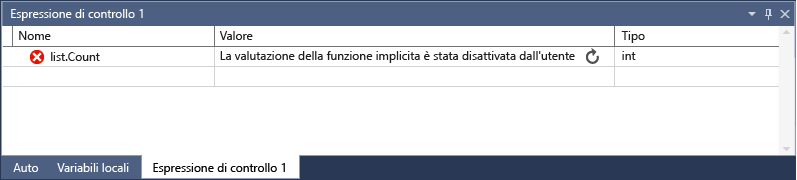

# Finestre Espressioni di controllo e Controllo immediato
[!INCLUDE[vs2017banner](../code-quality/includes/vs2017banner.md)]

È possibile usare le finestre **Espressioni di controllo** \(**Debug\/Windows\/Espressioni di controllo\/Espressione di controllo \(1, 2, 3, 4\)**\) e **Controllo immediato** \(**Debug\/Controllo immediato**\) per controllare variabili ed espressioni durante una sessione di debug. La differenza è che la finestra **Espressioni di controllo** può visualizzare più variabili, mentre la finestra **Controllo immediato** visualizza una singola variabile alla volta.  
  
## Osservazione di una singola variabile con Controllo immediato  
 È possibile usare la finestra **Controllo immediato** per osservare una singola variabile. Si supponga, ad esempio, di avere il codice seguente:  
  
```c#  
static void Main(string[] args) { int a, b; a = 1; b = 2; for (int i = 0; i < 10; i++) { a = a + b; } }  
```  
  
 È possibile osservare la variabile a nella finestra Controllo immediato come segue:  
  
1.  Impostare un punto di interruzione nella riga `a = a + b;`.  
  
2.  Avviare il debug. L'esecuzione verrà interrotta in corrispondenza del punto di interruzione.  
  
3.  Aprire la finestra **Controllo immediato** \(fare clic con il pulsante destro del mouse su a, quindi scegliere **Debug\/Controllo immediato** o **MAIUSC\+F9**\). È possibile aprire la finestra e aggiungere la variabile a nella finestra **Espressione**, quindi fare clic su **Rivaluta**. La variabile a verrà visualizzata nella finestra **Valori** con il valore 2.  
  
4.  La finestra **Controllo immediato** è una finestra di dialogo modale, per cui non è possibile continuare il debug finché è aperta. È possibile aggiungere la variabile nella finestra **Espressioni di controllo** facendo clic su **Aggiungi espressione di controllo**.  
  
5.  Chiudere la finestra **Controllo immediato**. È ora possibile continuare il debug osservando il valore nella finestra **Espressioni di controllo**.  
  
## Osservazione delle variabili con la finestra Espressioni di controllo  
 È possibile osservare più variabili con la finestra **Espressioni di controllo**. Si supponga, ad esempio, di avere il codice seguente:  
  
```c#  
static void Main(string[] args) { int a, b, c; a = 1; b = 2; c = 0; for (int i = 0; i < 10; i++) { a++; b *= 2; c = a + b; } }  
  
```  
  
 Aggiungere i valori delle tre variabili nella finestra Espressioni di controllo come segue:  
  
1.  Impostare un punto di interruzione nella riga `c = a + b;`.  
  
2.  Avviare i debug \(**F5**\). L'esecuzione verrà interrotta in corrispondenza del punto di interruzione.  
  
3.  Aprire la finestra Espressioni di controllo \(**Debug\/Windows\/Espressioni di controllo\/Espressione di controllo 1** o **CTRL\+ALT\+W, 1**\).  
  
4.  Aggiungere la variabile `a` nella prima riga, la variabile `b` nella seconda riga e la variabile `c` nella terza riga.  
  
5.  Continuare il debug.  
  
 I valori delle variabili cambieranno durante l'iterazione del ciclo `for`.  
  
 Se si programma in codice nativo, può essere necessario, in certi casi, qualificare il contesto di un nome di variabile o di un'espressione contenente un nome di variabile. Il contesto è rappresentato dalla funzione, il file di origine e il modulo in cui risiede una variabile. È possibile usare la sintassi dell'operatore di contesto per questa operazione. Per altre informazioni, vedere Espressioni in C\+\+.  
  
## Osservazione delle espressioni con la finestra Espressioni di controllo  
 Ora si proverà invece a usare un'espressione. È possibile aggiungere qualsiasi espressione valida riconosciuta dal debugger.  
  
 Prendendo come esempio sempre il codice riportato nella sezione precedente, è possibile calcolare la media dei tre valori come segue:  
  
   
  
 In generale, le regole per la valutazione delle espressioni nella finestra **Espressioni di controllo** sono le stesse delle regole per la valutazione delle espressioni nel linguaggio di codifica. Se l'espressione contiene un errore di sintassi, è possibile aspettarsi lo stesso errore del compilatore che verrebbe visualizzato nell'editor del codice. Di seguito è riportato un esempio:  
  
   
  
##  <a name="bkmk_refreshWatch"></a> Aggiornamento dei valori delle espressioni di controllo che non sono aggiornati  
 In alcuni casi è possibile che venga visualizzata un'icona di aggiornamento \(un cerchio con due frecce o un cerchio con due linee ondulate\) quando un'espressione viene valutata nella finestra **Espressioni di controllo**.  Si supponga ad esempio che la valutazione delle proprietà sia disattivata \(**Strumenti\/Opzioni\/Debug\/Abilita valutazione delle proprietà e altre chiamate di funzioni implicite**\) e di avere il codice seguente:  
  
```c#  
static void Main(string[] args) { List<string> list = new List<string>(); list.Add("hello"); list.Add("goodbye"); }  
  
```  
  
 Se si imposta un'espressione di controllo nella proprietà `Count` dell'elenco, verrà visualizzato un output simile al seguente:  
  
   
  
 Ciò indica un errore o un valore che non è aggiornato. In genere, è possibile aggiornare il valore facendo clic sull'icona, ma in alcuni casi potrebbe essere preferibile non aggiornarlo. È necessario sapere prima di tutto perché il valore non è stato valutato.  
  
 Se si punta all'icona, una descrizione comando fornisce informazioni sul motivo per cui l'espressione non è stata valutata. Se vengono visualizzate le frecce che girano in cerchio, l'espressione non è stata valutata per uno dei seguenti motivi:  
  
-   •	Si è verificato un errore durante la valutazione dell'espressione. Ad esempio, è possibile che si sia verificato un timeout o che una variabile fosse esterna all'ambito.  
  
-   •	L'espressione contiene una chiamata di funzione che potrebbe attivare un effetto collaterale nell'applicazione \(vedere [Effetti collaterali ed espressioni](#bkmk_sideEffects)\).  
  
-   La valutazione automatica delle proprietà e delle chiamate di funzioni implicite da parte del debugger è disattivata \(**Strumenti\/Opzioni\/Debug\/Abilita valutazione delle proprietà e altre chiamate di funzioni implicite**\) e quindi l'espressione non può essere valutata automaticamente.  
  
 Per aggiornare il valore, fare clic sull'icona di aggiornamento o premere la barra spaziatrice. Il debugger proverà a rivalutare l'espressione. Se l'icona di aggiornamento è stata visualizzata perché la valutazione automatica delle proprietà e gli effetti collaterali impliciti erano disattivati, l'espressione potrà essere valutata.  
  
 Se viene visualizzata un'icona rappresentata da un cerchio con due linee ondulate che assomigliano a dei fili, l'espressione non è stata valutata a causa di una potenziale dipendenza cross\-thread. In altre parole, la valutazione del codice richiede l'esecuzione temporanea di altri thread nell'applicazione. Quando ci si trova in modalità di interruzione, in genere tutti i thread nell'applicazione vengono arrestati. L'esecuzione temporanea di altri thread può avere effetti imprevisti sullo stato del programma e può far sì che il debugger ignori alcuni eventi quali i punti di interruzione e le eccezioni generate in tali thread.  
  
##  <a name="bkmk_sideEffects"></a> Effetti collaterali ed espressioni  
 La valutazione di alcune espressioni può comportare la modifica del valore di una variabile o altri effetti sullo stato del programma. La valutazione della seguente espressione, ad esempio, comporta la modifica del valore di `var1`:  
  
```  
var1 = var2  
```  
  
 Questo comportamento viene chiamato [effetto collaterale](https://en.wikipedia.org/wiki/Side_effect_\(computer_science\)). Gli effetti collaterali possono rendere più difficile il debug modificando la modalità di funzionamento del programma.  
  
 Se è noto che un'espressione presenta effetti collaterali, viene valutata una sola volta al momento della prima immissione. Le successive valutazioni vengono disabilitate. È possibile eseguire manualmente l'override di questo comportamento facendo clic sull'icona di aggiornamento visualizzata accanto al valore.  
  
 Un modo per evitare gli effetti collaterali consiste nel disattivare la valutazione automatica della funzione \(**Strumenti\/Opzioni\/Debug\/Abilita valutazione delle proprietà e altre chiamate di funzioni implicite**\).  
  
 Quando la valutazione delle proprietà o delle chiamate di funzione implicite è disattivata, è possibile forzarla con il modificatore di formato **ac** \(solo per C\#\). Vedere [Identificatori di formato in C\#](../debugger/format-specifiers-in-csharp.md).  
  
## Uso degli ID oggetto nella finestra Espressioni di controllo \(C\# e Visual Basic\)  
 Possono esistere situazioni in cui si vuole osservare il comportamento di un oggetto specifico, ad esempio si potrebbe voler tenere traccia di un oggetto a cui una variabile locale fa riferimento dopo che la variabile non è più compresa nell'ambito. In C\# e Visual Basic è possibile creare ID oggetto per istanze specifiche dei tipi di riferimento e usarle nella finestra Espressioni di controllo e nelle condizioni del punto di interruzione. L'ID oggetto viene generato dai servizi di debug di Common Language Runtime \(CLR\) e associato all'oggetto.  
  
> [!NOTE]
>  Gli ID oggetto creano riferimenti deboli e non impediscono all'oggetto di essere sottoposto a Garbage Collection. Sono validi solo per la sessione di debug corrente.  
  
 Nel codice seguente un metodo crea un oggetto `Person` usando una variabile locale, ma si vuole scoprire il nome dell'oggetto `Person` con un altro metodo:  
  
```c#  
class Person { public Person(string name) { Name = name; } public string Name { get; set; } } public class Program { List<Person> _people = new List<Person>(); public static void Main(string[] args) { MakePerson(); DoSomething(); } private static void MakePerson() { var p = new Person("Bob"); _people.Add(p); } private static void DoSomething() { // more processing Console.WriteLine("done"); } }  
  
```  
  
 È possibile aggiungere un riferimento all'oggetto `Person` nella finestra **Espressioni di controllo** come segue:  
  
1.  Impostare un punto di interruzione nel codice dopo la creazione dell'oggetto.  
  
2.  Avviare il debug e quando l'esecuzione si arresta nel punto di interruzione, trovare la variabile nella finestra **Variabili locali**, fare clic con il pulsante destro del mouse sulla variabile e scegliere **Crea ID oggetto**.  
  
3.  Nella finestra **Variabili locali** verrà visualizzato il simbolo **$** insieme a un numero. Si tratta dell'ID oggetto.  
  
4.  Aggiungere l'ID oggetto nella finestra Espressioni di controllo.  
  
5.  Impostare un punto di interruzione nella posizione in cui si vuole osservare il comportamento dell'oggetto.  Nel codice precedente tale posizione corrisponde al metodo `DoSomething()`.  
  
6.  Continuare il debug e quando l'esecuzione viene arrestata nel metodo `DoSomething()`, nella finestra **Espressioni di controllo** viene visualizzato l'oggetto `Person`.  
  
> [!NOTE]
>  Se si vogliono visualizzare le proprietà dell'oggetto, ad esempio `Person.Name` nell'esempio precedente, è necessario abilitare la valutazione delle proprietà.  
  
## Uso di registri nella finestra Espressioni di controllo \(solo C\+\+\)  
 Se si esegue il debug del codice nativo, è possibile aggiungere i nomi di registro e i nomi di variabili usando **$\<nome registro\>** o **@\<nome registro\>**.  Per altre informazioni, vedere [Pseudo variabili](../debugger/pseudovariables.md).  
  
## DynamicView e la finestra Espressioni di controllo  
 Alcuni linguaggi di script \(ad esempio, JavaScript o Python\) usano la tipizzazione dinamica o [duck typing](https://en.wikipedia.org/wiki/Duck_typing) e i linguaggi .NET \(nella versione 4.0 e versioni successive\) supportano gli oggetti che sono difficili da osservare con le normali finestre di debug, poiché possono contenere proprietà e metodi di runtime che non possono essere visualizzati.  
  
 Quando nella finestra Espressioni di controllo viene visualizzato un oggetto creato da un tipo che implementa l'[IDynamicMetaObjectProvider Interfaccia](../Topic/IDynamicMetaObjectProvider%20Interface.md), il debugger aggiunge il nodo speciale **Visualizzazione dinamica** alla visualizzazione **Auto**. Questo nodo mostra i membri dinamici dell'oggetto dinamico, ma non consente la modifica dei valori dei membri.  
  
 Se si fa clic con il pulsante destro del mouse su un oggetto figlio di una **Visualizzazione dinamica** e si sceglie **Aggiungi espressione di controllo**, il debugger inserisce una nuova variabile di controllo che esegue il cast di un oggetto in un oggetto dinamico. In altre parole, **object Name** diventa \(**\(dynamic\)object\).Name**.  
  
 La valutazione dei membri di una **Visualizzazione dinamica** può avere degli effetti collaterali. Per una spiegazione degli effetti collaterali, vedere [Effetti collaterali ed espressioni](#bkmk_sideEffects). Per C\# il debugger non rivaluta automaticamente i valori mostrati nella **Visualizzazione dinamica** quando si passa a una nuova riga di codice. Per Visual Basic le espressioni aggiunte tramite la **Visualizzazione dinamica** vengono aggiornate automaticamente.  
  
 Per istruzioni su come aggiornare i valori della Visualizzazione dinamica, vedere [Aggiornamento dei valori delle espressioni di controllo che non sono aggiornati](#bkmk_refreshWatch).  
  
 Se si vuole visualizzare solo la **Visualizzazione dinamica** per un oggetto, è possibile usare l'identificatore di formato **dynamic**:  
  
-   C\#: **ObjectName, dynamic**  
  
-   Visual Basic:: **$dynamic, ObjectName**  
  
 La **Visualizzazione dinamica** migliora anche l'esperienza di debug per gli oggetti COM. Quando il debugger rileva un oggetto COM di cui è stato eseguito il wrapping in **System.\_\_ComObject**, aggiunge il nodo **Visualizzazione dinamica** per l'oggetto.  
  
## Vedere anche  
 [Finestre del debugger](../debugger/debugger-windows.md)