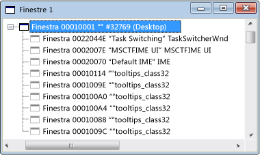

# Windows View
[!INCLUDE[vs2017banner](../code-quality/includes/vs2017banner.md)]

Quando si apre per la prima volta Spy\+\+, nella visualizzazione finestre viene presentata una struttura ad albero di tutte le finestre e i controlli disponibili nel sistema.  Vengono visualizzati l'handle della finestra e il nome della classe.  La finestra del desktop corrente si trova all'inizio della struttura ad albero.  Tutte le altre sono finestre figlio del desktop e vengono elencate in base alla gerarchia delle finestre standard.  Le finestre di pari livello vengono visualizzate in elenchi espandibili su un livello di rientro al di sotto dei relativi elementi padri.  
  
 Nella figura seguente viene mostrata una visualizzazione finestre tipica di Spy\+\+ con il nodo principale espanso.  
  
   
Visualizzazione finestre di Spy\+\+  
  
 La finestra del desktop corrente si trova all'inizio della struttura ad albero.  Tutte le altre sono finestre figlio del desktop e vengono elencate in base alla gerarchia delle finestre standard, con le finestre di pari livello disposte in base all'ordine z.  È possibile espandere o comprimere qualsiasi nodo padre della struttura ad albero facendo clic sul simbolo \+ o \- accanto al nodo.  
  
 Quando la visualizzazione finestre ha lo stato attivo, è possibile utilizzare lo strumento di ricerca nella [Finestra di dialogo Ricerca finestre](../debugger/window-search-dialog-box.md) per visualizzare le informazioni di qualsiasi finestra aperta nel sistema.  
  
## Argomenti della sezione  
 [How to: Use the Finder Tool](../debugger/how-to-use-the-finder-tool.md)  
 Viene illustrato come questo strumento analizza le finestre per le proprietà o i messaggi.  
  
 [How to: Search for a Window in Windows View](../debugger/how-to-search-for-a-window-in-windows-view.md)  
 Viene illustrato come individuare una finestra specifica nella visualizzazione finestre.  
  
 [How to: Display Window Properties](../debugger/how-to-display-window-properties.md) m  
 Routine per l'apertura della finestra di dialogo Proprietà finestra.  
  
## Sezioni correlate  
 [Spy\+\+ Views](../debugger/spy-increment-views.md)  
 Vengono illustrate le visualizzazioni struttura ad albero di Spy\+\+ relative a finestre, messaggi, processi e thread.  
  
 [Using Spy\+\+](../debugger/using-spy-increment.md)  
 Vengono illustrati lo strumento Spy\+\+ e il relativo utilizzo.  
  
 [Finestra di dialogo Trova finestra](../debugger/find-window-dialog-box.md)  
 Utilizzata per visualizzare le proprietà o i messaggi di una finestra specifica.  
  
 [Finestra di dialogo Ricerca finestre](../debugger/window-search-dialog-box.md)  
 Utilizzata per individuare il nodo relativo a una finestra specifica nella visualizzazione finestre.  
  
 [Finestra di dialogo Proprietà finestra](../debugger/window-properties-dialog-box.md)  
 Utilizzata per visualizzare le proprietà di una finestra selezionata nella visualizzazione finestre.  
  
 [Spy\+\+ Reference](../debugger/spy-increment-reference.md)  
 Sono incluse le sezioni in cui vengono descritti tutti i menu e le finestre di dialogo di Spy\+\+.