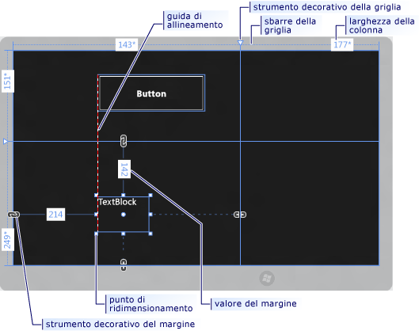
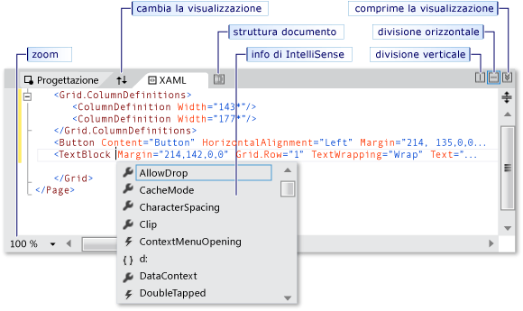
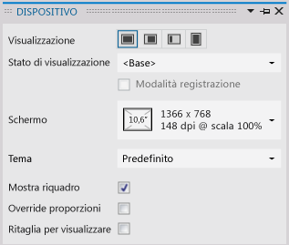
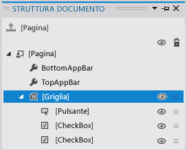
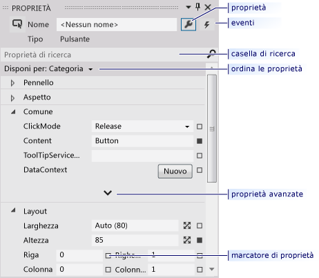

# Creazione di un&#39;interfaccia utente tramite la finestra di progettazione XAML in Visual Studio
[!INCLUDE[vs2017banner](../code-quality/includes/vs2017banner.md)]

La finestra di progettazione XAML in Visual Studio offre un'interfaccia visiva per semplificare la progettazione di app per Windows Store, Windows Phone, WPF e Silverlight basate su XAML. È possibile creare interfacce utente per le app trascinando i controlli dalla **Casella degli strumenti** e impostando le proprietà nella finestra **Proprietà**. È anche possibile modificare il codice XAML direttamente nella visualizzazione XAML.  
  
 Per attività di progettazione XAML avanzate quali animazioni e comportamenti, vedere [Creazione di un'interfaccia utente usando Blend per Visual Studio](../designers/creating-a-ui-by-using-blend-for-visual-studio.md).  
  
## Area di lavoro della finestra di progettazione XAML  
 L'area di lavoro della finestra di progettazione XAML è costituita da alcuni elementi dell'interfaccia visiva, ad esempio la tavola da disegno, l'Editor XAML, la finestra Dispositivo, la finestra Struttura documento e la finestra Proprietà. Per aprire la finestra di progettazione XAML, fare clic con il pulsante destro del mouse su un file XAML in **Esplora soluzioni**, quindi scegliere **Progettazione visualizzazioni**.  
  
## Visualizzazioni per la creazione  
 La finestra di progettazione XAML include una visualizzazione XAML e una visualizzazione Progettazione sincronizzata del markup XAML dell'app sottoposto a rendering. Con un file XAML aperto in Visual Studio, è possibile spostarsi tra la visualizzazione Progettazione e la visualizzazione XAML mediante le schede **Progettazione** e **XAML**. È possibile usare il pulsante **Scambia riquadri** per visualizzare in primo piano alternativamente la tavola da disegno o l'Editor XAML.  
  
 Nella visualizzazione Progettazione la finestra che include la *tavola da disegno* è la finestra attiva ed è possibile usarla come area di lavoro principale. Permette di progettare visivamente una pagina nell'app, aggiungendo o disegnando elementi e quindi modificandoli. Per altre informazioni, vedi [Utilizzo di elementi in XAML Designer](../designers/working-with-elements-in-xaml-designer.md). Questa figura mostra la tavola da disegno nella visualizzazione Progettazione.  
  
   
  
 Nella tavola da disegno sono disponibili le funzionalità seguenti:  
  
 **Guide di allineamento**  
 Le guide di allineamento sono *limiti di allineamento*, visualizzati sotto forma di linee tratteggiate rosse, per indicare quando i bordi dei controlli sono allineati o quando le linee di base del testo sono allineate. I limiti di allineamento vengono visualizzati solo quando è abilitato l'**allineamento alle guide di allineamento**.  
  
 **Sbarre della griglia**  
 Le sbarre `Grid` consentono di gestire righe e colonne in un pannello [Grid](http://msdn.microsoft.com/library/windows/apps/windows.ui.xaml.controls.grid.aspx). È possibile creare ed eliminare righe e colonne e modificare le rispettive larghezze e altezze. La sbarra verticale della griglia, visualizzata nel lato sinistro della tavola da disegno, viene usata per le righe, mentre la sbarra orizzontale, visualizzata in alto, viene usata per le colonne.  
  
 **Strumenti decorativi griglia**  
 Uno strumento decorativo `Grid` viene visualizzato sotto forma di triangolo a cui è collegata una linea verticale oppure orizzontale sulla sbarra della `Grid`. Quando si trascina uno strumento decorativo `Grid`, le larghezze o altezze delle colonne o righe adiacenti vengono aggiornate in base allo spostamento del mouse.  
  
 Gli strumenti decorativi `Grid` vengono usati per controllare la larghezza e l'altezza delle righe e delle colonne di una `Grid`. È possibile aggiungere una nuova colonna o riga facendo clic sulle sbarre della `Grid`. Quando si aggiunge una nuova linea di riga o colonna per un pannello `Grid` che include due o più colonne o righe, una barra degli strumenti ridotta viene visualizzata all'esterno della sbarra e permette di impostare esplicitamente la larghezza e l'altezza. La barra degli strumenti ridotta permette di configurare le opzioni di ridimensionamento per le righe e le colonne della `Grid`.  
  
 **Quadratini di ridimensionamento**  
 I quadratini di ridimensionamento vengono visualizzati sui controlli selezionati e ne permettono il ridimensionamento. Quando si ridimensiona un controllo, vengono in genere visualizzati i valori relativi a larghezza e altezza per semplificare il ridimensionamento del controllo. Per ulteriori informazioni sulla modifica dei controlli nella visualizzazione Progettazione, vedere [Utilizzo di elementi in XAML Designer](../designers/working-with-elements-in-xaml-designer.md).  
  
 **Margini**  
 I margini rappresentano la quantità di spazio fisso tra il bordo di un controllo e il bordo del rispettivo contenitore. È possibile impostare i margini di un controllo usando le proprietà [Margin](http://msdn.microsoft.com/library/windows/apps/windows.ui.xaml.frameworkelement.margin.aspx) in **Layout** nella finestra Proprietà.  
  
 **Strumenti decorativi del margine**  
 È possibile usare gli strumenti decorativi del margine per modificare i margini di un elemento in relazione al rispettivo contenitore di layout. Se uno strumento decorativo del margine è aperto, il margine non viene impostato e viene visualizzata una catena interrotta. Se il margine non è impostato, gli elementi restano al proprio posto quando il contenitore di layout viene ridimensionato in fase di esecuzione. Se uno strumento decorativo del margine viene chiuso, viene visualizzata una catena ininterrotta e gli elementi vengono spostati insieme al margine quando il contenitore di layout viene ridimensionato in fase di esecuzione \(il margine resta fisso\).  
  
 **Handle degli elementi**  
 È possibile modificare un elemento usando i rispettivi handle visualizzati sulla tavola da disegno quando si sposta il puntatore sugli angoli della casella blu che circonda l'elemento. Gli handle consentono di ruotare, ridimensionare, capovolgere, spostare o aggiungere un raggio dell'angolo all'elemento. Il simbolo per l'handle dell'elemento varia in base alla funzione e cambia a seconda della posizione esatta del puntatore. Se gli handle non sono visibili, verificare che l'elemento sia selezionato.  
  
 Nella visualizzazione Progettazione sono disponibili comandi aggiuntivi della tavola da disegno nell'area inferiore sinistra della schermata, come illustrato di seguito:  
  
   
  
 Nella barra degli strumenti sono disponibili i comandi seguenti:  
  
 **Zoom**  
 Lo zoom consente di ridimensionare l'area di progettazione. È possibile ingrandire dal 12,5% all'800% o selezionare opzioni come **Larghezza pagina** e **Adatta tutto**.  
  
 **Mostra\/Nascondi griglia di allineamento**  
 Visualizza o nasconde la griglia di allineamento che mostra le griglie. Le griglie vengono usate quando è abilitato il **blocco sulla griglia** o l'**allineamento alle guide di allineamento**.  
  
 **Attiva\/Disattiva allineamento alla griglia**  
 Se è abilitato l'**allineamento alla griglia** quando si trascina un elemento sulla tavola da disegno, l'elemento tende ad allinearsi alle linee orizzontali e verticali più vicine.  
  
 **Attiva\/Disattiva allineamento alle guide di allineamento**  
 Le guide di allineamento consentono di allineare i controlli l'uno rispetto all'altro. Se è abilitato l'**allineamento alle guide di allineamento**, quando si trascina un controllo in relazione ad altri controlli, vengono visualizzati i limiti di allineamento quando i bordi e il testo di alcuni controlli sono allineati orizzontalmente o verticalmente. Il limite di allineamento viene mostrato come una linea tratteggiata rossa.  
  
 Nella visualizzazione XAML, la finestra contenente l'editor XAML è la finestra attiva e l'editor XAML è lo strumento di creazione primario. Il linguaggio Extensible Application Markup Language \(XAML\) fornisce un vocabolario dichiarativo basato su XML per la specifica dell'interfaccia utente di un'applicazione. La visualizzazione XAML include IntelliSense, la formattazione automatica, l'evidenziazione della sintassi e la navigazione tra tag. La figura seguente mostra la visualizzazione XAML:  
  
   
  
 **Barra della visualizzazione suddivisa**  
 La barra della visualizzazione suddivisa compare nella parte superiore della visualizzazione XAML quando l'editor XAML si trova nella finestra inferiore. Tale barra consente di controllare le dimensioni relative delle visualizzazioni Progettazione e XAML. È anche possibile scambiare le posizioni delle visualizzazioni, usando il pulsante **Scambia riquadri**, specificare se le visualizzazioni sono disposte orizzontalmente o verticalmente e comprimere una visualizzazione.  
  
 **Zoom di markup**  
 Lo zoom di markup consente di ridimensionare la visualizzazione XAML. È possibile ingrandire dal 20% al 400%.  
  
## Finestra Dispositivo  
 La finestra Dispositivo nella finestra di progettazione XAML per Visual Studio consente di simulare in fase di progettazione diverse visualizzazioni e opzioni di visualizzazione per il progetto Windows Store o Windows Phone. La finestra Dispositivo è disponibile nel menu **Progettazione** quando si usa la finestra di progettazione XAML e ha l'aspetto seguente:  
  
   
  
 Le opzioni della finestra Dispositivo sono le seguenti:  
  
 **Visualizzazione**  
 Specifica dimensioni e risoluzioni di visualizzazione diverse per l'app.  
  
 **Orientamento**  
 Specifica diversi orientamenti per l'app, **Orizzontale** o **Verticale**.  
  
 **Microsoft Edge**  
 Specifica diversi allineamenti per i bordi dell'app, ad esempio **Entrambi**, **A sinistra**, **A destra** o **Nessuno**.  
  
 **Contrasto elevato**  
 Visualizza l'app in anteprima in base all'impostazione di contrasto selezionata. Se per l'impostazione viene specificato un valore diverso da **Predefinito**, l'impostazione della proprietà `RequestedTheme` in App.xaml verrà sovrascritta.  
  
 **Override ridimensionamento**  
 Attiva e disattiva l'emulazione delle proporzioni del documento nell'area di progettazione. Ciò permette di aumentare la percentuale di scala di un fattore. Selezionare la casella di controllo per attivare l'emulazione. Ad esempio, se la percentuale di scala è 100%, al documento nell'area di progettazione verrà applicato un valore di scala fino a 140%. Questa opzione è disabilitata se la percentuale di scala corrente è 180.  
  
 **Larghezza minima**  
 Specifica l'impostazione della larghezza minima. Tale valore può essere modificato nel file App.xaml.  
  
 **Tema**  
 Specifica il tema dell'app. È ad esempio possibile alternare un tema chiaro e uno scuro.  
  
 **Mostra riquadro**  
 Attiva e disattiva il frame simulato per tablet intorno all'app nella visualizzazione Progettazione. Selezionare la casella di controllo per mostrare il frame.  
  
 **Ritaglia per visualizzare**  
 Specifica la modalità di visualizzazione. Selezionare la casella di controllo per ritagliare le dimensioni del documento in base alle dimensioni di visualizzazione.  
  
## Finestra Struttura documento  
 La finestra Struttura documento nella finestra di progettazione XAML permette di eseguire le operazioni seguenti:  
  
-   Visualizzare la struttura gerarchica di tutti gli elementi sulla tavola da disegno.  
  
-   Selezionare gli elementi in modo da poterli modificare, ossia spostarli nella gerarchia, modificarli sulla tavola da disegno, impostarne le proprietà nella finestra Proprietà e così via. Per ulteriori informazioni, vedere [Utilizzo di elementi in XAML Designer](../designers/working-with-elements-in-xaml-designer.md).  
  
-   Creare e modificare modelli per gli elementi che sono controlli.  
  
-   Usare il menu contestuale per gli elementi selezionati. Lo stesso menu è disponibile anche per gli elementi selezionati nella tavola da disegno.  
  
 Per visualizzare la finestra Struttura documento, scegliere **Visualizza**, **Altre finestre**, **Struttura documento** sulla barra dei menu.  
  
   
  
 Le opzioni della finestra Struttura documento sono le seguenti:  
  
 **Struttura documento**  
 La visualizzazione principale nella finestra Struttura documento mostra la gerarchia di un documento in una struttura ad albero. È possibile usare la natura gerarchica della struttura documento per esaminare il documento con diversi livelli di dettaglio e per bloccare e nascondere gli elementi singolarmente o in gruppo.  
  
 **Mostra\/Nascondi**  
 Visualizza o nasconde gli elementi della tavola da disegno che corrispondono agli elementi nella struttura documento. Usare i pulsanti **Mostra\/Nascondi** \(identificati, quando gli elementi sono visualizzati, dal simbolo di un occhio\) oppure premere CTRL\+H per nascondere gli elementi e MAIUSC\+CTRL\+H per visualizzarli.  
  
 **Blocca\/Sblocca**  
 Blocca o sblocca gli elementi della tavola da disegno che corrispondono agli elementi nella struttura documento. Gli elementi bloccati non possono essere modificati. Usare i pulsanti **Blocca\/Sblocca** \(identificati, quando è applicato il blocco, dal simbolo di un lucchetto\) oppure premere CTRL\+L per bloccare gli elementi e MAIUSC\+CTRL\+L per sbloccarli.  
  
 **Reimposta l'ambito pageRoot**  
 L'opzione nella parte superiore della finestra Struttura documento, con il simbolo di una freccia rivolta verso l'alto, reimposta l'ambito precedente per la struttura del documento. Questa operazione può essere eseguita solo nell'ambito di uno stile o di un modello.  
  
## Finestra Proprietà  
 La finestra Proprietà consente di impostare valori di proprietà sui controlli e ha l'aspetto seguente:  
  
   
  
 Nella parte superiore della finestra Proprietà sono disponibili varie opzioni. È possibile modificare il nome dell'elemento selezionato usando la casella **Nome**. Nell'angolo superiore sinistro è presente un'icona che rappresenta l'elemento selezionato. Per disporre le proprietà per categoria o in ordine alfabetico, fare clic su **Categoria**, **Nome** oppure **Origine** nell'elenco **Disponi per**. Per visualizzare l'elenco di eventi per un controllo, fare clic sul pulsante **Eventi**, al quale è associato il simbolo di un fulmine. Per cercare una proprietà, iniziare a digitare il nome corrispondente nella casella **Proprietà di ricerca**. La finestra Proprietà mostra le proprietà corrispondenti alla ricerca durante la digitazione. In alcuni casi è possibile impostare proprietà avanzate selezionando un pulsante Freccia GIÙ. Per altre informazioni sull'uso delle proprietà e sulla gestione degli eventi, vedere [Guida introduttiva: Aggiunta di controlli e gestione di eventi](http://go.microsoft.com/fwlink/?LinkID=247983).  
  
 A destra di ogni valore di proprietà è presente un *marcatore della proprietà*, visualizzato sotto forma di simbolo di casella. L'aspetto del marcatore della proprietà indica se è presente un data binding o una risorsa applicata alla proprietà. Ad esempio, una casella bianca indica un valore predefinito, una casella nera indica che è stata applicata una risorsa locale e una casella arancione indica che è stato applicato un data binding. Quando si fa clic su questo marcatore, è possibile passare alla definizione di uno stile, aprire il generatore di data binding oppure aprire il selettore risorse.  
  
## Vedere anche  
 [Utilizzo di elementi in XAML Designer](../designers/working-with-elements-in-xaml-designer.md)   
 [Procedura per creare e applicare una risorsa](../designers/how-to-create-and-apply-a-resource.md)   
 [Procedura dettagliata: Binding ai dati nella finestra di progettazione XAML](../designers/walkthrough-binding-to-data-in-xaml-designer.md)