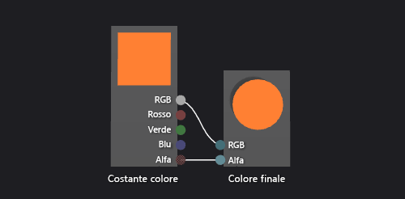

# Procedura: Creare uno shader con colore di base
[!INCLUDE[vs2017banner](../code-quality/includes/vs2017banner.md)]

In questo documento viene illustrato come utilizzare la finestra di Progettazione shader e il linguaggio DGSL per creare uno shader di colore piano.  Questo shader imposta il colore finale su un valore costante di colore RGB.  
  
 In questo documento vengono illustrate queste attività:  
  
-   Rimozione di nodi da un grafico  
  
-   Aggiunta di nodi a un grafico  
  
-   Impostazione delle proprietà del nodo  
  
-   Connessione di nodi  
  
## Creazione di uno shader di colore piano  
 È possibile implementare uno shader di colore piatto scrivendo il valore del colore di una costante di colore RGB nel colore di output finale.  
  
 Prima di iniziare, assicurarsi che la finestra **Proprietà** e **Casella degli strumenti** visualizzazione.  
  
#### Per creare uno shader di colore piatto  
  
1.  Creare uno shader di DGSL per l'utilizzo.  Per informazioni su come aggiungere uno shader di DGSL al progetto, vedere la sezione della guida introduttiva in [Finestra di progettazione shader](../designers/shader-designer.md).  
  
2.  Eliminare il nodo **Colore punto**.  Utilizzare lo strumento **Seleziona** per selezionare il nodo **Colore punto**, quindi nella barra dei menu scegliere **Modifica** ed **Elimina**.  
  
3.  Aggiungere un nodo **Costante colore** al grafico.  Nella **Casella degli strumenti** in **Costanti** selezionare **Costante colore** e spostarlo nell'area di progettazione.  
  
4.  Specificare un valore di colore per il nodo **Costante colore**.  Utilizzare lo strumento **Seleziona** per selezionare il nodo **Costante colore**, quindi nella finestra **Proprietà**, nella proprietà **Output** specificare un valore di colore.  Per arancione, specificare un valore di \(1,0, 0,5, 0,2, 1,0\).  
  
5.  Connettere la costante di colore al colore finale.  Per creare le connessioni, spostare il terminale **RGB** del nodo **Costante colore** verso il terminale **RGB** del nodo **Colore finale**, quindi spostare il terminale **Alfa** del nodo **Costante colore** verso il terminale **Alfa** del nodo **Colore finale**.  Queste connessioni impostano il colore finale sulla costante di colore definita nel passaggio precedente.  
  
 Nella figura seguente viene mostrato il grafico di shader completato e un'anteprima dello shader applicato a un cubo.  
  
> [!NOTE]
>  Nell'illustrazione seguente viene specificato un colore arancione per illustrare meglio l'effetto dello shader.  
  
   
  
 Alcune forme potrebbero fornire anteprime ottimizzate per alcuni pixel.  Per ulteriori informazioni su come visualizzare in anteprima gli shader nella finestra di Progettazione shader, vedere [Finestra di progettazione shader](../designers/shader-designer.md).  
  
## Vedere anche  
 [Procedura: Applicare uno shader a un modello tridimensionale](../designers/how-to-apply-a-shader-to-a-3-d-model.md)   
 [Procedura: Esportare uno shader](../designers/how-to-export-a-shader.md)   
 [Finestra di progettazione shader](../designers/shader-designer.md)   
 [Nodi della finestra di progettazione shader](../designers/shader-designer-nodes.md)