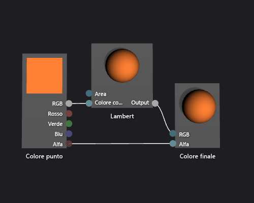

# Procedura: Creare uno shader con Lambert di base
Questo documento illustra come usare la finestra di progettazione shader e il linguaggio DGSL (Directed Graph Shader Language) per creare uno shader di illuminazione che implementa il modello di illuminazione Lambert classico.  
  
 Questo documento illustra queste attività:  
  
-   Aggiunta di nodi a un grafico shader  
  
-   Disconnessione di nodi  
  
-   Connessione ai nodi  
  
## Modello di illuminazione Lambert  
 Il modello di illuminazione Lambert incorpora l'illuminazione ambientale e direzionale per ombreggiare oggetti in una scena 3D. I componenti ambientali forniscono un livello di illuminazione di base della scena 3D, mentre i componenti direzionali forniscono illuminazione aggiuntiva da sorgenti di luce (lontane) direzionali. L'illuminazione ambientale interessa allo stesso modo tutte le superfici della scena, indipendentemente dall'orientamento. Per una determinata superficie, è un prodotto del colore ambientale della superficie, nonché del colore e dell'intensità dell'illuminazione ambientale nella scena. L'illuminazione direzionale, invece, influenza ogni area della scena in modo diverso, in base all'orientamento della superficie rispetto alla direzione della sorgente di luce. È un prodotto del colore diffuso e dell'orientamento della superficie, nonché del colore, dell'intensità e della direzione delle sorgenti di luce. Le superfici rivolte direttamente verso una sorgente di luce ricevono il massimo contributo, mentre le superfici rivolte in senso contrario alla luce non ricevono alcun contributo. Nel modello di illuminazione Lambert, il componente ambientale e uno o più componenti direzionali vengono combinati per determinare il contributo totale di colore con riflessione diffusa per ogni punto sull'oggetto.  
  
 Prima di iniziare, assicurarsi che siano visualizzate la finestra **Proprietà** e la **casella degli strumenti**.  
  
#### Per creare uno shader Lambert  
  
1.  Creare uno shader DGSL da utilizzare. Per informazioni su come aggiungere uno shader DGSL al progetto, vedere la sezione Introduzione in [Finestra di progettazione shader](../designers/shader-designer.md).  
  
2.  Scollegare il nodo **Colore punto** dal nodo **Colore finale**. Scegliere il terminale **RGB** del nodo **Colore punto** e quindi scegliere **Interrompi collegamenti**. Lasciare connesso il terminale **Alfa**.  
  
3.  Aggiungere un nodo **Lambert** al grafico. Nella **casella degli strumenti**, in **Utilità**, selezionare **Lambert** e spostarlo nell'area di progettazione. Il nodo Lambert calcola il contributo totale di colore con riflessione diffusa del pixel in base ai parametri di illuminazione ambientale e diffusa.  
  
4.  Collegare il nodo **Colore punto** al nodo **Lambert**. In modalità **Seleziona** spostare il terminale **RGB** del nodo **Colore punto** nel terminale **Colore diffuso** del nodo **Lambert**. Questa connessione fornisce il nodo Lambert con interpolazione del colore con riflessione diffusa del pixel.  
  
5.  Collegare il valore del colore calcolato al colore finale. Spostare il terminale **Output** del nodo **Lambert** nel terminale **RGB** del nodo **Colore finale**.  
  
 La figura seguente illustra il grafico shader completato e un'anteprima dello shader applicato a un modello di teiera.  
  
> [!NOTE]
>  Per illustrare meglio l'effetto dello shader in questa figura, è stato specificato un colore arancione usando il parametro **MaterialDiffuse** dello shader. Un gioco o un'app può usare questo parametro per specificare un valore di colore univoco per ogni oggetto. Per informazioni sui parametri di materiale, vedere la sezione Anteprima degli shader in [Finestra di progettazione shader](../designers/shader-designer.md).  
  
   
  
 Alcune forme potrebbero produrre anteprime migliori per alcuni shader. Per altre informazioni su come visualizzare in anteprima gli shader nella finestra di progettazione shader, vedere la sezione Anteprima degli shader in [Finestra di progettazione shader](../designers/shader-designer.md).  
  
 La figura seguente illustra lo shader descritto in questo documento applicato a un modello 3D.  
  
   
  
 Per altre informazioni su come applicare uno shader a un modello 3D, vedere [Procedura: Applicare uno shader a un modello 3D](../designers/how-to-apply-a-shader-to-a-3-d-model.md).  
  
## Vedere anche  
 [Procedura: Applicare uno shader a un modello 3D](../designers/how-to-apply-a-shader-to-a-3-d-model.md)   
 [Procedura: Esportare uno shader](../designers/how-to-export-a-shader.md)   
 [Procedura: Creare uno shader con Phong di base](../designers/how-to-create-a-basic-phong-shader.md)   
 [Finestra di progettazione shader](../designers/shader-designer.md)   
 [Nodi della finestra di progettazione shader](../designers/shader-designer-nodes.md)