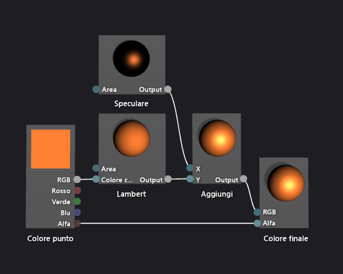

# Procedura: Creare uno shader con phong di base
[!INCLUDE[vs2017banner](../code-quality/includes/vs2017banner.md)]

In questo documento viene illustrato come utilizzare la finestra di Progettazione shader e il linguaggio DGSL per creare uno shader di illuminazione che implementa il modello di illuminazione di Phong classico.  
  
 In questo documento vengono illustrate queste attività:  
  
-   Aggiunta di nodi a un grafico shader  
  
-   Disconnessione di nodi  
  
-   Connessione di nodi  
  
## Modello di illuminazione di Phong  
 Il modello di illuminazione di Phong estende il modello di illuminazione di Lambert per includere l'evidenziazione speculare, che simula le proprietà riflettenti di una superficie.  Il componente speculare fornisce ulteriore illuminazione dalle stesse sorgenti di luce direzionale utilizzate nel modello di illuminazione di Lambert, ma i suoi effetti sul colore finale vengono elaborati in modo diverso.  L'evidenziazione speculare influenza ogni area nella scena in modo diverso, in base alla relazione tra la direzione di visualizzazione, la direzione delle sorgenti di luce e l'orientamento della superficie.  È un prodotto del colore speculare, della potenza speculare e dell'orientamento della superficie e del colore, dell'intensità e della direzione delle sorgenti di luce.  Superfici che riflettono una sorgente di luce direttamente al visualizzatore ricevono il contributo speculare massimo e le superfici che riflette una sorgente di luce lontano dal visualizzatore non ricevono alcun contributo.  Nel modello di illuminazione di Phong, uno o più componenti speculari vengono combinati per determinare il colore e l'intensità di evidenziazione speculare per ciascun punto sull'oggetto e quindi vengono aggiunti al risultato del modello di illuminazione di Lambert per produrre il colore finale del pixel.  
  
 Per ulteriori informazioni sul modello di illuminazione Lambert, vedere [Procedura: Creare uno shader con Lambert di base](../designers/how-to-create-a-basic-lambert-shader.md).  
  
 Prima di iniziare, assicurarsi che la finestra **Proprietà** e la **casella degli strumenti** siano visualizzate.  
  
#### Per creare uno shader di Phong  
  
1.  Creare uno shader di Lambert, come descritto in [Procedura: Creare uno shader con Lambert di base](../designers/how-to-create-a-basic-lambert-shader.md).  
  
2.  Disconnettere il nodo **Lambert** dal nodo **Colore finale**.  Scegliere il terminale **RGB** del nodo **Lambert**, quindi scegliere **Interrompi collegamenti**.  In questo modo si crea lo spazio per il nodo che viene aggiunto nel passaggio successivo.  
  
3.  Aggiungere un nodo **Aggiungi** al grafico.  Nella **Casella degli strumenti** in **Matematica** selezionare **Aggiungi** e spostarlo nell'area di progettazione.  
  
4.  Aggiungere un nodo **Speculare** al grafico.  Nella **Casella degli strumenti** in **Utilità** selezionare **Speculare** e spostarla nell'area di progettazione.  
  
5.  Aggiungere il contributo speculare.  Spostare il terminale **Output** del nodo **Specular** nel terminale **X** del nodo **Aggiungi**, quindi spostare il terminale **Output** del nodo **Lambert** nel terminale **Y** del nodo **Aggiungi**.  Queste connessioni combinano i contributi diffusi e speculari totali del colore per il pixel.  
  
6.  Connettere il valore della costante di colore elaborata al colore finale.  Spostare il terminale **Output** del nodo **Aggiungi** nel terminale **RGB** del nodo **Colore finale**.  
  
 Nella figura seguente viene mostrato il grafico di shader completato e un'anteprima dello shader applicato a un modello di teiera.  
  
> [!NOTE]
>  Per illustrare meglio l'effetto dello shader in questa illustrazione, è stato specificato un colore arancione utilizzando il parametro **MaterialDiffuse** dello shader, e un colore metallizzato utilizzando i parametri **MaterialSpecularPower** e **MaterialSpecular**.  Per informazioni sui parametri materiali, vedere la sezione di visualizzazione in anteprima dello shader in [Finestra di progettazione shader](../designers/shader-designer.md).  
  
   
  
 Alcune forme potrebbero fornire anteprime ottimizzate per alcuni pixel.  Per ulteriori informazioni su come visualizzare in anteprima gli shader nella finestra di progettazione dello shader, vedere la sezione di visualizzazione in anteprima dello shader in [Finestra di progettazione shader](../designers/shader-designer.md)  
  
 Nella figura seguente viene illustrato lo shader descritto in questo documento applicato a un modello tridimensionale.  La proprietà **MaterialSpecular** è impostata su \(1,00, 0,50, 0,20, 0,00\) e la proprietà **MaterialSpecularPower** è impostata su 16.  
  
> [!NOTE]
>  La proprietà **MaterialSpecular** determina la fine apparente del materiale della superficie.  Una superficie molto lucente come il cristallo o la plastica tende ad avere un colore speculare che è una sfumatura luminosa di bianco.  Una superficie metallica tende ad avere un colore speculare vicino al colore diffuso.  Una superficie con finiture in raso tende ad avere un colore speculare che è una sfumatura scura di grigio.  
>   
>  La proprietà **MaterialSpecularPower** determina l'intensità delle evidenziazioni speculari.  Le potenze speculari elevate simulano evidenziazioni deboli e più localizzate.  Le potenze speculari molto deboli simulano evidenziazioni intense e ampie che possono saturare eccessivamente e nascondere il colore dell'intera superficie.  
  
   
  
 Per ulteriori informazioni su come applicare uno shader a un modello tridimensionale, vedere [Procedura: Applicare uno shader a un modello tridimensionale](../designers/how-to-apply-a-shader-to-a-3-d-model.md).  
  
## Vedere anche  
 [Procedura: Applicare uno shader a un modello tridimensionale](../designers/how-to-apply-a-shader-to-a-3-d-model.md)   
 [Procedura: Esportare uno shader](../designers/how-to-export-a-shader.md)   
 [Procedura: Creare uno shader con Lambert di base](../designers/how-to-create-a-basic-lambert-shader.md)   
 [Finestra di progettazione shader](../designers/shader-designer.md)   
 [Nodi della finestra di progettazione shader](../designers/shader-designer-nodes.md)