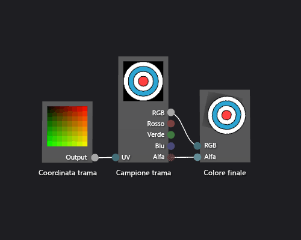

# Procedura: Creare uno shader con trama di base
Questo documento illustra come usare la finestra di progettazione shader e il linguaggio DGSL (Directed Graph Shader Language) per creare uno shader a trama singola. Questo shader imposta il colore finale direttamente sui valori RGB e alfa campionati dalla trama.  
  
 Questo documento illustra queste attività:  
  
-   Rimozione di nodi da un grafico shader  
  
-   Aggiunta di nodi a un grafico  
  
-   Impostazione dei parametri dello shader  
  
-   Impostazione della visibilità dei parametri  
  
-   Connessione ai nodi  
  
## Creare uno shader con trama di base  
 È possibile implementare uno shader a trama singola di base scrivendo i valori di colore e alfa di un campione di trama direttamente nel colore di output finale.  
  
 Prima di iniziare, assicurarsi che siano visualizzate la finestra **Proprietà** e la **casella degli strumenti**.  
  
#### Per creare uno shader con trama di base  
  
1.  Creare uno shader DGSL da utilizzare. Per informazioni su come aggiungere uno shader DGSL al progetto, vedere la sezione Introduzione in [Finestra di progettazione shader](../designers/shader-designer.md).  
  
2.  Eliminare il nodo **Colore punto**. In modalità **Seleziona** selezionare il nodo **Colore punto** e scegliere **Modifica**, **Elimina** nella barra dei menu. In questo modo si crea lo spazio per il nodo che viene aggiunto nel passaggio successivo.  
  
3.  Aggiungere un nodo **Trama** al grafico. Nella **casella degli strumenti**, in **Trama**, selezionare **Campione trama** e spostarlo nell'area di progettazione.  
  
4.  Aggiungere un nodo **Coordinata trama** al grafico. Nella **casella degli strumenti**, in **Trama**, selezionare **Coordinata trama** e spostarlo nell'area di progettazione.  
  
5.  Scegliere una trama da applicare. In modalità **Seleziona** selezionare il nodo **Campione trama** e nella finestra **Proprietà** specificare la trama che si vuole usare tramite la proprietà **Nome file**.  
  
6.  Rendere la trama accessibile pubblicamente. Selezionare il nodo **Campione trama** e nella finestra **Proprietà** impostare la proprietà **Accesso** su **Pubblico**. A questo punto è possibile impostare la trama da un altro strumento, ad esempio dall'**editor dei modelli**.  
  
7.  Collegare le coordinate di trama al campione di trama. In modalità **Seleziona** spostare il terminale **Output** del nodo **Coordinata trama** nel terminale **UV** del nodo **Campione trama**. Questa connessione esegue la campionatura della trama in corrispondenza delle coordinate specificate.  
  
8.  Collegare il campione di trama al colore finale. Spostare il terminale **RGB** del nodo **Campione trama** nel terminale **RGB** del nodo **Colore finale** e quindi spostare il terminale **Alfa** del nodo **Campione trama** nel terminale **Alfa** del nodo **Colore finale**.  
  
 La figura seguente illustra il grafico shader completato e un'anteprima dello shader applicato a un cubo.  
  
> [!NOTE]
>  In questa illustrazione, viene utilizzato un piano come forma di anteprima ed è stata specificata una trama per illustrare meglio l'effetto dello shader.  
  
   
  
 Alcune forme potrebbero produrre anteprime migliori per alcuni shader. Per altre informazioni su come visualizzare in anteprima gli shader nella finestra di progettazione shader, vedere [Finestra di progettazione shader](../designers/shader-designer.md).  
  
## Vedere anche  
 [Procedura: Applicare uno shader a un modello 3D](../designers/how-to-apply-a-shader-to-a-3-d-model.md)   
 [Editor di immagini](../designers/image-editor.md)   
 [Finestra di progettazione shader](../designers/shader-designer.md)   
 [Nodi della finestra di progettazione shader](../designers/shader-designer-nodes.md)