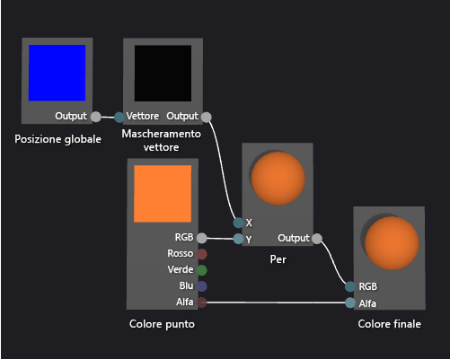

# Procedura: Creare uno shader con sfumatura basata sulla geometria
[!INCLUDE[vs2017banner](../code-quality/includes/vs2017banner.md)]

In questo documento viene illustrato come utilizzare la finestra di Progettazione shader e il linguaggio DGSL per creare uno shader di sfumatura basato sulla geometria.  Questo pixel ridimensiona un valore costante di colore RGB in base all'altezza di ciascun punto di un oggetto nello spazio globale.  
  
 In questo documento vengono illustrate queste attività:  
  
-   Aggiunta di nodi a un grafico shader  
  
-   Impostazione delle proprietà del nodo  
  
-   Disconnessione di nodi  
  
-   Connessione di nodi  
  
## Creazione di uno shader di sfumatura basato sulla geometria  
 È possibile implementare uno shader basato sulla geometria incorporando la posizione del pixel nello shader.  Nei linguaggi di ombreggiatura, un pixel contiene più informazioni rispetto al solo colore e posizione sullo schermo bidimensionale.  Un pixel, noto come un *frammento* in alcuni sistemi, è una raccolta di valori che descrivono la superficie che corrisponde a un pixel.  Lo shader descritto in questo documento utilizza l'altezza di ogni pixel di un oggetto 3D nello spazio globale per influire sul colore di output finale del frammento.  
  
 Prima di iniziare, assicurarsi che la finestra **Proprietà** e la **casella degli strumenti** siano visualizzate.  
  
#### Per creare uno shader di sfumatura basato sulla geometria  
  
1.  Creare uno shader DGSL da utilizzare.  Per informazioni su come aggiungere uno shader DGSL al progetto, vedere la sezione della Guida introduttiva in [Finestra di progettazione shader](../designers/shader-designer.md).  
  
2.  Disconnettere il nodo **Colore punto** dal nodo **Colore finale**.  Scegliere il terminale **RGB** del nodo **Colore punto**, quindi scegliere **Interrompi collegamenti**.  In questo modo si crea lo spazio per il nodo che viene aggiunto nel passaggio successivo.  
  
3.  Aggiungere un nodo **Moltiplica** al grafico.  Nella **Casella degli strumenti** in **Matematica** selezionare **Per** e spostarlo nell'area di progettazione.  
  
4.  Aggiungere un nodo **Mascheramento vettore** al grafico.  Nella **Casella degli strumenti** in **Utilità** selezionare **Mascheramento vettore** e spostarla nell'area di progettazione.  
  
5.  Specificare i valori di maschera per il nodo **Mascheramento vettore**.  In modalità **Seleziona** selezionare il nodo **Mascheramento vettore**, quindi nella finestra **Proprietà**, impostare la proprietà **Verde \/ Y** su **True**. Impostare quindi le proprietà **Rosso \/ X**, **Blu \/ Z** e **Alfa \/ W** su **False**.  In questo esempio, le proprietà **Rosso \/ X**, **Verde \/ Y** e **Blu \/ Z** corrispondono ai componenti x, y e z del nodo **Posizione globale** e **Alfa \/ W** non viene utilizzato.  Poiché solo **Verde \/ Y** è impostato su **True**, solo il componente y del vettore di input rimane dopo che è stato mascherato.  
  
6.  Aggiungere un nodo **Posizione globale** al grafico.  Nella **Casella degli strumenti** in **Costanti** selezionare **Posizione globale** e spostarlo nell'area di progettazione.  
  
7.  Mascherare la posizione dello spazio globale del frammento.  In modalità **Seleziona** spostare il terminale **Output** del nodo **Posizione globale** nel terminale **Vettore** del nodo **Mascheramento vettore**.  Questa connessione maschera la posizione del frammento per ignorare i componenti x e z.  
  
8.  Moltiplicare la costante di colore RGB per la posizione mascherata dello spazio globale.  Spostare il terminale **RGB** del nodo **Colore punto** nel terminale **Y** del nodo **Per**, quindi spostare il terminale **Output** del nodo **Mascheramento vettore** nel terminale **X** del nodo **Per**.  Questa connessione ridimensiona il valore del colore in base all'altezza del pixel nello spazio globale.  
  
9. Connettere il valore del colore scalato al colore finale.  Spostare il terminale **Output** del nodo **Moltiplicazione** nel terminale **RGB** del nodo **Colore finale**.  
  
 Nella figura seguente viene mostrato il grafico di shader completato e un'anteprima dello shader applicato a una sfera.  
  
> [!NOTE]
>  In questa illustrazione è specificato un colore arancione per illustrare meglio l'effetto dello shader, ma poiché la forma di anteprima non dispone di una posizione nello spazio globale, lo shader non può essere visualizzato completamente in anteprima nella finestra Progettazione shader.  Lo shader deve essere visualizzato in anteprima in una scena reale per mostrare l'effetto completo.  
  
   
  
 Alcune forme potrebbero fornire anteprime ottimizzate per alcuni pixel.  Per ulteriori informazioni su come visualizzare in anteprima gli shader nella finestra di Progettazione shader, vedere **Visualizzare in anteprima gli shader** in [Finestra di progettazione shader](../designers/shader-designer.md).  
  
 Nella figura seguente viene illustrato lo shader descritto in questo documento applicato alla scena tridimensionale mostrata in [Procedura: Modellare un modello tridimensionale](../designers/how-to-model-3-d-terrain.md).  L'intensità del colore aumenta con l'altezza del punto nel contenitore World.  
  
   
  
 Per ulteriori informazioni su come applicare uno shader a un modello tridimensionale, vedere [Procedura: Applicare uno shader a un modello tridimensionale](../designers/how-to-apply-a-shader-to-a-3-d-model.md).  
  
## Vedere anche  
 [Procedura: Applicare uno shader a un modello tridimensionale](../designers/how-to-apply-a-shader-to-a-3-d-model.md)   
 [Procedura: Esportare uno shader](../designers/how-to-export-a-shader.md)   
 [Procedura: Modellare un modello tridimensionale](../designers/how-to-model-3-d-terrain.md)   
 [Procedura: Creare uno shader con trama in scala di grigi](../designers/how-to-create-a-grayscale-texture-shader.md)   
 [Finestra di progettazione shader](../designers/shader-designer.md)   
 [Nodi della finestra di progettazione shader](../designers/shader-designer-nodes.md)