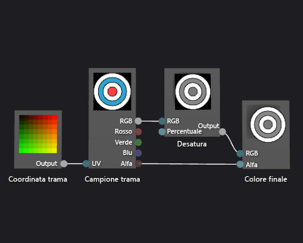

# Procedura: Creare uno shader con trama in scala di grigi
Questo documento illustra come usare la finestra di progettazione shader e il linguaggio DGSL (Directed Graph Shader Language) per creare uno shader con trama in scala di grigi. Questo shader modifica il valore di colore RGB del campione di trama e lo usa insieme al valore alfa invariato per impostare il colore finale.  
  
## Creazione di uno shader con trama in scala di grigi  
 È possibile implementare uno shader con trama in scala di grigi modificando il valore di colore di un campione di trama prima di scriverlo nel colore di output finale.  
  
 Prima di iniziare, assicurarsi che siano visualizzate la finestra **Proprietà** e la **casella degli strumenti**.  
  
#### Per creare uno shader con trama in scala di grigi  
  
1.  Creare uno shader con trama di base, come descritto in [Procedura: Creare uno shader con trama di base](../designers/how-to-create-a-basic-texture-shader.md).  
  
2.  Scollegare il terminale **RGB** del nodo **Campione trama** dal terminale **RGB** del nodo **Colore finale**. In modalità **Seleziona** scegliere il terminale **RGB** del nodo **Campione trama** e quindi scegliere **Interrompi collegamenti**. In questo modo si crea lo spazio per il nodo che viene aggiunto nel passaggio successivo.  
  
3.  Aggiungere un nodo **Desatura** al grafico. Nella **casella degli strumenti**, in **Filtri**, selezionare **Desatura** e spostarlo nell'area di progettazione.  
  
4.  Calcolare il valore della scala di grigi usando il nodo **Desatura**. In modalità **Seleziona** spostare il terminale **RGB** del nodo **Campione trama** nel terminale **RGB** del nodo **Desatura**.  
  
    > [!NOTE]
    >  Per impostazione predefinita, il nodo **Desatura** desatura completamente il colore di input e usa i valori di luminanza standard per la conversione in scala di grigi. È possibile modificare il comportamento del nodo**Desatura** modificando il valore della proprietà **Luminanza** o desaturando parzialmente il colore di input. Per desaturare parzialmente il colore di input, immettere un valore scalare compreso nell'intervallo [0,1) nel terminale **Percentuale**  del nodo **Desatura**.  
  
5.  Collegare il valore del colore in scala di grigi al colore finale. Spostare il terminale **Output** del nodo **Desatura** nel terminale **RGB** del nodo **Colore finale**.  
  
 La figura seguente illustra il grafico shader completato e un'anteprima dello shader applicato a un cubo.  
  
> [!NOTE]
>  In questa illustrazione, viene utilizzato un piano come forma di anteprima ed è stata specificata una trama per illustrare meglio l'effetto dello shader.  
  
   
  
 Alcune forme potrebbero produrre anteprime migliori per alcuni shader. Per altre informazioni su come visualizzare in anteprima gli shader nella finestra di progettazione shader, vedere [Finestra di progettazione shader](../designers/shader-designer.md).  
  
## Vedere anche  
 [Procedura: Applicare uno shader a un modello 3D](../designers/how-to-apply-a-shader-to-a-3-d-model.md)   
 [Procedura: Esportare uno shader](../designers/how-to-export-a-shader.md)   
 [Editor di immagini](../designers/image-editor.md)   
 [Finestra di progettazione shader](../designers/shader-designer.md)   
 [Nodi della finestra di progettazione shader](../designers/shader-designer-nodes.md)