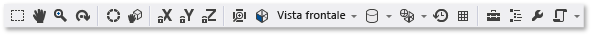

# Editor modello
[!INCLUDE[vs2017banner](../code-quality/includes/vs2017banner.md)]

In questo documento viene descritto come utilizzare l'editor modello di [!INCLUDE[vsprvs](../code-quality/includes/vsprvs_md.md)] per visualizzare, creare e modificare modelli 3D.  
  
 È possibile utilizzare l'editor modello per creare modelli 3D di base completamente nuovi o per visualizzare e modificare modelli 3D più complessi creati utilizzando strumenti di modellazione 3D completi.  L'editor modello supporta diversi formati di modelli 3D utilizzati nello sviluppo di applicazioni DirectX.  
  
## Formati supportati  
 L'editor modello supporta i formati di modello indicati di seguito.  
  
|Nome del formato|Estensione file|Operazioni supportate \(visualizzazione, modifica, creazione\)|  
|----------------------|---------------------|--------------------------------------------------------------------|  
|File di interscambio AutoDesk FBX|.fbx|Visualizzazione, modifica, creazione|  
|File Collada DAE|.dae|Visualizzazione, modifica \(le modifiche ai file Collada DAE vengono salvate utilizzando il formato FBX\).|  
|OBJ|.obj|Visualizzazione, modifica \(le modifiche ai file OBJ vengono salvate utilizzando il formato FBX\).|  
  
## Guida introduttiva  
 In questa sezione viene descritto come aggiungere un modello 3D al progetto [!INCLUDE[vsprvs](../code-quality/includes/vsprvs_md.md)] e vengono fornite informazioni introduttive di base.  
  
#### Per aggiungere un modello 3D al progetto  
  
1.  In **Esplora soluzioni** aprire il menu di scelta rapida del progetto a cui si desidera aggiungere l'immagine, quindi scegliere **Aggiungi**, **Nuovo elemento**.  
  
2.  In **Installato** all'interno della finestra di dialogo **Aggiungi nuovo elemento** selezionare **Grafica**, quindi **Scena 3D \(.fbx\)**.  
  
3.  Specificare il **nome** del file del modello e il **percorso** in cui crearlo.  
  
4.  Scegliere il pulsante **Aggiungi**.  
  
### Orientamento asse  
 In [!INCLUDE[vsprvs](../code-quality/includes/vsprvs_md.md)] è supportato qualsiasi orientamento dell'asse 3D e vengono caricate le informazioni di orientamento dell'asse dai formati del file di modello che lo supportano.  Se non viene specificato alcun orientamento di asse, in [!INCLUDE[vsprvs](../code-quality/includes/vsprvs_md.md)] viene utilizzato il sistema di coordinate di destra per impostazione predefinita.  L'**indicatore di asse** mostra l'orientamento dell'asse corrente nell'angolo inferiore destro dell'area di progettazione.  Nell'**indicatore di asse** il rosso rappresenta l'asse x, il verde indica l'asse y e il blu indica l'asse z.  
  
### Prime fasi di creazione del modello 3D  
 Nell'editor modello ogni nuovo oggetto inizia sempre come una delle forme 3D di base, o *primitive*, compilate nell'editor modello.  Per creare oggetti nuovi e univoci, aggiungere una primitiva alla scena e quindi alterarne la forma modificandone i vertici.  Per le forme complesse, aggiungere ulteriori vertici mediante estrusione o suddivisione e quindi modificandoli.  Per informazioni su come aggiungere un oggetto primitivo alla scena, vedere [Creazione e importazione di oggetti 3D](#Adding3DObjects).  Per informazioni su come aggiungere altri vertici a un oggetto, vedere [Modificare oggetti](#ModifyingObjects).  
  
## Utilizzo dell'editor modello  
 Nelle sezioni seguenti viene descritto come utilizzare l'editor modello per lavorare con modelli 3D.  
  
### Barre degli strumenti dell'editor modello  
 Le barre degli strumenti dell'editor modello contengono i comandi che consentono di lavorare con i modelli 3D.  
  
 I comandi che influiscono sullo stato dell'editor modello si trovano nella barra degli strumenti **Modalità editor modello** della finestra principale di [!INCLUDE[vsprvs](../code-quality/includes/vsprvs_md.md)].  Gli strumenti di modellazione e i comandi basati su script si trovano nella barra degli strumenti **Editor modello** nell'area di progettazione dell'editor modello.  
  
 Di seguito viene riportata la barra degli strumenti **Modalità editor modello**.  
  
   
  
 In questa tabella vengono descritti gli elementi nella barra degli strumenti **Modalità editor modello**, nell'ordine in cui appaiono da sinistra verso destra.  
  
|Elemento della barra degli strumenti|Descrizione|  
|------------------------------------------|-----------------|  
|**Seleziona**|Consente di selezionare i punti, i bordi, le facce oppure gli oggetti nella scena, a seconda della modalità di selezione attiva.|  
|**Dettaglio**|Consente lo spostamento di una scena 3D relativa alla cornice della finestra.  Per visualizzare una panoramica, selezionare un punto nella scena e spostarlo nell'area circostante.   In modalità **Seleziona** è possibile tenere premuto CTRL per attivare temporaneamente la modalità **Panoramica**.|  
|**Zoom**|Consente la visualizzazione di un numero maggiore o minore di dettagli della scena a seconda della cornice della finestra.  In modalità **Zoom** selezionare un punto nella scena, quindi spostarlo a destra o in basso per eseguire lo zoom avanti oppure a sinistra o in basso per eseguire lo zoom indietro.   In modalità **Seleziona** è possibile eseguire lo zoom avanti o indietro utilizzando la rotellina del mouse mentre si tiene premuto CTRL.|  
|**Orbita**|Posiziona la visualizzazione in un percorso circolare intorno all'oggetto selezionato.  Se non è selezionato alcun oggetto, il percorso viene centrato nell'origine della scena. **Note:**  Questa modalità non ha effetto se è abilitata la proiezione di tipo **Ortografico**.|  
|**WorldLocal**|Se questo elemento è abilitato, le trasformazioni sull'oggetto selezionato si verificano nello spazio globale.  In caso contrario, le trasformazioni sull'oggetto selezionato si verificano nello spazio locale.|  
|**Modalità perno**|Se questo elemento è abilitato, le trasformazioni incidono sulla posizione e sull'orientamento del *punto di perno* dell'oggetto selezionato \(il punto di perno definisce il centro delle operazioni di traslazione, ridimensionamento e rotazione\). In caso contrario, le trasformazioni incidono sulla posizione e sull'orientamento della geometria dell'oggetto, rispetto al punto di perno.|  
|**Blocca asse X**|Limita la manipolazione dell'oggetto all'asse x.  Si applica solo se si utilizza la parte centrale del widget del manipolatore.|  
|**Blocca asse Y**|Limita la manipolazione dell'oggetto all'asse y.  Si applica solo se si utilizza la parte centrale del widget del manipolatore.|  
|**Blocca asse Z**|Limita la manipolazione dell'oggetto all'asse z.  Si applica solo se si utilizza la parte centrale del widget del manipolatore.|  
|**Oggetto frame**|All'oggetto selezionato viene aggiunto un frame in modo che sia posizionato al centro della visualizzazione.|  
|**Visualizzazione**|Imposta l'orientamento di visualizzazione.  Di seguito sono riportati gli orientamenti disponibili.   **Fronte**  Posiziona la visualizzazione davanti alla scena.   **Indietro**  Posiziona la visualizzazione dietro la scena.   **A sinistra**  Posiziona la visualizzazione a sinistra della scena.   **A destra**  Posiziona la visualizzazione a destra della scena.   **In alto**  Posiziona la visualizzazione al di sopra della scena.   **Bottom**  Posiziona la visualizzazione al di sotto della scena. **Note:**  Si tratta dell'unico modo per modificare la direzione di visualizzazione quando è abilitata la proiezione di tipo **Ortografico**.|  
|**Proiezione**|Imposta il tipo di proiezione utilizzato per disegnare la scena.  Di seguito sono riportate le proiezioni disponibili.   **Prospettiva**  Nella proiezione Prospettiva gli oggetti più lontani dal punto di vista appaiono di dimensioni inferiori e convergono in un punto a distanza.   **Ortogonale**  Nella proiezione Ortografico gli oggetti sembrano avere le stesse dimensioni, indipendentemente dalla distanza dal punto di vista.  Non viene visualizzata alcuna convergenza.  Quando la proiezione di tipo **Ortografico** è attivata, non è possibile utilizzare la modalità **Orbita** per posizionare la visualizzazione.|  
|**Stile di disegno**|Imposta la modalità di rendering degli oggetti nella scena.  Di seguito sono riportati gli stili disponibili.   **Gabbia metallica**  Se abilitata, gli oggetti vengono sottoposti a rendering come wireframe.   **Carica**  Se abilitata, gli oggetti vengono sottoposti a rendering utilizzando una sfumatura aggiuntiva.  È possibile utilizzare questa opzione per visualizzare la quantità di carica presente nella scena.   **Ombreggiato semplice**  Se abilitata, gli oggetti vengono sottoposti a rendering utilizzando un modello di illuminazione di base con ombreggiatura semplice.  È possibile utilizzare questa opzione per visualizzare più agevolmente le facce di un oggetto.   Se nessuna di queste opzioni è abilitata, per ogni oggetto viene eseguito il rendering utilizzando il materiale a esso applicato.|  
|**Modalità rendering in tempo reale**|Se è abilitato il rendering in tempo reale, in [!INCLUDE[vsprvs](../code-quality/includes/vsprvs_md.md)] viene ridisegnata l'area di progettazione, anche se non viene eseguita alcuna azione da parte dell'utente.  Questa modalità è utile se si utilizzano shader mutevoli nel tempo.|  
|**Attiva\/Disattiva griglia**|Se questo elemento è abilitato, verrà visualizzata una griglia.  In caso contrario, non verrà visualizzata.|  
|**Casella degli strumenti**|Verrà mostrata o nascosta la finestra **Casella degli strumenti**.|  
|**Struttura documento**|Verrà mostrata o nascosta la finestra **Struttura documento**.|  
|**Proprietà**|Verrà mostrata o nascosta la finestra **Proprietà**.|  
|**Avanzate**|Contiene opzioni e comandi avanzati.   **Motori grafica**   **Rendering con D3D11**  Utilizza Direct3D 11 per il rendering dell'area di progettazione dell'editor modello.   **Rendering con D3D11WARP**  Utilizza la piattaforma WARP \(Windows Advanced Rasterization Platform\) di Direct3D 11 per il rendering dell'area di progettazione dell'editor modello.   **Gestione della scena**   **Importa**  Importa oggetti da un altro file di modello 3D nella scena corrente.   **Connetti al padre**  Stabilisce il primo di più oggetti selezionati come padre degli oggetti selezionati rimanenti.   **Disconnetti dal padre**  Disconnette l'oggetto selezionato dal padre.  L'oggetto selezionato diverrà un *oggetto radice* nella scena.  Un oggetto radice non dispone di un oggetto padre.   **Crea gruppo**  Raggruppa gli oggetti selezionati come oggetti di pari livello.   **Merge di oggetti**  Combina gli oggetti selezionati in un oggetto.   **Crea oggetto da selezione poligono**  Rimuove le facce selezionate dall'oggetto corrente e aggiunge alla scena un nuovo oggetto contenente tali facce.   **Strumenti**   **Capovolgi vertici del poligono**  Capovolge i poligoni selezionati in modo da invertire l'ordine dei vertici e la normale alla superficie.   **Rimuovi tutta l'animazione**  Rimuove i dati di animazione dagli oggetti.   **Triangolazione**  Converte l'oggetto selezionato in triangoli.   **Visualizzazione**   Eliminazione della faccia posteriore  Abilita o disabilita l'eliminazione della faccia posteriore.   **Frequenza dei fotogrammi**  Visualizza la frequenza dei fotogrammi nell'angolo superiore destro dell'area di progettazione.  La frequenza dei fotogrammi è il numero di fotogrammi disegnati al secondo.   Questa opzione è utile quando si abilita l'opzione **Modalità rendering in tempo reale**.   **Mostra tutto**  Mostra tutti gli oggetti nella scena.  Questa opzione reimposta la proprietà **Nascosto** di ogni oggetto su **False**.   **Mostra normali facce**  Mostra la normale di ciascuna faccia.   **Mostra materiali**  Visualizza una trama speciale sugli oggetti a cui non è assegnato un materiale.   **Mostra perno**  Abilita o disabilita la visualizzazione di un marcatore di asse 3D nel punto di perno della selezione attiva.   **Mostra nodi segnaposto**  Mostra i nodi segnaposto.  Viene creato un nodo segnaposto quando si raggruppano oggetti.   **Mostra normali vertici**  Mostra la normale di ciascun vertice. **Tip:**  È possibile selezionare il pulsante **Script** per eseguire nuovamente l'ultimo script.|  
  
 Di seguito è illustrata la barra degli strumenti **Editor modello**.  
  
   
  
 Nella tabella successiva vengono descritti gli elementi nella barra degli strumenti **Editor modello**, elencati in ordine di visualizzazione dall'alto verso il basso.  
  
|Elemento della barra degli strumenti|Descrizione|  
|------------------------------------------|-----------------|  
|**Traduci**|Sposta la selezione.|  
|**Scala**|Modifica la dimensione della selezione.|  
|**Ruota**|Ruota la selezione.|  
|**Seleziona punto**|Imposta la **modalità selezione** per selezionare singoli punti in un oggetto.|  
|**Seleziona bordo**|Imposta la **modalità selezione** per selezionare un bordo \(una linea tra due vertici\) in un oggetto.|  
|**Seleziona icona**|Imposta la **modalità selezione** per selezionare una faccia in un oggetto.|  
|**Seleziona oggetto**|Imposta la **modalità selezione** per selezionare un intero oggetto.|  
|**Estrudi**|Crea una faccia aggiuntiva e la collega alla faccia selezionata.|  
|**Suddividi**|Divide ciascuna faccia selezionata in più facce.  Per creare le nuove facce, vengono aggiunti nuovi vertici, uno al centro della faccia originale e uno in mezzo a ciascun bordo, quindi vengono uniti ai vertici originali.  Il numero di facce aggiunte è uguale al numero dei bordi nella faccia originale.|  
  
### Controllo della visualizzazione  
 Per la scena 3D viene eseguito il rendering in base alla visualizzazione, che può essere considerata una fotocamera virtuale con una posizione e un orientamento.  Per modificare la posizione e l'orientamento, utilizzare i controlli di visualizzazione della barra degli strumenti **Modalità editor modello**.  
  
 Nella tabella indicata di seguito vengono descritti i controlli di visualizzazione principali.  
  
|Controllo di visualizzazione|Descrizione|  
|----------------------------------|-----------------|  
|**Dettaglio**|Consente lo spostamento di una scena 3D relativa alla cornice della finestra.  Per visualizzare una panoramica, selezionare un punto nella scena e spostarlo nell'area circostante.   In modalità **Seleziona** è possibile tenere premuto CTRL per attivare temporaneamente la modalità **Panoramica**.|  
|**Zoom**|Consente la visualizzazione di un numero maggiore o minore di dettagli della scena a seconda della cornice della finestra.  In modalità **Zoom** selezionare un punto nella scena, quindi spostarlo a destra o in basso per eseguire lo zoom avanti oppure a sinistra o in basso per eseguire lo zoom indietro.   In modalità **Seleziona** è possibile eseguire lo zoom avanti o indietro utilizzando la rotellina del mouse mentre si tiene premuto CTRL.|  
|**Orbita**|Posiziona la visualizzazione in un percorso circolare intorno all'oggetto selezionato.  Se non è selezionato alcun oggetto, il percorso viene centrato nell'origine della scena. **Note:**  Questa modalità non ha effetto se è abilitata la proiezione di tipo **Ortografico**.|  
|**Oggetto frame**|All'oggetto selezionato viene aggiunto un frame in modo che sia posizionato al centro della visualizzazione.|  
  
 La visualizzazione viene determinata dalla fotocamera virtuale, ma è definita anche da una proiezione.  La proiezione definisce la modalità di conversione in pixel di forme e oggetti nella visualizzazione nell'area di progettazione.  Nella barra degli strumenti **Editor modello** è possibile scegliere una proiezione di tipo **Prospettiva** oppure **Ortografico**.  
  
|Proiezione|Descrizione|  
|----------------|-----------------|  
|**Prospettiva**|Nella proiezione Prospettiva gli oggetti più lontani dal punto di vista appaiono di dimensioni inferiori e convergono in un punto a distanza.|  
|**Ortogonale**|Nella proiezione Ortografico gli oggetti sembrano avere le stesse dimensioni, indipendentemente dalla distanza dal punto di vista.  Non viene visualizzata alcuna convergenza.  Se è abilitata la proiezione di tipo **Ortografico**, non è possibile utilizzare la modalità **Orbita** per posizionare arbitrariamente la visualizzazione.|  
  
 Può essere utile visualizzare una scena 3D da una posizione e un angolo noti, ad esempio se si desidera confrontare due scene simili.  Per questo scenario, l'editor modello offre diverse visualizzazioni predefinite.  Per utilizzare una visualizzazione predefinita, nella barra degli strumenti **Modalità editor modello** scegliere **Visualizza**, quindi selezionare la visualizzazione predefinita desiderata: anteriore, posteriore, sinistra, destra, superiore o inferiore.  In queste visualizzazioni la fotocamera virtuale punta direttamente all'origine della scena.  Ad esempio, se si sceglie **Vista dall'alto**, la fotocamera virtuale punta all'origine della scena direttamente al di sopra di essa.  
  
### Visualizzazione di dettagli aggiuntivi sulla geometria  
 Per comprendere meglio un oggetto o una scena 3D, è possibile visualizzare dettagli aggiuntivi sulla geometria, quali normali per singolo vertice, normali per singola faccia, punti di perno della selezione attiva e così via.  Per abilitarli o disabilitarli, nella barra degli strumenti **Editor modello** scegliere **Script**, **Visualizza**, quindi selezionare l'opzione desiderata.  
  
###   Creazione e importazione di oggetti 3D  
 Per aggiungere una forma 3D predefinita alla scena, in **Casella degli strumenti** selezionare la forma desiderata e spostarla nell'area di progettazione.  All'origine della scena vengono posizionate nuove forme.  Nell'editor modello sono disponibili sette forme: **Cono**, **Cubo**, **Cilindro**, **Disco**, **Piano**, **Sfera** e **Teiera**.  
  
 Per importare un oggetto 3D da un file, nella barra degli strumenti **Editor modello** scegliere **Avanzate**, **Gestione della scena**, **Importa**, quindi specificare il file che si desidera importare.  
  
### Trasformare oggetti  
 È possibile *trasformare* un oggetto modificandone le proprietà **Rotazione**, **Scala** e **Traslazione**.  *Rotazione*: orienta un oggetto applicando successive rotazioni attorno all'asse x, all'asse y e all'asse z definiti dal punto di perno.  Ogni specifica di rotazione presenta tre componenti \(x, y e z, in questo ordine\) e i componenti vengono specificati in gradi.  **Ridimensionamento**: ridimensiona un oggetto adattandolo di un fattore specificato lungo uno o più assi centrati sul punto di perno.  La *traslazione* individua un oggetto nello spazio tridimensionale rispetto al relativo padre, anziché al punto di perno.  
  
 È possibile trasformare un oggetto utilizzando strumenti di modellazione o impostando proprietà.  
  
##### Per trasformare un oggetto utilizzando strumenti di modellazione  
  
1.  In modalità **Seleziona** selezionare l'oggetto che si desidera trasformare.  Una sovrapposizione del wireframe indica che l'oggetto è stato selezionato.  
  
2.  Nella barra degli strumenti **Editor modello** scegliere lo strumento **Trasla**, **Scala** o **Ruota**.  Verrà visualizzato un manipolatore di traslazione, ridimensionamento o rotazione per l'oggetto selezionato.  
  
3.  Utilizzare il manipolatore per eseguire la trasformazione.  Per le trasformazioni di traslazione e ridimensionamento il manipolatore rappresenta un indicatore di asse.  È possibile modificare un asse per volta oppure tutti gli assi contemporaneamente utilizzando il cubo bianco al centro dell'indicatore.  Per la rotazione, il manipolatore è una sfera composta da cerchi con colori diversi che corrispondono all'asse x \(rosso\), all'asse y \(verde\) e all'asse z \(blu\).  È necessario modificare separatamente ogni asse per creare la rotazione desiderata.  
  
##### Per trasformare un oggetto impostandone le proprietà  
  
1.  In modalità **Seleziona** selezionare l'oggetto che si desidera trasformare.  Una sovrapposizione del wireframe indica che l'oggetto è stato selezionato.  
  
2.  Nella finestra **Proprietà** specificare i valori per le proprietà **Rotazione**, **Scala** e **Traslazione**.  
  
    > [!IMPORTANT]
    >  Per la proprietà **Rotazione** specificare il grado di rotazione attorno a ciascuno dei tre assi.  Le rotazioni vengono applicate in ordine; verificare pertanto di pianificare una rotazione partendo dall'asse x, proseguendo con l'asse y e infine con l'asse z.  
  
 Mediante gli strumenti di modellazione è possibile creare trasformazioni in modo rapido, ma approssimativo.  Impostando le proprietà dell'oggetto, è possibile specificare trasformazioni in modo preciso, ma non rapido.  È consigliabile utilizzare gli strumenti di modellazione per ottenere trasformazioni più simili a quelle desiderate e successivamente regolare i valori delle proprietà.  
  
 Se non si desidera utilizzare manipolatori, è possibile abilitare la modalità a mano libera.  Nella barra degli strumenti **Editor modello** scegliere **Script**, **Strumenti**, **Manipolazione a mano libera** per abilitare o disabilitare la modalità a mano libera.  Nella modalità a mano libera è possibile avviare una modifica in un punto qualsiasi dell'area di progettazione, anziché in un punto del manipolatore.  Nella modalità a mano libera è possibile vincolare le modifiche a determinati assi bloccando quelli che non si desidera modificare.  Nella barra degli strumenti **Modalità editor modello** scegliere qualsiasi combinazione di pulsanti **Blocco: X**, **Blocco: Y** e **Blocco: Z**.  
  
 Potrebbe essere utile utilizzare oggetti mediante aggancio alla griglia.  Nella barra degli strumenti **Modalità editor modello** scegliere **Snapping** per abilitare o disabilitare l'aggancio alla griglia.  Se è abilitata la funzione di aggancio alla griglia, le trasformazioni di traslazione, rotazione e ridimensionamento sono vincolate a incrementi predefiniti.  
  
### Utilizzo del punto di perno  
 Il punto di perno di un oggetto ne definisce il centro di rotazione e di ridimensionamento.  È possibile modificare il punto di perno di un oggetto per variare il modo in cui viene interessato dalle trasformazioni di rotazione e ridimensionamento.  Nella barra degli strumenti **Modalità editor modello** scegliere **Modalità perno** per abilitare o disabilitare tale modalità.  Se è abilitata la modalità perno, nel punto di perno dell'oggetto selezionato verrà visualizzato un piccolo indicatore di asse.  Sarà quindi possibile utilizzare gli strumenti **Traslazione** e **Rotazione** per modificare il punto di perno.  
  
 Per una dimostrazione in cui viene illustrato come utilizzare il punto di perno, vedere [Procedura: Modificare il punto pivot di un modello tridimensionale](../designers/how-to-modify-the-pivot-point-of-a-3-d-model.md).  
  
### Modalità locale e globale  
 La traslazione e la rotazione possono verificarsi nel sistema di coordinate locale \(o *frame di riferimento locale*\) dell'oggetto o nel sistema di coordinate globale \(o *frame di riferimento globale*\).  Il frame di riferimento globale è indipendente dalla rotazione dell'oggetto.  La modalità locale è quella predefinita.  Per abilitare o disabilitare la modalità globale, nella barra degli strumenti **Modalità editor modello** scegliere il pulsante **WorldLocal**.  
  
###   Modificare oggetti  
 È possibile modificare la forma di un oggetto 3D spostandone o eliminandone vertici, bordi e facce.  Per impostazione predefinita, l'editor modello è in *modalità oggetto*, pertanto è possibile selezionare e trasformare interi oggetti.  Per selezionare punti, bordi o facce, scegliere la modalità di selezione appropriata.  Nella barra degli strumenti **Modalità editor modello** fare clic su **Modalità selezione**, quindi scegliere la modalità desiderata.  
  
 È possibile creare vertici aggiuntivi per estrusione o suddivisione.  L'estrusione duplica i vertici di una faccia \(un set complanare di vertici\) che rimangono collegati tramite i vertici duplicati.  La suddivisione aggiunge vertici per creare diverse facce laddove ne era presente solamente una.  Per creare le nuove facce, vengono aggiunti nuovi vertici, uno al centro della faccia originale e uno in mezzo a ciascun bordo, quindi vengono uniti ai vertici originali.  Il numero di facce aggiunte è uguale al numero dei bordi nella faccia originale.  In entrambi i casi è possibile traslare, ruotare e ridimensionare i nuovi vertici per modificare la geometria dell'oggetto.  
  
##### Per estrudere una faccia da un oggetto  
  
1.  In modalità di selezione delle facce, selezionare la faccia che si desidera estrudere.  
  
2.  Nella barra degli strumenti **Editor modello** scegliere **Script**, **Strumenti**, **Estrudi**.  
  
##### Per suddividere facce  
  
1.  In modalità di selezione delle facce, selezionare le facce che si desidera suddividere.  Poiché la suddivisione crea nuovi dati di bordo, la suddivisione immediata di tutte le facce fornisce risultati più coerenti se le facce sono adiacenti.  
  
2.  Nella barra degli strumenti **Editor modello** scegliere **Script**, **Strumenti**, **Suddividi**.  
  
 È inoltre possibile triangolare facce, eseguire il merge di oggetti e convertire selezioni di poligoni in nuovi oggetti.  La triangolazione crea bordi aggiuntivi in modo che una faccia non triangolare venga convertita in un numero ottimale di triangoli. Questa funzionalità non fornisce tuttavia dettagli geometrici aggiuntivi.  L'azione di merge combina gli oggetti selezionati in un oggetto.  Nuovi oggetti possono essere creati da una selezione di poligoni.  
  
##### Per triangolare una faccia  
  
1.  In modalità di selezione delle facce, selezionare la faccia di cui si desidera eseguire la triangolazione.  
  
2.  Nella barra degli strumenti **Editor modello** scegliere **Script**, **Strumenti**, **Triangolazione**.  
  
##### Per eseguire il merge di oggetti  
  
1.  In modalità di selezione degli oggetti, selezionare gli oggetti di cui si desidera eseguire il merge.  
  
2.  Nella barra degli strumenti **Editor modello** scegliere **Script**, **Strumenti**, **Merge di oggetti**.  
  
##### Per creare un oggetto da una selezione di poligoni  
  
1.  In modalità di selezione delle facce, selezionare le facce da cui si desidera creare un nuovo oggetto.  
  
2.  Nella barra degli strumenti **Editor modello** scegliere **Script**, **Strumenti**, **Crea oggetto da selezione poligono**.  
  
### Utilizzo di materiali e shader  
 L'aspetto di un oggetto è determinato dall'interazione dell'illuminazione nella scena e dal materiale dell'oggetto.  I materiali vengono definiti dalle proprietà che descrivono in che modo la superficie risponde a tipi diversi di luci e da un programma di shader che calcola il colore finale di ogni pixel nell'area dell'oggetto in base alle informazioni di illuminazione, alle mappe della trama, alle mappe normali e ad altri dati.  
  
 L'editor modello fornisce i materiali predefiniti indicati di seguito.  
  
|Materiale|Descrizione|  
|---------------|-----------------|  
|Non illuminato|Esegue il rendering di una superficie senza illuminazione simulata.|  
|Lambert|Esegue il rendering di un'area con luce di ambiente simulata e illuminazione diffusa.|  
|Phong|Esegue il rendering di un'area con luce di ambiente simulata, illuminazione diffusa ed evidenziazioni speculari.|  
  
 A ognuno di questi materiali viene applicata una trama sulla superficie di un oggetto.  È possibile impostare una trama diversa per ogni oggetto che utilizza il materiale.  
  
 Per modificare il modo in cui un determinato oggetto risponde alle differenti sorgenti di luce nella scena, è possibile modificare le proprietà di illuminazione del materiale indipendentemente dagli altri oggetti che lo utilizzano.  In questa tabella vengono descritte le proprietà di illuminazione comuni.  
  
|Proprietà di illuminazione|Descrizione|  
|--------------------------------|-----------------|  
|Di ambiente|Descrive in che modo la superficie è interessata da luce ambientale.|  
|Diffusa|Descrive in che modo la superficie è interessata da luce direzionale e puntiforme.|  
|Emissiva|Descrive in che modo la superficie emette luce, indipendentemente da altre fonti di illuminazione.|  
|Speculare|Descrive in che modo la superficie riflette la luce direzionale e puntiforme.|  
|Potenza speculare|Descrive l'ampiezza e l'intensità delle evidenziazioni speculari.|  
  
 A seconda del materiale supportato, è possibile modificare le proprietà di illuminazione, le trame e altri dati.  In modalità **Seleziona** selezionare l'oggetto di cui si desidera modificare il materiale, quindi nella finestra **Proprietà** modificare **MaterialAmbient**, **MaterialDiffuse**, **MaterialEmissive**, **MaterialSpecular**, **MaterialSpecularPower** o un'altra proprietà disponibile.  Un materiale può esporre fino a otto trame, le cui proprietà vengono denominate in sequenza da **Texture1** a **Texture8**.  
  
 Per rimuovere tutti i materiali da un oggetto, nella barra degli strumenti **Editor modello** scegliere **Script**, **Materiali**, **Rimuovi materiali**.  
  
 È possibile utilizzare **Modalità progettazione shader** per creare materiali di shader personalizzati che è possibile applicare agli oggetti nella scena 3D.  Per ulteriori informazioni sulla creazione di materiali di shader personalizzati, vedere [Finestra di progettazione shader](../designers/shader-designer.md).  Per informazioni su come applicare un materiale di shader personalizzato a un oggetto, vedere [Procedura: Applicare uno shader a un modello tridimensionale](../designers/how-to-apply-a-shader-to-a-3-d-model.md).  
  
### Gestione della scena  
 È possibile gestire le scene come una gerarchia di oggetti.  Se in una gerarchia sono organizzati più oggetti, qualsiasi traslazione, ridimensionamento o rotazione di un nodo padre interessa anche i relativi figli.  Questa condizione risulta utile per costruire oggetti o scene complesse da oggetti più elementari.  
  
 È possibile utilizzare la finestra **Struttura documento** per visualizzare la gerarchia della scena e selezionare nodi.  Se si seleziona un nodo nella struttura, è possibile utilizzare la finestra **Proprietà** per modificarne le proprietà.  
  
 È possibile costruire una gerarchia di oggetti impostandone uno come padre degli altri o raggruppandoli insieme come pari livello in un nodo segnaposto che funge da padre.  
  
##### Per creare una gerarchia con un oggetto padre  
  
1.  Nella modalità **Seleziona** selezionare due o più oggetti.  Il primo oggetto selezionato sarà l'oggetto padre.  
  
2.  Nella barra degli strumenti **Editor modello** scegliere **Script**, **Gestione della scena**, **Connetti al padre**.  
  
##### Per creare una gerarchia di oggetti di pari livello  
  
1.  Nella modalità **Seleziona** selezionare due o più oggetti.  Viene creato un oggetto segnaposto, che diviene oggetto padre.  
  
2.  Nella barra degli strumenti **Editor modello** scegliere **Script**, **Gestione della scena**, **Crea gruppo**.  
  
 Nell'editor modello viene utilizzato un wireframe bianco per identificare il primo oggetto selezionato, che diviene il padre.  Altri oggetti della selezione presentano un wireframe blu.  Per impostazione predefinita, non vengono visualizzati i nodi segnaposto.  Per visualizzare i nodi segnaposto, nella barra degli strumenti **Editor modello** scegliere **Script**, **Gestione della scena**, **Mostra nodi segnaposto**.  È possibile utilizzare nodi segnaposto in modo analogo a qualsiasi oggetto di diverso tipo.  
  
 Per rimuovere l'associazione padre\-figlio tra due oggetti, selezionare l'oggetto figlio, quindi nella barra degli strumenti **Editor modello** scegliere **Script**, **Gestione della scena**, **Disconnetti dal padre**.  Quando si rimuove il padre da un oggetto figlio, quest'ultimo diventa un oggetto radice nella scena.  
  
## Tasti di scelta rapida  
  
|Comando|Tasti di scelta rapida|  
|-------------|----------------------------|  
|Passare alla modalità **Seleziona**.|CTRL\+G, CTRL\+Q   S|  
|Passare alla modalità **Zoom**.|CTRL\+G, CTRL\+Z   Z|  
|Passare alla modalità **Panoramica**.|CTRL\+G, CTRL\+P   K|  
|Selezionare tutto|CTRL\+A|  
|Eliminare la selezione corrente|Elimina|  
|Annullare la selezione corrente|Escape|  
|Zoom avanti|Rotellina del mouse avanti   CTRL\+rotellina del mouse avanti   MAIUSC\+rotellina del mouse avanti   CTRL\+PGSU   Segno più \(\+\)|  
|Zoom indietro|Rotellina del mouse indietro   CTRL\+rotellina del mouse indietro   MAIUSC\+rotellina del mouse indietro   CTRL\+PGGIÙ   Segno meno \(\-\)|  
|Panoramica della fotocamera verso l'alto|PGGIÙ|  
|Panoramica della fotocamera verso il basso|PGSU|  
|Panoramica della fotocamera verso sinistra|Rotellina del mouse a sinistra   CTRL\+PGGIÙ|  
|Panoramica della fotocamera verso destra|Rotellina del mouse verso destra   CTRL\+PGGIÙ|  
|Visualizzare il lato superiore del modello|CTRL\+L, CTRL\+T   T|  
|Visualizzare il lato inferiore del modello|CTRL\+L, CTRL\+U|  
|Visualizzare il lato sinistro del modello|CTRL\+L, CTRL\+L|  
|Visualizzare il lato destro del modello|CTRL\+L, CTRL\+R|  
|Visualizzare il lato anteriore del modello|CTRL\+L, CTRL\+F|  
|Visualizzare il lato posteriore del modello|CTRL\+L, CTRL\+B|  
|Oggetto frame nella finestra|F|  
|Abilitare\/Disabilitare la modalità wireframe|CTRL\+L, CTRL\+W|  
|Abilitare\/Disabilitare l'aggancio alla griglia|CTRL\+G, CTRL\+N|  
|Abilitare\/Disabilitare la modalità perno|CTRL\+G, CTRL\+V|  
|Abilitare\/Disabilitare la limitazione per l'asse x|CTRL\+L, CTRL\+X|  
|Abilitare\/Disabilitare la limitazione per l'asse y|CTRL\+L, CTRL\+Y|  
|Abilitare\/Disabilitare la limitazione per l'asse z|CTRL\+L, CTRL\+Z|  
|Passare alla modalità traslazione|CTRL\+G, CTRL\+W   W|  
|Passare alla modalità scala.|CTRL\+G, CTRL\+E   E|  
|Passare alla modalità rotazione.|CTRL\+G, CTRL\+R   R|  
|Passare alla modalità di selezione punti|CTRL\+L, CTRL\+1|  
|Passare alla modalità di selezione dei bordi|CTRL\+L, CTRL\+2|  
|Passare alla modalità di selezione delle facce|CTRL\+L, CTRL\+3|  
|Passare alla modalità di selezione degli oggetti|CTRL\+L, CTRL\+4|  
|Passare alla modalità orbita \(fotocamera\)|CTRL\+G, CTRL\+O|  
|Selezionare l'oggetto successivo nella scena|TAB|  
|Selezionare l'oggetto precedente nella scena|MAIUSC\+TAB|  
|Modifica l'oggetto selezionato in base allo strumento corrente.|Tasti freccia|  
|Disattivare il manipolatore corrente|Q|  
|Ruotare la fotocamera|ALT\+Trascinamento con il pulsante sinistro del mouse|  
  
## Argomenti correlati  
  
|Titolo|Descrizione|  
|------------|-----------------|  
|[Utilizzo di risorse tridimensionali per giochi e app](../designers/working-with-3-d-assets-for-games-and-apps.md)|Fornisce una panoramica degli strumenti [!INCLUDE[vsprvs](../code-quality/includes/vsprvs_md.md)] a cui attingere per poter utilizzare risorse grafiche, quali trame, immagini, modelli 3D ed effetti shader.|  
|[Editor immagini](../designers/image-editor.md)|Descrive come utilizzare l'editor di immagini di [!INCLUDE[vsprvs](../code-quality/includes/vsprvs_md.md)] con trame e immagini.|  
|[Finestra di progettazione shader](../designers/shader-designer.md)|Descrive come utilizzare Progettazione shader di [!INCLUDE[vsprvs](../code-quality/includes/vsprvs_md.md)] con shader.|