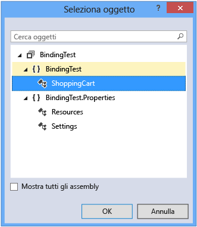
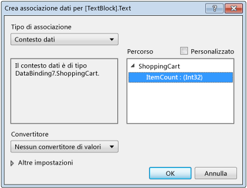

# Procedura dettagliata: Binding ai dati nella finestra di progettazione XAML
[!INCLUDE[vs2017banner](../code-quality/includes/vs2017banner.md)]

Nella finestra di progettazione XAML è possibile impostare le proprietà di data binding mediante la tavola da disegno e la finestra Proprietà.  Questa procedura dettagliata illustra come associare dati a un controllo.  In particolare, la procedura dettagliata illustra come creare una classe carrello semplice con un oggetto [DependencyProperty](http://msdn.microsoft.com/library/windows/apps/windows.ui.xaml.dependencyproperty.aspx) denominato `ItemCount` e quindi associare la proprietà `ItemCount` alla proprietà **Text** di un controllo [TextBlock](http://msdn.microsoft.com/library/windows/apps/windows.ui.xaml.controls.textblock.aspx).  
  
### Per creare una classe da usare come origine dati  
  
1.  Nel menu **File**, scegliere **Nuovo**, **Progetto**.  
  
2.  Nella finestra di dialogo **Nuovo progetto** scegliere il nodo **Visual C\#** o **Visual Basic**, espandere il nodo **Desktop di Windows** e quindi scegliere il modello **Applicazione WPF**.  
  
3.  Assegnare al progetto il nome BindingTest e quindi fare clic sul pulsante **OK**.  
  
4.  Aprire il file MainWindow.xaml.cs \(o MainWindow.xaml.vb\) e aggiungere il codice seguente.  In C\# aggiungere il codice nello spazio dei nomi `BindingTest` \(prima della parentesi chiusa finale nel file\).  In Visual Basic, è sufficiente aggiungere la nuova classe.  
  
    ```c#  
    public class ShoppingCart : DependencyObject  
    {  
        public int ItemCount  
        {  
            get { return (int)GetValue(ItemCountProperty); }  
            set { SetValue(ItemCountProperty, value); }  
        }  
  
        public static readonly DependencyProperty ItemCountProperty =  
             DependencyProperty.Register("ItemCount", typeof(int),  
             typeof(ShoppingCart), new PropertyMetadata(0));  
    }  
  
    ```  
  
    ```vb  
    Public Class ShoppingCart  
        Inherits DependencyObject  
  
        Public Shared ReadOnly ItemCountProperty As DependencyProperty = DependencyProperty.Register(  
            "ItemCount", GetType(Integer), GetType(ShoppingCart), New PropertyMetadata(0))  
        Public Property ItemCount As Integer  
            Get  
                ItemCount = CType(GetValue(ItemCountProperty), Integer)  
            End Get  
            Set(value As Integer)  
                SetValue(ItemCountProperty, value)  
            End Set  
        End Property  
    End Class  
    ```  
  
     Questo codice imposta un valore di 0 come numero predefinito di elementi usando l'oggetto [PropertyMetadata](http://msdn.microsoft.com/library/windows/apps/windows.ui.xaml.propertymetadata.aspx).  
  
5.  Dal menu **File** scegliere **Compila** e quindi **Compila soluzione**.  
  
### Per associare la proprietà ItemCount a un controllo TextBlock  
  
1.  In Esplora soluzioni aprire il menu di scelta rapida per MainWindow.xaml e scegliere **Progettazione visualizzazioni**.  
  
2.  Nella Casella degli strumenti scegliere un controllo [Grid](http://msdn.microsoft.com/library/windows/apps/windows.ui.xaml.controls.grid.aspx) e aggiungerlo al modulo.  
  
3.  Con il controllo `Grid` selezionato, nella finestra Proprietà fare clic sul pulsante **Nuovo** accanto alla proprietà **DataContext**.  
  
4.  Nella finestra di dialogo **Seleziona oggetto** verificare che la casella di controllo **Mostra tutti gli assembly** sia deselezionata, scegliere **ShoppingCart** nello spazio dei nomi **BindingTest** e quindi fare clic sul pulsante **OK**.  
  
     La figura seguente mostra la finestra di dialogo **Seleziona oggetto** con **ShoppingCart** selezionato.  
  
       
  
5.  Nella **Casella degli strumenti** scegliere un controllo `TextBlock` per aggiungerlo al modulo.  
  
6.  Con il controllo `TextBlock` selezionato, nella finestra Proprietà scegliere il marcatore della proprietà a destra della proprietà **Text** e quindi scegliere **Crea data binding**.  Il marcatore della proprietà ha l'aspetto di una piccola casella.  
  
7.  Nella casella **Percorso** della finestra di dialogo Crea data binding scegliere la proprietà **ItemCount : \(int32\)** e quindi fare clic sul pulsante **OK**.  
  
     La figura seguente mostra la finestra di dialogo **Crea data binding** con la proprietà **ItemCount** selezionata.  
  
       
  
8.  Premere F5 per eseguire l'app.  
  
     Il controllo `TextBlock` dovrebbe ora visualizzare il valore predefinito 0 come testo.  
  
## Vedere anche  
 [Creazione di un'interfaccia utente tramite XAML Designer](../designers/creating-a-ui-by-using-xaml-designer-in-visual-studio.md)   
 [NIB: Add Value Converter dialog box](http://msdn.microsoft.com/it-it/c5f3d110-a541-4b55-8bca-928f77778af8)