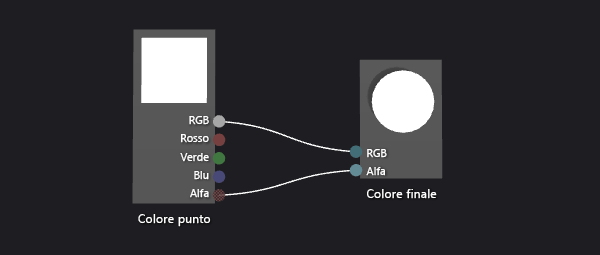
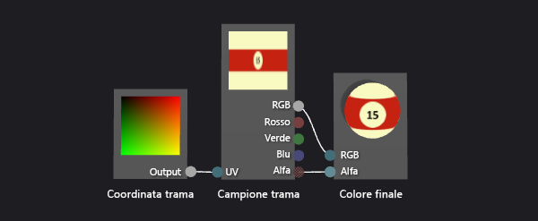
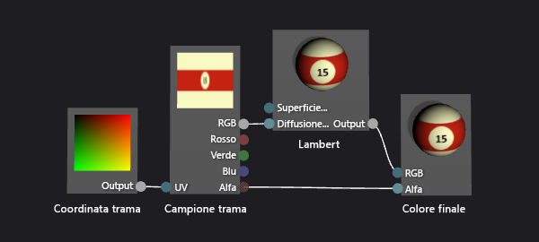
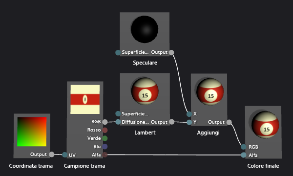
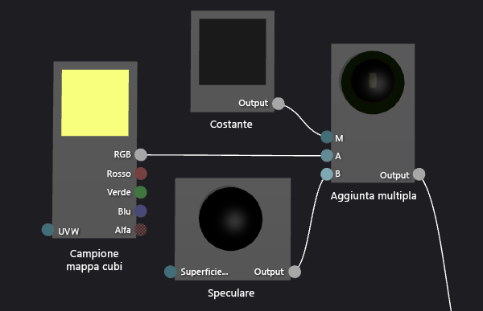
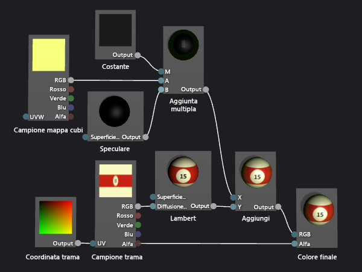

# Procedura dettagliata: creazione di una palla da biliardo tridimensionale realistica
[!INCLUDE[vs2017banner](../code-quality/includes/vs2017banner.md)]

In questa procedura dettagliata viene illustrato come creare una palla da biliardo tridimensionale realistica utilizzando la finestra di Progettazione shader e l'editor di immagini in [!INCLUDE[vsprvs](../code-quality/includes/vsprvs_md.md)].  L'aspetto tridimensionale della palla da biliardo viene raggiunto combinando diverse tecniche di shader con le risorse appropriate di trama.  
  
 In questo documento vengono illustrate queste attività:  
  
-   Creazione dell'aspetto di base di una palla da biliardo utilizzando la forma e la trama.  
  
-   Aggiunta di profondità tramite il modello di illuminazione Lambert.  
  
-   Miglioramento dell'aspetto di base tramite l'utilizzo delle evidenziazioni speculari.  
  
-   Creazione di un senso di spazio tramite il riflesso dell'ambiente.  
  
## Prerequisiti  
 Per completare questa procedura dettagliata, è necessario disporre dei seguenti componenti e abilità:  
  
-   Uno strumento per l'assembly di trame in un mapping del cubo, ad esempio lo strumento di trama DirectX è incluso in DirectX SDK del giugno 2010.  
  
-   Conoscenza dell'editor immagini in [!INCLUDE[vsprvs](../code-quality/includes/vsprvs_md.md)].  
  
-   Conoscenza della finestra di progettazione shader in [!INCLUDE[vsprvs](../code-quality/includes/vsprvs_md.md)].  
  
## Creazione dell'aspetto di base con la forma e la trama  
 In computer grafica gli elementi più semplici dell'aspetto sono forma e colore.  In una simulazione sul computer, è normale utilizzare un modello tridimensionale per rappresentare la forma di un oggetto reale.  Il dettaglio di colore viene quindi applicato alla superficie del modello tramite una mappa di trama.  
  
 In genere, potrebbe essere necessario chiedere a un esperto di creare un modello tridimensionale da poter utilizzare, ma poiché una palla da biliardo è una comune sfera, nella finestra di Progettazione shader è già incorporato un modello adeguato.  
  
 Una sfera è la forma di anteprima predefinita nella finestra di Progettazione shader. Se al momento si sta utilizzando una forma differente per visualizzare in anteprima lo shader, tornare alla sfera.  
  
#### Per visualizzare in anteprima lo shader utilizzando una sfera  
  
-   Sulla barra degli strumenti Progettazione shader scegliere **Anteprima con sfera.**  
  
 Nel prossimo passaggio verrà creato un programma shader che applica una trama al modello, ma è necessario innanzitutto creare una trama da utilizzare.  In questa procedura dettagliata viene illustrato come creare una trama utilizzando l'editor di immagini incluso in [!INCLUDE[vsprvs](../code-quality/includes/vsprvs_md.md)]. È tuttavia possibile utilizzare qualsiasi editor di immagini in grado di salvare la trama in un formato appropriato.  
  
 Verificare che le finestre **Proprietà** e **Casella degli strumenti** siano visualizzate.  
  
#### Per creare una trama palla da biliardo utilizzando l'editor di immagini  
  
1.  Creare una trama da utilizzare.  Per informazioni su come aggiungere una trama al progetto, vedere la sezione della Guida introduttiva in [Editor immagini](../designers/image-editor.md).  
  
2.  Impostare la dimensione immagine in modo che la larghezza sia due volte l'altezza. Questa operazione è necessaria a causa della modalità con cui viene eseguito il mapping di una trama sulla superficie sferica della palla da biliardo.  Per ridimensionare l'immagine, nella finestra **Proprietà** specificare i nuovi valori per le proprietà **Larghezza** e **Altezza**.  Ad esempio, impostare la larghezza su 512 e l'altezza su 256.  
  
3.  Disegnare una trama per la palla da biliardo, tenendo presente il modo in cui la trama viene mappata su una sfera.  
  
     La trama è analoga alla seguente:  
  
       
  
4.  Facoltativamente, è possibile ridurre i requisiti di archiviazione della trama.  È possibile eseguire questa operazione riducendo la larghezza della trama in modo che corrisponda all'altezza.  In questo modo la trama viene compressa lungo la larghezza, ma dal momento che la trama è mappata alla sfera, verrà espansa quando verrà eseguito il rendering della palla da biliardo.  Dopo il ridimensionamento, la trama è analoga alla seguente:  
  
       
  
 È ora possibile creare uno shader che applica questa trama al modello.  
  
#### Per creare uno shader di trama di base  
  
1.  Creare uno shader DGSL da utilizzare.  Per informazioni su come aggiungere uno shader DGSL al progetto, vedere la sezione della Guida introduttiva in [Finestra di progettazione shader](../designers/shader-designer.md).  
  
     Per impostazione predefinita, un grafico shader è simile al seguente:  
  
       
  
2.  Modificare lo shader predefinito in modo da applicare il valore di un esempio di trama al pixel corrente.  Il grafico di shader dovrebbe avere un aspetto simile al seguente:  
  
       
  
3.  Applicare la trama creata nella procedura precedente configurando le proprietà della trama.  Impostare il valore della proprietà **Trama** del nodo **Campione trama** su **Trama1**, quindi specificare il file di trama utilizzando la proprietà **Nome file** del gruppo di proprietà **Trama1** nella stessa finestra della proprietà.  
  
 Per ulteriori informazioni su come applicare una trama allo shader, vedere [Procedura: Creare uno shader con trama di base](../designers/how-to-create-a-basic-texture-shader.md).  
  
 Il codice dovrebbe ora risultare simile al seguente:  
  
   
  
## Creazione di profondità con il modello di illuminazione Lambert  
 Pertanto, è stata creata una palla da biliardo facilmente riconoscibile.  Tuttavia, appare piana e non interessante \(più simile un'immagine di un fumetto di una palla da biliardo che a una replica convincente\).  L'aspetto piano deriva dallo shader semplicistico, che si comporta come se ogni pixel sulla superficie della palla da biliardo ricevesse la stessa quantità di luce.  
  
 Nel mondo reale, la luce appare più luminosa su superfici rivolte direttamente verso una sorgente di luce e meno luminosa su superfici disposte obliquamente rispetto alla sorgente di luce.  Il motivo è che, quando la superficie si trova di fronte alla sorgente di luce, l'energia nei raggi di luce è concentrata su una area più piccola della superficie.  Mentre la superficie si allontana dalla sorgente di luce, la stessa quantità di energia viene distribuita in un'area sempre più grande.  Una superficie non rivolta verso una fonte di luce non riceve alcuna energia dando come risultato un aspetto completamente scuro.  Questa varianza nella luminosità sulla superficie di un oggetto è un segnale visivo importante che consente di individuare la forma di un oggetto. Senza di essa, l'oggetto appare piatto.  
  
 In computer grafica i *modelli di illuminazione*, ovvero approssimazioni semplificate di interazioni complesse di illuminazione reale, vengono utilizzati per replicare l'aspetto dell'illuminazione reale.  Il modello di illuminazione di Lambert varia la quantità di luce diffusa riflessa sulla superficie di un oggetto come descritto nel paragrafo precedente.  È possibile aggiungere il modello di illuminazione di Lambert allo shader per conferire alla palla da biliardo un aspetto 3D più realistico.  
  
#### Per aggiungere l'illuminazione di Lambert allo shader  
  
-   Modificare il pixel per modulare il valore dell'esempio di trama dal valore di illuminazione di Lambert.  Il grafico di shader dovrebbe avere un aspetto simile al seguente:  
  
       
  
-   Facoltativamente, è possibile regolare la modalità di comportamento dell'illuminazione configurando la proprietà **MaterialDiffuse** del grafico di shader.  Per accedere alle proprietà del grafico di shader, scegliere un'area vuota dell'area di progettazione, quindi nella finestra **Proprietà** individuare la proprietà a cui si desidera accedere.  
  
 Per ulteriori informazioni su come applicare una illuminazione di Lambert allo shader, vedere [Procedura: Creare uno shader con Lambert di base](../designers/how-to-create-a-basic-lambert-shader.md).  
  
 Con l'illuminazione di Lambert applicata, la palla da biliardo risulterà simile alla seguente:  
  
   
  
## Miglioramento dell'aspetto di base con le evidenziazioni speculari.  
 Il modello di illuminazione di Lambert genera il senso di forma e dimensione che era assente nello shader a sola trama.  Tuttavia, la palla da biliardo ha un aspetto piatto.  
  
 Una palla da biliardo vera in genere ha una finitura brillante che riflette una parte della luce che ricade su di essa.  Parte di questa luce riflessa produce evidenziazioni speculari, che simulano le proprietà di reflection di una superficie.  A seconda delle proprietà di completamento, le evidenziazioni possono essere localizzate o ampie, intense o meno evidenti.  Queste reflection speculari vengono modellate mediante la relazione tra una sorgente di luce, l'orientamento della superficie e la posizione della fotocamera. Ciò significa che l'evidenziazione è più intensa quando l'orientamento della superficie riflette la sorgente di luce direttamente nella fotocamera, mentre è meno intensa quando la reflection è meno diretta.  
  
 Il modello di illuminazione di Phong si basa sul modello di illuminazione di Lambert per includere le evidenziazioni speculari come descritto nel paragrafo precedente.  È possibile aggiungere il modello di illuminazione di Phong allo shader per conferire alla palla da biliardo una finitura simulata che produce un aspetto più interessante.  
  
#### Per aggiungere le evidenziazioni speculari allo shader  
  
1.  Modificare il pixel per includere il contributo speculare tramite la sfumatura aggiuntiva.  Il grafico di shader dovrebbe avere un aspetto simile al seguente:  
  
       
  
2.  Facoltativamente, è possibile regolare la modalità di comportamento dell'evidenziazione speculare configurando le proprietà speculari \(**MaterialSpecular** e **MaterialSpecularPower**\) del grafico di shader.  Per accedere alle proprietà del grafico di shader, scegliere un'area vuota dell'area di progettazione, quindi nella finestra **Proprietà** individuare la proprietà a cui si desidera accedere.  
  
 Per ulteriori informazioni su come applicare evidenziazioni speculari, vedere [Procedura: Creare uno shader con phong di base](../designers/how-to-create-a-basic-phong-shader.md).  
  
 Con l'illuminazione speculare applicata, la palla da biliardo risulterà simile alla seguente:  
  
   
  
## Creazione di un senso di spazio tramite il riflesso dell'ambiente  
 Con le evidenziazioni speculari applicate, l'aspetto della palla da biliardo sarà piuttosto convincente.  È la forma giusta, il processo di disegno appropriato e la finitura corretta.  Tuttavia, comunque esiste un'altra tecnica che farà apparire la palla da biliardo più come parte del suo ambiente.  
  
 Se si esamina da vicino una palla da biliardo reale, è possibile vedere che la relativa superficie lucida non presenta solo evidenziazioni speculari, ma riflette anche vagamente un'immagine dell'ambiente circostante.  È possibile simulare la reflection utilizzando un'immagine dell'ambiente come trama e combinandola con la trama propria del modello per determinare il colore finale di ogni pixel.  A seconda del tipo di completamento desiderato, è possibile combinare più o meno della trama di reflection con il resto dello shader.  Ad esempio, uno shader che simula una superficie altamente riflettente come un'immagine speculare può utilizzare solo la trama di reflection, ma lo shader che simula una reflection meno evidente come quella presente in una palla da biliardo può combinare solo una piccola parte del valore della trama di reflection con il resto del calcolo di shader.  
  
 Naturalmente, non è possibile applicare solo nell'immagine riportata al modello allo stesso modo in cui tali il mapping della trama del modello.  In caso affermativo, il riflesso dell'ambiente si sposterà con la palla da biliardo, come se il riflesso vi fosse incollato.  Poiché una reflection può provenire da qualsiasi direzione, è necessario un modo per fornire un valore del mapping della reflection per qualsiasi angolo e per mantenere il mapping di reflection orientato in base all'orientamento terrestre.  Per rispondere a queste esigenze, è possibile utilizzare un tipo speciale di mappa di trama, chiamato *mappa di cubo*, che è dotato di sei trame disposte per formare i lati di un cubo.  Nel cubo, è possibile puntare a qualsiasi direzione per individuare un valore di trama.  Se le trame su ogni lato del cubo contengono immagini dell'ambiente, è possibile simulare eventuali riflessi mediante il campionamento della posizione corretta sulla superficie del cubo.  Mantenendo il cubo allineato alla terra, si otterrà una reflection accurata dell'ambiente.  Per determinare la posizione di campionatura del cubo, è sufficiente calcolare la reflection del vettore della fotocamera dalla superficie dell'oggetto, quindi utilizzarla come coordinate della trama tridimensionale.  L'utilizzo di mappe di cubi in questo modo è una tecnica comune nota come *mapping dell'ambiente*.  
  
 Il mapping dell'ambiente fornisce un'approssimazione efficace di reflection reali come descritto nei paragrafi precedenti.  È possibile sfumare le reflection mappate all'ambiente nello shader per conferire alla palla da biliardo una finitura simulata che la fa sembrare più integrata con la scena.  
  
 Il primo passaggio consiste nella creazione della trama del mapping del cubo.  In molti tipi di app il contenuto della mappa del cubo non deve essere perfetto per essere efficace, specialmente quando la reflection impercettibile o non occupa uno spazio rilevante sullo schermo.  Ad esempio, molti giochi utilizzano mapping del cubo precedentemente elaborati per il mapping dell'ambiente e utilizzano solo quello più vicino a ogni oggetto riflettente, sebbene questo significhi che la reflection non è corretta.  Anche una vaga approssimazione è spesso sufficiente per avere un effetto convincente.  
  
#### Per creare le trame per un mapping dell'ambiente tramite l'editor di immagini  
  
1.  Creare una trama da utilizzare.  Per informazioni su come aggiungere una trama al progetto, vedere la sezione della Guida introduttiva in [Editor immagini](../designers/image-editor.md).  
  
2.  Impostare la dimensione dell'immagine in modo che la larghezza sia uguale all'altezza e una potenza di due nelle dimensioni; ciò è necessario a causa della modalità con cui una cube map è indicizzata.  Per ridimensionare l'immagine, nella finestra **Proprietà** specificare i nuovi valori per le proprietà **Larghezza** e **Altezza**.  Ad esempio, impostare il valore delle proprietà **Width** e **Height** su 256.  
  
3.  Utilizzare una tinta unita per riempire la trama.  Questa trama sarà la parte inferiore della mappa del cubo, che corrisponde alla superficie del tavolo da biliardo.  Ricordare il colore utilizzato per la trama successiva.  
  
4.  Creare una seconda trama con la stessa dimensione della prima.  La trama verrà ripetuta sui quattro lati della mappa del cubo, che corrispondono alla superficie e ai lati di un tavolo da biliardo e l'area intorno al tavolo da biliardo.  Assicurarsi disegnare la superficie del tavolo da biliardo in questa trama utilizzando lo stesso colore della trama inferiore.  La trama è analoga alla seguente:  
  
       
  
     Tenere presente che una mappa di reflection non deve essere fotorealistica per essere efficace; ad esempio, il mapping del cubo utilizzato per creare immagini in questo articolo sono esattamente quattro caselle invece di sei.  
  
5.  Creare una terza trama con la stessa dimensione delle altre.  Questa trama sarà la parte superiore della mappa del cubo, che corrisponde all'area sopra il tavolo da biliardo.  Per rendere questa parte della reflection più interessante, è possibile disegnare una luce sopraelevata per aumentare le evidenziazioni speculari aggiunte allo shader nella procedura precedente.  La trama è analoga alla seguente:  
  
       
  
 Dopo avere creato le singole trame per i lati di mapping del cubo, è possibile utilizzare lo strumento per montarli in un mapping del cubo memorizzato in una singola trama di .dds.  È possibile utilizzare qualsiasi programma per creare la mappa del cubo a condizione che si possa salvare la mappa nel formato di trama .dds.  In questa procedura dettagliata viene illustrato come creare una trama utilizzando lo strumento Trama di DirectX, incluso in DirectX SDK di giugno 2010.  
  
#### Per assemblare una mappa di cubo utilizzando lo strumento Trama di DirectX  
  
1.  Nello strumento Trama di DirectX scegliere **File**, **Nuova trama** dal menu principale.  Verrà visualizzata la finestra di dialogo **Nuova trama**.  
  
2.  Nel gruppo **Tipo trama** scegliere **Trama mappa del cubo**.  
  
3.  Nel gruppo **Dimensioni** immettere il valore corretto per **Larghezza** e **Altezza**, quindi scegliere **OK**.  Verrà visualizzato un nuovo documento a trama.  Per impostazione predefinita, la trama mostrata per prima nel documento di trama corrisponde alla faccia del cubo **X positivo**.  
  
4.  Caricare la trama creata per il lato del cubo di trama nella faccia del cubo.  Nel menu principale scegliere **File**, quindi fare clic per aprire sulla faccia di questa mappa del cubo e selezionare la trama creata per il lato del cubo e quindi scegliere **Apri**.  
  
5.  Ripetere il passaggio 4 per le facce del cubo **X negativo**, **Z positivo** e **Z negativo**.  A tal fine, è necessario visualizzare la faccia che si desidera caricare.  Per visualizzare un'altra faccia della mappa del cubo, dal menu principale scegliere **Visualizza**, **Faccia mappa del cubo**, quindi selezionare la faccia che si desidera visualizzare.  
  
6.  Per la faccia del cubo **Y positivo**, caricare la trama creata per la parte superiore del cubo di trama.  
  
7.  Per la faccia del cubo **Y negativo**, caricare la trama creata per la parte inferiore del cubo di trama.  
  
8.  Salvare la trama.  
  
 Il layout della mappa del cubo avrà un aspetto del seguente tipo:  
  
   
  
 L'immagine nella parte superiore è la faccia del cubo Y \(\+Y\) positiva, al centro, da sinistra a destra, ci sono le facce del cubo \-X, \+Z e \-Z, mentre nella parte inferiore c'è la faccia del cubo \-Y.  
  
 Ora è possibile modificare lo shader per questo l'esempio di mapping del cubo nel resto dello shader.  
  
#### Per aggiungere il mapping dell'ambiente allo shader  
  
1.  Modificare il pixel per includere il mapping dell'ambiente tramite la sfumatura aggiuntiva.  Il grafico di shader dovrebbe avere un aspetto simile al seguente:  
  
       
  
     Si noti che è possibile utilizzare un nodo **Aggiunta multipla** per semplificare il grafico di shader.  
  
     Questa è una visualizzazione più dettagliata dei nodi di shader che implementano il mapping dell'ambiente:  
  
       
  
2.  Applicare la trama creata nella procedura precedente configurando le proprietà della trama del mapping del cubo.  Impostare il valore della proprietà **Trama** del nodo **Campione mappa cubi** su **Trama2**, quindi specificare il file di trama utilizzando la proprietà **Nome file** del gruppo di proprietà **Trama2**.  
  
3.  Facoltativamente, è possibile regolare la riflettività della palla da biliardo configurando la proprietà **Output** del nodo **Costante**.  Per accedere alle proprietà del nodo, selezionarlo e quindi nella finestra **Proprietà** individuare la proprietà a cui si desidera accedere.  
  
 Con il mapping dell'ambiente applicato, la palla da biliardo risulterà simile alla seguente:  
  
   
  
 In questa immagine finale, osservare come gli effetti aggiunti convergono per creare una palla da biliardo molto convincente.  La forma, la trama e l'illuminazione creano l'aspetto di base di un oggetto 3D e le evidenziazioni e i riflessi speculari abbelliscono la palla da biliardo e la rendono parte dell'ambiente che la circonda.  
  
## Vedere anche  
 [Procedura: Esportare uno shader](../designers/how-to-export-a-shader.md)   
 [Procedura: Applicare uno shader a un modello tridimensionale](../designers/how-to-apply-a-shader-to-a-3-d-model.md)   
 [Finestra di progettazione shader](../designers/shader-designer.md)   
 [Editor immagini](../designers/image-editor.md)   
 [Nodi della finestra di progettazione shader](../designers/shader-designer-nodes.md)