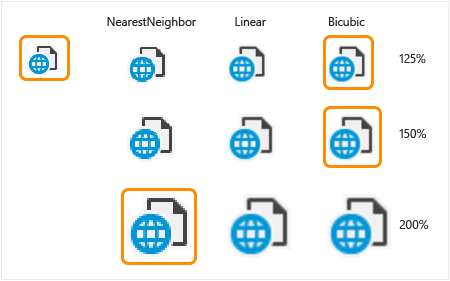

# Risoluzione dei problemi di DPI
[!INCLUDE[vs2017banner](../code-quality/includes/vs2017banner.md)]

Un numero crescente di dispositivi è distribuiti con "schermi". Queste schermate sono in genere più di 200 pixel per pollice \(ppi\). Utilizzo di un'applicazione in tali computer richiede il contenuto per la scalabilità verticale per soddisfare le esigenze di visualizzazione del contenuto a una distanza di visualizzazione normale per il dispositivo. A partire da 2014, la destinazione principale per gli schermi ad alta densità è mobile computing dispositivi \(telefoni, Tablet e portatili conchiglia\).  
  
 Windows 8.1 e versioni successive sono disponibili numerose funzionalità per consentire a questi computer lavorare con gli ambienti in cui il computer è collegato a entrambi ad alta densità e densità standard consente di visualizzare contemporaneamente e Visualizza.  
  
-   Windows consente a ridimensiona il contenuto per il dispositivo utilizzando il "rendere il testo e altri elementi di maggiore o minore" impostazione \(disponibile fin da Windows XP\).  
  
-   Windows 8.1 e versioni successive verranno automaticamente scalati contenuto per la maggior parte delle applicazioni sia coerente quando viene spostato da visualizzare le diverse densità di pixel. Quando la visualizzazione primaria è ad alta densità \(200% scalabilità\) e la visualizzazione secondaria è densità standard \(100%\), Windows verrà automaticamente ridimensionare il contenuto della finestra dell'applicazione sullo schermo secondario \(1 pixel visualizzati per ogni 4 pixel viene eseguito il rendering dall'applicazione\).  
  
-   Per impostazione predefinita Windows a destra scalabilità per la densità di pixel e la visualizzazione di distanza per la visualizzazione \(Windows 7 e versioni successive, OEM configurabile\).  
  
-   Windows consente di adattare automaticamente il contenuto di 250% su nuovi dispositivi che superano 280 PPID \(a partire da Windows 8.1 S14\).  
  
 Windows dispone di una soluzione per gestire la scalabilità dell'interfaccia utente per sfruttare i vantaggi dei conteggi pixel maggiore. Un'applicazione consente di partecipare a questo sistema dichiarando stesso "sistema compatibile con DPI." Le applicazioni che non eseguire questa operazione vengono ridimensionate dal sistema. Ciò può comportare un'esperienza utente "fuzzy" in cui l'intera applicazione è in modo uniforme allungato pixel. Ad esempio:  
  
   
  
 Visual Studio consente di partecipare alla scalabilità compatibile con DPI e pertanto non viene "virtualizzata."  
  
 Windows \(e Visual Studio\) sfruttare diverse tecnologie dell'interfaccia utente, che in diversi modi di affrontare impostati dal sistema di fattori di scala. Ad esempio:  
  
-   WPF misura controlli in modo indipendente dalla periferica \(unità, non pixel\). WPF UI viene ridimensionato automaticamente per il DPI corrente.  
  
-   Tutte le dimensioni del testo indipendentemente dal framework dell'interfaccia utente sono espresse in punti e vengono pertanto considerate dal sistema come indipendente dai DPI. Testo in Win32, Windows Form e WPF già aumentare in modo corretto quando viene disegnata sullo schermo.  
  
-   Finestre e finestre di dialogo Win32\/WinForms dispongono di mezzi per l'abilitazione di layout che viene ridimensionato con testo, ad esempio, tramite la griglia, flusso e pannelli di layout di tabella. Che permettono di evitare percorsi hardcoded pixel che non vengono scalati quando vengono aumentate le dimensioni dei caratteri.  
  
-   Icone fornite dal sistema o risorse in base alle metriche di sistema \(ad esempio, SM\_CXICON e SM\_CXSMICON\) sono già aumentate.  
  
## Win32 precedente \(GDI, GDI\+\) e un'interfaccia utente basata su Windows Form  
 Mentre WPF è ancora\-DPI avanzata, gran parte del codice basata su Win32\/GDI non è stato scritto originariamente con il riconoscimento DPI presente. Windows ha fornito le API di ridimensionamento DPI. Correzioni ai problemi di Win32 devono essere considerati in modo uniforme per il prodotto. Visual Studio ha fornito un supporto di libreria di classi per evitare la duplicazione di funzionalità e garantendo la coerenza tra il prodotto.  
  
## Immagini ad alta risoluzione  
 In questa sezione è principalmente per gli sviluppatori di estendere Visual Studio 2013. Per Visual Studio 2015, usare immagine servizio incorporato in Visual Studio. È inoltre possibile che si desidera supporto\/destinazione molte versioni di Visual Studio e pertanto si utilizza il servizio immagini in 2015 non è un'opzione in quanto non esiste nelle versioni precedenti. In questa sezione sarà anche per l'utente.  
  
## Ridimensionamento di immagini che sono troppo piccole  
 Immagini che sono troppo piccole possono essere "aumentate" e il rendering GDI e WPF tramite alcuni metodi comuni. Classi helper DPI gestite sono disponibili per gli integratori di Visual Studio interni ed esterni all'indirizzo scalabilità icone, bitmap, imagestrips e imagelists. Basate su Win32 nativo C \/ C\+\+ helper sono disponibili per la scalabilità di ICONA, HBITMAP, HIMAGELIST e VsUI::GdiplusImage. Ridimensionamento di una bitmap in genere richiede solo una modifica di una riga dopo aver incluso un riferimento alla libreria di supporto. Ad esempio:  
  
```cpp  
(Unmanaged)  VsUI::DpiHelper::LogicalToDeviceUnits(&hBitmap);  
```  
  
```c#  
(WinForms) DpiHelper.LogicalToDeviceUnits(ref image);  
```  
  
 Ridimensionamento di un oggetto imagelist varia a seconda se è stato completato in fase di caricamento, il componente imagelist o viene aggiunto in fase di esecuzione. Se in fase di caricamento è completo, chiamare LogicalToDeviceUnits\(\) con imagelist come una bitmap. Quando il codice necessario caricare una bitmap singoli prima composizione imagelist, assicuratevi di scalare le dimensioni dell'immagine di imagelist:  
  
```c#  
imagelist.ImageSize = DpiHelper.LogicalToDeviceUnits(imagelist.ImageSize);  
```  
  
 Nel codice nativo, le dimensioni possono essere ridimensionate quando si crea l'oggetto imagelist come indicato di seguito:  
  
```cpp  
ImageList_Create(VsUI::DpiHelper::LogicalToDeviceUnitsX(16),VsUI::DpiHelper::LogicalToDeviceUnitsY(16), ILC_COLOR32|ILC_MASK, nCount, 1);  
```  
  
 Funzioni della libreria consentono di specificare l'algoritmo di ridimensionamento. Quando ridimensionamento di immagini da inserire nella imagelists, assicurarsi di specificare il colore di sfondo utilizzato per la trasparenza o utilizzare NearestNeighbor la scalabilità \(che causerà distorsioni al 125% e % 150\).  
  
 Consultare la <xref:Microsoft.VisualStudio.PlatformUI.DpiHelper> documentazione su MSDN.  
  
 Nella tabella seguente vengono illustrati esempi di come le immagini devono essere ridimensionate DPI corrispondente fattori di scala. Le immagini in verde indicano la procedura consigliata a partire da Visual Studio 2013 \(100\-200% di ridimensionamento DPI\):  
  
   
  
## Problemi di layout  
 È possibile evitare problemi di layout comuni principalmente mantenendo i punti nell'interfaccia utente di scalabilità e rispetto a un altro piuttosto che tramite percorsi assoluti \(in particolare, in unità di pixel\). Ad esempio:  
  
-   Posizioni di layout, testo o necessario modificare per account per le immagini con scalabilità verticale.  
  
-   Colonne nelle griglie devono avere larghezza regolata per il testo con scalabilità verticale.  
  
-   Le dimensioni a livello di codice o lo spazio tra gli elementi anche dovrà essere aumentato. Le dimensioni che si basano solo le dimensioni del testo sono in genere un problema, perché i tipi di carattere vengono automaticamente ridimensionati.  
  
 Le funzioni di supporto sono disponibili nella <xref:Microsoft.VisualStudio.PlatformUI.DpiHelper> classe per consentire la scalabilità sull'asse X e Y:  
  
-   LogicalToDeviceUnitsX\/LogicalToDeviceUnitsY \(funzioni di consentono la scalabilità in X o asse Y\)  
  
-   spazio int \= DpiHelper.LogicalToDeviceUnitsX \(10\).  
  
-   altezza int \= VsUI::DpiHelper::LogicalToDeviceUnitsY\(5\);  
  
 Sono disponibili overload LogicalToDeviceUnits per consentire il ridimensionamento di oggetti, ad esempio Rect, Point e Size.  
  
## Utilizzando la libreria\/classe DPIHelper per ridimensionare le immagini e layout  
 La libreria di supporto di Visual Studio DPI è disponibile in formati nativi e gestiti e può essere utilizzata all'esterno della shell di Visual Studio da altre applicazioni.  
  
 Per utilizzare la libreria, vedere il [esempi di estendibilità di Visual Studio VSSDK](https://github.com/Microsoft/VSSDK-Extensibility-Samples) e clonare il codice di esempio DPI\_Images\_Icons elevata  
  
 Nel file di origine, includere VsUIDpiHelper.h e chiamare le funzioni statiche della classe VsUI::DpiHelper:  
  
```cpp  
#include "VsUIDpiHelper.h"  
  
int cxScaled = VsUI::DpiHelper::LogicalToDeviceUnitsX(cx);  
VsUI::DpiHelper::LogicalToDeviceUnits(&hBitmap);  
  
```  
  
> [!NOTE]
>  Non utilizzare le funzioni di supporto in variabili statiche a livello di modulo o a livello di classe. La libreria utilizza inoltre elementi statici per la sincronizzazione dei thread e si potrebbero riscontrare problemi di inizializzazione dell'ordine. Convertire tali elementi statici in variabili membro non statiche o eseguire il wrapping in una funzione \(in modo da ottenere costruite al primo accesso\).  
  
 Per utilizzare le funzioni di supporto DPI dal codice gestito che verrà eseguito all'interno dell'ambiente di Visual Studio:  
  
-   Il progetto consumer deve fare riferimento la versione più recente di MPF di Shell. Ad esempio:  
  
    ```c#  
    <Reference Include="Microsoft.VisualStudio.Shell.14.0.dll" />  
    ```  
  
-   Verificare il progetto contiene riferimenti a **System.Windows.Forms**, **PresentationCore**, e **PresentationUI**.  
  
-   Nel codice, utilizzare il **Microsoft.VisualStudio.PlatformUI** dello spazio dei nomi e chiamare funzioni statiche della classe DpiHelper. Per i tipi supportati \(punti, dimensioni, rettangoli e così via\), vengono fornite funzioni di estensione che restituiscono nuovi scalata oggetti. Ad esempio:  
  
    ```c#  
    using Microsoft.VisualStudio.PlatformUI;  
    double x = DpiHelper.LogicalToDeviceUnitsX(posX);  
    Point ptScaled = ptOriginal.LogicalToDeviceUnits();  
    DpiHelper.LogicalToDeviceUnits(ref bitmap);  
  
    ```  
  
## Gestione di tolleranza immagine WPF nell'interfaccia utente di questo  
 In WPF, le bitmap vengono ridimensionate automaticamente da WPF per il livello di zoom DPI corrente mediante un algoritmo bicubica di alta qualità \(predefinito\), che funziona bene per immagini o le schermate di grandi dimensioni, ma non è appropriato per le icone di menu perché introduce percepito tolleranza.  
  
 Raccomandazioni:  
  
-   Per logo banner e immagine grafica, il valore predefinito <xref:System.Windows.Media.BitmapScalingMode> modalità di ridimensionamento può essere utilizzato.  
  
-   Per le voci di menu e le immagini visualizzato, il <xref:System.Windows.Media.BitmapScalingMode> deve essere utilizzata quando non causa di altri elementi di una distorsione a eliminare tolleranza \(al 200% e % 300\).  
  
-   •	Per i livelli di zoom di grandi dimensioni non multipli di 100% \(ad esempio, 250% o % 350\), il ridimensionamento delle immagini visualizzato con Bicubica risultati nell'interfaccia utente fuzzy, sbiadito consentendo di riprodurre. Viene ottenuto un risultato migliore scalabilità l'immagine con NearestNeighbor al multiplo più grande del 100% \(ad esempio, 200% o 300%\) prima e la scalabilità con Bicubica da lì. Vedere caso speciale: prescaling immagini WPF per DPI elevato dei livelli per ulteriori informazioni.  
  
 La classe DpiHelper nello spazio dei nomi Microsoft.VisualStudio.PlatformUI fornisce un membro <xref:System.Windows.Media.BitmapScalingMode> che può essere utilizzato per l'associazione. Consente la shell di Visual Studio controllare la modalità di ridimensionamento tra il prodotto in modo uniforme, a seconda del fattore di ridimensionamento DPI di bitmap.  
  
 Per utilizzarlo in XAML, aggiungere:  
  
```xaml  
xmlns:vsui="clr-namespace:Microsoft.VisualStudio.PlatformUI;assembly=Microsoft.VisualStudio.Shell.14.0"  
  
<Setter Property="RenderOptions.BitmapScalingMode" Value="{x:Static vs:DpiHelper.BitmapScalingMode}" />  
  
```  
  
 La shell di Visual Studio già imposta questa proprietà su finestre di dialogo e finestre di primo livello. Interfaccia utente basata su WPF in esecuzione in Visual Studio verrà già ereditare. Se l'impostazione non si propaga alle parti di particolare dell'interfaccia utente, è possibile impostare per l'elemento radice dell'interfaccia utente XAML\/WPF. Posizioni in cui ciò includono i popup per gli elementi con elementi padre di Win32, e finestre di progettazione eseguiti da elaborare, ad esempio Blend.  
  
 Parte dell'interfaccia utente è possibile scalare in modo indipendente il livello di zoom DPI set di sistema, ad esempio l'editor di testo di Visual Studio e finestre di progettazione basata su WPF \(Desktop WPF e Windows Store\). In questi casi, DpiHelper.BitmapScalingMode non deve essere utilizzato. Per risolvere il problema nell'editor, il team dell'IDE creato una proprietà personalizzata denominata RenderOptions.BitmapScalingMode. Impostare il valore della proprietà per riprodurre o NearestNeighbor a seconda del livello di zoom combinato del sistema e l'interfaccia utente.  
  
## Caso speciale: prescaling immagini WPF per i livelli di grandi dimensioni DPI  
 Per i livelli di zoom molto grandi che non sono multipli di 100% \(ad esempio, 250%, % 350 e così via\), ridimensionamento di immagini visualizzato con risultati bicubica nell'interfaccia utente fuzzy, sbiadito consentendo di riprodurre. L'impressione di queste immagini con testo nitido è quasi simile a quella di un effetto ottico. Le immagini vengono visualizzate per avvicinarsi all'occhio e la messa a fuoco in relazione al testo. Il risultato della scalabilità queste dimensioni ingrandite può essere migliorato dal primo scalabilità l'immagine con NearestNeighbor al multiplo più grande del 100% \(ad esempio, 200% o 300%\) e la scalabilità con Bicubica al resto \(un ulteriore % di 50\).  
  
 Il seguente è riportato un esempio delle differenze nei risultati, dove la prima immagine viene ridimensionata con l'algoritmo migliore scalabilità doppia\-\> 100%, 200% \-\> 250% e la seconda solo con Bicubica 100% \-\> 250%.  
  
   
  
 Per abilitare l'interfaccia utente per utilizzare questo ridimensionamento double, il markup XAML per la visualizzazione di ogni elemento immagine dovrà essere modificato. Negli esempi seguenti viene illustrato come utilizzare la scalabilità double in WPF in Visual Studio utilizzando la libreria di DpiHelper e Shell.12\/14.  
  
 Passaggio 1: Prescale 300% l'immagine in 200% e così via utilizzando NearestNeighbor.  
  
 Prescale l'immagine utilizzando un convertitore di applicare un'associazione, o con un'estensione di markup XAML. Ad esempio:  
  
```xaml  
<vsui:DpiPrescaleImageSourceConverter x:Key="DpiPrescaleImageSourceConverter" />  
  
<Image Source="{Binding Path=SelectedImage, Converter={StaticResource DpiPrescaleImageSourceConverter}}" Width="16" Height="16" />  
  
<Image Source="{vsui:DpiPrescaledImage Images/Help.png}" Width="16" Height="16" />  
  
```  
  
 Se l'immagine deve inoltre essere temi \(più, se non tutti, dovrebbe essere\), il markup può utilizzare un convertitore diverso che esegue prima dei temi dell'immagine e quindi pre\-scalabilità. Il markup può essere <xref:Microsoft.VisualStudio.PlatformUI.DpiPrescaleThemedImageConverter> o <xref:Microsoft.VisualStudio.PlatformUI.DpiPrescaleThemedImageSourceConverter>, a seconda l'output di conversione desiderata.  
  
```xaml  
<vsui:DpiPrescaleThemedImageSourceConverter x:Key="DpiPrescaleThemedImageSourceConverter" />  
  
<Image Width="16" Height="16">  
  <Image.Source>  
    <MultiBinding Converter="{StaticResource DpiPrescaleThemedImageSourceConverter}">  
      <Binding Path="Icon" />  
      <Binding Path="(vsui:ImageThemingUtilities.ImageBackgroundColor)"    
               RelativeSource="{RelativeSource Self}" />  
      <Binding Source="{x:Static vsui:Boxes.BooleanTrue}" />  
    </MultiBinding>  
  </Image.Source>  
</Image>  
```  
  
 Passaggio 2: Verificare che la dimensione finale sia corretta per il DPI corrente.  
  
 Poiché WPF ridimensionerà l'interfaccia utente per il DPI corrente utilizzando la proprietà BitmapScalingMode impostata su UIElement, un controllo immagine con un'immagine di prescaled come origine avrà un aspetto due o tre volte maggiore rispetto al necessario. Di seguito sono un paio di modi per contrastare questo effetto:  
  
-   Se si conosce la dimensione dell'immagine originale al 100%, è possibile specificare la dimensione esatta del controllo Image. Queste dimensioni riflette che la dimensione dell'interfaccia utente prima del ridimensionamento viene applicata.  
  
    ```xaml  
    <Image Source="{Binding Path=SelectedImage, Converter={StaticResource DpiPrescaleImageSourceConverter}}" Width="16" Height="16" />  
    ```  
  
-   Se le dimensioni dell'immagine originale non sono noto, è possibile utilizzare una proprietà LayoutTransform scalare verso il basso l'oggetto immagine finale. Ad esempio:  
  
    ```xaml  
    <Image Source="{Binding Path=SelectedImage, Converter={StaticResource DpiPrescaleImageSourceConverter}}" >  
        <Image.LayoutTransform>  
         <ScaleTransform  
             ScaleX="{x:Static vsui:DpiHelper.PreScaledImageLayoutTransformScale}"  
             ScaleY="{x:Static vsui:DpiHelper.PreScaledImageLayoutTransformScale}" />  
        </Image.LayoutTransform>  
    </Image>  
    ```  
  
## Abilita il supporto HDPI per WebOC  
 Per impostazione predefinita, non abilitare controlli WebOC \(ad esempio il controllo WebBrowser in WPF, o l'interfaccia IWebBrowser2\) HDPI rilevamento e supporto. Il risultato sarà un controllo incorporato con il contenuto visualizzato è troppo piccolo su uno schermo ad alta risoluzione. Di seguito viene descritto come abilitare il supporto di valori DPI alti in un'istanza di WebOC web specifico.  
  
 Implementare l'interfaccia IDocHostUIHandler \(vedere l'articolo MSDN di [IDocHostUIHandler](http://msdn.microsoft.com/library/aa753260.aspx) interface\):  
  
```idl  
[ComImport, InterfaceType(ComInterfaceType.InterfaceIsIUnknown),  
 Guid("BD3F23C0-D43E-11CF-893B-00AA00BDCE1A")]  
public interface IDocHostUIHandler  
{  
    [return: MarshalAs(UnmanagedType.I4)]  
    [PreserveSig]  
    int ShowContextMenu(  
        [In, MarshalAs(UnmanagedType.U4)] int dwID,  
        [In] POINT pt,  
        [In, MarshalAs(UnmanagedType.Interface)] object pcmdtReserved,  
        [In, MarshalAs(UnmanagedType.IDispatch)] object pdispReserved);  
    [return: MarshalAs(UnmanagedType.I4)]  
    [PreserveSig]  
    int GetHostInfo([In, Out] DOCHOSTUIINFO info);  
    [return: MarshalAs(UnmanagedType.I4)]  
    [PreserveSig]  
    int ShowUI(  
        [In, MarshalAs(UnmanagedType.I4)] int dwID,  
        [In, MarshalAs(UnmanagedType.Interface)] object activeObject,  
        [In, MarshalAs(UnmanagedType.Interface)] object commandTarget,  
        [In, MarshalAs(UnmanagedType.Interface)] object frame,  
        [In, MarshalAs(UnmanagedType.Interface)] object doc);  
    [return: MarshalAs(UnmanagedType.I4)]  
    [PreserveSig]  
    int HideUI();  
    [return: MarshalAs(UnmanagedType.I4)]  
    [PreserveSig]  
    int UpdateUI();  
    [return: MarshalAs(UnmanagedType.I4)]  
    [PreserveSig]  
    int EnableModeless([In, MarshalAs(UnmanagedType.Bool)] bool fEnable);  
    [return: MarshalAs(UnmanagedType.I4)]  
    [PreserveSig]  
    int OnDocWindowActivate([In, MarshalAs(UnmanagedType.Bool)] bool fActivate);  
    [return: MarshalAs(UnmanagedType.I4)]  
    [PreserveSig]  
    int OnFrameWindowActivate([In, MarshalAs(UnmanagedType.Bool)] bool fActivate);  
    [return: MarshalAs(UnmanagedType.I4)]  
    [PreserveSig]  
    int ResizeBorder(  
        [In] COMRECT rect,  
        [In, MarshalAs(UnmanagedType.Interface)] object doc,  
        bool fFrameWindow);  
    [return: MarshalAs(UnmanagedType.I4)]  
    [PreserveSig]  
    int TranslateAccelerator(  
        [In] ref MSG msg,  
        [In] ref Guid group,  
        [In, MarshalAs(UnmanagedType.I4)] int nCmdID);  
    [return: MarshalAs(UnmanagedType.I4)]  
    [PreserveSig]  
    int GetOptionKeyPath(  
        [Out, MarshalAs(UnmanagedType.LPArray)] string[] pbstrKey,  
        [In, MarshalAs(UnmanagedType.U4)] int dw);  
    [return: MarshalAs(UnmanagedType.I4)]  
    [PreserveSig]  
    int GetDropTarget(  
        [In, MarshalAs(UnmanagedType.Interface)] IOleDropTarget pDropTarget,  
        [MarshalAs(UnmanagedType.Interface)] out IOleDropTarget ppDropTarget);  
    [return: MarshalAs(UnmanagedType.I4)]  
    [PreserveSig]  
    int GetExternal([MarshalAs(UnmanagedType.IDispatch)] out object ppDispatch);  
    [return: MarshalAs(UnmanagedType.I4)]  
    [PreserveSig]  
    int TranslateUrl(  
        [In, MarshalAs(UnmanagedType.U4)] int dwTranslate,  
        [In, MarshalAs(UnmanagedType.LPWStr)] string strURLIn,  
        [MarshalAs(UnmanagedType.LPWStr)] out string pstrURLOut);  
    [return: MarshalAs(UnmanagedType.I4)]  
    [PreserveSig]  
    int FilterDataObject(  
        IDataObject pDO,  
        out IDataObject ppDORet);  
    }   
```  
  
 Facoltativamente, implementare l'interfaccia ICustomDoc \(vedere l'articolo MSDN di [ICustomDoc](http://msdn.microsoft.com/library/aa753272.aspx) interface\):  
  
```idl  
[InterfaceType(ComInterfaceType.InterfaceIsIUnknown),  
 Guid("3050F3F0-98B5-11CF-BB82-00AA00BDCE0B")]  
public interface ICustomDoc  
{  
    void SetUIHandler(IDocHostUIHandler pUIHandler);  
}   
```  
  
 Associare la classe che implementa IDocHostUIHandler con documento del WebOC. Se è stata implementata l'interfaccia ICustomDoc precedente, come proprietà del documento del WebOC è valido, viene eseguito il cast a un ICustomDoc e chiamare il metodo SetUIHandler, passando la classe che implementa IDocHostUIHandler.  
  
```c#  
// "this" references that class that owns the WebOC control and in this case also implements the IDocHostUIHandler interface  
ICustomDoc customDoc = (ICustomDoc)webBrowser.Document;  
customDoc.SetUIHandler(this);  
  
```  
  
 Se non è stato implementato l'interfaccia ICustomDoc, quindi come proprietà del documento del WebOC è valido, è necessario eseguirne il cast a un oggetto IOleObject e chiamare il metodo SetClientSite, passando la classe che implementa IDocHostUIHandler. Impostare il flag DOCHOSTUIFLAG\_DPI\_AWARE il DOCHOSTUIINFO passato alla chiamata al metodo GetHostInfo:  
  
```c#  
public int GetHostInfo(DOCHOSTUIINFO info)  
{  
    // This is what the default site provides.  
    info.dwFlags = (DOCHOSTUIFLAG)0x5a74012;  
    // Add the DPI flag to the defaults  
    info.dwFlags |=.DOCHOSTUIFLAG.DOCHOSTUIFLAG_DPI_AWARE;  
    return S_OK;  
}  
```  
  
 Deve trattarsi di tutto ciò che è necessario ottenere il controllo WebOC supporti HPDI.  
  
## Suggerimenti  
  
1.  Se la proprietà di documento nel controllo WebOC cambia, potrebbe essere necessario riassociare il documento con la classe IDocHostUIHandler.  
  
2.  Se la soluzione non funziona, sussiste un problema noto con WebOC non prelievo per il flag DPI la modifica. Il modo più affidabile di questa correzione è per attivare o disattivare lo zoom ottico di WebOC due chiamate al significato con due valori diversi per la percentuale di zoom. Inoltre, se questa soluzione è necessaria, potrebbero essere necessaria per eseguirla in ogni chiamata navigate.  
  
    ```c#  
    // browser2 is a SHDocVw.IWebBrowser2 in this case  
    // EX: Call the Exec twice with DPI%-1 and then DPI% as the zoomPercent values  
    IOleCommandTarget cmdTarget = browser2.Document as IOleCommandTarget;  
    if (cmdTarget != null)  
    {  
        object commandInput = zoomPercent;  
        cmdTarget.Exec(IntPtr.Zero,  
                       OLECMDID_OPTICAL_ZOOM,  
                       OLECMDEXECOPT_DONTPROMPTUSER,  
                       ref commandInput,  
                       ref commandOutput);  
    }  
    ```