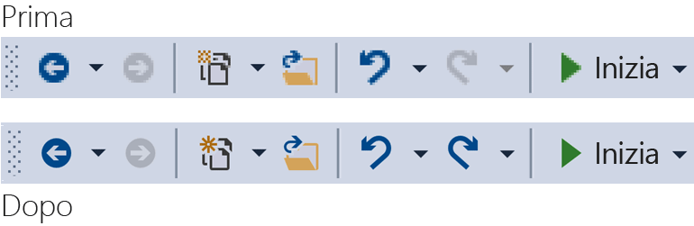
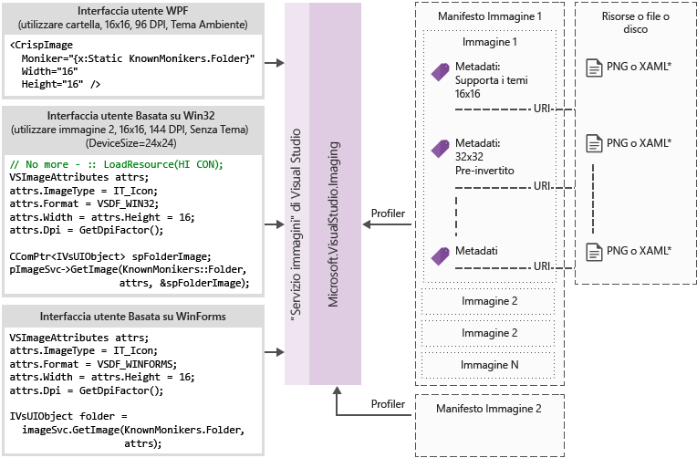

# Catalogo e il servizio di immagine
[!INCLUDE[vs2017banner](../code-quality/includes/vs2017banner.md)]

Tale cookbook contiene indicazioni e procedure consigliate per l'adozione di servizio di immagini di Visual Studio e il catalogo di immagine introdotte in Visual Studio 2015.  
  
 Il servizio immagini introdotto in Visual Studio 2015 consente agli sviluppatori di ottenere le immagini migliori per il dispositivo e il tema scelto dell'utente per visualizzare l'immagine, tra cui temi corretto per il contesto in cui vengono visualizzati. Adottare il servizio immagini consente di eliminare aree problematiche principali correlate alla manutenzione di asset, HDPI la scalabilità e temi.  
  
|||  
|-|-|  
|**Problemi di oggi**|**Soluzioni**|  
|La sfumatura di colore di sfondo|Sfumatura alfa incorporato|  
|Immagini dei temi (alcuni)|Metadati del tema|  
|Modalità contrasto elevato|Risorse alternative di contrasto elevato|  
|Necessarie più risorse per le diverse modalità di DPI|Risorse selezionabile con fallback vettoriale|  
|Immagini duplicate|Un identificatore per il concetto di immagine|  
  
 Perché adottare il servizio immagini?  
  
-   Ottenere sempre l'ultima immagine "pixel perfetto" da Visual Studio  
  
-   È possibile inviare e utilizzare proprie immagini  
  
-   Non è necessario testare le immagini out quando vengono aggiunte nuove di ridimensionamento DPI  
  
-   Indirizzo precedente ostacoli all'architettura nelle implementazioni di  
  
 Visual Studio shell barra degli strumenti prima e dopo aver utilizzato il servizio immagini:  
  
   
  
## <a name="how-it-works"></a>Come funziona  
 Il servizio immagini è possibile fornire un'immagine bitmap adatta per qualsiasi framework dell'interfaccia utente supportate:  
  
-   WPF: BitmapSource  
  
-   Windows Form: System.Drawing.Bitmap  
  
-   Win32: HBITMAP  
  
 Diagramma di flusso del servizio di immagine  
  
   
  
 **Moniker immagine**  
  
 Un moniker immagine (o moniker per brevità) è una coppia GUID/ID che identifica in modo univoco un asset elenco immagine nella raccolta immagini o asset immagine.  
  
 **Moniker noti**  
  
 Il set di moniker immagine contenuta nel catalogo di immagini Visual Studio e pubblicamente che può essere utilizzato da qualsiasi componente di Visual Studio o estensione.  
  
 **File manifesti di immagine**  
  
 File di immagine manifesto (.imagemanifest) sono file XML che definiscono un set di risorse di immagini, il moniker che rappresentano tali risorse e reali le immagini che rappresentano ogni asset. Manifesti dell'immagine è possibile definire immagini autonomo o elenchi di immagini per il supporto dell'interfaccia utente legacy. Inoltre, esistono attributi che possono essere impostati sull'asset o sulle singole immagini dietro ogni asset cambiare la data e la modalità di visualizzazione di tali risorse.  
  
 **Schema del manifesto dell'immagine**  
  
 Un manifesto di completare l'immagine è simile al seguente:  
  
```xml  
<ImageManifest>  
      <!-- zero or one Symbols elements -->  
      <Symbols>  
        <!-- zero or more Import, Guid, ID, or String elements -->  
      </Symbols>  
      <!-- zero or one Images elements -->  
      <Images>  
        <!-- zero or more Image elements -->  
      </Images>  
      <!-- zero or one ImageLists elements -->  
      <ImageLists>  
        <!-- zero or more ImageList elements -->  
      </ImageLists>  
</ImageManifest>  
```  
  
 **Simboli**  
  
 Come favorire una leggibilità e la manutenzione, il manifesto dell'immagine è possibile utilizzare i simboli per i valori di attributo. Vengono definiti i simboli simile al seguente:  
  
```xml  
<Symbols>  
      <Import Manifest="manifest" />  
      <Guid Name="ShellCommandGuid" Value="8ee4f65d-bab4-4cde-b8e7-ac412abbda8a" />  
      <ID Name="cmdidSaveAll" Value="1000" />  
      <String Name="AssemblyName" Value="Microsoft.VisualStudio.Shell.UI.Internal" />  
</Symbols>  
```  
  
|||  
|-|-|  
|**Sottoelemento**|**Definizione**|  
|Import|Importa i simboli del file di manifesto specificato per l'utilizzo nel manifesto corrente|  
|Guid|Il simbolo rappresenta un GUID e deve corrispondere la formattazione di GUID|  
|ID|Il simbolo rappresenta un ID e deve essere un numero intero non negativo|  
|String|Il simbolo rappresenta un valore stringa arbitrario|  
  
 Distinzione maiuscole/minuscole e di riferimento utilizzando la sintassi $(symbol-name) sono simboli:  
  
```xml  
<Image Guid="$(ShellCommandGuid)" ID="$(cmdidSaveAll)" >  
      <Source Uri="/$(AssemblyName);Component/Resources/image.xaml" />  
</Image>  
```  
  
 Alcuni simboli sono già definiti per tutti i manifesti. Questi possono essere utilizzati nell'attributo dell'Uri di \< origine> o \< importazione> elemento ai percorsi di riferimento sul computer locale.  
  
|||  
|-|-|  
|**Simbolo**|**Descrizione**|  
|CommonProgramFiles|Il valore della variabile di ambiente % CommonProgramFiles %|  
|LocalAppData|Il valore della variabile di ambiente % LocalAppData %|  
|ManifestFolder|La cartella contenente il file manifesto|  
|Documenti|Il percorso completo della cartella documenti dell'utente corrente|  
|ProgramFiles|Il valore della variabile di ambiente % ProgramFiles %|  
|System|Nella cartella Windows\System32|  
|WinDir|Il valore della variabile di ambiente % WinDir %|  
  
 **Immagine**  
  
 Il \< immagine> elemento definisce un'immagine che è possibile fare riferimento da un moniker. Il GUID e ID complessivamente formano il moniker di immagine. Il moniker per l'immagine deve essere univoco in libreria intera immagine. Se più di un'immagine dispone di un moniker specificato, il primo durante la generazione della libreria è quello che viene mantenuto.  
  
 Deve contenere almeno un'origine. Indipendente dalla dimensione origini fornirà i migliori risultati in una vasta gamma di dimensioni, ma non sono necessari. Se il servizio è richiesto per un'immagine di dimensioni non è definita nel \< immagine> elemento ed è presente alcuna origine indipendente dalla dimensione, il servizio scegliere la migliore fonte di dimensioni specifiche e scalabilità per la dimensione richiesta.  
  
```xml  
<Image Guid="guid" ID="int" AllowColorInversion="true/false">  
      <Source ... />  
      <!-- optional additional Source elements -->  
</Image>  
```  
  
|||  
|-|-|  
|**Attributo**|**Definizione**|  
|Guid|[Obbligatorio] La parte GUID del moniker immagine|  
|ID|[Obbligatorio] La porzione dell'ID del moniker immagine|  
|AllowColorInversion|[Facoltativo, valore predefinito true] Indica se l'immagine può avere i colori invertiti a livello di codice quando viene utilizzato su uno sfondo scuro.|  
  
 **Origine**  
  
 Il \< origine> elemento definisce una risorsa di origine immagine singola (XAML e PNG).  
  
```xml  
<Source Uri="uri" Background="background">  
      <!-- optional NativeResource element -->  
 </Source>  
```  
  
|||  
|-|-|  
|**Attributo**|**Definizione**|  
|URI|[Obbligatorio] URI che definisce dove è possibile caricare l'immagine da. Può essere uno dei seguenti:<br /><br /> -A [Pack URI](http://msdn.microsoft.com/en-US/library/aa970069\(v=vs.100\).aspx) utilizzando l'applicazione: / / / autorità<br />-Un riferimento a una risorsa componente assoluto<br />-Un percorso di un file contenente una risorsa nativa|  
|Sfondo|[Facoltativo] Indica quali tipo di origine deve essere utilizzata in background.<br /><br /> Può essere uno dei seguenti:<br /><br /> *Luce:* l'origine può essere utilizzata su uno sfondo.<br /><br /> *Scuro:*l'origine può essere utilizzata su uno sfondo scuro.<br /><br /> *Contrasto elevato:* l'origine può essere utilizzata su uno sfondo in modalità contrasto elevato.<br /><br /> *HighContrastLight:* l'origine può essere utilizzata su uno sfondo in modalità contrasto elevato.<br /><br /> *HighContrastDark:* l'origine può essere utilizzata su uno sfondo scuro in modalità contrasto elevato.<br /><br /> Se l'attributo di Background viene omesso, l'origine può essere utilizzata su uno sfondo.<br /><br /> Se si *Light*, *scuro*, *HighContrastLight*, o *HighContrastDark*, i colori dell'origine non vengono mai invertiti. Se viene omesso o impostato su sfondo *contrasto*, l'inversione dei colori dell'origine viene controllata l'immagine **AllowColorInversion** attributo.|  
|||  
  
 Oggetto \< origine> elemento può avere esattamente uno dei sottoelementi facoltativi seguenti:  
  
||||  
|-|-|-|  
|**Elemento**|**Attributi (tutti necessari)**|**Definizione**|  
|\< dimensione>|Valore|L'origine verrà utilizzata per le immagini della dimensione specificata (in unità di dispositivo). L'immagine sarà quadrato.|  
|\< SizeRange>|MinSize, MaxSize|L'origine verrà utilizzata per le immagini dalla MinSize MaxSize (in unità di dispositivo), inclusi. L'immagine sarà quadrato.|  
|\< dimensioni>|Larghezza, altezza|L'origine verrà utilizzata per le immagini della larghezza e l'altezza (in unità di dispositivo).|  
|\< DimensionRange>|MinWidth, MinHeight,<br /><br /> MaxWidth, MaxHeight|L'origine verrà utilizzata per le immagini dalla larghezza/altezza minima larghezza/altezza massima (in unità di dispositivo), inclusi.|  
  
 Oggetto \< origine> elemento può anche disporre di un \< NativeResource> sottoelemento che definisce un \< origine> che viene caricato da un assembly nativo piuttosto che un assembly gestito.  
  
```xml  
<NativeResource Type="type" ID="int" />  
```  
  
|||  
|-|-|  
|**Attributo**|**Definizione**|  
|Tipo|[Obbligatorio] Il tipo di risorsa nativa, XAML o PNG|  
|ID|[Obbligatorio] Il quoziente di ID di risorsa nativa|  
  
 **ImageList**  
  
 Il \< ImageList> elemento definisce una raccolta di immagini che possono essere restituiti in un singolo elenco. L'elenco viene compilato su richiesta, in base alle esigenze.  
  
```xml  
<ImageList>  
      <ContainedImage Guid="guid" ID="int" External="true/false" />  
      <!-- optional additional ContainedImage elements -->  
 </ImageList>  
```  
  
|||  
|-|-|  
|**Attributo**|**Definizione**|  
|Guid|[Obbligatorio] La parte GUID del moniker immagine|  
|ID|[Obbligatorio] La porzione dell'ID del moniker immagine|  
|Esterno|[Facoltativo, valore predefinito false] Indica se il moniker immagine fa riferimento a un'immagine nel manifesto corrente.|  
  
 Il moniker per l'immagine indipendente non è necessario fare riferimento a un'immagine definita nel manifesto corrente. Se l'immagine indipendente non viene trovato nella raccolta immagini, un'immagine segnaposto vuota da utilizzare al suo posto.  
  
## <a name="using-the-image-service"></a>Utilizzo del servizio di immagine  
  
### <a name="first-steps-managed"></a>Primi passi (gestiti)  
 Per utilizzare il servizio immagini, è necessario aggiungere al progetto i riferimenti ad alcuni o tutti gli assembly seguenti:  
  
-   **Microsoft.VisualStudio.ImageCatalog.dll**  
  
    -   Obbligatorio se si utilizza il catalogo di immagine incorporata KnownMonikers  
  
-   **Microsoft.VisualStudio.Imaging.dll**  
  
    -   Obbligatorio se si utilizza **CrispImage** e **ImageThemingUtilities** nella UI di WPF  
  
-   **Microsoft.VisualStudio.Imaging.Interop.14.0.DesignTime.dll**  
  
    -   Obbligatorio se si utilizza il **ImageMoniker** e **ImageAttributes** tipi  
  
    -   **EmbedInteropTypes** deve essere impostato su true  
  
-   **Microsoft.VisualStudio.Shell.Interop.14.0.DesignTime**  
  
    -   Obbligatorio se si utilizza il **IVsImageService2** tipo  
  
    -   **EmbedInteropTypes** deve essere impostato su true  
  
-   **Microsoft.VisualStudio.Utilities.dll**  
  
    -   Obbligatorio se si utilizza il **BrushToColorConverter** per il ImageThemingUtilities.**ImageBackgroundColor** nell'interfaccia Utente WPF  
  
-   **Microsoft.VisualStudio.Shell. \< VSVersion>0**  
  
    -   Obbligatorio se si utilizza il **IVsUIObject** tipo  
  
-   **Microsoft.VisualStudio.Shell.Interop.10.0.dll**  
  
    -   Obbligatorio se si utilizza l'helper dell'interfaccia utente correlati a Windows Form  
  
    -   **EmbedInteropTypes** deve essere impostato su true  
  
### <a name="first-steps-native"></a>Primi passi (nativo)  
 Per utilizzare il servizio immagini, è necessario includere alcune o tutte le intestazioni seguenti al progetto:  
  
-   **KnownImageIds.h**  
  
    -   Obbligatorio se si utilizza il catalogo di immagine incorporata **KnownMonikers**, ma non la **ImageMoniker** tipo, ad esempio quando la restituzione di valori da **IVsHierarchy GetGuidProperty** o **GetProperty** chiamate.  
  
-   **KnownMonikers.h**  
  
    -   Obbligatorio se si utilizza il catalogo di immagine incorporata **KnownMonikers**.  
  
-   **ImageParameters140.h**  
  
    -   Obbligatorio se si utilizza il **ImageMoniker** e **ImageAttributes** tipi.  
  
-   **VSShell140.h**  
  
    -   Obbligatorio se si utilizza il **IVsImageService2** tipo.  
  
-   **ImageThemingUtilities.h**  
  
    -   Obbligatorio se non è possibile lasciare che il servizio immagini gestire temi per l'utente.  
  
    -   Non utilizzare questa intestazione se il servizio immagini in grado di gestire l'applicazione di temi di immagine.  
  
-   **VSUIDPIHelper.h**  
  
    -   Obbligatorio se si utilizza l'helper DPI per ottenere il DPI corrente.  
  
## <a name="how-do-i-write-new-wpf-ui"></a>La modalità di scrittura nuova UI WPF  
  
1.  Iniziare con l'aggiunta di riferimenti ad assembly richiesti in questa sezione passaggi innanzitutto al progetto. Non è necessario aggiungere tutti gli elementi e di aggiungere solo i riferimenti che necessari. (Nota: se si utilizza o si dispone dell'accesso a **Colori** anziché **pennelli**, è possibile passare il riferimento a **utilità**, poiché non è necessario il convertitore.)  
  
2.  Selezionare l'immagine desiderata e recuperare il moniker. Utilizzare un **KnownMoniker**, o utilizzare il proprio se si dispone di proprie immagini personalizzate e moniker.  
  
3.  Aggiungere **CrispImages** in XAML. (Vedere di seguito riportato).  
  
4.  Impostare il **ImageThemingUtilities.ImageBackgroundColor** proprietà nella gerarchia dell'interfaccia Utente. (Deve essere impostato in corrispondenza della posizione in cui il colore di sfondo è noto, non necessariamente sul **CrispImage**.) (Vedere di seguito riportato).  
  
```xaml  
<Window  
  x:Class="WpfApplication.MainWindow"  
  xmlns="http://schemas.microsoft.com/winfx/2006/xaml/presentation"  
  xmlns:x="http://schemas.microsoft.com/winfx/2006/xaml"  
  xmlns:imaging="clr-namespace:Microsoft.VisualStudio.Imaging;assembly=Microsoft.VisualStudio.Imaging"  
  xmlns:theming="clr-namespace:Microsoft.VisualStudio.PlatformUI;assembly=Microsoft.VisualStudio.Imaging"  
  xmlns:utilities="clr-namespace:Microsoft.Internal.VisualStudio.Imaging;assembly=Microsoft.VisualStudio.Imaging"  
  xmlns:catalog="clr-namespace:Microsoft.VisualStudio.Imaging;assembly=Microsoft.VisualStudio.ImageCatalog"  
  Title="MainWindow" Height="350" Width="525" UseLayoutRounding="True">  
  <Window.Resources>  
    <utilities:BrushToColorConverter x:Key="BrushToColorConverter"/>  
  </Window.Resources>  
  <StackPanel Background="White" VerticalAlignment="Center"   
    theming:ImageThemingUtilities.ImageBackgroundColor="{Binding Background, RelativeSource={RelativeSource Self}, Converter={StaticResource BrushToColorConverter}}">  
    <imaging:CrispImage Width="16" Height="16" Moniker="{x:Static catalog:KnownMonikers.MoveUp}" />  
  </StackPanel>  
</Window>  
```  
  
 **Come posso aggiornare UI WPF esistente?**  
  
 L'aggiornamento UI WPF esistente è un processo relativamente semplice costituito da tre passaggi di base:  
  
1.  Sostituisci tutto \< immagine> gli elementi dell'interfaccia Utente con \< CrispImage> elementi  
  
2.  Modificare tutti gli attributi di origine per gli attributi di Moniker  
  
    -   Se l'immagine non cambia mai e si utilizza **KnownMonikers**, quindi associare in modo statico tale proprietà per il **KnownMoniker**. (Vedere l'esempio precedente).  
  
    -   Se l'immagine non cambia mai e si utilizza un'immagine personalizzata, quindi in modo statico associato al proprio moniker.  
  
    -   Se è possibile modificare l'immagine, associare l'attributo Moniker a una proprietà di codice che invia una notifica sulle modifiche di proprietà.  
  
3.  In qualche punto della gerarchia dell'interfaccia Utente, impostare **ImageThemingUtilities.ImageBackgroundColor** per rendere l'inversione dei colori che funziona correttamente.  
  
    -   Ciò potrebbe richiedere l'uso di **BrushToColorConverter** (classe). (Vedere l'esempio precedente).  
  
## <a name="how-do-i-update-win32-ui"></a>Come aggiornare l'interfaccia utente di Win32?  
 Aggiungere quanto segue al codice, laddove appropriato per sostituire il caricamento delle immagini non elaborato. Passare i valori per la restituzione gli HBITMAP e HICONs e HIMAGELIST in base alle esigenze.  
  
 **Ottenere il servizio immagini**  
  
```cpp  
CComPtr<IVsImageService2> spImgSvc;  
CGlobalServiceProvider::HrQueryService(SID_SVsImageService, &spImgSvc);  
```  
  
 **La richiesta dell'immagine**  
  
```cpp  
ImageAttributes attr = { 0 };  
attr.StructSize      = sizeof(attributes);  
attr.Format          = DF_Win32;  
// IT_Bitmap for HBITMAP, IT_Icon for HICON, IT_ImageList for HIMAGELIST  
attr.ImageType       = IT_Bitmap;  
attr.LogicalWidth    = 16;  
attr.LogicalHeight   = 16;  
attr.Dpi             = VsUI::DpiHelper::GetDeviceDpiX();  
attr.Background      = 0xFFFFFFFF;  
// Desired RGBA color, if you don't use this, don't set IAF_Background below  
attr.Flags           = IAF_RequiredFlags | IAF_Background;  
  
CComPtr<IVsUIObject> spImg;  
// Replace this KnownMoniker with your desired ImageMoniker  
spImgSvc->GetImage(KnownMonikers::Blank, attributes, &spImg);  
  
```  
  
## <a name="how-do-i-update-winforms-ui"></a>Come posso aggiornare WinForms UI?  
 Aggiungere quanto segue al codice, laddove appropriato per sostituire il caricamento delle immagini non elaborato. Passare i valori per la restituzione di bitmap e icone in base alle esigenze.  
  
 **Istruzione using utile**  
  
```c#  
using GelUtilities = Microsoft.Internal.VisualStudio.PlatformUI.Utilities;  
```  
  
 **Ottenere il servizio immagini**  
  
```c#  
// This or your preferred way of querying for Visual Studio services  
IVsImageService2 imageService = (IVsImageService2)Package.GetGlobalService(typeof(SVsImageService));  
  
```  
  
 **Richiedono l'immagine**  
  
```c#  
ImageAttributes attributes = new ImageAttributes  
{  
    StructSize    = Marshal.SizeOf(typeof(ImageAttributes)),  
    // IT_Bitmap for Bitmap, IT_Icon for Icon  
    ImageType     = (uint)_UIImageType.IT_Bitmap,  
    Format        = (uint)_UIDataFormat.DF_WinForms,  
    LogicalWidth  = 16,  
    LogicalHeight = 16,  
    // Desired RGBA color, if you don't use this, don't set IAF_Background below  
    Background    = 0xFFFFFFFF,  
    Flags = (uint)_ImageAttributesFlags.IAF_RequiredFlags | _ImageAttributesFlags.IAF_Background,  
};  
  
// Replace this KnownMoniker with your desired ImageMoniker  
IVsUIObject uIObj = imageService.GetImage(KnownMonikers.Blank, attributes);  
  
Bitmap bitmap = (Bitmap)GelUtilities.GetObjectData(uiObj); // Use this if you need a bitmap  
// Icon icon = (Icon)GelUtilities.GetObjectData(uiObj); // Use this if you need an icon  
  
```  
  
## <a name="how-do-i-use-image-monikers-in-a-new-tool-window"></a>Utilizzo di moniker immagine in una nuova finestra degli strumenti  
 Il modello di progetto VSIX pacchetto è stato aggiornato per Visual Studio 2015. Per creare una nuova finestra degli strumenti, fare clic sul progetto VSIX e selezionare "Aggiungi nuovo elemento..." (Ctrl + Maiusc + A). Sotto il nodo di estendibilità per il linguaggio del progetto, selezionare "Finestra degli strumenti personalizzata", assegnare un nome della finestra degli strumenti e fare clic sul pulsante "Aggiungi".  
  
 Questi sono i punti chiave in cui utilizzare moniker in una finestra degli strumenti. Seguire le istruzioni per ognuno:  
  
1.  La scheda finestra degli strumenti quando le schede ottenere piccole sufficiente (utilizzato anche nelle finestre di Ctrl + Tab).  
  
     Aggiungere questa riga per il costruttore della classe che deriva dal **ToolWindowPane** tipo:  
  
    ```c#  
    // Replace this KnownMoniker with your desired ImageMoniker  
    this.BitmapImageMoniker = KnownMonikers.Blank;  
    ```  
  
2.  Il comando per aprire la finestra degli strumenti.  
  
     Nel file vsct per il pacchetto, modificare il pulsante di comando della finestra degli strumenti:  
  
    ```xml  
    <Button guid="guidPackageCmdSet" id="CommandId" priority="0x0100" type="Button">  
      <Parent guid="guidSHLMainMenu" id="IDG_VS_WNDO_OTRWNDWS1"/>  
      <!-- Replace this KnownMoniker with your desired ImageMoniker -->  
      <Icon guid="ImageCatalogGuid" id="Blank" />  
      <!-- Add this -->  
      <CommandFlag>IconIsMoniker</CommandFlag>  
      <Strings>  
        <ButtonText>MyToolWindow</ButtonText>  
      </Strings>  
    </Button>  
    ```  
  
 **Utilizzo di moniker immagine in una finestra degli strumenti esistenti**  
  
 L'aggiornamento di una finestra degli strumenti esistenti per l'utilizzo di moniker immagine è simile alla procedura di creazione di una nuova finestra degli strumenti.  
  
 Questi sono i punti chiave in cui utilizzare moniker in una finestra degli strumenti. Seguire le istruzioni per ognuno:  
  
1.  La scheda finestra degli strumenti quando le schede ottenere piccole sufficiente (utilizzato anche nelle finestre di Ctrl + Tab).  
  
    1.  Rimuovere le righe (se presenti) nel costruttore per la classe che deriva dal **ToolWindowPane** tipo:  
  
        ```c#  
        this.BitmapResourceID = <Value>;  
        this.BitmapIndex = <Value>;  
        ```  
  
    2.  Vedere il passaggio #1 del "How Do I moniker immagine utilizzare in una nuova finestra degli strumenti?" sezione precedente.  
  
2.  Il comando per aprire la finestra degli strumenti.  
  
    -   Passaggio 2 di #, vedere la "How Do I moniker immagine utilizzare in una nuova finestra degli strumenti?" sezione precedente.  
  
## <a name="how-do-i-use-image-monikers-in-a-vsct-file"></a>Utilizzo di moniker immagine in un file. vsct  
 Aggiornare il file vsct come indicato dalle linee commentate seguente:  
  
```xml  
<?xml version="1.0" encoding="utf-8"?>  
<CommandTable xmlns="http://schemas.microsoft.com/VisualStudio/2005-10-18/CommandTable" xmlns:xs="http://www.w3.org/2001/XMLSchema">  
  <!--  Include the definitions for images included in the VS image catalog -->  
  <Include href="KnownImageIds.vsct"/>  
  <Commands package="guidMyPackage">  
    <Buttons>  
      <Button guid="guidMyCommandSet" id="cmdidMyCommand" priority="0x0000" type="Button">  
        <!-- Add an Icon element, changing the attributes to match the image moniker you want to use.  
             In this case, we’re using the Guid for the VS image catalog.  
             Change the id attribute to be the ID of the desired image moniker. -->  
        <Icon guid="ImageCatalogGuid" id="OpenFolder" />  
        <CommandFlag>DynamicVisibility</CommandFlag>  
        <CommandFlag>DefaultInvisible</CommandFlag>  
        <CommandFlag>DefaultDisabled</CommandFlag>  
        <CommandFlag>CommandWellOnly</CommandFlag>  
        <CommandFlag>IconAndText</CommandFlag>  
        <!-- Add the IconIsMoniker CommandFlag -->  
        <CommandFlag>IconIsMoniker</CommandFlag>  
        <Strings>  
          <ButtonText>Quick Fixes...</ButtonText>  
          <CommandName>Show Quick Fixes</CommandName>  
          <CanonicalName>ShowQuickFixes</CanonicalName>  
          <LocCanonicalName>ShowQuickFixes</LocCanonicalName>  
        </Strings>  
      </Button>  
    </Buttons>  
  </Commands>  
  <!-- It is recommended that you remove <Bitmap> elements that are no longer used in the vsct file -->  
  <Symbols>  
    <GuidSymbol name="guidMyPackage"    value="{1491e936-6ffe-474e-8371-30e5920d8fdd}" />  
    <GuidSymbol name="guidMyCommandSet" value="{10347de4-69a9-47f4-a950-d3301f6d2bc7}">  
      <IDSymbol name="cmdidMyCommand" value="0x9437" />  
    </GuidSymbol>  
  </Symbols>  
</CommandTable>  
```  
  
 **Se il file vsct deve inoltre essere letto da versioni precedenti di Visual Studio?**  
  
 Le versioni precedenti di Visual Studio non è possibile riconoscere il **IconIsMoniker** flag di comando. Versioni di Visual Studio che lo supporta, ma continuare a utilizzare le immagini di vecchio stile su versioni precedenti di Visual Studio, è possibile utilizzare immagini dal servizio di immagine. A tale scopo, si potrebbe lasciare file vsct invariato (e pertanto compatibili con versioni precedenti di Visual Studio) e creare un file CSV (valori delimitati da virgole) che esegue il mapping da coppie/ID GUID definite in un file. vsct \< bitmap> elemento alle coppie GUID o ID immagine moniker.  
  
 Il formato del file CSV di mapping è:  
  
```  
Icon guid, Icon id, Moniker guid, Moniker id  
b714fcf7-855e-4e4c-802a-1fd87144ccad,1,fda30684-682d-421c-8be4-650a2967058e,100  
b714fcf7-855e-4e4c-802a-1fd87144ccad,2,fda30684-682d-421c-8be4-650a2967058e,200  
```  
  
 Il file CSV viene distribuito con il pacchetto e il relativo percorso è specificato dal **IconMappingFilename** proprietà del **ProvideMenuResource** attributo del pacchetto:  
  
```c#  
[ProvideMenuResource("MyPackage.ctmenu", 1, IconMappingFilename="IconMappings.csv")]  
```  
  
 Il **IconMappingFilename** è un percorso relativo in modo implicito con radice presso $PackageFolder$ (come illustrato nell'esempio precedente) o un percorso assoluto con radice in modo esplicito in una directory definita da una variabile di ambiente, ad esempio @"%UserProfile%\dir1\dir2\MyMappingFile.csv".  
  
## <a name="how-do-i-port-a-project-system"></a>Come si trasferisce un sistema di progetto?  
 **Come fornire ImageMonikers per un progetto**  
  
1.  Implementare **VSHPROPID_SupportsIconMonikers** il progetto **IVsHierarchy**, e restituiscono true.  
  
2.  Implementare **VSHPROPID_IconMonikerImageList** (se il progetto originale utilizzato **VSHPROPID_IconImgList**) o **VSHPROPID_IconMonikerGuid**, **VSHPROPID_IconMonikerId**, **VSHPROPID_OpenFolderIconMonikerGuid**, **VSHPROPID_OpenFolderIconMonikerId** (se il progetto originale utilizzato **VSHPROPID_IconHandle** e **VSHPROPID_OpenFolderIconHandle**).  
  
3.  Modificare l'implementazione del VSHPROPIDs originale per le icone per creare versioni "legacy" delle icone se ne fanno richiesta punti di estensione. **IVsImageService2** fornisce la funzionalità necessaria per ottenere tali icone  
  
 **Requisiti aggiuntivi per VB / c# progetto caratteristiche**  
  
 Implementare solo **VSHPROPID_SupportsIconMonikers** Se si rileva che il progetto è il **flavor più esterno**. In caso contrario, la versione più esterna effettiva potrebbe non supportare moniker immagine in realtà, e la versione di base potrebbe essere effettivamente "nascondere" immagini personalizzate.  
  
 **Utilizzo di moniker immagine CPS**  
  
 L'impostazione di immagini personalizzate in CPS (sistema di progetto comuni) può essere eseguita manualmente o tramite un modello di elemento che viene fornito con il SDK di estendibilità del sistema di progetto.  
  
 **Utilizzando il sistema di progetto estensibilità SDK**  
  
 Seguire le istruzioni in [forniscono icone personalizzate per il tipo di elemento di progetto tipo/](https://github.com/Microsoft/VSProjectSystem/blob/master/doc/scenario/provide_custom_icons_for_the_project_or_item_type.md) per personalizzare le immagini di CPS. Ulteriori informazioni su CPS sono reperibile in [documentazione Extensibility di Visual Studio progetto sistema](https://github.com/Microsoft/VSProjectSystem)  
  
 **Utilizzare manualmente ImageMonikers**  
  
1.  Implementare ed esportare il **IProjectTreeModifier** interfaccia del sistema del progetto.  
  
2.  Determinare quale **KnownMoniker** o moniker immagine personalizzata da utilizzare.  
  
3.  Nel **ApplyModifications** (metodo), eseguire le operazioni seguenti in un punto nel metodo prima di restituire il nuovo albero, simile all'esempio seguente:  
  
    ```c#  
    // Replace this KnownMoniker with your desired ImageMoniker  
    tree = tree.SetIcon(KnownMonikers.Blank.ToProjectSystemType());  
    ```  
  
4.  Se si sta creando un nuovo albero, è possibile impostare le immagini personalizzate passando il moniker desiderato nel metodo NewTree, simile all'esempio seguente:  
  
    ```c#  
    // Replace this KnownMoniker with your desired ImageMoniker  
    ProjectImageMoniker icon         = KnownMonikers.FolderClosed.ToProjectSystemType();  
    ProjectImageMoniker expandedIcon = KnownMonikers.FolderOpened.ToProjectSystemType();  
  
    return this.ProjectTreeFactory.Value.NewTree(/*caption*/<value>,  
                                                 /*filePath*/<value>,  
                                                 /*browseObjectProperties*/<value>,  
                                                 icon,  
                                                 expandedIcon);  
    ```  
  
## <a name="how-do-i-convert-from-a-real-image-strip-to-a-moniker-based-image-strip"></a>Come si converte da un elenco di immagini reale per un elenco di immagini basate su moniker?  
 **È necessario supportare HIMAGELISTs**  
  
 Se è presente un elenco di immagini già esistente per il codice che si desidera aggiornare per utilizzare il servizio immagini, ma sono vincolate dalle API che richiedono il passaggio intorno a elenchi di immagini, è comunque possibile ottenere i vantaggi del servizio immagini. Per creare un elenco di immagini basate su moniker, attenersi alla procedura seguente per creare un manifesto da moniker esistente.  
  
1.  Eseguire il **ManifestFromResources** strumento, passandogli l'elenco di immagini. Verrà generato un manifesto per la striscia.  
  
    -   Consigliato: specificare un nome non predefinito per il manifesto soddisfare il relativo utilizzo.  
  
2.  Se si utilizzano solo **KnownMonikers**, quindi eseguire le operazioni seguenti:  
  
    -   Sostituire il \< immagini> sezione del manifesto con \< immagini />.  
  
    -   Rimuovere tutti l'icona della regione ID (qualsiasi valore con \< nome imagestrip>_ # #).  
  
    -   Consigliato: rinominare il simbolo AssetsGuid e il simbolo di striscia immagine in base alle esigenze di utilizzo.  
  
    -   Sostituire ogni **ContainedImage**del GUID con $(ImageCatalogGuid), sostituire ogni **ContainedImage**ID con $(\<moniker>) e aggiungere l'attributo esterno = "true" per ogni **ContainedImage**  
  
        -   \< moniker> deve essere sostituito con il **KnownMoniker** che corrisponda all'immagine, ma con "KnownMonikers". rimosso dal nome.  
  
    -   Aggiungere < importazione Manifest="$(ManifestFolder)\\< relativo installare percorso dir\>\Microsoft.VisualStudio.ImageCatalog.imagemanifest" /\> all'inizio di \< simboli> sezione.  
  
        -   Il percorso relativo è il percorso di distribuzione definito nel programma di installazione di authoring per il manifesto.  
  
3.  Eseguire il **ManifestToCode** strumento per generare i wrapper in modo che il codice esistente dispone di un moniker è possibile utilizzare per eseguire query sul servizio di immagine per l'elenco di immagini.  
  
    -   Consigliato: fornire nomi non predefinito per il wrapper e spazi dei nomi in base all'uso.  
  
4.  Eseguire tutte le aggiunge, creazione e distribuzione di installazione e altre modifiche al codice per lavorare con il servizio immagini e i nuovi file.  
  
 Manifesto di esempio incluse le immagini interne ed esterne per vedere cosa dovrebbe essere simile:  
  
```xml  
<?xml version="1.0"?>  
<ImageManifest  
  xmlns:xsi="http://www.w3.org/2001/XMLSchema-instance"  
  xmlns:xsd="http://www.w3.org/2001/XMLSchema"  
  xmlns="http://schemas.microsoft.com/VisualStudio/ImageManifestSchema/2014">  
  
  <Symbols>  
    <!-- This needs to be the relative path from your manifest to the ImageCatalog's manifest  
         where $(ManifestFolder) is the deployed location of this manifest. -->  
    <Import Manifest="$(ManifestFolder)\<RelPath>\Microsoft.VisualStudio.ImageCatalog.imagemanifest" />  
  
    <String Name="Resources" Value="/My.Assembly.Name;Component/Resources/ImageStrip" />  
    <Guid Name="ImageGuid" Value="{fb41b7ef-6587-480c-aa27-5b559d42cfc9}" />  
    <Guid Name="ImageStripGuid" Value="{9c84a570-d9a7-4052-a340-188fb276f973}" />  
    <ID Name="MyImage_0" Value="100" />  
    <ID Name="MyImage_1" Value="101" />  
    <ID Name="InternalList" Value="1001" />  
    <ID Name="ExternalList" Value="1002" />  
  </Symbols>  
  
  <Images>  
    <Image Guid="$(ImageGuid)" ID="$(MyImage_0)">  
      <Source Uri="$(Resources)/MyImage_0.png">  
        <Size Value="16" />  
      </Source>  
    </Image>  
    <Image Guid="$(ImageGuid)" ID="$(MyImage_1)">  
      <Source Uri="$(Resources)/MyImage_1.png">  
        <Size Value="16" />  
      </Source>  
    </Image>  
  </Images>  
  
  <ImageLists>  
    <ImageList Guid="$(ImageStripGuid)" ID="$(InternalList)">  
      <ContainedImage Guid="$(ImageGuid)" ID="$(MyImage_0)" />  
      <ContainedImage Guid="$(ImageGuid)" ID="$(MyImage_1)" />  
    </ImageList>  
    <ImageList Guid="$(ImageStripGuid)" ID="$(ExternalList)">  
      <ContainedImage Guid="$(ImageCatalogGuid)" ID="$(StatusError)" External="true" />  
      <ContainedImage Guid="$(ImageCatalogGuid)" ID="$(StatusWarning)" External="true" />  
      <ContainedImage Guid="$(ImageCatalogGuid)" ID="$(StatusInformation)" External="true" />  
    </ImageList>  
  </ImageLists>  
  
</ImageManifest>  
```  
  
 **Non è necessario supportare HIMAGELISTs**  
  
1.  Determinare il set di **KnownMonikers** che corrispondenti all'immagine nell'elenco di immagini, oppure creare proprie moniker per le immagini nell'elenco di immagini.  
  
2.  Aggiornare qualsiasi mapping utilizzato per ottenere l'immagine in corrispondenza dell'indice richiesto nell'elenco di immagini da utilizzare invece il moniker.  
  
3.  Aggiornare il codice per utilizzare il servizio immagini per richiedere moniker tramite il mapping aggiornato. (Questo potrebbe significare aggiornare a **CrispImages** per codice gestito, o richiedere gli HBITMAP o HICONs al servizio di immagine e passandoli intorno a codice nativo.)  
  
## <a name="testing-your-images"></a>Test delle immagini  
 È possibile utilizzare lo strumento Visualizzatore di libreria di immagini per testare i manifesti dell'immagine per assicurarsi che tutto sia stato creato correttamente. È possibile trovare lo strumento di [Visual Studio 2015 SDK](http://msdn.microsoft.com/library/bb166441.aspx). Documentazione relativa a questo e altri strumenti sono reperibili [qui](http://aka.ms/VSImageThemeTools).  
  
## <a name="additional-resources"></a>Risorse aggiuntive  
  
### <a name="samples"></a>Esempi  
 Molti degli esempi di Visual Studio su GitHub sono stati aggiornati per mostrare come utilizzare il servizio di immagine come parte di vari punti di estendibilità di Visual Studio.  
  
 Controllare [http://github.com/Microsoft/VSSDK-Extensibility-Samples](http://github.com/Microsoft/VSSDK-Extensibility-Samples) per gli esempi più recenti.  
  
### <a name="tooling"></a>Strumenti  
 Per facilitare la creazione o l'aggiornamento dell'interfaccia utente che funziona con il servizio immagini è stato creato un set di strumenti di supporto per il servizio immagini. Per ulteriori informazioni su ogni strumento, consultare la documentazione fornita con gli strumenti. Gli strumenti sono inclusi come parte del [Visual Studio 2015 SDK.](http://msdn.microsoft.com/library/bb166441.aspx)  
  
 **ManifestFromResources**  
  
 Il manifesto dallo strumento risorse accetta un elenco di risorse di immagini (PNG o XAML) e genera un file manifesto di immagine per l'utilizzo di tali immagini con il servizio immagini.  
  
 **ManifestToCode**  
  
 Il manifesto per lo strumento codice accetta un file manifesto dell'immagine e genera un file di wrapper per fare riferimento a valori manifesti di codice (C++, c# o Visual Basic) o file. vsct.  
  
 **ImageLibraryViewer**  
  
 Lo strumento Visualizzatore di libreria di immagini in grado di caricare i manifesti di immagine e consente all'utente di modificarli in modo identico a Visual Studio per verificare che il manifesto è stato creato correttamente. L'utente può modificare in background, dimensioni, impostazione DPI, contrasto elevato e altre impostazioni. Inoltre, Visualizza le informazioni di caricamento per trovare gli errori nei manifesti e visualizza le informazioni di origine per ogni immagine nel manifesto.  
  
## <a name="faq"></a>Domande frequenti  
  
-   Sono presenti dipendenze che è necessario includere durante il caricamento di \< Include="Microsoft.VisualStudio.* di riferimento. "Interop.14.0.DesignTime />?  
  
    -   Impostare EmbedInteropTypes = "true" in tutte le DLL di interoperabilità.  
  
-   Come è possibile distribuire il manifesto di un'immagine con estensione?  
  
    -   Aggiungere il file .imagemanifest al progetto.  
  
    -   Impostare "Includi in VSIX" su True.  
  
-   Il sistema di progetto CPS durante l'aggiornamento. Cosa è successo al **ImageName** e **StockIconService**?  
  
    -   In alternativa, che queste sono state rimosse quando CPS è stato aggiornato per utilizzare i moniker. Non è più necessario chiamare il **StockIconService**, è sufficiente passare il valore desiderato **KnownMoniker** al metodo o proprietà utilizzando il **ToProjectSystemType()** metodo di estensione nelle utilità di CPS. È possibile trovare un mapping da **ImageName** a **KnownMonikers** di seguito:  
  
        |||  
        |-|-|  
        |**ImageName**|**KnownMoniker**|  
        |ImageName.OfflineWebApp|KnownImageIds.Web|  
        |ImageName.WebReferencesFolder|KnownImageIds.Web|  
        |ImageName.OpenReferenceFolder|KnownImageIds.FolderOpened|  
        |ImageName.ReferenceFolder|KnownImageIds.Reference|  
        |ImageName.Reference|KnownImageIds.Reference|  
        |ImageName.SdlWebReference|KnownImageIds.WebReferenceFolder|  
        |ImageName.DiscoWebReference|KnownImageIds.DynamicDiscoveryDocument|  
        |ImageName.Folder|KnownImageIds.FolderClosed|  
        |ImageName.OpenFolder|KnownImageIds.FolderOpened|  
        |ImageName.ExcludedFolder|KnownImageIds.HiddenFolderClosed|  
        |ImageName.OpenExcludedFolder|KnownImageIds.HiddenFolderOpened|  
        |ImageName.ExcludedFile|KnownImageIds.HiddenFile|  
        |ImageName.DependentFile|KnownImageIds.GenerateFile|  
        |ImageName.MissingFile|KnownImageIds.DocumentWarning|  
        |ImageName.WindowsForm|KnownImageIds.WindowsForm|  
        |ImageName.WindowsUserControl|KnownImageIds.UserControl|  
        |ImageName.WindowsComponent|KnownImageIds.ComponentFile|  
        |ImageName.XmlSchema|KnownImageIds.XMLSchema|  
        |ImageName.XmlFile|KnownImageIds.XMLFile|  
        |ImageName.WebForm|KnownImageIds.Web|  
        |ImageName.WebService|KnownImageIds.WebService|  
        |ImageName.WebUserControl|KnownImageIds.WebUserControl|  
        |ImageName.WebCustomUserControl|KnownImageIds.WebCustomControl|  
        |ImageName.AspPage|KnownImageIds.ASPFile|  
        |ImageName.GlobalApplicationClass|KnownImageIds.SettingsFile|  
        |ImageName.WebConfig|KnownImageIds.ConfigurationFile|  
        |ImageName.HtmlPage|KnownImageIds.HTMLFile|  
        |ImageName.StyleSheet|KnownImageIds.StyleSheet|  
        |ImageName.ScriptFile|KnownImageIds.JSScript|  
        |ImageName.TextFile|KnownImageIds.Document|  
        |ImageName.SettingsFile|KnownImageIds.Settings|  
        |ImageName.Resources|KnownImageIds.DocumentGroup|  
        |ImageName.Bitmap|KnownImageIds.Image|  
        |ImageName.Icon|KnownImageIds.IconFile|  
        |ImageName.Image|KnownImageIds.Image|  
        |ImageName.ImageMap|KnownImageIds.ImageMapFile|  
        |ImageName.XWorld|KnownImageIds.XWorldFile|  
        |ImageName.Audio|KnownImageIds.Sound|  
        |ImageName.Video|KnownImageIds.Media|  
        |ImageName.Cab|KnownImageIds.CABProject|  
        |ImageName.Jar|KnownImageIds.JARFile|  
        |ImageName.DataEnvironment|KnownImageIds.DataTable|  
        |ImageName.PreviewFile|KnownImageIds.Report|  
        |ImageName.DanglingReference|KnownImageIds.ReferenceWarning|  
        |ImageName.XsltFile|KnownImageIds.XSLTransform|  
        |ImageName.Cursor|KnownImageIds.CursorFile|  
        |ImageName.AppDesignerFolder|KnownImageIds.Property|  
        |ImageName.Data|KnownImageIds.Database|  
        |ImageName.Application|KnownImageIds.Application|  
        |ImageName.DataSet|KnownImageIds.DatabaseGroup|  
        |ImageName.Pfx|KnownImageIds.Certificate|  
        |ImageName.Snk|KnownImageIds.Rule|  
        |ImageName.VisualBasicProject|KnownImageIds.VBProjectNode|  
        |ImageName.CSharpProject|KnownImageIds.CSProjectNode|  
        |ImageName.Empty|KnownImageIds.Blank|  
        |ImageName.MissingFolder|KnownImageIds.FolderOffline|  
        |ImageName.SharedImportReference|KnownImageIds.SharedProject|  
        |ImageName.SharedProjectCs|KnownImageIds.CSSharedProject|  
        |ImageName.SharedProjectVc|KnownImageIds.CPPSharedProject|  
        |ImageName.SharedProjectJs|KnownImageIds.JSSharedProject|  
        |ImageName.CSharpCodeFile|KnownImageIds.CSFileNode|  
        |ImageName.VisualBasicCodeFile|KnownImageIds.VBFileNode|  
  
    -   Il provider dell'elenco di completamento durante l'aggiornamento. Cosa **KnownMonikers** corrisponde a quella vecchia **StandardGlyphGroup** e **StandardGlyph** valori?  
  
        ||||  
        |-|-|-|  
        |GlyphGroupClass|GlyphItemPublic|ClassPublic|  
        |GlyphGroupClass|GlyphItemInternal|ClassInternal|  
        |GlyphGroupClass|GlyphItemFriend|ClassInternal|  
        |GlyphGroupClass|GlyphItemProtected|ClassProtected|  
        |GlyphGroupClass|GlyphItemPrivate|ClassPrivate|  
        |GlyphGroupClass|GlyphItemShortcut|ClassShortcut|  
        |GlyphGroupConstant|GlyphItemPublic|ClassPublic|  
        |GlyphGroupConstant|GlyphItemInternal|ClassInternal|  
        |GlyphGroupConstant|GlyphItemFriend|ClassInternal|  
        |GlyphGroupConstant|GlyphItemProtected|ClassProtected|  
        |GlyphGroupConstant|GlyphItemPrivate|ClassPrivate|  
        |GlyphGroupConstant|GlyphItemShortcut|ClassShortcut|  
        |GlyphGroupDelegate|GlyphItemPublic|DelegatePublic|  
        |GlyphGroupDelegate|GlyphItemInternal|DelegateInternal|  
        |GlyphGroupDelegate|GlyphItemFriend|DelegateInternal|  
        |GlyphGroupDelegate|GlyphItemProtected|DelegateProtected|  
        |GlyphGroupDelegate|GlyphItemPrivate|DelegatePrivate|  
        |GlyphGroupDelegate|GlyphItemShortcut|DelegateShortcut|  
        |GlyphGroupEnum|GlyphItemPublic|EnumerationPublic|  
        |GlyphGroupEnum|GlyphItemInternal|EnumerationInternal|  
        |GlyphGroupEnum|GlyphItemFriend|EnumerationInternal|  
        |GlyphGroupEnum|GlyphItemProtected|EnumerationProtected|  
        |GlyphGroupEnum|GlyphItemPrivate|EnumerationPrivate|  
        |GlyphGroupEnum|GlyphItemShortcut|EnumerationShortcut|  
        |GlyphGroupEnumMember|GlyphItemPublic|EnumerationMemberPublic|  
        |GlyphGroupEnumMember|GlyphItemInternal|EnumerationMemberInternal|  
        |GlyphGroupEnumMember|GlyphItemFriend|EnumerationMemberInternal|  
        |GlyphGroupEnumMember|GlyphItemProtected|EnumerationMemberProtected|  
        |GlyphGroupEnumMember|GlyphItemPrivate|EnumerationMemberPrivate|  
        |GlyphGroupEnumMember|GlyphItemShortcut|EnumerationMemberShortcut|  
        |GlyphGroupEvent|GlyphItemPublic|EventPublic|  
        |GlyphGroupEvent|GlyphItemInternal|EventInternal|  
        |GlyphGroupEvent|GlyphItemFriend|EventInternal|  
        |GlyphGroupEvent|GlyphItemProtected|EventProtected|  
        |GlyphGroupEvent|GlyphItemPrivate|EventPrivate|  
        |GlyphGroupEvent|GlyphItemShortcut|EventShortcut|  
        |GlyphGroupException|GlyphItemPublic|ExceptionPublic|  
        |GlyphGroupException|GlyphItemInternal|ExceptionInternal|  
        |GlyphGroupException|GlyphItemFriend|ExceptionInternal|  
        |GlyphGroupException|GlyphItemProtected|ExceptionProtected|  
        |GlyphGroupException|GlyphItemPrivate|ExceptionPrivate|  
        |GlyphGroupException|GlyphItemShortcut|ExceptionShortcut|  
        |GlyphGroupField|GlyphItemPublic|FieldPublic|  
        |GlyphGroupField|GlyphItemInternal|FieldInternal|  
        |GlyphGroupField|GlyphItemFriend|FieldInternal|  
        |GlyphGroupField|GlyphItemProtected|FieldProtected|  
        |GlyphGroupField|GlyphItemPrivate|FieldPrivate|  
        |GlyphGroupField|GlyphItemShortcut|FieldShortcut|  
        |GlyphGroupInterface|GlyphItemPublic|InterfacePublic|  
        |GlyphGroupInterface|GlyphItemInternal|InterfaceInternal|  
        |GlyphGroupInterface|GlyphItemFriend|InterfaceInternal|  
        |GlyphGroupInterface|GlyphItemProtected|InterfaceProtected|  
        |GlyphGroupInterface|GlyphItemPrivate|InterfacePrivate|  
        |GlyphGroupInterface|GlyphItemShortcut|InterfaceShortcut|  
        |GlyphGroupMacro|GlyphItemPublic|MacroPublic|  
        |GlyphGroupMacro|GlyphItemInternal|MacroInternal|  
        |GlyphGroupMacro|GlyphItemFriend|MacroInternal|  
        |GlyphGroupMacro|GlyphItemProtected|MacroProtected|  
        |GlyphGroupMacro|GlyphItemPrivate|MacroPrivate|  
        |GlyphGroupMacro|GlyphItemShortcut|MacroShortcut|  
        |GlyphGroupMap|GlyphItemPublic|MapPublic|  
        |GlyphGroupMap|GlyphItemInternal|MapInternal|  
        |GlyphGroupMap|GlyphItemFriend|MapInternal|  
        |GlyphGroupMap|GlyphItemProtected|MapProtected|  
        |GlyphGroupMap|GlyphItemPrivate|MapPrivate|  
        |GlyphGroupMap|GlyphItemShortcut|MapShortcut|  
        |GlyphGroupMapItem|GlyphItemPublic|MapItemPublic|  
        |GlyphGroupMapItem|GlyphItemInternal|MapItemInternal|  
        |GlyphGroupMapItem|GlyphItemFriend|MapItemInternal|  
        |GlyphGroupMapItem|GlyphItemProtected|MapItemProtected|  
        |GlyphGroupMapItem|GlyphItemPrivate|MapItemPrivate|  
        |GlyphGroupMapItem|GlyphItemShortcut|MapItemShortcut|  
        |GlyphGroupMethod|GlyphItemPublic|MethodPublic|  
        |GlyphGroupMethod|GlyphItemInternal|MethodInternal|  
        |GlyphGroupMethod|GlyphItemFriend|MethodInternal|  
        |GlyphGroupMethod|GlyphItemProtected|MethodProtected|  
        |GlyphGroupMethod|GlyphItemPrivate|MethodPrivate|  
        |GlyphGroupMethod|GlyphItemShortcut|MethodShortcut|  
        |GlyphGroupOverload|GlyphItemPublic|MethodPublic|  
        |GlyphGroupOverload|GlyphItemInternal|MethodInternal|  
        |GlyphGroupOverload|GlyphItemFriend|MethodInternal|  
        |GlyphGroupOverload|GlyphItemProtected|MethodProtected|  
        |GlyphGroupOverload|GlyphItemPrivate|MethodPrivate|  
        |GlyphGroupOverload|GlyphItemShortcut|MethodShortcut|  
        |GlyphGroupModule|GlyphItemPublic|ModulePublic|  
        |GlyphGroupModule|GlyphItemInternal|ModuleInternal|  
        |GlyphGroupModule|GlyphItemFriend|ModuleInternal|  
        |GlyphGroupModule|GlyphItemProtected|ModuleProtected|  
        |GlyphGroupModule|GlyphItemPrivate|ModulePrivate|  
        |GlyphGroupModule|GlyphItemShortcut|ModuleShortcut|  
        |GlyphGroupNamespace|GlyphItemPublic|NamespacePublic|  
        |GlyphGroupNamespace|GlyphItemInternal|NamespaceInternal|  
        |GlyphGroupNamespace|GlyphItemFriend|NamespaceInternal|  
        |GlyphGroupNamespace|GlyphItemProtected|NamespaceProtected|  
        |GlyphGroupNamespace|GlyphItemPrivate|NamespacePrivate|  
        |GlyphGroupNamespace|GlyphItemShortcut|NamespaceShortcut|  
        |GlyphGroupOperator|GlyphItemPublic|OperatorPublic|  
        |GlyphGroupOperator|GlyphItemInternal|OperatorInternal|  
        |GlyphGroupOperator|GlyphItemFriend|OperatorInternal|  
        |GlyphGroupOperator|GlyphItemProtected|OperatorProtected|  
        |GlyphGroupOperator|GlyphItemPrivate|OperatorPrivate|  
        |GlyphGroupOperator|GlyphItemShortcut|OperatorShortcut|  
        |GlyphGroupProperty|GlyphItemPublic|PropertyPublic|  
        |GlyphGroupProperty|GlyphItemInternal|PropertyInternal|  
        |GlyphGroupProperty|GlyphItemFriend|PropertyInternal|  
        |GlyphGroupProperty|GlyphItemProtected|PropertyProtected|  
        |GlyphGroupProperty|GlyphItemPrivate|PropertyPrivate|  
        |GlyphGroupProperty|GlyphItemShortcut|PropertyShortcut|  
        |GlyphGroupStruct|GlyphItemPublic|StructurePublic|  
        |GlyphGroupStruct|GlyphItemInternal|StructureInternal|  
        |GlyphGroupStruct|GlyphItemFriend|StructureInternal|  
        |GlyphGroupStruct|GlyphItemProtected|StructureProtected|  
        |GlyphGroupStruct|GlyphItemPrivate|StructurePrivate|  
        |GlyphGroupStruct|GlyphItemShortcut|StructureShortcut|  
        |GlyphGroupTemplate|GlyphItemPublic|TemplatePublic|  
        |GlyphGroupTemplate|GlyphItemInternal|TemplateInternal|  
        |GlyphGroupTemplate|GlyphItemFriend|TemplateInternal|  
        |GlyphGroupTemplate|GlyphItemProtected|TemplateProtected|  
        |GlyphGroupTemplate|GlyphItemPrivate|TemplatePrivate|  
        |GlyphGroupTemplate|GlyphItemShortcut|TemplateShortcut|  
        |GlyphGroupTypedef|GlyphItemPublic|TypeDefinitionPublic|  
        |GlyphGroupTypedef|GlyphItemInternal|TypeDefinitionInternal|  
        |GlyphGroupTypedef|GlyphItemFriend|TypeDefinitionInternal|  
        |GlyphGroupTypedef|GlyphItemProtected|TypeDefinitionProtected|  
        |GlyphGroupTypedef|GlyphItemPrivate|TypeDefinitionPrivate|  
        |GlyphGroupTypedef|GlyphItemShortcut|TypeDefinitionShortcut|  
        |GlyphGroupType|GlyphItemPublic|TypePublic|  
        |GlyphGroupType|GlyphItemInternal|TypeInternal|  
        |GlyphGroupType|GlyphItemFriend|TypeInternal|  
        |GlyphGroupType|GlyphItemProtected|TypeProtected|  
        |GlyphGroupType|GlyphItemPrivate|TypePrivate|  
        |GlyphGroupType|GlyphItemShortcut|TypeShortcut|  
        |GlyphGroupUnion|GlyphItemPublic|UnionPublic|  
        |GlyphGroupUnion|GlyphItemInternal|UnionInternal|  
        |GlyphGroupUnion|GlyphItemFriend|UnionInternal|  
        |GlyphGroupUnion|GlyphItemProtected|UnionProtected|  
        |GlyphGroupUnion|GlyphItemPrivate|UnionPrivate|  
        |GlyphGroupUnion|GlyphItemShortcut|UnionShortcut|  
        |GlyphGroupVariable|GlyphItemPublic|FieldPublic|  
        |GlyphGroupVariable|GlyphItemInternal|FieldInternal|  
        |GlyphGroupVariable|GlyphItemFriend|FieldInternal|  
        |GlyphGroupVariable|GlyphItemProtected|FieldProtected|  
        |GlyphGroupVariable|GlyphItemPrivate|FieldPrivate|  
        |GlyphGroupVariable|GlyphItemShortcut|FieldShortcut|  
        |GlyphGroupValueType|GlyphItemPublic|ValueTypePublic|  
        |GlyphGroupValueType|GlyphItemInternal|ValueTypeInternal|  
        |GlyphGroupValueType|GlyphItemFriend|ValueTypeInternal|  
        |GlyphGroupValueType|GlyphItemProtected|ValueTypeProtected|  
        |GlyphGroupValueType|GlyphItemPrivate|ValueTypePrivate|  
        |GlyphGroupValueType|GlyphItemShortcut|ValueTypeShortcut|  
        |GlyphGroupIntrinsic|GlyphItemPublic|ObjectPublic|  
        |GlyphGroupIntrinsic|GlyphItemInternal|ObjectInternal|  
        |GlyphGroupIntrinsic|GlyphItemFriend|ObjectInternal|  
        |GlyphGroupIntrinsic|GlyphItemProtected|ObjectProtected|  
        |GlyphGroupIntrinsic|GlyphItemPrivate|ObjectPrivate|  
        |GlyphGroupIntrinsic|GlyphItemShortcut|ObjectShortcut|  
        |GlyphGroupJSharpMethod|GlyphItemPublic|MethodPublic|  
        |GlyphGroupJSharpMethod|GlyphItemInternal|MethodInternal|  
        |GlyphGroupJSharpMethod|GlyphItemFriend|MethodInternal|  
        |GlyphGroupJSharpMethod|GlyphItemProtected|MethodProtected|  
        |GlyphGroupJSharpMethod|GlyphItemPrivate|MethodPrivate|  
        |GlyphGroupJSharpMethod|GlyphItemShortcut|MethodShortcut|  
        |GlyphGroupJSharpField|GlyphItemPublic|FieldPublic|  
        |GlyphGroupJSharpField|GlyphItemInternal|FieldInternal|  
        |GlyphGroupJSharpField|GlyphItemFriend|FieldInternal|  
        |GlyphGroupJSharpField|GlyphItemProtected|FieldProtected|  
        |GlyphGroupJSharpField|GlyphItemPrivate|FieldPrivate|  
        |GlyphGroupJSharpField|GlyphItemShortcut|FieldShortcut|  
        |GlyphGroupJSharpClass|GlyphItemPublic|ClassPublic|  
        |GlyphGroupJSharpClass|GlyphItemInternal|ClassInternal|  
        |GlyphGroupJSharpClass|GlyphItemFriend|ClassInternal|  
        |GlyphGroupJSharpClass|GlyphItemProtected|ClassProtected|  
        |GlyphGroupJSharpClass|GlyphItemPrivate|ClassPrivate|  
        |GlyphGroupJSharpClass|GlyphItemShortcut|ClassShortcut|  
        |GlyphGroupJSharpNamespace|GlyphItemPublic|NamespacePublic|  
        |GlyphGroupJSharpNamespace|GlyphItemInternal|NamespaceInternal|  
        |GlyphGroupJSharpNamespace|GlyphItemFriend|NamespaceInternal|  
        |GlyphGroupJSharpNamespace|GlyphItemProtected|NamespaceProtected|  
        |GlyphGroupJSharpNamespace|GlyphItemPrivate|NamespacePrivate|  
        |GlyphGroupJSharpNamespace|GlyphItemShortcut|NamespaceShortcut|  
        |GlyphGroupJSharpInterface|GlyphItemPublic|InterfacePublic|  
        |GlyphGroupJSharpInterface|GlyphItemInternal|InterfaceInternal|  
        |GlyphGroupJSharpInterface|GlyphItemFriend|InterfaceInternal|  
        |GlyphGroupJSharpInterface|GlyphItemProtected|InterfaceProtected|  
        |GlyphGroupJSharpInterface|GlyphItemPrivate|InterfacePrivate|  
        |GlyphGroupJSharpInterface|GlyphItemShortcut|InterfaceShortcut|  
        |GlyphGroupError||StatusError|  
        |GlyphBscFile||ClassFile|  
        |GlyphAssembly||Riferimento|  
        |GlyphLibrary||Libreria|  
        |GlyphVBProject||VBProjectNode|  
        |GlyphCoolProject||CSProjectNode|  
        |GlyphCppProject||CPPProjectNode|  
        |GlyphDialogId||Finestra di dialogo|  
        |GlyphOpenFolder||FolderOpened|  
        |GlyphClosedFolder||FolderClosed|  
        |GlyphArrow||GoToNext|  
        |GlyphCSharpFile||CSFileNode|  
        |GlyphCSharpExpansion||Frammento di codice|  
        |GlyphKeyword||IntellisenseKeyword|  
        |GlyphInformation||StatusInformation|  
        |GlyphReference||ClassMethodReference|  
        |GlyphRecursion||Ricorsione|  
        |GlyphXmlItem||Tag|  
        |GlyphJSharpProject||DocumentCollection|  
        |GlyphJSharpDocument||Documento|  
        |GlyphForwardType||GoToNext|  
        |GlyphCallersGraph||Callto://|  
        |GlyphCallGraph||CallFrom|  
        |GlyphWarning||StatusWarning|  
        |GlyphMaybeReference||QuestionMark|  
        |GlyphMaybeCaller||Callto://|  
        |GlyphMaybeCall||CallFrom|  
        |GlyphExtensionMethod||ExtensionMethod|  
        |GlyphExtensionMethodInternal||ExtensionMethod|  
        |GlyphExtensionMethodFriend||ExtensionMethod|  
        |GlyphExtensionMethodProtected||ExtensionMethod|  
        |GlyphExtensionMethodPrivate||ExtensionMethod|  
        |GlyphExtensionMethodShortcut||ExtensionMethod|  
        |GlyphXmlAttribute||XmlAttribute|  
        |GlyphXmlChild||XmlElement|  
        |GlyphXmlDescendant||XmlDescendant|  
        |GlyphXmlNamespace||XmlNamespace|  
        |GlyphXmlAttributeQuestion||XmlAttributeLowConfidence|  
        |GlyphXmlAttributeCheck||XmlAttributeHighConfidence|  
        |GlyphXmlChildQuestion||XmlElementLowConfidence|  
        |GlyphXmlChildCheck||XmlElementHighConfidence|  
        |GlyphXmlDescendantQuestion||XmlDescendantLowConfidence|  
        |GlyphXmlDescendantCheck||XmlDescendantHighConfidence|  
        |GlyphCompletionWarning||IntellisenseWarning|