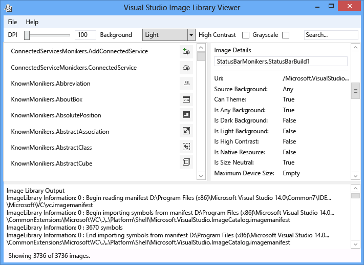
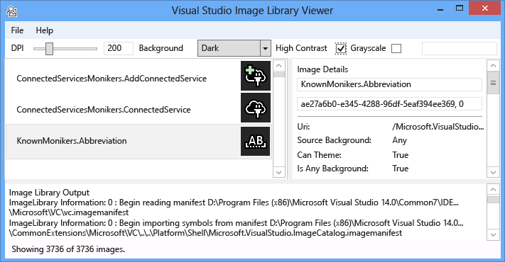
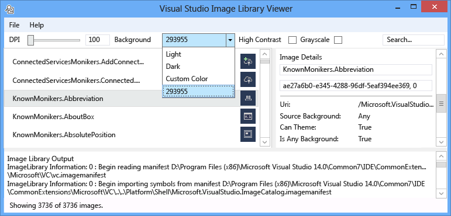
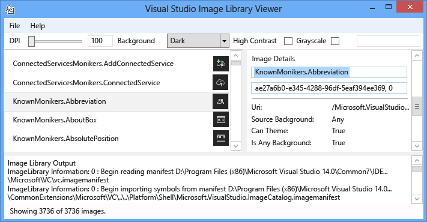
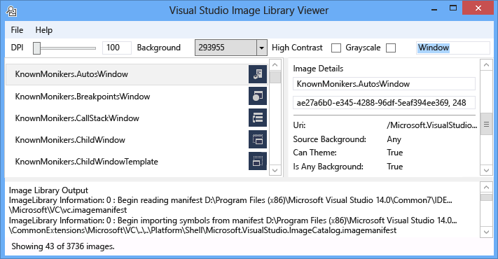
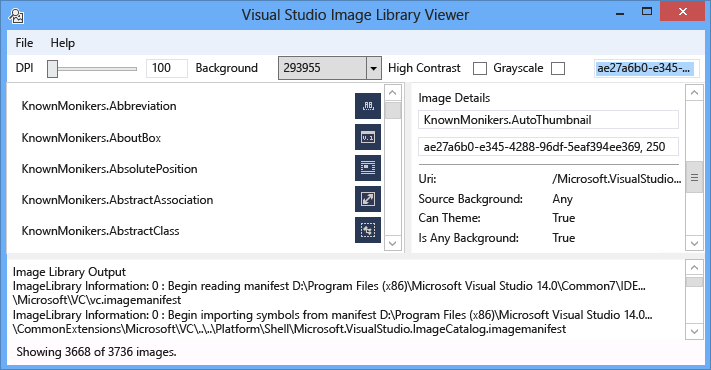
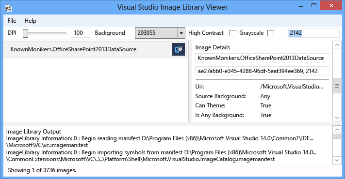

# Visualizzatore della libreria di immagini
[!INCLUDE[vs2017banner](../../code-quality/includes/vs2017banner.md)]

Lo strumento libreria Visualizzatore immagini di Visual Studio è possibile caricare e cercare i manifesti dell'immagine, consentendo all'utente di modificarli in modo identico a Visual Studio. L'utente può modificare in background, dimensioni, DPI, contrasto elevato e altre impostazioni. Inoltre, lo strumento visualizza le informazioni di caricamento per ogni manifesto immagine e visualizza le informazioni di origine per ogni immagine nel manifesto dell'immagine. Questo strumento è utile per:  
  
1.  Diagnostica degli errori  
  
2.  Per garantire gli attributi sono impostati correttamente nei manifesti immagine personalizzata  
  
3.  La ricerca delle immagini dell'immagine del catalogo di Visual Studio in modo che un'estensione di Visual Studio è possibile utilizzare le immagini adatti allo stile di Visual Studio  
  
   
  
 **Moniker immagine**  
  
 Un moniker immagine (o moniker per brevità) è una coppia di GUID:ID che identifica in modo univoco un asset elenco immagine nella raccolta immagini o asset immagine.  
  
 **File manifesti di immagine**  
  
 File di immagine manifesto (.imagemanifest) sono file XML che definiscono un set di risorse di immagini, il moniker che rappresentano tali risorse e reali le immagini che rappresentano ogni asset. Manifesti dell'immagine è possibile definire immagini autonomo o elenchi di immagini per il supporto dell'interfaccia utente legacy. Inoltre, esistono attributi che possono essere impostati sull'asset o sulle singole immagini dietro ogni asset cambiare la data e la modalità di visualizzazione di tali risorse.  
  
 **Schema del manifesto dell'immagine**  
  
 Un manifesto di completare l'immagine è simile al seguente:  
  
```xml  
<ImageManifest>  
      <!-- zero or one Symbols elements -->  
      <Symbols>  
        <!-- zero or more Guid, ID, or String elements -->  
      </Symbols>  
      <!-- zero or one Images elements -->  
      <Images>  
        <!-- zero or more Image elements -->  
      </Images>  
      <!-- zero or one ImageLists elements -->  
      <ImageLists>  
        <!-- zero or more ImageList elements -->  
      </ImageLists>  
</ImageManifest>  
```  
  
 **Simboli**  
  
 Come favorire una leggibilità e la manutenzione, il manifesto dell'immagine è possibile utilizzare i simboli per i valori di attributo. Vengono definiti i simboli simile al seguente:  
  
```xml  
<Symbols>  
      <Import Manifest="manifest" />  
      <Guid Name="ShellCommandGuid" Value="8ee4f65d-bab4-4cde-b8e7-ac412abbda8a" />  
      <ID Name="cmdidSaveAll" Value="1000" />  
      <String Name="AssemblyName" Value="Microsoft.VisualStudio.Shell.UI.Internal" />  
</Symbols>  
```  
  
|||  
|-|-|  
|**Sottoelemento**|**Definizione**|  
|Import|Importa i simboli del file di manifesto specificato per l'utilizzo nel manifesto corrente.|  
|Guid|Il simbolo rappresenta un GUID e deve corrispondere la formattazione di GUID.|  
|ID|Il simbolo rappresenta un ID e deve essere un numero intero non negativo.|  
|String|Il simbolo rappresenta un valore stringa arbitraria.|  
  
 Distinzione maiuscole/minuscole e di riferimento utilizzando la sintassi $(symbol-name) sono simboli:  
  
```xml  
<Image Guid="$(ShellCommandGuid)" ID="$(cmdidSaveAll)" >  
      <Source Uri="/$(AssemblyName);Component/Resources/image.xaml" />  
</Image>  
```  
  
 Alcuni simboli sono già definiti per tutti i manifesti. Questi possono essere utilizzati nell'attributo dell'Uri di \< origine> o \< importazione> elemento ai percorsi di riferimento sul computer locale.  
  
|||  
|-|-|  
|**Simbolo**|**Descrizione**|  
|CommonProgramFiles|Il valore della variabile di ambiente % CommonProgramFiles %|  
|LocalAppData|Il valore della variabile di ambiente % LocalAppData %|  
|ManifestFolder|La cartella contenente il file manifesto|  
|Documenti|Il percorso completo della cartella documenti dell'utente corrente|  
|ProgramFiles|Il valore della variabile di ambiente % ProgramFiles %|  
|System|Nella cartella Windows\System32|  
|WinDir|Il valore della variabile di ambiente % WinDir %|  
  
 **Immagine**  
  
 Il \< immagine> elemento definisce un'immagine che è possibile fare riferimento da un moniker. Il GUID e ID complessivamente formano il moniker di immagine. Il moniker per l'immagine deve essere univoco in libreria intera immagine. Se più di un'immagine dispone di un moniker specificato, il primo durante la generazione della libreria è quello che viene mantenuto.  
  
 Deve contenere almeno un'origine. La dimensione neutral origini fornirà i migliori risultati in una vasta gamma di dimensioni, non sono necessarie. Se il servizio è richiesto per un'immagine di dimensioni non è definita nel \< immagine> elemento ed è presente alcuna origine indipendente dalla dimensione, il servizio scegliere la migliore fonte di dimensioni specifiche e scalabilità per la dimensione richiesta.  
  
```xml  
<Image Guid="guid" ID="int" AllowColorInversion="true/false">  
      <Source ... />  
      <!-- optional additional Source elements -->  
</Image>  
```  
  
|||  
|-|-|  
|**Attributo**|**Definizione**|  
|Guid|[Obbligatorio] La parte GUID del moniker immagine|  
|ID|[Obbligatorio] La porzione dell'ID del moniker immagine|  
|AllowColorInversion|[Facoltativo, valore predefinito true] Indica se l'immagine può avere i colori invertiti a livello di codice quando viene utilizzato su uno sfondo scuro.|  
  
 **Origine**  
  
 Il \< origine> elemento definisce una risorsa di origine immagine singola (XAML e PNG).  
  
```xml  
<Source Uri="uri" Background="background">  
      <!-- optional NativeResource element -->  
 </Source>  
```  
  
|||  
|-|-|  
|**Attributo**|**Definizione**|  
|URI|[Obbligatorio] URI che definisce dove è possibile caricare l'immagine da. Può essere uno dei seguenti:<br /><br /> -A [Pack URI](http://msdn.microsoft.com/en-US/library/aa970069\(v=vs.100\).aspx) utilizzando l'applicazione: / / / autorità<br /><br /> -Un riferimento a una risorsa componente assoluto<br /><br /> -Un percorso di un file contenente una risorsa nativa|  
|Sfondo|[Facoltativo] Indica quali tipo di origine deve essere utilizzata in background.<br /><br /> Può essere uno dei seguenti:<br /><br /> - *Light*: l'origine può essere utilizzata su uno sfondo.<br /><br /> - *Scuro*: l'origine può essere utilizzata su uno sfondo scuro.<br /><br /> - *Contrasto elevato*: l'origine può essere utilizzata su uno sfondo in modalità contrasto elevato.<br /><br /> - *HighContrastLight*: l'origine può essere utilizzata su uno sfondo in modalità contrasto elevato.<br /><br /> -*HighContrastDark*: l'origine può essere utilizzata su uno sfondo scuro in modalità contrasto elevato.<br /><br /> Se il **Background** attributo viene omesso, l'origine può essere utilizzato su uno sfondo.<br /><br /> Se **Background** è *Light*, *scuro*, *HighContrastLight*, o *HighContrastDark*, i colori dell'origine non vengono mai invertiti. Se **Background** viene omesso o impostato su *contrasto*, l'inversione dei colori dell'origine viene controllata l'immagine **AllowColorInversion** attributo.|  
  
 Oggetto \< origine> elemento può avere esattamente uno dei sottoelementi facoltativi seguenti:  
  
||||  
|-|-|-|  
|**Elemento**|**Attributi (tutti necessari)**|**Definizione**|  
|\< dimensione>|Valore|L'origine verrà utilizzata per le immagini della dimensione specificata (in unità di dispositivo). L'immagine sarà quadrato.|  
|\< SizeRange>|MinSize, MaxSize|L'origine verrà utilizzata per le immagini dalla MinSize MaxSize (in unità di dispositivo), inclusi. L'immagine sarà quadrato.|  
|\< dimensioni>|Larghezza, altezza|L'origine verrà utilizzata per le immagini della larghezza e l'altezza (in unità di dispositivo).|  
|\< DimensionRange>|MinWidth, MinHeight,<br /><br /> MaxWidth, MaxHeight|L'origine verrà utilizzata per le immagini dalla larghezza/altezza minima larghezza/altezza massima (in unità di dispositivo), inclusi.|  
  
 Oggetto \< origine> elemento può anche disporre di un \< NativeResource> sottoelemento che definisce un \< origine> che viene caricato da un assembly nativo piuttosto che un assembly gestito.  
  
```xml  
<NativeResource Type="type" ID="int" />  
```  
  
|||  
|-|-|  
|**Attributo**|**Definizione**|  
|Tipo|[Obbligatorio] Il tipo di risorsa nativa, XAML o PNG|  
|ID|[Obbligatorio] Il quoziente di ID di risorsa nativa|  
  
 **ImageList**  
  
 Il \< ImageList> elemento definisce una raccolta di immagini che possono essere restituiti in un singolo elenco. L'elenco viene compilato su richiesta, in base alle esigenze.  
  
```xml  
<ImageList>  
      <ContainedImage Guid="guid" ID="int" External="true/false" />  
      <!-- optional additional ContainedImage elements -->  
 </ImageList>  
```  
  
|||  
|-|-|  
|**Attributo**|**Definizione**|  
|Guid|[Obbligatorio] La parte GUID del moniker immagine|  
|ID|[Obbligatorio] La porzione dell'ID del moniker immagine|  
|Esterno|[Facoltativo, valore predefinito false] Indica se il moniker immagine fa riferimento a un'immagine nel manifesto corrente.|  
  
 Il moniker per l'immagine indipendente non è necessario fare riferimento a un'immagine definita nel manifesto corrente. Se l'immagine indipendente non viene trovato nella raccolta immagini, un'immagine segnaposto vuota da utilizzare al suo posto.  
  
## <a name="how-to-use-the-tool"></a>Procedura: utilizzare lo strumento  
 **Convalida di un manifesto immagine personalizzata**  
  
 Per creare un manifesto personalizzato, è consigliabile utilizzare lo strumento ManifestFromResources per generare automaticamente il manifesto. Per convalidare il manifesto personalizzato, avviare il Visualizzatore della libreria di immagini e selezionare File > imposta percorsi... Per aprire la finestra di dialogo Directory di ricerca. Directory di ricerca verrà utilizzato per caricare i manifesti di immagine, ma utilizzerà inoltre esaminarli per individuare i file con estensione dll che contengono le immagini in un manifesto, pertanto assicurarsi di includere il manifesto e directory DLL in questa finestra di dialogo.  
  
   
  
 Fare clic su **Aggiungi...** Per selezionare nuova directory di ricerca per cercare i manifesti e le relative DLL corrispondente. Lo strumento memorizzerà le directory di ricerca e può essere attivate o disattivata selezionando o deselezionando una directory.  
  
 Per impostazione predefinita, lo strumento tenterà di trovare la directory di installazione di Visual Studio e aggiungere tali directory all'elenco di directory di ricerca. È possibile aggiungere manualmente le directory che non viene trovato lo strumento.  
  
 Una volta che vengono caricati tutti i manifesti, lo strumento consente di attivare o disattivare **background** colori **DPI**, **contrasto elevato**, o **grigio** per le immagini in modo che un utente può controllare visivamente gli asset delle immagini per verificare viene eseguito il rendering in modo corretto per diverse impostazioni.  
  
   
  
 Alla luce, scuro o un valore personalizzato, è possibile impostare il colore di sfondo. Se si seleziona "Colore personalizzato" verrà aprire una finestra di dialogo Selezione colori e aggiungere tale colore personalizzato nella parte inferiore della casella combinata in background per richiamare facilmente in un secondo momento.  
  
   
  
 Selezione di un moniker di immagine vengono visualizzate le informazioni per ogni immagine reale dietro il moniker nel riquadro dei dettagli di immagine a destra. Il riquadro consente inoltre agli utenti di copiare un moniker tramite nome o valore GUID:ID non elaborato.  
  
   
  
 Le informazioni visualizzate per ogni origine dell'immagine includono il tipo di sfondo per visualizzarlo, se è possibile applicare un tema o supporta contrasto elevato, le dimensioni è valido per o se è indipendente dalla dimensione e se l'immagine proviene da un assembly nativo.  
  
   
  
 Quando si convalida un manifesto dell'immagine, è consigliabile distribuire il manifesto e l'immagine DLL nelle rispettive posizioni reali. Ciò consente di verificare che tutti i percorsi relativi funzionino correttamente e che la libreria di immagini è possibile individuare e caricare il manifesto e l'immagine DLL.  
  
 **Cercare il catalogo di immagini KnownMonikers**  
  
 Per una migliore corrispondenza con lo stile di Visual Studio, un'estensione di Visual Studio può usare immagini in Visual Studio immagine catalogo anziché creare e con i propri. Questo ha il vantaggio di non dover gestire tali immagini e garantisce che l'immagine avrà un'immagine ad alta risoluzione in modo dovrebbe essere corretto in tutte le impostazioni DPI supportati da Visual Studio.  
  
 Il Visualizzatore della libreria di immagini consente di eseguire la ricerca in modo che un utente può trovare il moniker che rappresenta una risorsa immagine, utilizzare il moniker nel codice un manifesto. Per cercare le immagini, immettere il termine di ricerca desiderati nella casella di ricerca e premere INVIO. La barra di stato nella parte inferiore verrà visualizzato il numero di corrispondenze trovato da immagini totale in tutti i manifesti.  
  
   
  
 Quando si cerca moniker immagine manifesti esistenti, è consigliabile cercare di utilizzare solo moniker di Visual Studio immagine del catalogo, altri moniker intenzionalmente pubblicamente accessibile o il proprio moniker personalizzati. Se si utilizza il moniker non pubblico, interfaccia Utente personalizzata potrebbe essere interrotta o le immagini di modifiche apportate in modo imprevisto se o quando tali moniker pubblici e le immagini vengono modificate o aggiornate.  
  
 Inoltre, è possibile ricerca in base al GUID. Questo tipo di ricerca è utile per il filtro in basso nell'elenco a un unico manifesto o sottosezione singola di un manifesto manifesto se contiene più GUID.  
  
   
  
 Infine, la ricerca per ID è possibile anche.  
  
   
  
## <a name="notes"></a>Note  
  
-   Per impostazione predefinita, lo strumento effettuerà il pull nei diversi manifesti immagine presenti nella directory di installazione di Visual Studio. È l'unico con moniker utilizzabile pubblicamente il **Microsoft.VisualStudio.ImageCatalog** manifesto. GUID: ae27a6b0-e345-4288-96df-5eaf394ee369 (si **non** eseguire l'override di questo GUID in un manifesto personalizzato) tipo: KnownMonikers  
  
-   Lo strumento tenta all'avvio di caricare tutti i manifesti dell'immagine che vengono trovati, potrebbe richiedere alcuni secondi per l'applicazione vengono visualizzati. Potrebbe inoltre essere lento o che non risponde durante il caricamento dei manifesti.  
  
## <a name="sample-output"></a>Esempio di output  
 Questo strumento non genera alcun output.