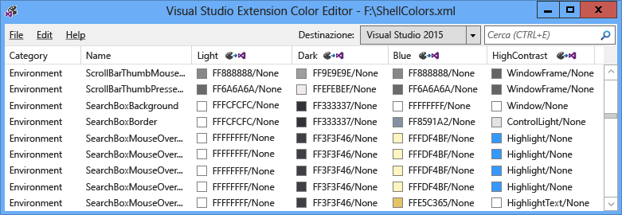
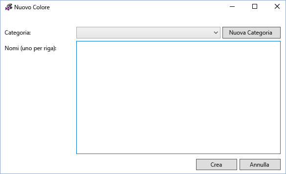
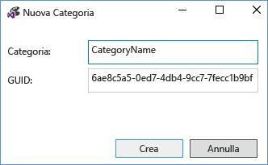
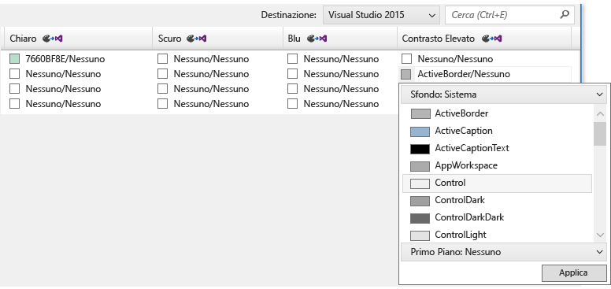
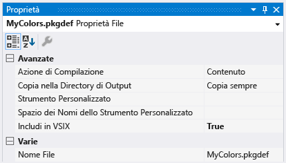
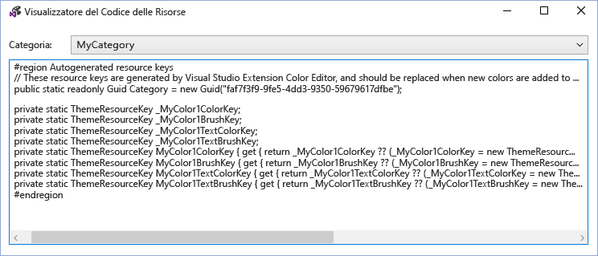
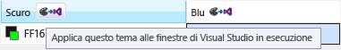

# <a name="vsix-color-editor"></a>Editor dei colori VSIX
Lo strumento Editor colore di estensione di Visual Studio è possibile creare e modificare i colori personalizzati per Visual Studio. Lo strumento può inoltre generare chiavi di risorsa tema in modo che i colori possono essere usati nel codice. Questo strumento è utile per rendere i colori per un'estensione di Visual Studio che supporta i temi. Questo strumento è possibile aprire i file. pkgdef e XML. Dei temi di Visual Studio (file .vstheme) utilizzabile con Visual Studio estensione Editor di colori modificando l'estensione di file in file con estensione XML. Inoltre, i file di .vstheme possono essere importati in un file con estensione XML corrente.  
  
   
  
 **File di definizione del pacchetto**  
  
 File di definizione (pkgdef) del pacchetto sono i file che definiscono i temi. I colori stessi vengono archiviati in file con estensione XML di tema colori, che vengono compilati in un file. pkgdef. I file. pkgdef sono distribuiti su percorsi di ricerca di Visual Studio, elaborati in fase di esecuzione e uniti in modo da definire temi.  
  
 **Token di colore**  
  
 Un token di colore è costituito da quattro elementi:  
  
-   **Nome della categoria:** un raggruppamento logico per un set di colori. Se sono già presenti colori specifici per l'elemento dell'interfaccia utente desiderato, o il gruppo di elementi dell'interfaccia utente, utilizzare un nome di categoria esistente.  
  
-   **Nome token:** un nome descrittivo per il token di colore e il set di token. Devono essere denominati in modo che risulti semplice identificare le coppie e gli Stati che si applicano a set di includono in background e i nomi di token di primo piano (testo), nonché tutti i relativi stati.  
  
-   **Colore di valori (o tonalità):** necessari per ogni tema colorato. Creare sempre sfondo e del testo i valori di colore in coppie. I colori vengono combinati per sfondo/primo piano in modo che il colore del testo (in primo piano) è sempre leggibile contro il colore di sfondo in cui viene disegnato. Questi colori sono collegati e vengono usati insieme nell'interfaccia utente. Se lo sfondo non deve essere utilizzato con il testo, non definire un colore di primo piano.  
  
-   **Il nome di colore di sistema:** per l'utilizzo nelle visualizzazioni di contrasto elevato.  
  
## <a name="how-to-use-the-tool"></a>Come utilizzare lo strumento  
 Per quanto possibile, e laddove appropriato, i colori di Visual Studio esistenti devono essere riutilizzati anziché eseguire nuovi. Tuttavia, per casi in cui non vengono definiti i colori appropriati, colori personalizzati devono essere creati per mantenere i temi di un'estensione compatibile.  
  
 **Creazione di nuovi token di colore**  
  
 Per creare colori personalizzati utilizzando l'Editor colore estensione di Visual Studio, seguire questi passaggi:  
  
1.  Determinare i nomi di categoria e il token per il nuovo token di colore.  
  
2.  Scegliere le tonalità che utilizza l'elemento dell'interfaccia utente per ogni tema e il colore di sistema per contrasto elevato.  
  
3.  Utilizzare l'editor dei colori per creare nuovi token di colore.  
  
4.  Utilizzare i colori in un'estensione di Visual Studio.  
  
5.  Verificare le modifiche in Visual Studio.  
  
 **Passaggio 1: Determinare la categoria e i nomi di token per il nuovo token di colore.**  
  
 La denominazione preferito schema per un VSColor è **[Category] [tipo di interfaccia utente] [stato]**. Non utilizzare la parola "color" nei nomi VSColor, come è ridondante.  
  
 I nomi di categoria forniscono raggruppamenti logici e devono essere definiti come ristretto possibile. Ad esempio, il nome di una finestra degli strumenti singolo può essere un nome di categoria, ma non è il nome di un team di progetto o unità intera azienda. Le voci in categorie di raggruppamento consente di evitare confusione tra i colori con lo stesso nome.  
  
 Un nome di token deve indicare chiaramente il tipo di elemento e le situazioni o "stato", per cui verrà applicato il colore. Del ad esempio, un active suggerimento dati **[tipo di interfaccia utente]** potrebbero essere denominati "**suggerimento dati**" e **[stato]** potrebbero essere denominati "**Active**," risultante in un nome del "**DataTipActive**." Poiché i suggerimenti dati text, è necessario definire sia un primo piano e un colore di sfondo. Utilizzando una coppia sfondo/primo piano, editor di colori crea automaticamente i colori "**DataTipActive**" per lo sfondo e "**DataTipActiveText**" per il primo piano.  
  
 Se la parte dell'interfaccia utente ha un solo stato, il **[stato]** parte del nome può essere omesso. Ad esempio, se una casella di ricerca ha un bordo ed è presente alcuna modifica di stato che influirebbe colore del bordo, quindi il nome per il token di colore del bordo può semplicemente essere chiamato "**SearchBoxBorder**."  
  
 Alcuni nomi di stato comuni includono:  
  
-   Attivo  
  
-   Inattivo  
  
-   MouseOver  
  
-   MouseDown  
  
-   Selezionato  
  
-   Con stato attivo  
  
 Esempi di alcuni nomi di token per parti di un controllo elemento elenco:  
  
-   ListItem  
  
-   ListItemBorder  
  
-   ListItemMouseOver  
  
-   ListItemMouseOverBorder  
  
-   ListItemSelected  
  
-   ListItemSelectedBorder  
  
-   ListItemDisabled  
  
-   ListItemDisabledBorder  
  
 **Passaggio 2: Scegliere le tonalità che utilizza l'elemento dell'interfaccia utente per ogni tema e il colore di sistema per contrasto elevato.**  
  
 Quando si scelgono colori personalizzati per l'interfaccia utente, selezionare un elemento di interfaccia utente simile esistente e utilizzare i colori come base. I colori per gli elementi dell'interfaccia utente nella casella sottoposte a livello di revisione e test, in modo che verrà Cerca appropriati e funzionino correttamente in tutti i temi.  
  
 **Passaggio 3: Utilizzare l'editor dei colori per creare nuovi token di colore.**  
  
 Avviare l'editor di colori e aprire o creare un nuovo file XML di colori tema personalizzato. Selezionare **Modifica > nuovo colore** dal menu. Verrà aperta una finestra di dialogo per specificare la categoria e uno o più nomi per le voci di colore all'interno di tale categoria:  
  
   
  
 Selezionare una categoria esistente oppure **nuova categoria** per creare una nuova categoria. Verrà aperta un'altra finestra di dialogo, creando un nuovo nome di categoria:  
  
   
  
 La nuova categoria quindi diventano disponibile nel **nuovo colore** menu a discesa categoria. Dopo aver scelto una categoria, immettere un nome per riga per ogni nuovo token di colore e selezionare "Crea" al termine:  
  
   
  
 I valori di colore vengono visualizzati in coppia sfondo/primo piano, con "None" che indica che il colore non è stato definito. Nota: se un colore non dispone di un testo o coppia di colori di sfondo a colori, quindi solo lo sfondo deve essere definita.  
  
   
  
 Per modificare un token di colore, selezionare un colore per il tema (colonna) del token. Aggiungere il valore di colore digitando un valore di colore in formato esadecimale nel formato ARGB a 8 cifre, immettere il nome di un colore di sistema nella cella, o utilizzando il menu a discesa per selezionare il colore desiderato tramite un set di cursori colore o un elenco di colori di sistema.  
  
   
  
   
  
 Per i componenti che non è necessario per visualizzare il testo, immettere il valore di un solo colore: il colore di sfondo. In caso contrario, immettere i valori per il colore di sfondo e di testo, separato da una barra rovesciata.  
  
 Quando si immettono valori per contrasto elevato, immettere i nomi di colori di sistema Windows validi. Non immettere valori ARGB hardcoded. Se si seleziona "Sfondo: sistema" o "in primo piano:" dai menu a discesa valore colore, è possibile visualizzare un elenco di nomi di colore di sistema valido. Durante la creazione di elementi che contengono componenti di testo, utilizzare la coppia di colori di sfondo correzione sistema o il testo potrebbe essere illeggibile.  
  
 Al termine delle operazioni di creazione, l'impostazione e modifica i token di colore, salvarle nel formato. pkgdef o XML desiderato. I token di colore con uno sfondo né né un set di primo piano verrà salvato come colori vuoti in formato XML, ma eliminato nel formato. pkgdef. Una finestra di dialogo verrà visualizzato un avviso di potenziale perdita di colore se si tenta di salvare i colori vuoti in un file. pkgdef.  
  
 **Passaggio 4: Utilizzare i colori in un'estensione di Visual Studio.**  
  
 Dopo aver definito il nuovo colore di token, includere il pkgdef nel file di progetto con l'opzione "Compila azione" impostato su "Contenuto" e "Includi in VSIX" impostato su "True".  
  
   
  
 Nell'Editor di Visual Studio estensione colore, scegliere File > Visualizza risorse codice per visualizzare il codice che viene utilizzato per l'accesso personalizzato colori nell'interfaccia utente basato su WPF.  
  
   
  
 Includere questo codice in una classe statica nel progetto. Un riferimento a **Microsoft.VisualStudio.Shell.\< VSVersion >.0.dll** deve essere aggiunto al progetto per utilizzare il **ThemeResourceKey** tipo.  
  
```csharp  
namespace MyCustomColors  
{  
    public static class MyCategory  
    {  
        #region Autogenerated resource keys  
        // These resource keys are generated by Visual Studio Extension Color Editor, and should be replaced when new colors are added to this category.  
        public static readonly Guid Category = new Guid("faf7f3f9-9fe5-4dd3-9350-59679617dfbe");  
  
        private static ThemeResourceKey _MyColor1ColorKey;  
        private static ThemeResourceKey _MyColor1BrushKey;  
        private static ThemeResourceKey _MyColor1TextColorKey;  
        private static ThemeResourceKey _MyColor1TextBrushKey;  
        public static ThemeResourceKey MyColor1ColorKey { get { return _MyColor1ColorKey ?? (_MyColor1ColorKey = new ThemeResourceKey(Category, "MyColor1", ThemeResourceKeyType.BackgroundColor)); } }  
        public static ThemeResourceKey MyColor1BrushKey { get { return _MyColor1BrushKey ?? (_MyColor1BrushKey = new ThemeResourceKey(Category, "MyColor1", ThemeResourceKeyType.BackgroundBrush)); } }  
        public static ThemeResourceKey MyColor1TextColorKey { get { return _MyColor1TextColorKey ?? (_MyColor1TextColorKey = new ThemeResourceKey(Category, "MyColor1", ThemeResourceKeyType.ForegroundColor)); } }  
        public static ThemeResourceKey MyColor1TextBrushKey { get { return _MyColor1TextBrushKey ?? (_MyColor1TextBrushKey = new ThemeResourceKey(Category, "MyColor1", ThemeResourceKeyType.ForegroundBrush)); } }  
        #endregion  
    }  
}  
```  
  
 Questo consente l'accesso per i colori nel codice XAML e l'interfaccia utente per rispondere alle modifiche al tema.  
  
```xaml  
<UserControl x:Class="NewTestProject.TestPackageControl" Name="MyToolWindow"  
             xmlns="http://schemas.microsoft.com/winfx/2006/xaml/presentation"  
             xmlns:x="http://schemas.microsoft.com/winfx/2006/xaml"  
             xmlns:ns="clr-namespace:MyCustomColors">  
  <Grid>  
    <TextBlock Background="{DynamicResource {x:Static ns:MyCategory.MyColor1BrushKey}}"  
               Foreground="{DynamicResource {x:Static ns:MyCategory.MyColor1TextBrushKey}}"  
      >Sample Text</TextBlock>  
  
  </Grid>  
</UserControl>  
```  
  
 **Passaggio 5: Testare le modifiche in Visual Studio.**  
  
 Editor dei colori applicare temporaneamente i token di colore per le istanze in esecuzione di Visual Studio per visualizzare le modifiche in tempo reale per i colori senza ricompilare il pacchetto di estensione. A tale scopo, fare clic sul pulsante "Applica questo tema alle finestre di Visual Studio esegue" si trova nell'intestazione di ogni colonna del tema. Quando viene chiuso l'Editor dei colori VSIX non verrà più visualizzato il tema temporaneo.  
  
   
  
 Per rendere permanenti le modifiche, ricompilare e ridistribuire l'estensione di Visual Studio dopo aver aggiunto i nuovi colori per il file. pkgdef e scrivere il codice che utilizzerà questi colori. La ricompilazione di estensione di Visual Studio consentono di unire i valori del Registro di sistema per i nuovi colori nel resto dei temi. Riavviare Visual Studio, visualizzare l'interfaccia utente e verificare che i nuovi colori vengono visualizzati come previsto.  
  
## <a name="notes"></a>Note  
 Questo strumento deve essere utilizzata per la creazione di colori personalizzati per i temi di Visual Studio preesistenti, oppure per modificare i colori di un tema personalizzato di Visual Studio. Per creare i temi di Visual Studio personalizzati completati, scaricare il [estensione di editor del tema colori di Visual Studio](http://visualstudiogallery.msdn.microsoft.com/6f4b51b6-5c6b-4a81-9cb5-f2daa560430b) dalla raccolta di estensioni di Visual Studio.  
  
## <a name="sample-output"></a>Esempio di output  
 **Output di colore XML**  
  
 Il file XML generato dallo strumento sarà simile al seguente:  
  
```xml  
<Themes>  
  <Theme Name="Light" GUID="{de3dbbcd-f642-433c-8353-8f1df4370aba}">  
    <Category Name="CategoryName" GUID="{eee9d521-dac2-48d9-9a5e-5c625ba2040c}">  
      <Color Name="ColorName1">  
        <Background Type="CT_RAW" Source="FFFFFFFF" />  
      </Color>  
      <Color Name="ColorName2">  
        <Background Type="CT_RAW" Source="FFFFFFFF" />  
        <Foreground Type="CT_RAW" Source="FF000000" />  
      </Color>  
      <Color Name="ColorName3">  
        <Background Type="CT_RAW" Source="FFFF0000" />  
      </Color>  
      <Color Name="ColorName4">  
        <Background Type="CT_RAW" Source="FF000088" />  
        <Foreground Type="CT_RAW" Source="FFFFFFFF" />  
      </Color>  
    </Category>  
  </Theme>  
  <Theme Name="Dark" GUID="{1ded0138-47ce-435e-84ef-9ec1f439b749}">...</Theme>  
  <Theme Name="Blue" GUID="{a4d6a176-b948-4b29-8c66-53c97a1ed7d0}">...</Theme>  
  <Theme Name="HighContrast" GUID="{a5c004b4-2d4b-494e-bf01-45fc492522c7}">...</Theme>  
</Themes>  
  
```  
  
 **Output di colore PKGDEF**  
  
 Il file. pkgdef generato dallo strumento sarà simile al seguente:  
  
```  
[$RootKey$\Themes\{de3dbbcd-f642-433c-8353-8f1df4370aba}\CategoryName]  
"Data"=hex:78,00,00,00,0b,00,00,00,01,00,00,00,21,d5,e9,ee,c2,da,d9,48,9a,5e,5c,62,5b,a2,04,0c,04,00,00,00,0a,00,00,00,43,6f,6c,6f,72,4e,61,6d,65,31,01,ff,ff,ff,ff,00,0a,00,00,00,43,6f,6c,6f,72,4e,61,6d,65,32,01,ff,ff,ff,ff,01,00,00,00,ff,0a,00,00,00,43,6f,6c,6f,72,4e,61,6d,65,33,01,ff,00,00,ff,00,0a,00,00,00,43,6f,6c,6f,72,4e,61,6d,65,34,01,00,00,88,ff,01,ff,ff,ff,ff  
[$RootKey$\Themes\{1ded0138-47ce-435e-84ef-9ec1f439b749}\CategoryName]  
"Data"=hex:...  
[$RootKey$\Themes\{a4d6a176-b948-4b29-8c66-53c97a1ed7d0}\CategoryName]  
"Data"=hex:...  
[$RootKey$\Themes\{a5c004b4-2d4b-494e-bf01-45fc492522c7}\CategoryName]  
"Data"=hex:...  
  
```  
  
 **Wrapper di chiavi di risorsa in c#**  
  
 Le chiavi di risorsa colore generate dallo strumento sarà simile al seguente:  
  
```csharp  
namespace MyNamespace  
{  
    public static class MyColors  
    {  
        #region Autogenerated resource keys  
        // These resource keys are generated by Visual Studio Extension Color Editor, and should be replaced when new colors are added to this category.  
  
        public static string ColorName1ColorKey { get { return "ColorName1ColorKey"; } }  
        public static string ColorName1BrushKey { get { return "ColorName1BrushKey"; } }  
  
        public static string ColorName2ColorKey { get { return "ColorName2ColorKey"; } }  
        public static string ColorName2BrushKey { get { return "ColorName2BrushKey"; } }  
        public static string ColorName2TextColorKey { get { return "ColorName2TextColorKey"; } }  
        public static string ColorName2TextBrushKey { get { return "ColorName2TextBrushKey"; } }  
  
        public static string ColorName3ColorKey { get { return "ColorName4ColorKey"; } }  
        public static string ColorName3BrushKey { get { return "ColorName4BrushKey"; } }  
        public static string ColorName3TextColorKey { get { return "ColorName4TextColorKey"; } }  
        public static string ColorName3TextBrushKey { get { return "ColorName4TextBrushKey"; } }  
        #endregion  
    }  
}  
```  
  
 **Wrapper di dizionario risorse WPF**  
  
 Il colore **ResourceDictionary** chiavi generate dallo strumento sarà simile al seguente:  
  
```xaml  
<ResourceDictionary xmlns="http://schemas.microsoft.com/winfx/2006/xaml/presentation"  
        xmlns:x="http://schemas.microsoft.com/winfx/2006/xaml"  
        xmlns:colors="clr-namespace:MyNamespace">  
  
  <SolidColorBrush x:Key="{x:Static colors:MyColors.ColorName1BrushKey}" Color="#FFFFFFFF" />  
  <Color x:Key="{x:Static colors:MyColors.ColorName1ColorKey}" A="255" R="255" G="255" B="255" />  
  
  <SolidColorBrush x:Key="{x:Static colors:MyColors.ColorName2BrushKey}" Color="#FFFFFFFF" />  
  <Color x:Key="{x:Static colors:MyColors.ColorName2ColorKey}" A="255" R="255" G="255" B="255" />  
  <SolidColorBrush x:Key="{x:Static colors:MyColors.ColorName2TextBrushKey}" Color="#FF000000" />  
  <Color x:Key="{x:Static colors:MyColors.ColorName2TextColorKey}" A="255" R="0" G="0" B="0" />  
  
  <SolidColorBrush x:Key="{x:Static colors:MyColors.ColorName3BrushKey}" Color="#FFFF0000" />  
  <Color x:Key="{x:Static colors:MyColors.ColorName3ColorKey}" A="255" R="255" G="0" B="0" />  
  
  <SolidColorBrush x:Key="{x:Static colors:MyColors.ColorName4BrushKey}" Color="#FF000088" />  
  <Color x:Key="{x:Static colors:MyColors.ColorName4ColorKey}" A="255" R="0" G="0" B="136" />  
  <SolidColorBrush x:Key="{x:Static colors:MyColors.ColorName4TextBrushKey}" Color="#FFFFFFFF" />  
  <Color x:Key="{x:Static colors:MyColors.ColorName4TextColorKey}" A="255" R="255" G="255" B="255" />  
</ResourceDictionary>  
```