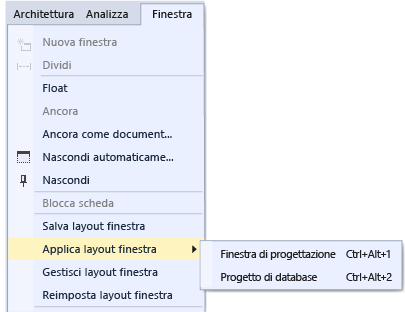

# Personalizzare il layout delle finestre in Visual Studio
In Visual Studio è possibile personalizzare la posizione, la dimensione e il comportamento delle finestre per creare layout di finestra ottimali per i vari flussi di lavoro relativi allo sviluppo. Quando si personalizza il layout, l'IDE memorizza le modifiche apportate. Se, ad esempio, si modifica la posizione di ancoraggio di **Esplora soluzioni** e quindi si chiude Visual Studio, al successivo avvio di **Esplora soluzioni** , anche se si utilizza un altro computer, la finestra risulterà ancorata nella stessa posizione. È anche possibile fornire un nome a un layout personalizzato e salvarlo, quindi passare da un layout all'altro con un unico comando. È ad esempio possibile creare un layout per la modifica e un altro per il debug e passare dall'uno all'altro usando il comando di menu **Finestra &#124; Applica layout finestra**.  

## Tipi di finestre  

### Finestre dei documenti e degli strumenti  
 L'IDE presenta due tipi di finestre di base: *finestre degli strumenti* e *finestre dei documenti*. Le finestre degli strumenti includono Esplora soluzioni, Esplora server, Finestra di output, Elenco errori, le finestre di progettazione, le finestre del debugger e così via. Le finestre dei documenti contengono i file del codice sorgente, file di testo arbitrario, file config e così via. Le finestre degli strumenti possono essere ridimensionate e trascinate dalla barra del titolo. Le finestre di documento possono essere trascinate dalla scheda. Fare clic con il pulsante destro del mouse sulla scheda o sulla barra del titolo per impostare altre opzioni della finestra.  

 Nel menu **Finestra** vengono visualizzate le opzioni disponibili per ancorare, rendere mobili e nascondere le finestre nell'IDE. Fare clic con il pulsante destro del mouse sulla barra del titolo o sulla scheda di una finestra per visualizzare opzioni aggiuntive per tale specifica finestra. È possibile visualizzare più istanze di determinate finestre degli strumenti per volta. Ad esempio, è possibile visualizzare più finestre di un browser Web, nonché creare ulteriori istanze di alcune finestre degli strumenti selezionando **Nuova finestra** nel menu **Finestra** .  

### Scheda Anteprima (finestre dei documenti)  
 Nella scheda Anteprima è possibile visualizzare i file nell'editor senza aprirli. È possibile visualizzare i file di anteprima selezionandoli in **Esplora soluzioni**, durante il debug quando si esegue l'istruzione nei file, con Vai a definizione e quando si esplorano i risultati di una ricerca. I file di anteprima vengono visualizzati in una scheda a destra della scheda del documento. Il file viene aperto per la modifica se viene modificato o se si sceglie **Apri**.  

### Gruppi di schede  
 I gruppi di schede estendono la possibilità di gestire l'area di lavoro limitata mentre si lavora con due o più documenti aperti nell'IDE. È possibile organizzare più finestre dei documenti e finestre degli strumenti in gruppi di schede orizzontali o verticali, nonché spostare i documenti in ordine casuale da un gruppo di schede a un altro.  

### Finestre divise  
 Quando è necessario visualizzare o modificare due percorsi contemporaneamente in un documento, è possibile dividere le finestre. Per dividere il documento in due sezioni che scorrono in modo indipendente, fare clic su **Dividi** nel menu **Finestra** . Fare clic su **Rimuovi divisione** nel menu **Finestra** per ripristinare la visualizzazione singola.  

### Barre degli strumenti  
 Le barre degli strumenti possono essere disposte trascinandole o utilizzando la finestra di dialogo **Personalizza** . Per altre informazioni su come posizionare e personalizzare le barre degli strumenti, vedere [How to: Customize Menus and Toolbars ](../ide/how-to-customize-menus-and-toolbars-in-visual-studio.md) (Procedura: Personalizzare i menu e le barre degli strumenti).  

## Disporre e ancorare le finestre  
 Le finestre dei documenti e le finestre degli strumenti possono essere *ancorate*in modo che abbiano una posizione e una dimensione all'interno della cornice della finestra dell'IDE. È anche possibile renderle mobili come finestre separate indipendenti dell'IDE. Le finestre degli strumenti possono essere ancorate in qualsiasi area all'interno della cornice dell'IDE; alcune di esse possono essere ancorate come finestre a schede nella cornice dell'editor. Le finestre dei documenti possono essere ancorate all'interno della cornice dell'editor e bloccate nella posizione corrente nell'ordine di tabulazione. È possibile ancorare più finestre per renderle mobili in un "raggruppamento" sopra o all'esterno dell'IDE. Le finestre degli strumenti possono anche essere nascoste o ridotte a icona.  

 È possibile disporre le finestre nei modi seguenti:  

-   Bloccare le finestre dei documenti a sinistra della scheda.  

-   Ancorare le schede delle finestre alla cornice per la modifica.  

-   Ancorare le finestre degli strumenti al bordo di una cornice nell'IDE.  

-   Rendere mobili le finestre dei documenti o degli strumenti sopra o all'esterno dell'IDE.  

-   Nascondere le finestre degli strumenti lungo il bordo dell'IDE.  

-   Visualizzare le finestre su monitor diversi.  

-   Reimpostare la posizione delle finestre sul layout predefinito o su un layout personalizzato salvato.  

 Le finestre dei documenti e degli strumenti possono essere disposte trascinandole, utilizzando i comandi nel menu **Finestra** e facendo clic con il pulsante destro del mouse sulla barra del titolo della finestra da disporre.  

> [!NOTE]
>  I nomi o i percorsi visualizzati per alcuni elementi dell'interfaccia utente di Visual Studio nelle istruzioni seguenti potrebbero essere diversi nel computer in uso. La versione di Visual Studio in uso e le impostazioni configurate determinano questi elementi. Per altre informazioni, vedere [Personalizzare l'IDE di Visual Studio](../ide/personalizing-the-visual-studio-ide.md).  

### Ancorare le finestre  
 Quando si seleziona e si trascina la barra del titolo di una finestra degli strumenti oppure la scheda della finestra del documento, viene visualizzata una guida a forma di rombo. Durante l'operazione di trascinamento, quando il cursore si trova sopra una delle frecce nel rombo, viene visualizzata un'area ombreggiata che mostra la posizione in cui verrà ancorata la finestra se viene rilasciato il mouse in quel preciso momento.  

 Per spostare una finestra ancorabile senza allinearla nella posizione desiderata, selezionare il tasto CTRL mentre si trascina la finestra.  

 Per ricollocare una finestra degli strumenti o una finestra del documento nella posizione di ancoraggio più recente, premere **CTRL** e fare doppio clic sulla scheda o sulla barra del titolo della finestra.  

 Nella figura seguente viene illustrata la guida a forma di rombo per le finestre dei documenti, che è possibile ancorare solo all'interno della cornice per la modifica:  

   

 Le finestre degli strumenti possono essere bloccate su un lato di una cornice nell'IDE o all'interno della cornice per la modifica. Per consentire all'utente di ancorare di nuovo la finestra facilmente, viene visualizzata una guida a forma di rombo quando si trascina una finestra degli strumenti in un'altra posizione.  

 Guida a forma di rombo per le finestre degli strumenti  

   

 Nella figura seguente viene illustrata la finestra Esplora soluzioni mentre viene ancorata in una nuova posizione, mostrata dall'area ombreggiata in blu:  

   

### Chiudere e nascondere automaticamente le finestre degli strumenti  
 È possibile chiudere una finestra degli strumenti facendo clic sulla X nella parte superiore destra della barra del titolo. Per riaprire la finestra, utilizzare l'abbreviazione da tastiera o il comando di menu appropriato. Le finestre degli strumenti supportano una funzionalità denominata Nascondi automaticamente, che fa in modo che una finestra scompaia dallo schermo quando si utilizza un'altra finestra. Quando una finestra viene nascosta automaticamente, il relativo nome viene visualizzato su una scheda sul bordo dell'IDE. Per utilizzare nuovamente la finestra, posizionare il mouse sulla scheda affinché sia possibile visualizzare di nuovo la finestra.  

   

> [!NOTE]
>  Per specificare se l'opzione Nascondi automaticamente debba essere applicata alle finestre degli strumenti singolarmente o in gruppi ancorati, selezionare o deselezionare **Nascondi automaticamente ha effetto solo sulla finestra degli strumenti attiva** nella finestra di dialogo **Opzioni** . Per altre informazioni, vedere [General, Environment, Options Dialog Box](../ide/reference/general-environment-options-dialog-box.md).  

> [!NOTE]
>  Le finestre degli strumenti con l'opzione Nascondi automaticamente abilitata potrebbero essere temporaneamente visualizzate quando la finestra ha lo stato attivo. Per nascondere di nuovo la finestra, selezionare un elemento all'esterno della finestra corrente. Quando la finestra non è nello stato attivo, non viene più visualizzata.  

### Indicazione di un secondo monitor  
 Se si dispone di un secondo monitor, supportato dal sistema operativo, è possibile scegliere in quale monitor visualizzare una finestra. È possibile anche raggruppare più finestre in "raggruppamenti" su altri monitor.  

> [!TIP]
>  È possibile creare più istanze di **Esplora soluzioni** e spostarle in un altro monitor. Fare clic con il pulsante destro del mouse sulla finestra e scegliere **Nuova visualizzazione Esplora soluzioni**. È possibile ricollocare tutte le finestre nel monitor originale facendo doppio clic e premendo il tasto CTRL.  

### Reimpostare, nominare e passare da un layout di finestra all'altro  
 È possibile ripristinare il layout di finestra originale dell'IDE per la raccolta delle impostazioni utilizzando il comando **Reimposta layout finestra** . Quando si esegue questo comando, si verificano le seguenti azioni:  

-   Tutte le finestre vengono spostate nelle rispettive posizioni predefinite.  

-   Le finestre chiuse nel layout di finestra predefinito vengono chiuse.  

-   Le finestre aperte nel layout di finestra predefinito vengono aperte.  

### Creare e salvare layout personalizzati  
 Visual Studio consente di salvare fino a 10 layout di finestra personalizzati e di spostarsi rapidamente da un layout all'altro. La seguente procedura illustra come creare, salvare, richiamare e gestire layout personalizzati con cui vengono usati più monitor grazie a finestre degli strumenti ancorate e mobili.  

 Creare prima di tutto una soluzione di test che include due progetti, ognuno con un layout ottimale diverso.  

##### Creare un progetto per interfaccia utente e personalizzare il layout  

1.  Nella finestra di dialogo **Nuovo progetto** creare un'applicazione desktop WPF di Visual C# e assegnarle il nome desiderato. Si supponga che questo sia il progetto in cui si lavorerà nell'interfaccia utente e che quindi si voglia dare più spazio alla finestra di progettazione spostando le altre finestre degli strumenti.  

2.  Se sono disponibili più monitor, spostare le finestre **Esplora soluzioni** e **Proprietà** sul secondo monitor. In un sistema con un solo monitor provare a chiudere tutte le finestre eccetto quella di progettazione.  

3.  Premere **CTRL+ALT+X** per visualizzare la Casella degli strumenti. Se la finestra è ancorata, trascinarla in modo da spostarla nel punto in cui si vuole posizionarla sull'uno o sull'altro monitor.  

4.  Premere F5 per attivare la modalità di debug in Visual Studio. Regolare la posizione delle finestre di debug Auto, Stack di chiamate e Output nel modo desiderato. Il layout che si sta per creare verrà applicato sia alla modalità di modifica che a quella di debug.  

5.  Quando i layout in modalità di modifica o di debug sono quelli voluti, dal menu principale scegliere **Finestra >Salva layout finestra**. Assegnare a questo layout il nome "Finestra di progettazione".  

     Notare che al nuovo layout viene assegnato il tasto di scelta rapida successivo dell'elenco riservato CTRL+ALT+1...0.  

##### Creare un layout e un progetto di database  

1.  Aggiungere un nuovo progetto **Database SQL Server** alla soluzione.  

2.  In Esplora soluzioni fare clic con il pulsante destro del mouse sul nuovo progetto e scegliere **Visualizza in Esplora oggetti**. Verrà visualizzata la finestra **Esplora oggetti di SQL Server** che consente di accedere a tabelle, viste e altri oggetti nel database. È possibile impostare la finestra come mobile o lasciarla ancorata. Regolare le altre finestre degli strumenti nel modo desiderato. Per maggior realismo è possibile aggiungere un database effettivo, ma questa operazione non è necessaria ai fini di questa procedura dettagliata.  

3.  Quando il layout è quello voluto, dal menu principale scegliere **Finestra > Salva layout finestra**. Assegnare a questo layout il nome "Progetto di database". Per questo progetto non è necessario creare anche un layout per la modalità di debug.  

##### Passare da un layout a un altro  

1.  Per passare da un layout a un altro, usare le abbreviazioni da tastiera oppure dal menu principale scegliere **Finestra > Applica layout finestra**.  

       

     Dopo l'applicazione del layout dell'interfaccia utente, notare che questo viene mantenuto sia modalità di modifica che in modalità di debug.  

     Se in ufficio si usa una configurazione a più monitor e a casa una laptop con un solo monitor, è possibile creare layout ottimizzati per ogni computer.  

     Nota: se si applica un layout a più monitor in un sistema a monitor singolo, le finestre mobili posizionate sul secondo monitor risulteranno nascoste dietro la finestra di Visual Studio. Per portarle in primo piano, premere ALT+TAB. Se in seguito si apre Visual Studio in un computer con più monitor, sarà possibile ripristinare le posizioni specificate delle finestre riapplicando il layout.  

##### Gestire o effettuare il roaming dei layout  

1.  Per rimuovere, rinominare o riordinare il layout personalizzato, scegliere **Finestra > Gestisci layout finestra**. Se si sposta un layout, l'associazione principale viene adattata automaticamente alla nuova posizione nell'elenco. Le associazioni non possono essere modificate diversamente, di conseguenza è possibile archiviare un massimo di 10 layout alla volta.  

       

     Per ricordare le abbreviazioni da tastiera associate ai vari layout, scegliere **Finestra > Applica layout finestra**.  

     Il roaming di questi layout verrà effettuato automaticamente tra le edizioni di Visual Studio, oltre che tra le istanze di Blend in computer diversi e da una qualsiasi edizione Express a una qualsiasi altra organizzazione Express. Non viene invece effettuato il roaming dei layout tra Visual Studio, Blend ed Express.  

## Argomenti correlati  

[How to: Move Around in the IDE](../ide/how-to-move-around-in-the-visual-studio-ide.md) (Procedura: Spostarsi all'interno dell'IDE)

