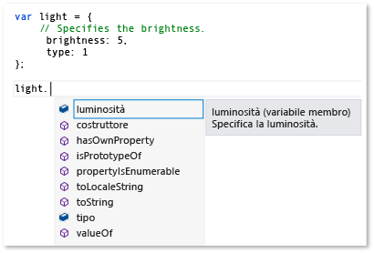
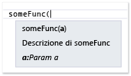
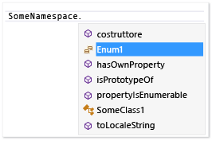

# Estensione di IntelliSense in JavaScript
[!INCLUDE[vs2017banner](../code-quality/includes/vs2017banner.md)]

La funzionalità di estensibilità JavaScript IntelliSense consente di personalizzare i risultati di IntelliSense nell'editor JavaScript per le raccolte di terze parti.  Ciò può migliorare l'esperienza gli sviluppatori che utilizzano queste librerie.  
  
 Il servizio di linguaggio JavaScript forniscono le funzionalità di IntelliSense per le raccolte di terze parti JavaScript che vengono aggiunti a un progetto.  Per la maggior parte delle librerie, il completamento delle istruzioni è fornito automaticamente dal servizio di linguaggio.  Nella figura seguente viene illustrato un esempio di completamento delle istruzioni:  
  
   
  
 Se la libreria include le descrizioni delle variabili, le funzioni e oggetti nei tag di commenti standard JavaScript \(\/\), automaticamente usufruendo di, per impostazione predefinita, le funzionalità di estensibilità di IntelliSense, che forniscono informazioni descrittive in una finestra popup che viene visualizzata a destra degli elementi in un elenco di completamento, o quando si digita la parentesi di apertura in una chiamata di funzione.  Commenti nella casella popup contengono la descrizione del membro.  Nell'esempio seguente viene illustrata la casella popup per un elenco di completamento.  
  
   
  
 Per migliorare ulteriormente l'esperienza dello sviluppatore, è possibile fornire le informazioni sul tipo per gli sviluppatori nella casella popup.  È possibile fornire informazioni sul tipo tramite JavaScript [Commenti relativi alla documentazione XML](../ide/xml-documentation-comments-javascript.md) anziché i tag standard di commento.  Aggiungere commenti della documentazione XML utilizzando i tag di con commenti a barra tripla \(\/\) e un set definito di elementi XML.  
  
 In alternativa, è possibile fornire informazioni sul tipo utilizzando l'extensibility JavaScript IntelliSense.  Questa funzionalità consente di personalizzare i risultati di IntelliSense creando estensioni JavaScript e aggiungendoli al contesto dello script.  Nell'estensione, un file JavaScript, la sottoscrizione agli eventi esposti dall'oggetto di `intellisense` del servizio di linguaggio.  L'estensibilità JavaScript IntelliSense è la soluzione consigliata per le librerie se un modello di comportamento della raccolta impedisce al servizio di linguaggio JavaScript di fornire il livello di supporto IntelliSense desiderato e se di un'alternativa ai commenti dichiarative di documentazione XML inoltre necessario.  Personalizzazione dei risultati di IntelliSense, è possibile creare un'esperienza di prima classe di IntelliSense, indipendentemente da tutti i modelli comportamentali che possono limitare le funzionalità predefinite del servizio di linguaggio.  Per ulteriori informazioni, vedere [Completamento delle istruzioni per gli identificativi](../ide/statement-completion-for-identifiers.md).  
  
## Aggiunta di un'estensione al contesto dello script  
 Per un'estensione di IntelliSense sia eseguita, deve essere aggiunto al contesto corrente dello script.  L'estensione può essere aggiunto automaticamente al contesto dello script dal meccanismo di rilevazione automatica, oppure aggiungere l'estensione nel contesto dello script manualmente utilizzando i gruppi di riferimento o la direttiva di riferimento.  
  
 Il meccanismo di rilevazione automatica consente al servizio di linguaggio per cercare automaticamente le estensioni che seguono la convenzione di denominazione *libraryname*.intellisense.js del file che si trovano nella stessa directory della raccolta alla quale l'estensione viene applicato.  Ad esempio, un'estensione valida per la libreria jQuery sarebbe jQuery.intellisense.js.  Per le estensioni più restrittive jQuery, è possibile utilizzare i nomi file come jQuery\-1.7.1.intellisense.js \(un'estensione specifica della versione\) o jQuery.ui.intellisense.js \(un'estensione per una raccolta ambito jQuery\).  La versione più restrittiva di estensione viene utilizzata se più di un'estensione viene trovata per una raccolta specificata.  
  
 Se si desidera utilizzare l'estensione per tutti i file di progetto JavaScript, è invece possibile aggiungere l'estensione a un gruppo di riferimento.  Esistono diversi tipi di gruppi di riferimento, o quelle che includono riferimenti implicita e quelli che includono lavoro dedicate fanno riferimento.  Per aggiungere un'estensione, è necessario aggiungere il file come un gruppo di riferimento implicito, qualsiasi **Implicito \(Windows\)**, **Implicito \(Web\)**.  I riferimenti implicita nell'ambito per ogni file js aperto nell'editor di codice.  Quando si utilizza questo metodo, è necessario aggiungere sia l'estensione del file che l'estensione di completare.  
  
 Utilizzare la pagina **Intellisense** la finestra di dialogo **Options** per aggiungere un'estensione come un gruppo di riferimento.  È possibile accedere alla pagina **Intellisense** scegliendo **Strumenti**, **Options** nella barra dei menu e quindi sulla scelta **Editor di testo**, **JavaScript**, **Intellisense**, **Riferimenti**.  Per ulteriori informazioni sui gruppi di riferimento, vedere [IntelliSense per JavaScript](../ide/javascript-intellisense.md) e [Opzioni, Editor di testo, JavaScript, IntelliSense](../ide/reference/options-text-editor-javascript-intellisense.md).  
  
 Se si desidera utilizzare l'estensione per un set specifico di file, utilizzare una direttiva di riferimento.  Quando si utilizza questo metodo, è necessario fare riferimento sia l'estensione del file che l'estensione di completare.  Per informazioni sull'utilizzo della direttiva di riferimento, vedere [IntelliSense per JavaScript](../ide/javascript-intellisense.md).  
  
## Eventi di IntelliSense di gestione  
 La funzionalità di estensibilità consente di personalizzare i risultati di IntelliSense sottoscrizione agli eventi mentre l'evento di `statementcompletion` dell'oggetto di `intellisense` del servizio di linguaggio.  Nell'esempio seguente viene illustrata un'estensione semplice utilizzata dal servizio di linguaggio per nascondere i membri che iniziano con un carattere di sottolineatura dal completamento delle istruzioni.  Questo codice è contenuto in underscorefilter.js e si trova in \\\\*Percorso di installazione di Visual Studio* nella cartella \\JavaScript\\References.  
  
```javascript  
intellisense.addEventListener('statementcompletion', function (event) {  
    if (event.targetName === "this") return;  
  
    var filterRegex;  
  
    if (event.target === undefined || event.target === window)  
        filterRegex = /^_.*\d{2,}/;  
    else  
        filterRegex = /^_.*/;  
  
    event.items = event.items.filter(function (item) {  
        return !filterRegex.test(item.name);  
    });  
});  
```  
  
 Nel codice precedente, l'estensione controlla le proprietà di [proprietà di destinazione](#Target) e di [proprietà di nomedestinazione](#TargetName) dell'oggetto evento di `statementcompletion` per escludere gli oggetti come `this` e `window`e per garantire che un elenco valido di completamento delle istruzioni possa essere identificato.  Se l'elenco di completamento può essere identificato, l'estensione l'aggiornamento della raccolta [proprietà degli elementi](#Items) di completamento delle istruzioni filtrando i membri che iniziano con un carattere di sottolineatura.  
  
 Per ulteriori esempi, vedere in \\\\*Percorso di installazione di Visual Studio* nella cartella \\JavaScript\\References.  Il file di showPlainComments.js in questa cartella vengono forniti esempi di utilizzo altri eventi per fornire il supporto IntelliSense predefinito per i tag di commenti standard JavaScript \(\/\).  Come underscorefilter.js, showPlainComments.js è già disponibile come estensione attiva ed è possibile visualizzare le informazioni risultanti IntelliSense quando vengono utilizzati i tag di commento nel codice per le variabili, le funzioni e oggetti.  Per ulteriori esempi, vedere [Esempi di codice](#CodeExamples).  
  
> [!WARNING]
>  Se si modificano i file di estensione vengono inclusi in Visual Studio, è possibile disabilitare JavaScript IntelliSense o la funzionalità supportata dall'estensione.  
  
 Nel codice di estensione, è possibile creare gestori per i seguenti tipi di evento utilizzando `addEventListener`:  
  
-   `statementcompletion`, per aggiungere un gestore per l'evento di completamento delle istruzioni.  Il completamento delle istruzioni fornisce un elenco di membri per un determinato tipo visualizzato dopo aver digitato un carattere speciale come un punto \(.\), o un elenco di identificatori visualizzato durante la digitazione o premendo CTRL \+ J.  Il gestore riceve un oggetto evento di tipo `CompletionEvent`, che supporta i seguenti membri: [proprietà degli elementi](#Items), [proprietà di destinazione](#Target), [proprietà di nomedestinazione](#TargetName) e [proprietà con ambito](#Scope).  
  
-   `signaturehelp`, per aggiungere un gestore per informazioni sul parametro IntelliSense.  Fornisce a informazioni dei parametri è informazioni sul numero, i nomi e i tipi di parametri richiesti da una funzione.  Il gestore riceve un oggetto evento di tipo `SignatureHelpEvent`, che supporta i seguenti membri: [proprietà di destinazione](#Target), [proprietà di parentObject](#ParentObject), [proprietà di functionComments](#FunctionComments), [proprietà di functionHelp](#FunctionHelp).  
  
-   `statementcompletionhint`, per aggiungere un gestore per informazioni rapide IntelliSense.  La casella di controllo popup di informazioni rapide illustrata la dichiarazione completa per gli identificatori nel codice.  Il gestore riceve un oggetto evento di tipo `CompletionHintEvent`, che supporta i seguenti membri: [proprietà di completionItem](#CompletionItem)e [proprietà dello symbolHelp](#SymbolHelp).  
  
 Per esempi che illustrano le funzionalità IntelliSense quali completamento delle istruzioni, informazioni di parametro e informazioni rapide, vedere [Utilizzo di IntelliSense](../ide/using-intellisense.md).  
  
> [!NOTE]
>  In JavaScript, le informazioni rapide è una finestra popup che viene visualizzata a destra di un elenco di completamento.  Non è possibile richiamare manualmente le informazioni rapide.  
  
##  <a name="intellisenseObject"></a> oggetto di intellisense  
 Nella tabella seguente sono illustrate le funzioni disponibili per l'oggetto di `intellisense`.  L'oggetto di `intellisense` è disponibile solo in fase di progettazione.  
  
|Funzione|Descrizione|  
|--------------|-----------------|  
|`addEventListener(type, handler);`|Aggiungere un gestore eventi per un evento di IntelliSense.<br /><br /> `type` è un valore stringa.  I valori validi includono `statementcompletion`, `signaturehelp`e `statementcompletionhint`.<br /><br /> `handler` è una funzione del gestore eventi che riceve un oggetto evento di uno dei seguenti tipi:<br /><br /> -   `CompletionEvent`, utilizzato per l'evento di `statementcompletion`.<br />-   `SignatureHelpEvent`, utilizzato per l'evento di `signaturehelp`.<br />-   `CompletionHintEvent`, utilizzato per l'evento di `statementcompletionhint`.<br /><br /> Per esempi che utilizzano questa funzione, vedere [Esempi di codice](#CodeExamples).|  
|`annotate(obj, doc);`|Specifica la documentazione per un oggetto copiando i commenti della documentazione da un oggetto a un altro oggetto.<br /><br /> `obj` specifica l'oggetto a cui copiare la documentazione.<br /><br /> `doc` specifica l'oggetto da cui copiare la documentazione.<br /><br /> Per un esempio che illustra come utilizzare questa funzione, vedere [Annotazioni di aggiunta di IntelliSense](#Annotations).|  
|`getFunctionComments(func);`|Restituisce i commenti per una funzione specificata.<br /><br /> `func` specifica i commenti di funzione per il quale viene restituito.<br /><br /> È possibile impostare il parametro di `func` utilizzando `completionItem.value`.<br /><br /> L'oggetto restituito di `functionComments` include i seguenti membri: `above`, `inside`e `paramComment`.  Per ulteriori informazioni, vedere la proprietà [proprietà di functionComments](#FunctionComments).<br /><br /> `getFunctionComments` può essere chiamato solo da uno dei gestori eventi registrati da `addEventListener`.<br /><br /> Per un esempio che illustra come utilizzare questa funzione, vedere \\\\*Percorso di installazione di Visual Studio*\\JavaScript\\References\\showPlainComments.js.|  
|`logMessage(msg);`|Invia messaggi diagnostici nella finestra di output.<br /><br /> `msg` è una stringa contenente il messaggio.<br /><br /> Per un esempio che illustra come utilizzare questa funzione, vedere [Inviando messaggi nella Finestra di output](#Logging).|  
|`nullWithCompletionsOf(value);`|Restituisce un valore null speciale per cui l'elenco di completamento dipende dall'oggetto passato nel parametro di `value`.<br /><br /> `value` determina l'elenco di completamento per il valore restituito.  `value` può essere qualsiasi tipo.<br /><br /> Il valore restituito null viene considerato come null in fase di progettazione, ma l'elenco di completamento per il valore restituito sarà lo stesso dell'elenco di completamento per il parametro di `value`.<br /><br /> Un utilizzo per questa funzione è fornire IntelliSense per un valore restituito al tipo restituito è prevedibile in fase di esecuzione, ma il valore restituito è `null` in fase di progettazione.|  
|`redirectDefinition(func, definition);`|Indica a IntelliSense utilizzare la funzione della definizione anziché la funzione funzionale originale quando la guida o **Vai a definizione** di parametro è obbligatoria.<br /><br /> `func` specifica la funzione di destinazione.<br /><br /> `definition` specifica la funzione da utilizzare al posto della funzione di destinazione per informazioni e **Vai a definizione**di parametro.|  
|`setCallContext(func, thisArg);`|Stabilisce il contesto di chiamata, o l'ambito, per la funzione specificata.<br /><br /> `func` specifica la funzione per il quale impostare l'ambito.<br /><br /> `thisArg` è un valore letterale di oggetto a cui la parola chiave di `this` può fare riferimento a, che specifica il nuovo ambito per il membro.  È possibile includere gli argomenti da passare questo parametro, ad esempio, `intellisense.setCallContext(func, { thisArg: "", args: [23,2] });`"",}\);<br /><br /> `setCallContext` fornisce il comportamento simile a `Function.prototype.bind`, con la differenza che ha utilizzato solo per il supporto IntelliSense in fase di progettazione.  È possibile utilizzare `setCallContext` per impostare l'ambito di funzione per simulare una chiamata al codice non è raggiungibile in caso contrario, in modo che quando viene chiamata la funzione, la chiamata di funzione includerà l'ambito e gli argomenti corretti.|  
|`undefinedWithCompletionsOf(value);`|Restituisce un valore definito speciale per cui l'elenco di completamento dipende dall'oggetto passato nel parametro di `value`.<br /><br /> `value` determina l'elenco di completamento per il valore restituito.  `value` può essere qualsiasi tipo.<br /><br /> Il valore restituito non viene trattato come definito in fase di progettazione, ma l'elenco di completamento per il valore restituito sarà lo stesso dell'elenco di completamento per il parametro di `value`.<br /><br /> Un utilizzo per questa funzione è fornire IntelliSense per un valore restituito al tipo restituito è prevedibile in fase di esecuzione, ma il valore restituito è definito in fase di progettazione.|  
|`version()`|Restituisce la versione di Visual Studio.|  
  
## Membri evento  
 Nelle sezioni seguenti vengono descritti i membri dell'oggetto esposto per gli eventi seguenti: `statementcompletion`, `signaturehelp`e `statementcompletionhint`.  
  
###  <a name="CompletionItem"></a> proprietà di completionItem  
 Restituisce l'identificatore, noto come elemento di completamento, per il quale una casella di controllo popup di informazioni rapide è obbligatorio.  Questa proprietà è disponibile per l'oggetto evento di `statementcompletionhint` e per la proprietà [proprietà degli elementi](#Items) dell'oggetto evento di `statementcompletion`.  
  
 Valore restituito: oggetto di `completionItem`  
  
 Seguire i membri dell'oggetto di `completionItem` :  
  
-   `name`.  Lettura\/scrittura se utilizzato nella raccolta di `items` ; in caso contrario, di sola lettura.  Restituisce una stringa che identifica l'elemento finale.  
  
-   `kind`.  Lettura\/scrittura se utilizzato nella raccolta di `items` ; in caso contrario, di sola lettura.  Restituisce una stringa che rappresenta il tipo di elemento di completamento.  I valori possibili sono metodo, il campo, una proprietà, un parametro, una variabile e riservato.  
  
-   `glyph`.  Lettura\/scrittura se utilizzato nella raccolta di `items` ; in caso contrario, di sola lettura.  Restituisce una stringa che rappresenta un'icona visualizzata nell'elenco di completamento.  I valori possibili per `glyph` utilizzano il formato seguente: in:*glyphType*, dove *glyphType* corrisponde ai membri indipendente dall'enumerazione di <xref:Microsoft.VisualStudio.Language.Intellisense.StandardGlyphGroup>.  Ad esempio, `vs:GlyphGroupMethod` è un valore per `glyph`.  Quando `glyph` non è impostata, la proprietà di `kind` determina l'icona predefinita.  
  
-   `parentObject`.  Solo lettura.  Restituisce l'oggetto padre.  
  
-   `value`.  Solo lettura.  Restituisce un oggetto che rappresenta il valore dell'elemento finale.  
  
-   `comments`.  Solo lettura.  Restituisce una stringa contenente i commenti presenti sul campo o la variabile.  
  
-   `scope`.  Solo lettura.  Restituisce l'ambito degli elementi di completamento.  I valori possibili sono globali, locali, parametro e membro.  
  
###  <a name="Items"></a> proprietà degli elementi  
 Ottiene o imposta la matrice di elementi di completamento delle istruzioni.  Ogni elemento della matrice è un oggetto di [proprietà di completionItem](#CompletionItem).  La proprietà di `items` è disponibile per l'oggetto evento di `statementcompletion`.  
  
 Valore restituito: matrice  
  
###  <a name="FunctionComments"></a> proprietà di functionComments  
 Restituisce i commenti della funzione.  Questa proprietà è disponibile per l'oggetto evento di `signaturehelp`.  
  
 Valore restituito: oggetto di `comments`  
  
 Seguire i membri dell'oggetto di `comments` :  
  
-   `above`.  Restituisce i commenti sulla funzione.  
  
-   `inside`.  Restituisce le note nella funzione, in genere nel formato di VSDoc.  
  
-   `paramComments`.  Restituisce una matrice che rappresenta i commenti per ciascun parametro della funzione.  I membri della matrice includono:  
  
    -   `name`.  Restituisce una stringa che rappresenta il nome del parametro.  
  
    -   `comment`.  Restituisce una stringa contenente il commento di parametro.  
  
###  <a name="FunctionHelp"></a> proprietà di functionHelp  
 Restituisce la guida per la funzione.  Questa proprietà è disponibile per l'oggetto evento di `signaturehelp`.  
  
 Valore restituito: oggetto di `functionHelp`  
  
 Seguire i membri dell'oggetto di `functionHelp` :  
  
-   `functionName`.  Lettura\/scrittura.  Restituisce una stringa contenente il nome della funzione.  
  
-   `signatures`.  Lettura\/scrittura.  Ottiene o imposta la matrice delle firme della funzione.  Ogni elemento della matrice è un oggetto di `signature`.  Alcune proprietà di `signature`, come `locid`, corrispondono agli attributi comuni [Commenti relativi alla documentazione XML](../ide/xml-documentation-comments-javascript.md).  
  
     I membri dell'oggetto di `signature` includono:  
  
    -   `description`.  Lettura\/scrittura.  Restituisce una stringa che descrive la funzione.  
  
    -   `locid`.  Lettura\/scrittura.  Restituisce un identificatore di stringa che contiene le informazioni di localizzazione sulla funzione.  
  
    -   `helpKeyword`.  Lettura\/scrittura.  Restituisce una stringa contenente la parola chiave della Guida.  
  
    -   `externalFile`.  Lettura\/scrittura.  Restituisce una stringa che rappresenta il file contenente l'id del membro  
  
    -   `externalid`.  Lettura\/scrittura.  Restituisce una stringa che rappresenta il membro l'id della funzione.  
  
    -   `params`.  Lettura\/scrittura.  Ottiene o imposta la matrice di parametri per la funzione.  Ogni elemento della matrice di parametri è un oggetto di `parameter` che dispone di proprietà che corrispondono agli attributi dell'elemento di [\<param\>](../ide/param-javascript.md) :  
  
        -   `name`.  Lettura\/scrittura.  Restituisce una stringa che rappresenta il nome del parametro.  
  
        -   `type`.  Lettura\/scrittura.  Restituisce una stringa che rappresenta il tipo di parametro.  
  
        -   `elementType`.  Lettura\/scrittura.  Se il tipo è `Array`, restituisce una stringa che rappresenta il tipo degli elementi nella matrice.  
  
        -   `description`.  Lettura\/scrittura.  Restituisce una stringa che descrive il parametro.  
  
        -   `locid`.  Lettura\/scrittura.  Restituisce un identificatore di stringa che contiene le informazioni di localizzazione sulla funzione.  
  
        -   `optional`.  Lettura\/scrittura.  Restituisce una stringa che indica se il parametro è facoltativo.  `true` indica che il parametro è facoltativo, `false` indica che non è.  
  
    -   `returnValue`.  Lettura\/scrittura.  Ottiene o imposta un oggetto di valore restituito dalle proprietà che corrispondono agli attributi dell'elemento di [\<returns\>](../ide/returns-javascript.md) :  
  
        -   `type`.  Lettura\/scrittura.  Restituisce una stringa che rappresenta il tipo restituito.  
  
        -   `elementType`.  Lettura\/scrittura.  Se il tipo è `Array`, restituisce una stringa che rappresenta il tipo degli elementi nella matrice.  
  
        -   `description`.  Lettura\/scrittura.  Restituisce una stringa che descrive il valore restituito.  
  
        -   `locid`.  Lettura\/scrittura.  Restituisce un identificatore di stringa che contiene le informazioni di localizzazione sulla funzione.  
  
        -   `helpKeyword`.  Lettura\/scrittura.  Restituisce una stringa contenente la parola chiave della Guida.  
  
        -   `externalFile`.  Lettura\/scrittura.  Restituisce una stringa che rappresenta il file contenente l'id del membro  
  
        -   `externalid`.  Lettura\/scrittura.  Restituisce una stringa che rappresenta il membro l'id della funzione.  
  
###  <a name="ParentObject"></a> proprietà di parentObject  
 Restituisce l'oggetto padre di una funzione membro.  Ad esempio, per `document.getElementByID`, `parentObject` restituisce l'oggetto di `document`.  Questa proprietà è disponibile per l'oggetto evento di `signaturehelp`.  
  
 Valore restituito: oggetto  
  
###  <a name="Target"></a> proprietà di destinazione  
 Restituisce un oggetto che rappresenta l'elemento a sinistra del carattere trigger, un punto \(.\).  Per le funzioni, `target` restituisce informazioni sul parametro di funzione per il quale è obbligatorio.  Questa proprietà è disponibile per gli oggetti evento di `signaturehelp` e di `statementcompletion`.  
  
 Valore restituito: oggetto  
  
###  <a name="TargetName"></a> proprietà di nomedestinazione  
 Restituisce una stringa che rappresenta il database di destinazione.  Ad esempio, per "this. ", `targetName` restituisce "this".  Per "A.B" \(quando il cursore è posizionato dopo "B"\), `targetName` restituisce "B".  Questa proprietà è disponibile per l'oggetto evento di `statementcompletion`.  
  
 Valore restituito: stringa  
  
###  <a name="SymbolHelp"></a> proprietà dello symbolHelp  
 Restituisce l'elemento finale per il quale una casella di controllo popup di informazioni rapide è necessaria.  Questa proprietà è disponibile per l'oggetto evento di `statementcompletionhint`.  
  
 Valore restituito: oggetto di `symbolHelp`.  
  
 Alcune proprietà dell'oggetto di `symbolHelp`, come `locid`, corrispondono agli attributi comuni [Commenti relativi alla documentazione XML](../ide/xml-documentation-comments-javascript.md).  
  
 Seguire i membri dell'oggetto di `symbolHelp` :  
  
-   `name`.  Lettura\/scrittura.  Restituisce una stringa contenente il nome dell'identificatore.  
  
-   `symbolType`.  Lettura\/scrittura.  Restituisce una stringa che rappresenta il tipo del simbolo.  I valori possibili sono sconosciuto, boolean, numerano, supporti, l'oggetto, funzionano, una, l'origine e regex.  
  
-   `symbolDisplayType`.  Lettura\/scrittura.  Restituisce una stringa contenente il nome del tipo da visualizzare.  Se `symbolDisplayType` non è impostato, `symbolType` viene utilizzato.  
  
-   `elementType`.  Lettura\/scrittura.  Se `symbolType` è `Array`, restituisce una stringa che rappresenta il tipo degli elementi nella matrice.  
  
-   `scope`.  Lettura\/scrittura.  Restituisce una stringa che rappresenta l'extent del simbolo.  I valori possibili sono globali, locale, il parametro e il membro.  
  
-   `description`.  Lettura\/scrittura.  Restituisce una stringa contenente una descrizione del simbolo.  
  
-   `locid`.  Lettura\/scrittura.  Restituisce un identificatore di stringa che contiene le informazioni di localizzazione sul simbolo.  
  
-   `helpKeyword`.  Lettura\/scrittura.  Restituisce una stringa contenente la parola chiave della Guida.  
  
-   `externalFile`.  Lettura\/scrittura.  Restituisce una stringa che rappresenta il file contenente l'id del membro  
  
-   `externalid`.  Lettura\/scrittura.  Restituisce una stringa che rappresenta il membro l'id del simbolo.  
  
-   `functionHelp`.  Lettura\/scrittura.  Restituisce [proprietà di functionHelp](#FunctionHelp), che potrebbero contenere informazioni quando `symbolType` è funzione.  
  
###  <a name="Scope"></a> proprietà con ambito  
 Restituisce l'ambito del completamento dell'evento.  I valori possibili per l'ambito di completamento sono globali e membri.  Questa proprietà è disponibile per l'oggetto evento di `statementcompletion`.  
  
 Valore restituito: stringa  
  
## Eseguire il debug delle estensioni di IntelliSense  
 Non è possibile eseguire il debug delle estensioni, ma è possibile utilizzare la funzione di [oggetto di intellisense](#intellisenseObject) per inviare informazioni nella finestra di output Visual Studio.  Per un esempio che illustra come utilizzare questa funzione, vedere più avanti [Inviando messaggi nella Finestra di output](#Logging) in questo argomento.  Per `logMessage` funzioni, almeno un gestore eventi deve essere registrato in un'estensione.  
  
##  <a name="CodeExamples"></a> Esempi di codice  
 Questa sezione include esempi di codice che illustrano come utilizzare l'api di estensibilità di IntelliSense.  Esistono anche altri modi per utilizzare queste API.  Per ulteriori esempi, vedere i seguenti file in \\\\*Percorso di installazione di Visual Studio* nella cartella \\JavaScript\\References.  Questi sono esempi di lavoro utilizzati dal servizio di linguaggio JavaScript.  
  
-   underscoreFilter.js.  Questo codice nasconde i membri privati da IntelliSense.  Comprende gestori eventi per l'evento di `statementcompletion`.  
  
-   showPlainComments.js.  Questo codice fornisce supporto IntelliSense per i commenti standard.  Comprende gestori eventi per gli eventi di `statementcompletionhint` e di `signaturehelp`.  
  
###  <a name="Annotations"></a> Annotazioni di aggiunta di IntelliSense  
 Nella procedura seguente viene illustrato come fornire il supporto della documentazione di IntelliSense in una libreria di terze parti senza modificare la raccolta direttamente.  A questo scopo, è possibile utilizzare `intellisense.annotate` in un'estensione.  
  
 Per questo esempio funzioni, è necessario disporre dei seguenti file JavaScript nel progetto:  
  
-   demoLib.js, un file di progetto che rappresenta una libreria di terze parti.  
  
-   demoLib.intellisense.js, ovvero l'estensione di IntelliSense.  Questo file non deve essere incluso nel progetto, ma deve trovarsi nella stessa cartella di exampleLib.js.  
  
-   appCode.js, un file di progetto che rappresenta il codice dell'applicazione.  
  
##### Per aggiungere un'annotazione di IntelliSense  
  
1.  Aggiungere il codice seguente a demoLib.js.  
  
    ```javascript  
    function someFunc(a) { };  
    var rectangle;  
  
    ```  
  
2.  Aggiungere il codice seguente a demoLib.intellisense.js.  
  
    ```javascript  
    intellisense.annotate(someFunc, function (a) {  
        /// <signature>  
        /// <summary>Description of someFunc</summary>  
        /// <param name="a">Param a</param>  
        /// </signature>  
    });  
  
    intellisense.annotate(window, {  
        // This is a comment on a global variable named rectangle.  
        rectangle: undefined  
    });  
    ```  
  
3.  Aggiungere la seguente direttiva di riferimento come prima riga in appCode.js.  Il percorso utilizzato in questo contesto indica che i file JavaScript nella stessa cartella.  
  
    ```javascript  
    /// <reference path="demoLib.js" />  
  
    ```  
  
4.  In appCode.js, digitare il seguente codice.  Verranno visualizzati i commenti della documentazione XML con estensione visualizzare informazioni su come parametro di IntelliSense.  
  
       
  
5.  In appCode.js, digitare il seguente codice.  Mentre si digita, viene visualizzato commenti standard con estensione visualizzare quali informazioni rapide IntelliSense.  
  
       
  
###  <a name="Logging"></a> Inviando messaggi nella Finestra di output  
 Nella procedura seguente viene illustrato come inviare messaggi alla finestra di output.  È possibile inviare messaggi per eseguire il debug delle estensioni di IntelliSense.  
  
 Per questo esempio funzioni, è necessario disporre dei seguenti file JavaScript nel progetto:  
  
-   exampleLib.js, un file di progetto che rappresenta una libreria di terze parti.  
  
-   exampleLib.intellisense.js, ovvero l'estensione di IntelliSense.  Questo file non deve essere incluso nel progetto, ma deve trovarsi nella stessa cartella di exampleLib.js.  
  
-   appCode.js, un file di progetto che rappresenta il codice dell'applicazione.  
  
##### Per inviare un messaggio nella finestra di output  
  
1.  Aggiungere il codice seguente a exampleLib.js.  
  
    ```javascript  
    var someVar = {  
        a: 1,  
        b: 'hello'  
    };  
    ```  
  
2.  Aggiungere il codice seguente a exampleLib.intellisense.js.  
  
    ```javascript  
    intellisense.addEventListener('statementcompletion', function (e) {  
        // Prints out statement completion info: Either (1) the member   
        // list, if the trigger character was typed, or (2) the   
        // statement completion identifiers.  
        // e.target represents the object left of the trigger character.  
        intellisense.logMessage(  
            e.target ? 'member list requested, target: ' + e.targetName : 'statement completion for current scope requested');  
  
        // Prints out all statement completion items.  
        e.items.forEach(function (item) {  
            intellisense.logMessage('[completion item] ' + item.name + ', kind:' + item.kind + ', scope:' + item.scope + ', value:' + item.value);  
        });  
    });  
    ```  
  
3.  Aggiungere la seguente direttiva di riferimento come prima riga in appCode.js.  Il percorso utilizzato in questo contesto indica che i file JavaScript nella stessa cartella.  
  
    ```javascript  
    /// <reference path="exampleLib.js" />  
  
    ```  
  
4.  Nella finestra di output, scegliere **Servizio linguaggio JavaScript** nell'elenco **Mostra output di**.  \(Per visualizzare la finestra di output, **Output** scegliere dal menu Visualizza.\)  
  
5.  In appCode.js, digitare il seguente codice.  Mentre tipo, la finestra di output indicherà i messaggi dal servizio di linguaggio.  Il primo messaggio nella finestra di output indica che il completamento delle istruzioni per l'ambito corrente è stato richiesto.  
  
    ```javascript  
    some  
    ```  
  
     Seguire una visualizzazione parziale di output che è possibile vedere.  
  
    ```scr  
    03:16:14.3113: statement completion for current scope requested  
    03:16:14.3113: [completion item] break, kind:reserved, scope:undefined, value:undefined  
    03:16:14.3113: [completion item] case, kind:reserved, scope:undefined, value:undefined  
    03:16:14.3113: [completion item] catch, kind:reserved, scope:undefined, value:undefined  
  
    …  
    ```  
  
6.  Scegliere il pulsante **Cancella tutto** nella finestra di output.  
  
7.  Digitare il codice riportato di seguito.  Il primo messaggio nella finestra di output indica che un elenco di membri è stato richiesto.  
  
    ```javascript  
    someVar.  
    ```  
  
     Seguire una visualizzazione parziale di output che verrà visualizzato:  
  
    ```scr  
    03:17:43.4032: member list requested, target: someVar  
    03:17:43.4032: [completion item] a, kind:field, scope:member, value:1  
    03:17:43.4032: [completion item] b, kind:field, scope:member, value:hello  
    03:17:43.4032: [completion item] constructor, kind:method, scope:member, value:  
  
    …  
    ```  
  
###  <a name="Icons"></a> Modificare le icone di IntelliSense  
 Nella procedura seguente viene illustrato come modificare le icone vengono visualizzati da IntelliSense per impostazione predefinita.  Ciò può essere utile quando si immettono informazioni di IntelliSense per i concetti specifiche specifici quali spazi dei nomi, classi, interfacce ed enumerazioni.  
  
 Per i valori disponibili icona, vedere <xref:Microsoft.VisualStudio.Language.Intellisense.StandardGlyphGroup>.  
  
 Per questo esempio funzioni, è necessario disporre dei seguenti file JavaScript nel progetto:  
  
-   exampleLib.js, un file di progetto che represens una libreria di terze parti.  
  
-   exampleLib.intellisense.js, ovvero l'estensione di IntelliSense.  Questo file non deve essere incluso nel progetto, ma deve trovarsi nella stessa cartella di exampleLib.js.  
  
-   appCode.js, un file di progetto che rappresenta il codice dell'applicazione.  
  
##### Per modificare le icone  
  
1.  Aggiungere il codice seguente a exampleLib.js.  
  
    ```javascript  
    function Namespace(name) {  
        this._isNamespace = true;  
        window[name] = this;  
    };  
  
    function Enum(values) {  
        var e = Object.create(values);  
        e._isEnum = true;  
        return e;  
    };  
  
    var SomeNamespace = new Namespace('SomeNamespace');  
    // A constructor function is considered a class.  
    SomeNamespace.SomeClass1 = function () { }  
    SomeNamespace.Enum1 = new Enum({ VALUE1: 0, VALUE2: 1 });  
    ```  
  
2.  Aggiungere il codice seguente a exampleLib.intellisense.js.  
  
    ```javascript  
    intellisense.addEventListener('statementcompletion', function (e) {  
        e.items.forEach(function (item) {  
            // Detect a namespace by using the _isNamespace flag.  
            if (item.value && item.value._isNamespace) {  
                item.glyph = 'vs:GlyphGroupNamespace';  
                }  
  
            if (item.parentObject && item.parentObject._isNamespace) {  
                // The item is a member of a namespace.   
  
                // All constructor functions that are part of a namespace   
                // are considered classes.   
                // A constructor function starts with  
                // an uppercase letter by convention.    
                if (typeof item.value == 'function' && (item.name[0].toUpperCase()   
                    == item.name[0])) {  
                    item.glyph = 'vs:GlyphGroupClass';  
                }  
  
                // Detect an enumeration by using the _isEnum flag.  
                if (item.value && item.value._isEnum) {  
                    item.glyph = 'vs:GlyphGroupEnum';  
                }  
            }  
        });  
    });  
  
    intellisense.addEventListener('statementcompletionhint', function (e) {  
        if (e.completionItem.value) {  
            if (e.completionItem.value._isNamespace) {  
                e.symbolHelp.symbolDisplayType = 'Namespace';  
            }  
            if (e.completionItem.value._isEnum) {  
                e.symbolHelp.symbolDisplayType = 'Enum';  
            }  
        }  
    });  
    ```  
  
3.  Aggiungere la seguente direttiva di riferimento come prima riga in appCode.js.  Il percorso utilizzato in questo contesto indica che i file JavaScript nella stessa cartella.  
  
    ```javascript  
    /// <reference path="exampleLib.js" />  
  
    ```  
  
4.  In appCode.js, digitare il seguente codice.  Mentre tipo, si verrà visualizzata l'icona dello spazio dei nomi è stata modificata "{}", come viene utilizzato in c.  
  
       
  
5.  In appCode.js, digitare il seguente codice.  Mentre si digita, viene visualizzata una nuova icona di enumerazione per il membro Enum1 e una nuova icona della classe per il membro SomeClass1.  
  
       
  
###  <a name="Overriding"></a> Evitare gli effetti di runtime sui risultati di IntelliSense  
 Il codice di esecuzione del servizio di linguaggio JavaScript per fornire le informazioni di IntelliSense.  Di conseguenza, il comportamento in fase di esecuzione può talvolta può interferire con i risultati voluti.  Nella procedura seguente viene illustrato come eseguire l'override dei risultati di IntelliSense quando il comportamento di risultato errato IntelliSense.  
  
 Per questo esempio funzioni, è necessario disporre dei seguenti file JavaScript nel progetto:  
  
-   exampleLib.js, un file di progetto che rappresenta una libreria di terze parti.  
  
-   exampleLib.intellisense.js, ovvero l'estensione di IntelliSense.  Questo file non deve essere incluso nel progetto, ma deve trovarsi nella stessa cartella di exampleLib.js.  
  
-   appCode.js, un file di progetto che rappresenta il codice dell'applicazione.  
  
##### Per evitare effetti di runtime sui risultati di IntelliSense  
  
1.  Aggiungere il codice seguente a exampleLib.js.  
  
    ```javascript  
    function after(count, func) {  
        return function () {  
            if (--times < 1) {  
                return func.apply(this, arguments);  
            }  
        };  
    };  
    ```  
  
     Nel codice precedente, la funzione di cui è stato eseguito il wrapping ignora le chiamate iniziali, in base al valore di `count`e non restituisce i risultati.  
  
2.  Aggiungere la seguente direttiva di riferimento come prima riga in appCode.js.  Il percorso utilizzato in questo contesto indica che i file JavaScript nella stessa cartella.  
  
    ```javascript  
    /// <reference path="exampleLib.js" />  
  
    ```  
  
3.  In appCode.js, digitare il seguente codice.  L'elenco dell'identificatore viene invece di IntelliSense in quanto la funzione di cui è stato eseguito il wrapping non viene mai chiamata, ovvero la funzione di `throttled` non restituisce i risultati.  
  
       
  
4.  Aggiungere il codice seguente a exampleLib.intellisense.js.  Questa modifica il comportamento in fase di progettazione in modo da indicare IntelliSense per la funzione di cui è stato eseguito il wrapping, come previsto.  
  
    ```javascript  
    window.after = function (count, func) {  
        // Just return func.   
        return func;  
    };  
    ```  
  
5.  In appCode.js, verificare i risultati digitando lo stesso codice digitato in precedenza.  Questa volta, IntelliSense fornisce informazioni desiderate.  
  
       
  
## Vedere anche  
 [IntelliSense per JavaScript](../ide/javascript-intellisense.md)   
 [Completamento delle istruzioni per gli identificativi](../ide/statement-completion-for-identifiers.md)