# Trovare le modifiche apportate al codice e altri elementi della cronologia con CodeLens
CodeLens consente di rimanere concentrati sulle proprie attività mentre si cercano informazioni sul codice senza uscire dall'editor. È infatti possibile trovare i riferimenti e le modifiche apportate al codice, i bug collegati, gli elementi di lavoro, le revisioni del codice e gli unit test.  
  
> [!NOTE]
>  CodeLens è disponibile solo nelle edizioni Visual Studio Enterprise e Visual Studio Professional. Non è disponibile nell'edizione Community di Visual Studio.  
  
 Vedere dove e come vengono usate le singole parti di codice nella soluzione:  
  
 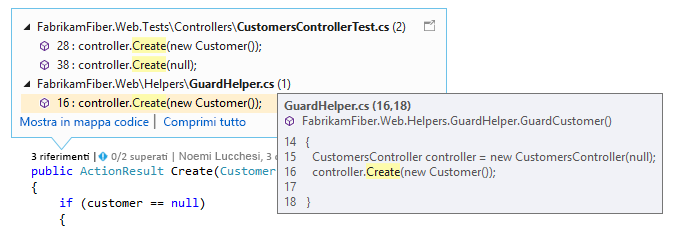  
  
 È anche possibile contattare il team in merito alle modifiche al codice senza uscire dall'editor:  
  
   
  
 Per scegliere gli indicatori da visualizzare o per abilitare o disabilitare CodeLens, passare a **Strumenti**, **Opzioni**, **Editor di testo**, **Tutti i linguaggi**, **CodeLens**.  
  
##   Individuare i riferimenti del codice  
 Sono necessari:  
  
-   Visual Studio Enterprise e Visual Studio Professional  
  
-   Codice di Visual C# .NET o Visual Basic .NET  
  
 Scegliere l'indicatore dei **riferimenti** (**Alt + 2**). Se i **riferimenti sono pari a 0**, non sono disponibili riferimenti da codice Visual C# o Visual Basic. Questo non include riferimenti da altri elementi, ad esempio file XAML e ASPX.  
  
 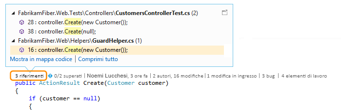  
  
 Per visualizzare il codice con riferimenti, posizionare il mouse sul riferimento.  
  
   
  
 Per aprire il file con il riferimento, fare doppio clic sul riferimento.  
  
 Per vedere le relazioni tra il codice e i riferimenti relativi, [creare una mappa dei codici](../modeling/map-dependencies-across-your-solutions.md) e scegliere **Mostra tutti i riferimenti** nel menu di scelta rapida della mappa del codice.  
  
   
  
##   Individuare la cronologia e gli elementi collegati del codice  
 È possibile esaminare la cronologia del codice per scoprire cosa è successo oppure esaminare le modifiche prima che vengano unite nel codice per ottenere altre informazioni sull'eventuale impatto di modifiche in altri rami sul codice.  
  
 Sono necessari:  
  
-   Visual Studio Enterprise e Visual Studio Professional  
  
-   Team Foundation Server 2013 o versioni successive, Visual Studio Team Services o Git  
  
-   [Lync 2010 o versioni successive oppure Skype for Business](http://technet.microsoft.com/en-us/lync)per contattare il team dall'editor di codice.  
  
 Per il codice Visual C# .NET o Visual Basic .NET archiviato con il controllo della versione di Team Foundation (TFVC) o Git, si ricevono dettagli CodeLens a livello di classe e metodo (indicatori a*livello di elemento codice* ). Se il repository Git è ospitato in TfGit, è anche possibile ottenere collegamenti negli elementi di lavoro TFS.  
  
   
  
 Per tutti gli altri tipi di file che si possono aprire nell'editor di Visual Studio, si ricevono dettagli CodeLens per l'intero file in un'unica posizione nella parte inferiore della finestra (indicatori*a livello di file* ).  
  
   
  
 Per usare la tastiera per la selezione degli indicatori, tenere premuto il testo **ALT** per visualizzare i tasti numerici correlati.  
  
   
  
### Individuare le modifiche nel codice  
 Trovare l'utente che ha modificato il codice C# o Visual Basic e le modifiche apportate, negli indicatori a livello di codice elemento. Questo è ciò che viene visualizzato quando si usa il controllo della versione di Team Foundation (TFVC) in Team Foundation Server o Visual Studio Team Services.  
  
   
  
 Il periodo di tempo predefinito è 12 secondi. Se il codice è archiviato in Team Foundation Server, è possibile modificarlo eseguendo il [comando TFSConfig](http://msdn.microsoft.com/en-us/94424190-3b6b-4f33-a6b6-5807f4225b62) con il [comando CodeIndex](../ide/codeindex-command.md) e il flag **/indexHistoryPeriod** .  
  
 Per visualizzare una cronologia dettagliata di tutte le modifiche, comprese quelle di più di un anno fa, scegliere **Mostra tutte le modifiche apportate ai file**.  
  
   
  
 Verrà visualizzata la finestra Cronologia per i set di modifiche.  
  
   
  
 Quando i file si trovano in un repository Git e si sceglie l'indicatore di modifiche a livello di elemento di codice, questo è ciò che viene visualizzato.  
  
   
  
 Individuare le modifiche di un intero file (esclusi i file C# e Visual Basic) negli indicatori a livello di file nella parte inferiore della finestra.  
  
 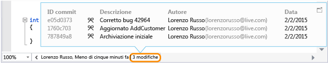  
  
 Per ottenere altre informazioni su una modifica, fare clic con il pulsante destro del mouse su tale elemento. A seconda se si utilizza TFVC o Git si otterrà una serie di opzioni per confrontare le versioni del file, visualizzare i dettagli e tenere traccia delle modifiche, ottenere la versione selezionata del file e inviare un messaggio di posta elettronica all'autore della modifica. Alcuni di dettagli vengono visualizzati in Team Explorer.  
  
 È possibile anche visualizzare l'utente che ha modificato il codice nel tempo, consentendo di individuare i criteri delle modifiche del team e di valutarne l'impatto.  
  
   
  
#### Individuare le modifiche nel branch corrente  
 Si supponga che il team sia costituito da più branch, ovvero un branch principale e un branch di sviluppo figlio, per ridurre il rischio di danneggiare la stabilità del codice:  
  
 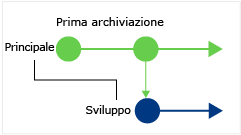  
  
 Individuare il numero di persone che hanno modificato il codice e il numero di modifiche apportate (**ALT + 6**) nel branch principale:  
  
 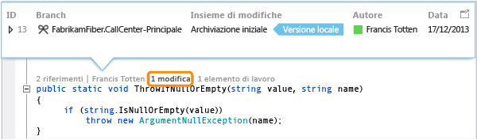  
  
#### Individuare il punto in cui il codice è stato sottoposto a branching  
 Passare al codice nel branch figlio, ad esempio, in questo caso il branch relativo allo sviluppo. Scegliere l'indicatore delle modifiche (**ALT + 6**):  
  
 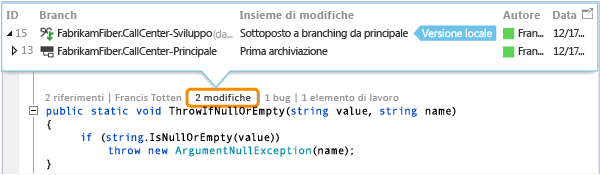  
  
#### Individuare le modifiche in arrivo da altri branch  
   
  
 … ad esempio questa correzione di bug nel branch relativo allo sviluppo:  
  
 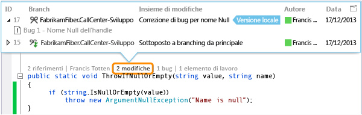  
  
 È possibile esaminare questa modifica senza uscire dal branch corrente (principale):  
  
 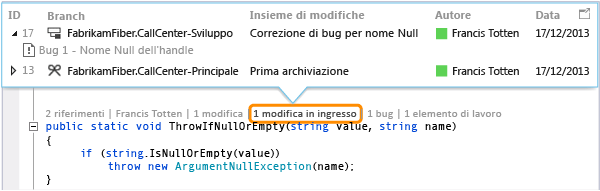  
  
#### Scoprire quando sono state unite le modifiche  
 Sarà quindi possibile verificare le modifiche incluse nel branch:  
  
 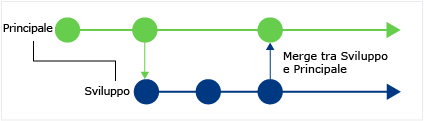  
  
 Ad esempio, il codice nel branch principale include ora la correzione di bug dal branch relativo allo sviluppo:  
  
 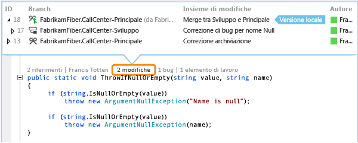  
  
#### Confrontare una modifica in arrivo con la versione locale (MAIUSC + F10)  
 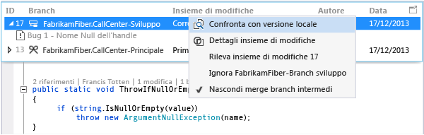  
  
 È anche possibile fare doppio clic sull'insieme di modifiche.  
  
#### Significato delle icone  
  
|**Icona**|**Origine della modifica**|  
|--------------|-----------------------------------------|  
||Branch corrente|  
||Branch padre|  
||Branch figlio|  
||Branch peer|  
||Branch più lontano rispetto a un branch padre, figlio o peer|  
||Unione dal branch padre in un branch figlio|  
||Unione da un branch figlio nel branch padre|  
||Unione da un branch non correlato (unione senza base)|  
  
### Individuare elementi di lavoro collegati  
 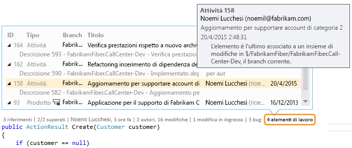  
  
### Individuare revisioni del codice collegate  
 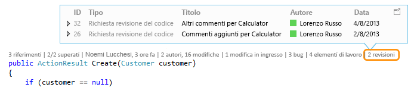  
  
### Individuare bug collegati  
 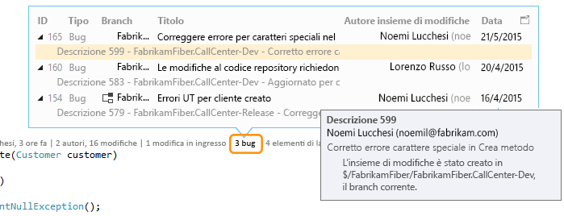  
  
### Contattare il proprietario di un elemento  
   
  
 Aprire il menu di scelta rapida di un elemento per visualizzare le opzioni di contatto. Se è installato Lync o Skype per Business, è possibile visualizzare queste opzioni:  
  
   
  
##   Trovare unit test per il codice  
 Informazioni sugli unit test disponibili per il proprio codice senza la necessità di aprire Test Explorer. Sono necessari:  
  
-   Visual Studio Enterprise e Visual Studio Professional  
  
-   Codice di Visual C# .NET o Visual Basic .NET  
  
-   Un [progetto unit test](../test/unit-test-your-code.md) che includa unit test per il codice dell'applicazione  
  
1.  Visualizzare il codice dell'applicazione contenente unit test.  
  
2.  Visualizzare i test per tale codice (**ALT + 3**).  
  
     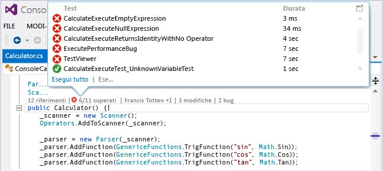  
  
3.  Se viene visualizzata un'icona di avviso , eseguire i test.  
  
     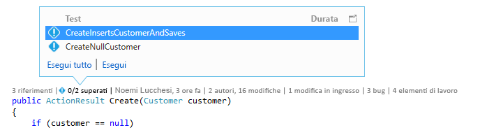  
  
4.  Per esaminare la definizione di un test, fare doppio clic sull'elemento di test nella finestra dell’indicatore CodeLens per aprire il file di codice nell'editor.  
  
     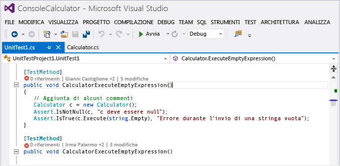  
  
5.  Esaminare i risultati del test. Scegliere l'indicatore di stato dei test ( o ), oppure premere **ALT + 1**.  
  
     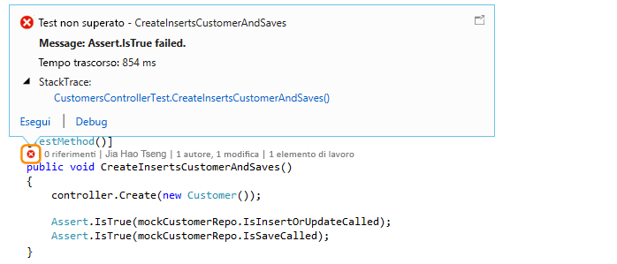  
  
6.  Per vedere quante persone hanno modificato il test, gli autori delle modifiche o il numero di modifiche apportate al test, [Individuare la cronologia e gli elementi collegati del codice](#FindCodeHistory).  
  
##   Domande e risposte  
  
###   D: Come si attiva o disattiva CodeLens o si scelgono gli indicatori da visualizzare?  
 **R:**  È possibile attivare o disattivare tutti gli indicatori, ad eccezione di Riferimenti. Passare a **Strumenti**, **Opzioni**, **Editor di testo**, **Tutti i linguaggi**, **CodeLens**.  
  
 Quando gli indicatori sono attivati, è possibile anche aprire le opzioni CodeLens dagli indicatori.  
  
 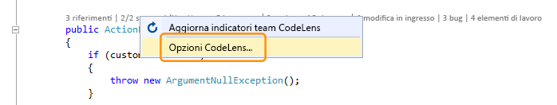  
  
 Attivare gli indicatori CodeLens a livello di file e disattivare l’utilizzo delle icone con la freccia di espansione nella parte inferiore della finestra dell'editor.  
  
   
  
###   D: Dove si trova CodeLens?  
 **R:** CodeLens viene visualizzato nel codice Visual C# .NET e Visual Basic .NET a livello di metodo, classe, indicizzatore e proprietà. CodeLens viene visualizzato a livello di file per tutti gli altri tipi di file.  
  
-   Assicurarsi che CodeLens sia attivato. Passare a **Strumenti**, **Opzioni**, **Editor di testo**, **Tutti i linguaggi**, **CodeLens**.  
  
-   Se il codice è archiviato in TFS, assicurarsi che l'indicizzazione del codice sia attivata usando il [comando CodeIndex](../ide/codeindex-command.md) con il [comando Config di TFS](http://msdn.microsoft.com/en-us/94424190-3b6b-4f33-a6b6-5807f4225b62).  
  
-   Gli indicatori TFS vengono visualizzati solo quando gli elementi di lavoro sono collegati al codice e quando si dispone delle autorizzazioni per aprire gli elementi di lavoro collegati. [Confermare di disporre delle autorizzazioni dei membri del team.](http://msdn.microsoft.com/en-us/f58805de-ba61-4d09-8f2d-d3ab9662ecfd)  
  
-   Gli indicatori di unit test non vengono visualizzati quando il codice dell'applicazione non contiene unit test. Gli indicatori di stato del test vengono visualizzati automaticamente nei progetti di test. Se si è certi che il codice dell'applicazione include di unit test, ma gli indicatori del test non vengono visualizzati, provare a compilare la soluzione (**CTRL+MAIUSC+B**).  
  
### D: Perché non vengono visualizzati i dettagli degli elementi di lavoro per un commit?  
 **R:** Questo problema potrebbe verificarsi perché CodeLens non riesce a trovare gli elementi di lavoro in TFS. Verificare di essere connessi al progetto team con quelli elementi di lavoro e di avere le autorizzazioni necessarie per visualizzare gli elementi di lavoro. Questa situazione potrebbe anche verificarsi se la descrizione di commit presenta informazioni non corrette sugli ID elemento di lavoro in TFS.  
  
###   D: Perché gli indicatori Lync o Skype non sono visualizzati?  
 **R:** Gli indicatori non vengono visualizzati quando non si è connessi a Lync oppure a Skype for Business, quando non uno di questi programmi non è installato o la configurazione non è supportata. È comunque possibile inviare messaggi di posta elettronica:  
  
 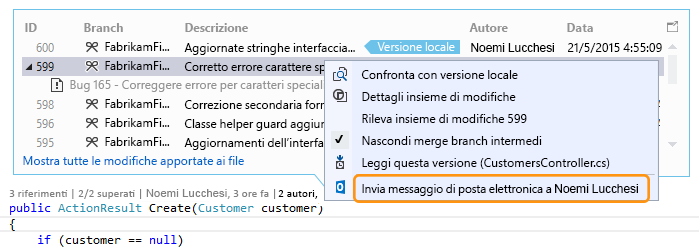  
  
 **Quali configurazioni di Lync e Skype sono supportate?**  
  
-   Skype per Business (32 bit o 64 bit)  
  
-   Lync 2010 o nelle versioni successive da solo (32 bit o 64 bit), ma non Lync Basic 2013 con Windows 8.1  
  
 CodeLens non supporta l'installazione di versioni di Lync o Skype diverse. Potrebbero non essere stati localizzati per tutte le versioni localizzate di Visual Studio.  
  
### D: Come si modifica il tipo di carattere e il colore per CodeLens?  
 **R:** accedere a **Strumenti**, **Opzioni**, **Ambiente**, **Tipi di carattere e colori**.  
  
 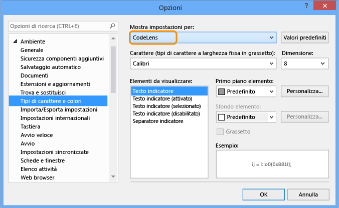  
  
 Per usare la tastiera:  
  
1.  Premere **ALT+T+O** per aprire la finestra di dialogo **Opzioni** .  
  
2.  Premere **Freccia SU** o **Freccia GIÙ** per passare al nodo **Ambiente** , quindi premere **Freccia SINISTRA** per espandere il nodo.  
  
3.  Premere **Freccia GIÙ** da passare a **Tipi di carattere e colori**.  
  
4.  Premere **TAB** per passare all'elenco **Mostra impostazioni per** , quindi premere **Freccia GIÙ** per selezionare **CodeLens**.  
  
### D: È possibile spostare l'heads-up display CodeLens?  
 **R:** Sì, è possibile scegliere  per ancorare CodeLens come una finestra.  
  
   
  
   
  
### D: come si aggiornano gli indicatori?  
 **R:** Dipende dall'indicatore:  
  
-   **Riferimenti**: questo indicatore viene aggiornato automaticamente in caso di modifica del codice. Se questo indicatore è ancorato come finestra separata, è possibile aggiornarlo manualmente qui:  
  
     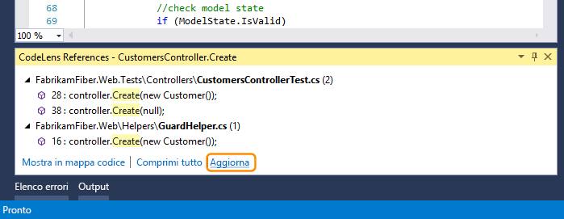  
  
-   **Team**: aggiornare questi indicatori manualmente qui:  
  
     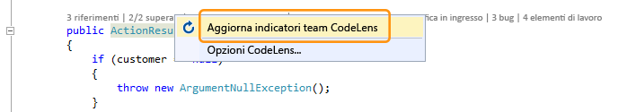  
  
-   **Test**: [Trovare unit test per il codice](#FindRunUnitTests) per aggiornare questo indicatore.  
  
###   D: Qual è la "versione locale"?  
 **R:** La freccia **Versione locale** punta al set di modifiche più recente nella versione locale di questo file. Quando il server ha insiemi di modifiche più recenti, vengono visualizzati sopra o sotto la freccia **Versione locale** , a seconda dell'ordine usato per ordinare gli insiemi di modifiche.  
  
### D: È possibile gestire la modalità di elaborazione del codice in CodeLens per visualizzare la cronologia e gli elementi collegati?  
 **R:** Sì, se il codice è disponibile in TFS, usare il [comando CodeIndex](../ide/codeindex-command.md) con il [comando Config di TFS](http://msdn.microsoft.com/en-us/94424190-3b6b-4f33-a6b6-5807f4225b62).
