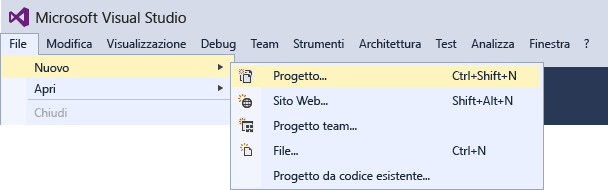
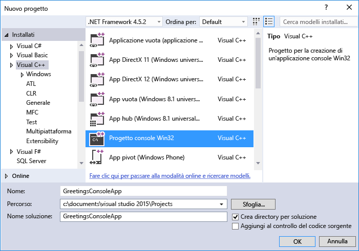
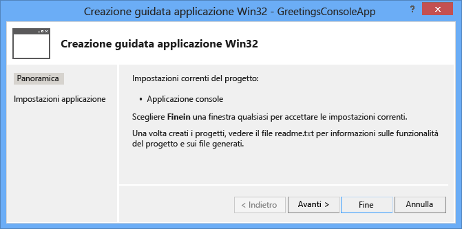
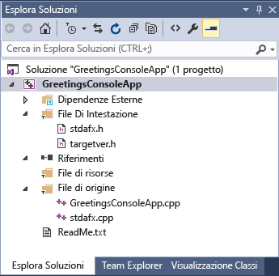
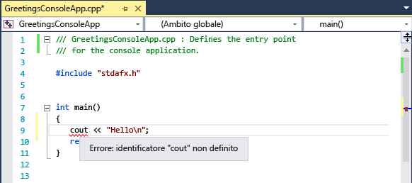
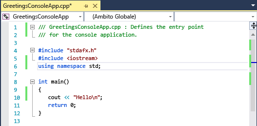
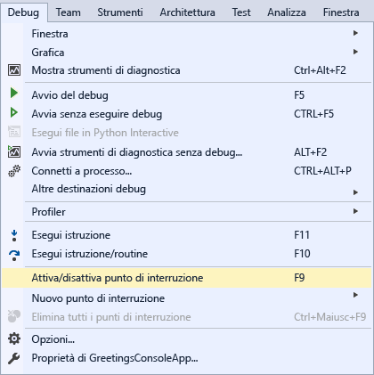
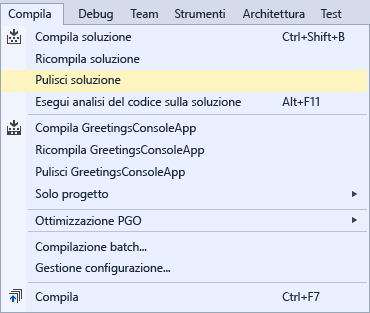
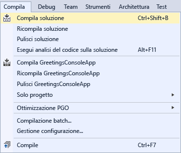

# <a name="getting-started-with-c-in-visual-studio"></a>Guida introduttiva a C++ in Visual Studio
Completando questa procedura dettagliata è possibile acquisire familiarità con molti strumenti e molte finestre di dialogo utili per lo sviluppo di applicazioni con Visual Studio. Durante la procedura gli utenti potranno creare una semplice applicazione in stile "Hello, World", acquisendo al contempo altre informazioni su come lavorare in un ambiente di sviluppo integrato (IDE, Integrated Development Environment).  
  
 Di seguito sono elencate le diverse sezioni di questo argomento:  
  
 [Accedere a Visual Studio](../ide/getting-started-with-cpp-in-visual-studio.md#BKMK_Configure)  
  
 [Creare una semplice applicazione](../ide/getting-started-with-cpp-in-visual-studio.md#BKMK_CreateApp)  
  
 [Aggiungere codice all'applicazione](../ide/getting-started-with-cpp-in-visual-studio.md#BKMK_AddCode)  
  
 [Eseguire il debug e il test dell'applicazione](../ide/getting-started-with-cpp-in-visual-studio.md#BKMK_DebugTest)  
  
 [Compilare una versione di rilascio dell'applicazione](../ide/getting-started-with-cpp-in-visual-studio.md#BKMK_BuildRelease)  
  
##  <a name="BKMK_Configure"></a> Accedere a Visual Studio  
 La prima volta che si avvia Visual Studio, è possibile eseguire l'accesso con il proprio account Microsoft, ad esempio Live o Outlook. L'esecuzione dell'accesso consente di sincronizzare le impostazioni tra tutti i dispositivi. Per altre informazioni, vedere [Signing in to Visual Studio](../ide/signing-in-to-visual-studio.md).  
  
 Figura 1: IDE di Visual Studio  
  
   
  
 Dopo aver aperto Visual Studio, saranno visibili le tre parti fondamentali dell'IDE, vale a dire le finestre degli strumenti, i menu e le barre degli strumenti e lo spazio della finestra principale. Le finestre degli strumenti sono ancorate ai lati sinistro e destro della finestra dell'applicazione, con **Avvio veloce**, la barra dei menu e la barra degli strumenti standard nella parte superiore. Al centro della finestra dell'applicazione si trova la **Pagina iniziale**. Quando si apre una soluzione o un progetto, in questo spazio verranno visualizzati gli editor e le finestre di progettazione. Quando si sviluppa un'applicazione, per la maggior parte del tempo si usa quest'area centrale.  
  
##  <a name="BKMK_CreateApp"></a> Creare una semplice applicazione  
 Quando si crea un'applicazione in Visual Studio, è necessario prima di tutto creare un progetto e una soluzione. In questo esempio verrà creata un'applicazione console di Windows.  
  
#### <a name="to-create-a-console-app"></a>Per creare un'applicazione console  
  
1.  Nella barra dei menu scegliere **File**, **Nuovo**, **Progetto**.  
  
       
  
2.  Nella categoria **Visual C++** scegliere il modello **Progetto console Win32** , quindi denominare il progetto `GreetingsConsoleApp`.  
  
       
     La finestra di dialogo potrebbe includere opzioni diverse, a seconda di ciò che è stato installato. Se non vengono visualizzati modelli di progetto Visual C++, è necessario tornare al programma di installazione e installare un carico di lavoro di C++.
  
3.  Quando viene visualizzata la Creazione guidata applicazione Win32, scegliere **Fine** .  
  
       
  
 Il progetto e la soluzione GreetingsConsoleApp, con i file di base per un progetto console Win32, verranno creati e automaticamente caricati in **Esplora soluzioni**. Il file GreetingsConsoleApp.cpp viene aperto nell'editor di codice. In **Esplora soluzioni**vengono visualizzati gli elementi indicati di seguito.  
  
 Figura 4: Elementi di progetto  
  
   
  
##  <a name="BKMK_AddCode"></a> Aggiungere codice all'applicazione  
 In seguito, verrà aggiunto il codice per visualizzare la parola "Hello" nella finestra della console.  
  
#### <a name="to-display-hello-in-the-console-window"></a>Per visualizzare "Hello" nella finestra della console  
  
1.  Nel file GreetingsConsoleApp.cpp, inserire una riga vuota prima della riga `return 0;` e quindi immettere il codice seguente:  
  
    ```  
    cout << "Hello\n";  
    ```  
  
     Una linea rossa ondulata appare sotto `cout`. Se si posiziona il mouse sulla linea, verrà visualizzato un messaggio di errore.  
  
       
  
     Il messaggio di errore viene visualizzato anche nella finestra **Elenco errori** . È possibile visualizzare la finestra scegliendo **Visualizzazione**, **Elenco errori** dalla barra dei menu.  
  
     [cout](/cpp/standard-library/iostream) è incluso nel file di intestazione \<iostream>.  
  
2.  Per includere l'intestazione iostream, immettere il codice seguente dopo `#include "stdafx.h"`:  
  
    ```  
    #include <iostream>  
    using namespace std;  
    ```  
  
     Come è possibile notare, dopo aver immesso il codice viene visualizzato un riquadro contenente suggerimenti per i caratteri immessi. Questo riquadro fa parte di IntelliSense per C++, che fornisce prompt di codifica, inclusi gli elenchi di classi o membri di interfaccia e informazioni sui parametri. È anche possibile usare frammenti di codice, cioè blocchi di codice predefiniti. Per altre informazioni, vedere [Using IntelliSense](../ide/using-intellisense.md) e [Code Snippets](../ide/code-snippets.md).  
  
     La sottolineatura ondulata di colore rosso sotto `cout` scomparirà dopo aver risolto l'errore.  
  
3.  Salvare le modifiche apportate al file.  
  
       
  
##  <a name="BKMK_DebugTest"></a> Eseguire il debug e testare l'applicazione  
 È possibile eseguire il debug del file GreetingsConsoleApp per verificare se la parola "Hello" viene visualizzata nella finestra della console.  
  
#### <a name="to-debug-the-application"></a>Per eseguire il debug dell'applicazione  
  
-   Avviare il debugger.  
  
       
  
     Il debugger viene avviato e viene eseguito il codice. La finestra della console (una finestra separata simile a un prompt dei comandi) viene visualizzata per pochi secondi, ma si chiude rapidamente quando il debugger si arresta. Per visualizzare il testo, è necessario impostare un punto di interruzione per arrestare l'esecuzione del programma.  
  
#### <a name="to-add-a-breakpoint"></a>Per aggiungere un punto di interruzione  
  
1.  Aggiungere un punto di interruzione dalla barra dei menu in corrispondenza della riga `return 0;`. È anche possibile fare clic sul margine sinistro per impostare un punto di interruzione.  
  
       
  
     Accanto alla riga di codice nel margine di estrema sinistra della finestra dell'editor verrà visualizzato un cerchio rosso.  
  
2.  Premere il tasto F5 per avviare il debug.  
  
     Il debugger viene avviato, e viene visualizzata una finestra della console con la parola **Hello**.  
  
       
  
3.  Premere MAIUSC+F5 per arrestare il debug.  
  
 Per altre informazioni, vedere [Console Projects](../debugger/debugging-preparation-console-projects.md) (Progetti console).  
  
##  <a name="BKMK_BuildRelease"></a> Compilare una versione di rilascio dell'applicazione  
 Dopo aver verificato che tutto funzioni, è possibile preparare una build di rilascio dell'applicazione.  
  
#### <a name="to-clean-the-solution-files-and-build-a-release-version"></a>Per pulire i file della soluzione e compilare una versione di rilascio  
  
1.  Dalla barra dei menu, eliminare i file intermedi e i file di output creati durante le compilazioni precedenti.  
  
       
  
2.  Modificare la configurazione di compilazione per GreetingsConsoleApp da **Debug** a **Rilascio**.  
  
       
  
3.  Compilare la soluzione.  
  
       
  
 La procedura dettagliata è stata completata. Per altri esempi, vedere [Visual Studio Samples](../ide/visual-studio-samples.md) (Esempi di Visual Studio).  
  
## <a name="see-also"></a>Vedere anche  
 [Using the Visual Studio IDE for C++ Desktop Development](/cpp/ide/using-the-visual-studio-ide-for-cpp-desktop-development)  (Uso dell'IDE di Visual Studio per lo sviluppo di applicazioni desktop C++)  
 [Walkthrough: Create a Simple Application with Visual C# or Visual Basic](../ide/walkthrough-create-a-simple-application-with-visual-csharp-or-visual-basic.md)  (Procedura dettagliata: creare un'applicazione semplice con Visual C# o Visual Basic)  
 [Suggerimenti relativi alla produttività per Visual Studio](../ide/productivity-tips-for-visual-studio.md)   
 [Visual Studio Samples](../ide/visual-studio-samples.md)  (Esempi di Visual Studio)  
 [Introduzione allo sviluppo con Visual Studio](../ide/get-started-developing-with-visual-studio.md)
