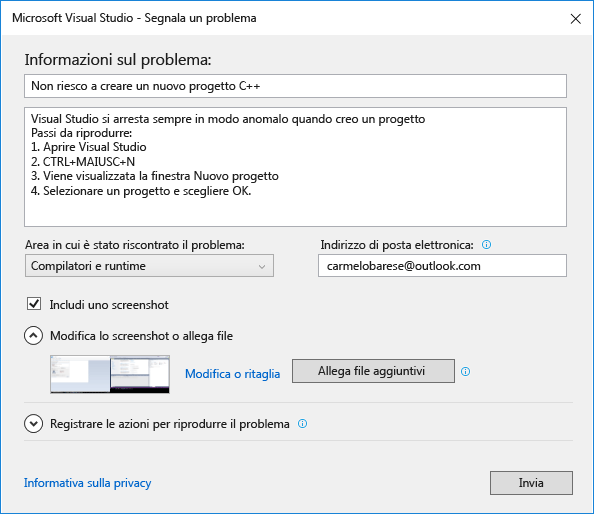
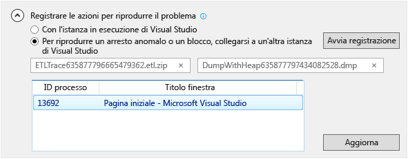

# Come segnalare un problema con Visual Studio
[!INCLUDE[vs2017banner](../code-quality/includes/vs2017banner.md)]

Se si verifica un problema con Visual Studio, è opportuno riportarlo a Microsoft in modo che possa diagnosticarlo e risolverlo.  Con lo strumento **Segnala un problema** è possibile raccogliere informazioni dettagliate sul problema e inviarle a Microsoft in pochi clic.  
  
 Microsoft rispetta la privacy degli utenti. Per informazioni su come vengono gestiti i dati inviati a Microsoft, vedere [Informativa sulla privacy della famiglia dei prodotti Microsoft Visual Studio](https://www.visualstudio.com/en-us/dn948229).  
  
## Aprire lo strumento Segnala un problema  
 Fare clic sull'icona dei commenti e suggerimenti dell'utente accanto ad **Avvio veloce** nella barra del titolo oppure fare clic su **? &#124; Invia commenti e suggerimenti &#124; Segnala un problema**.  
  
   
  
## Descrivere il problema  
  
###    
  
1.  Inserire un titolo descrittivo per il problema in modo da consentirne l'invio al team di Visual Studio dedicato.  
  
2.  Fornire eventuali dettagli aggiuntivi e, se possibile, la procedura per riprodurre il problema.  
  
3.  Scegliere un'area collegata al problema nell'elenco a discesa. Se non si è certi, scegliere l'opzione più probabile.  
  
   
  
## Aggiungere uno screenshot \(facoltativo\)  
 Scegliere **Includi uno screenshot** per inviare la schermata corrente a Microsoft. Lo strumento consente di ritagliare l'immagine per visualizzare solo la parte della schermata che illustra il problema. È possibile collegare ulteriori screenshot o altri file facendo clic sul pulsante **Allega file aggiuntivi**.  
  
## Fornire una traccia e un dump di heap \(facoltativo\)  
  
###    
  
1.  I file di traccia e di dump di heap sono utili per diagnosticare i problemi.   Siamo grati agli utenti che usano lo strumento Segnala un problema per registrare la procedura che consente di riprodurre il problema e inviare i dati a Microsoft.  
  
2.  Fare clic sulla freccia di espansione accanto a **Registrare le azioni per riprodurre il problema**. Se il problema causa il blocco o l'arresto anomalo di Visual Studio, aprire un'altra istanza di Visual Studio e selezionarla nella visualizzazione elenco.  
  
3.  Fare clic su **Avvia registrazione** e completare i passaggi per riprodurre il problema. Al termine, fare clic sul pulsante **Arresta registrazione** nella finestra mobile.  
  
4.  Attendere alcuni minuti mentre Visual Studio raccoglie e comprime le informazioni registrate. Quando il processo di raccolta è completato, la finestra di dialogo avrà un aspetto simile al seguente:  
  
       
  
## Descrivere la soluzione alternativa, se presente  
 Se è stata trovata una soluzione alternativa, descriverla nella casella di modifica fornita a tale scopo. In questo modo, Microsoft sarà in grado di fornire agli utenti non solo una diagnosi del problema, ma anche una possibile soluzione.  
  
## Inviare il report  
 Fare clic sul pulsante Invia per inviare il report, insieme a eventuali immagini e ai file di traccia o di dump. Se il pulsante **Invia** è disattivato, verificare di aver specificato un titolo e una descrizione.  
  
## Vedere anche  
 [Comunicazioni con Microsoft](../ide/talk-to-us.md)