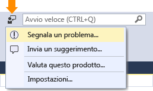

# Come segnalare un problema con Visual Studio 2017
Se si verifica un problema con Visual Studio, è opportuno riportarlo a Microsoft in modo che possa diagnosticarlo e risolverlo.  Con lo strumento **Segnala un problema** è possibile raccogliere informazioni dettagliate sul problema e quindi inviarle a Microsoft in pochi clic.  

 Microsoft rispetta la privacy degli utenti. Per informazioni sul trattamento dei dati inviati a Microsoft, vedere l'[Informativa sulla privacy Microsoft per aziende e sviluppatori](https://www.visualstudio.com/en-us/dn948229).  

## Aprire lo strumento Segnala un problema  
 Fare clic sull'icona dei commenti e suggerimenti utente accanto ad **Avvio veloce** sulla barra del titolo oppure fare clic su **? &#124; Commenti e suggerimenti &#124; Segnala un problema**.  

   

## Accedi a Visual Studio
 Se non già stato fatto, è opportuno effettuare l'accesso a Visual Studio prima di segnalare un problema. In questo modo, non solo è possibile segnalare un problema che si verifica, ma è anche possibile aggiungere voti o commenti per la segnalazione o per qualsiasi altro problema pubblicato.

  1. Fare clic su **Accedi** sul lato sinistro dello strumento, come illustrato nello screenshot seguente.
  2. Seguire le istruzioni visualizzate per accedere.

  

## Cercare e contrassegnare problemi simili  
###    

1.  Cercare il problema e controllare se è già stato segnalato da altri utenti.
2.  Se è già stato segnalato, è necessario contrassegnarlo per inviare a Microsoft la notifica.  

  

## Segnalare un problema nuovo
###  
1.  Nella parte inferiore a sinistra dello strumento **Segnala un problema** di Visual Studio fare clic sul pulsante "**+**".  
2.  Creare un titolo descrittivo per il problema in modo da consentirne l'invio al team di Visual Studio corretto.  
3.  Fornire eventuali dettagli aggiuntivi e, se possibile, descrivere la procedura per riprodurre il problema.  

  

## Inviare screenshot e allegati (facoltativo)
###  
 Scegliere di inviare la schermata corrente a Microsoft. È possibile allegare altri screenshot o altri file facendo clic sul pulsante **Allega altri file**.  

## Fornire una traccia e un dump di heap (facoltativo)  
###    

I file di traccia e di dump di heap sono utili per diagnosticare i problemi.   Si ringrazia coloro che usano lo strumento **Segnala un problema** per registrare la procedura che consente di riprodurre il problema e inviare i dati.  Ecco come eseguire questa operazione.

1.  Fare clic sulla scheda **Registra**.
2.  Fare clic su **Avvia registrazione**. Concedere le autorizzazioni per eseguire lo strumento.
3.  Quando lo strumento **Registrazione azioni utente** viene visualizzato, seguire la procedura per riprodurre il problema.
4.  Alla fine, fare clic sul pulsante **Arresta registrazione** nella finestra mobile.
5.  Attendere alcuni minuti mentre Visual Studio raccoglie e comprime le informazioni registrate.  Al termine della procedura si aprirà una finestra simile alla seguente.   

  

## Inviare il report  
###    
 Fare clic sul pulsante **Invia** per inviare il report, insieme a eventuali immagini, tracce o file dump. Se il pulsante **Invia** è disattivato, verificare di aver specificato un titolo e una descrizione per il report.  

## Vedere anche  
 [Talk to Us](../ide/talk-to-us.md) (Comunicazioni con Microsoft)

