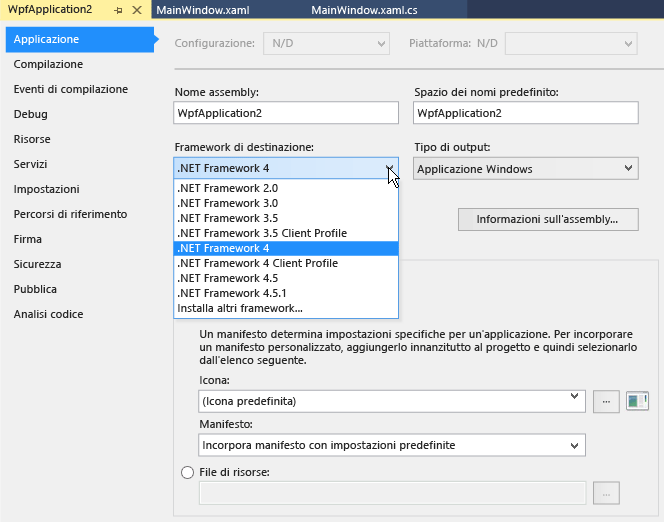

# Procedura: destinare una versione di .NET Framework

In questo documento viene descritto come scegliere una versione di destinazione di .NET Framework quando si crea un progetto e come modificare la versione di destinazione in un progetto di Visual Basic, Visual C# o Visual F# esistente.  
  
> [!IMPORTANT]
>  Per informazioni su come modificare la versione di destinazione per i progetti C++, vedere [Procedura: Modificare il framework di destinazione e il set di strumenti della piattaforma](/cpp/build/how-to-modify-the-target-framework-and-platform-toolset).  
  
 **Contenuto dell'argomento**  
  
-   [Destinazione di una versione durante la creazione di un progetto](../ide/how-to-target-a-version-of-the-dotnet-framework.md#bkmk_new)  
  
-   [Modifica della versione di destinazione](../ide/how-to-target-a-version-of-the-dotnet-framework.md#bkmk_existing)  
  
##   Versione di destinazione durante la creazione di un progetto  
 Quando si crea un progetto, la versione di .NET Framework di destinazione determina i modelli che è possibile utilizzare.  
  
> [!NOTE]
>  Nelle edizioni Express di Visual Studio, è necessario creare prima il progetto e successivamente modificare la destinazione, come descritto più avanti nella sezione [Modifica della versione di destinazione](../ide/how-to-target-a-version-of-the-dotnet-framework.md#bkmk_existing) di questo argomento.  
  
#### Per scegliere una versione di destinazione durante la creazione di un progetto
  
  
1.  Nella barra dei menu scegliere **File**, **Nuovo**, **Progetto**.  
  
2.  Nell'elenco che si trova nella parte superiore della finestra di dialogo **Nuovo progetto** scegliere la versione di .NET Framework a cui si vuole destinare il progetto.  
  
    > [!NOTE]
    >  In genere, viene installata una sola una versione di .NET Framework con Visual Studio. Se si desidera destinare il progetto a un'altra versione, è necessario innanzitutto verificare che sia installata. Vedere [Panoramica del multitargeting di Visual Studio](../ide/visual-studio-multi-targeting-overview.md).  
  
3.  Nell'elenco dei modelli installati, selezionare il tipo di progetto che si vuole creare, assegnare un nome al progetto e quindi scegliere **OK**.  
  
     Nell'elenco dei modelli vengono mostrati solo quei progetti che sono supportati dalla versione di .NET Framework selezionata.  
  
##  Modifica della versione di destinazione  
 È possibile cambiare la versione di destinazione di .NET Framework in un progetto di Visual Basic, Visual C#, Visual F# seguendo la procedura seguente.  
  
#### Per cambiare la versione di destinazione
  
  
1.  In **Esplora soluzioni** aprire il menu di scelta rapida del progetto che si vuole modificare e scegliere **Proprietà**.  
  
       
  
    > [!IMPORTANT]
    >  Per informazioni su come modificare la versione di destinazione per i progetti C++, vedere [Procedura: Modificare il framework di destinazione e il set di strumenti della piattaforma](/cpp/build/how-to-modify-the-target-framework-and-platform-toolset).  
  
2.  Nella colonna sinistra della finestra delle proprietà scegliere la scheda **Applicazione**.  
  
       
  
    > [!NOTE]
    >  Dopo aver creato un'app di Windows Store, non è possibile cambiare la versione di destinazione di Windows o di .NET Framework.  
  
3.  Nell'elenco **Framework di destinazione** selezionare la versione appropriata.  
  
4.  Nella finestra di dialogo di verifica visualizzata scegliere **Sì**.  
  
     Il progetto verrà scaricato. Una volta caricato nuovamente, il progetto sarà destinato alla versione di .NET Framework appena scelta.  
  
    > [!NOTE]
    >  Se il codice contiene riferimenti a una versione di .NET Framework diversa rispetto a quella di destinazione, è possibile che vengano visualizzati dei messaggi di errore durante la compilazione o l'esecuzione del codice. Per risolvere questi errori è necessario modificare i riferimenti. Vedere [Risoluzione dei problemi relativi agli errori di impostazione di .NET Framework come destinazione](../msbuild/troubleshooting-dotnet-framework-targeting-errors.md).  
  
## Vedere anche
  
 [Panoramica del multitargeting di Visual Studio](../ide/visual-studio-multi-targeting-overview.md)   
 [.NET Framework Multi-Targeting for ASP.NET Web Projects](http://msdn.microsoft.com/Library/8b8145a9-62f6-4fc4-8a83-47b0487cbe76)  (Multitargeting .NET Framework per progetti Web ASP.NET)  
 [Risoluzione dei problemi relativi agli errori di impostazione di .NET Framework come destinazione](../msbuild/troubleshooting-dotnet-framework-targeting-errors.md)   
 [Application Page, Project Designer (C#)](../ide/reference/application-page-project-designer-csharp.md)  (Applicazione (pagina), Creazione progetti (C#))  
 [Application Page, Project Designer (Visual Basic)](../ide/reference/application-page-project-designer-visual-basic.md)  (Pagina Applicazione, Creazione progetti (Visual Basic))  
 [Configurazione dei progetti](http://msdn.microsoft.com/Library/a1489abb-6294-4f8f-b71f-2cb126393526)   
 [Procedura: Modificare il framework di destinazione e il set di strumenti della piattaforma](/cpp/build/how-to-modify-the-target-framework-and-platform-toolset)
