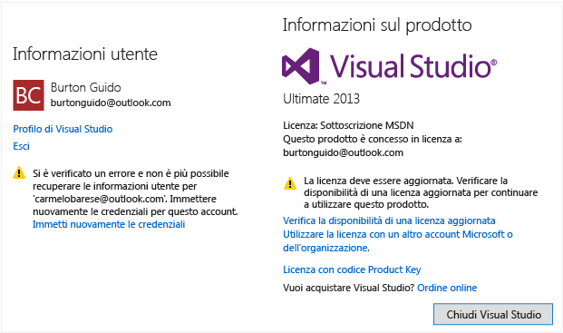

# Come sbloccare Visual Studio
È possibile valutare gratuitamente Visual Studio per un massimo di 30 giorni. Quando si accede all'IDE, sarà possibile estendere il periodo di valutazione fino a 90 giorni. Per continuare a usare Visual Studio, è possibile sbloccare l'IDE nei modi seguenti:  
  
1.  Usando un abbonamento online.  
  
2.  Immettendo un codice Product Key.  
  
## Per sbloccare Visual Studio usando una sottoscrizione online  
 Per sbloccare Visual Studio usando un abbonamento per MSDN o Visual Studio Online associato a un account Microsoft oppure a un account aziendale o dell'istituto di istruzione:  
  
1.  Fare clic sul pulsante "Accedi" nell'angolo superiore destro dell'IDE oppure scegliere File > Impostazioni account per aprire la finestra di dialogo Impostazioni account e fare clic sul pulsante "Accedi".  
  
2.  Immettere le credenziali per un account Microsoft oppure un account aziendale o dell'istituto di istruzione. Visual Studio individuerà un abbonamento a MSDN o a Visual Studio Team Services associato all'account.  
  
> [!IMPORTANT]
>  Visual Studio cerca automaticamente gli abbonamenti online associati quando ci si connette a un account Visual Studio Team Services dalla finestra dello strumento Team Explorer. Quando ci si connette a un account Visual Studio Team Services, è possibile accedere usando account Microsoft e account aziendali o dell'istituto di istruzione. Se è disponibile un abbonamento online per l'account utente, Visual Studio sbloccherà automaticamente l'IDE.  
  
## Per sbloccare Visual Studio con un codice Product Key  
  
1.  Selezionare **File > Impostazioni account** per aprire la finestra di dialogo Impostazioni account e fare clic sul collegamento "**Licenza con codice Product Key**".  
  
2.  Immettere il codice Product Key nell'apposita casella.  
  
> [!TIP]
>  Le versioni preliminari di Visual Studio non includono codici  Product Key. Per usare le versioni preliminari, è necessario accedere all'IDE.  
  
## Risolvere i problemi di licenza  
  
### Aggiornare le licenze non aggiornate  
 È possibile che sia stato visualizzato il messaggio seguente, che indica che la licenza sta per diventare obsoleta in Visual Studio.  
  
   
  
 Questo messaggio indica che, anche se è possibile che l'abbonamento sia ancora valido, il token della licenza usato da Visual Studio per mantenere aggiornato l'abbonamento non è stato aggiornato ed è diventato obsoleto a causa di uno dei motivi seguenti:  
  
1.  Visual Studio non è stato usato o non è stata disponibile alcuna connessione a Internet per un lungo periodo di tempo.  
  
2.  È stata effettuata la disconnessione da Visual Studio.  
  
 Prima che il token della licenza diventi obsoleto, Visual Studio visualizzerà un messaggio di avviso che richiede di immettere nuovamente le credenziali.  
  
 Se non si immettono di nuovo le credenziali, il token inizierà a diventare obsoleto. In questo caso, la finestra di dialogo Impostazioni account indica il numero di giorni rimanenti prima della scadenza completa del token. Dopo la scadenza del token, sarà necessario immettere di nuovo le credenziali per questo account oppure ottenere la licenza con un altro metodo indicato prima di potere continuare a usare Visual Studio.  
  
> [!IMPORTANT]
>  Se si usa Visual Studio per lunghi periodi di tempo in ambienti con accesso a Internet assente o limitato, è consigliabile usare un codice Product Key per sbloccare Visual Studio, in modo da evitare interruzioni.  
  
### Aggiornare le licenze scadute  
 Se l'abbonamento è completamente scaduto e non si dispone più dei diritti di accesso a Visual Studio, è necessario:  
  
1.  Rinnovare l'abbonamento. Per visualizzare altre informazioni sulla licenza in uso, passare alla finestra di dialogo File > Impostazioni account e quindi verificare le informazioni sulla licenza nella parte destra della finestra di dialogo.  
  
2.  Se si ha un altro abbonamento associato a un account diverso, aggiungere tale account all'elenco Tutti gli account nel lato sinistro della finestra di dialogo File > Impostazioni account facendo clic sul collegamento "Aggiungi un account".  
  
## Vedere anche  
 [Signing in to Visual Studio](../ide/signing-in-to-visual-studio.md) (Accesso a Visual Studio)

<!--HONumber=Feb17_HO4-->

