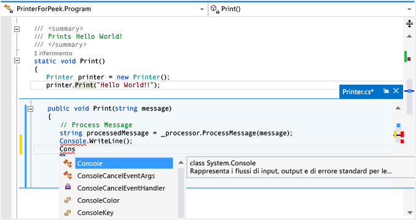

# Procedura: visualizzare e modificare il codice utilizzando la finestra Visualizza definizione (ALT+F12)
[!INCLUDE[vs2017banner](../code-quality/includes/vs2017banner.md)]

È possibile utilizzare il comando **Visualizza definizione** per visualizzare e modificare il codice senza chiuderlo in fase di scrittura.  **Visualizza definizione** e **Vai a definizione** visualizzano le stesse informazioni, ma **Visualizza definizione** mostra il codice in una finestra popup e **Vai a definizione** mostra il codice in una finestra separata.  **Vai a definizione** determina il passaggio del contesto \(ovvero la finestra di codice attiva, la riga corrente e la posizione del cursore\) alla finestra del codice di definizione.  Tramite **Visualizza definizione** è possibile visualizzare e modificare la definizione e spostarsi all'interno del file di definizione, mantenendo la stessa posizione nel file di codice originale.  
  
 È possibile utilizzare **Visualizza definizione** con codice C\#, Visual Basic e C\+\+.  In Visual Basic, **Visualizza definizione** mostra un collegamento a **Visualizzatore oggetti** per i simboli sprovvisti di metadati di definizione, ad esempio tipi .NET Framework incorporati.  
  
> [!IMPORTANT]
>  Non è possibile utilizzare questo comando nelle versioni Express di Visual Studio 2013.  
  
## Utilizzo di Visualizza definizione  
  
#### Per aprire una finestra Visualizza definizione  
  
1.  Per trovare **Visualizza definizione**, aprire il menu di scelta rapida per un metodo che si desidera esplorare. Tastiera: ALT\+F12.  
  
     In questa illustrazione viene mostrata la finestra **Visualizza definizione** per un metodo denominato `Print()`:  
  
       
  
     La finestra di definizione appare sotto la riga `printer.Print(“Hello World!”)` nel file originale.  La finestra non nasconde alcuna sezione di codice nel file originale.  Le righe che seguono la chiamata `printer.Print(“Hello World!”)` vengono visualizzate al di sotto della finestra di definizione.  
  
2.  È possibile spostare il cursore in posizioni diverse all'interno della finestra di definizione del codice.  È comunque possibile spostarsi nella finestra del codice originale al di sopra o al di sotto della finestra di definizione.  
  
3.  È possibile copiare una stringa dalla finestra di definizione e incollarla nel codice originale.  È inoltre possibile trascinare e rilasciare la stringa dalla finestra di definizione nel codice originale senza eliminarla dalla finestra di definizione.  
  
4.  È possibile chiudere la finestra di definizione utilizzando il tasto ESC o il pulsante **Chiudi** nella scheda della finestra di definizione.  
  
#### Per aprire una finestra Visualizza definizione all'interno di una finestra Visualizza definizione  
  
-   Se è già aperta una finestra **Visualizza definizione**, è possibile chiamare di nuovo **Visualizza definizione** nel codice in tale finestra.  Verrà visualizzata un'altra finestra di definizione.  Accanto alla scheda della finestra di definizione verrà visualizzato un set di punti di navigazione, che è possibile utilizzare per spostarsi tra le finestre di definizione.  La descrizione comando in ciascun punto indica il nome e il percorso del file di definizione rappresentato dal punto.  
  
       
  
#### Per utilizzare Visualizza definizione con più risultati  
  
-   Se si utilizza **Visualizza definizione** in codice con più definizioni, ad esempio classi parziali, verrà visualizzato un elenco di risultati a destra della visualizzazione della definizione di codice.  È possibile scegliere qualsiasi risultato nell'elenco per visualizzarne la definizione.  
  
       
  
#### Per apportare modifiche all'interno della finestra Visualizza Definizione  
  
-   All'avvio del processo di modifica all'interno di una finestra **Visualizza definizione**, il file sottoposto a modifiche verrà automaticamente visualizzato sotto forma di scheda separata nell'editor di codice e rifletterà le modifiche già apportate.  È possibile continuare ad apportare, annullare e salvare modifiche nella finestra **Visualizza definizione** e la scheda continuerà a riflettere tali modifiche.  Anche se si chiude la finestra senza salvare le modifiche, è possibile apportare, annullare e salvare altre modifiche nella scheda, riprendendo esattamente dal punto precedente nella finestra.  
  
       
  
#### Per utilizzare tasti di scelta rapida per Visualizza definizione  
  
-   È possibile utilizzare questi tasti di scelta rapida nella finestra **Visualizza definizione**:  
  
    |Funzionalità|Tasto di scelta rapida|  
    |------------------|----------------------------|  
    |Consente di aprire la finestra di definizione|ALT\+F12|  
    |Consente di chiudere la finestra di definizione|ESC|  
    |Consente di alzare di livello la finestra di definizione in una scheda documento normale|MAIUSC\+ALT\+HOME|  
    |Consente di spostarsi tra le finestre di definizione|CTRL\+ALT\+\- e CTRL\+ALT\+\=|  
    |Consente di spostarsi tra più risultati|F8 e MAIUSC\+F8|  
    |Consente di alternare la visualizzazione della finestra dell'editor di codice e la finestra di definizione|MAIUSC\+ESC|  
  
    > [!NOTE]
    >  È inoltre possibile utilizzare gli stessi tasti di scelta rapida per modificare codice in una finestra **Visualizza definizione** come in qualsiasi altra posizione in Visual Studio.  
  
## Vedere anche  
 [Suggerimenti per la produttività](../ide/productivity-tips-for-visual-studio.md)