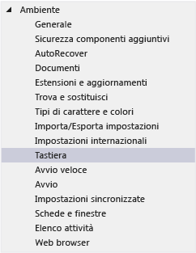
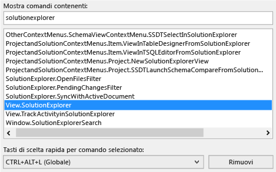
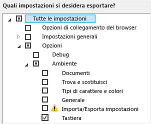
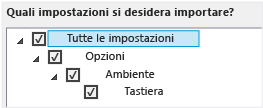

# Identificazione e personalizzazione dei tasti di scelta rapida in Visual Studio
[!INCLUDE[vs2017banner](../code-quality/includes/vs2017banner.md)]

È possibile identificare i tasti di scelta rapida per i comandi di Visual Studio, personalizzarli ed esportarli per consentirne l'utilizzo ad altri utenti.  Molti tasti di scelta rapida richiamano sempre gli stessi comandi, ma il comportamento di un tasto può variare in base alle condizioni indicate di seguito.  
  
-   Impostazioni di ambiente predefinite scelte alla prima esecuzione di Visual Studio, ad esempio Sviluppo generale o Visual C\#\).  
  
-   Se è stato personalizzato il comportamento del tasto di scelta rapida.  
  
-   Contesto attivo quando si seleziona il tasto di scelta rapida.  Ad esempio, il tasto di scelta rapida F2 richiama il comando Edit.EditCell se si utilizza Progettazione impostazioni e il comando File.Rename se si utilizza Team Explorer.  
  
 Indipendentemente dalle impostazioni, dalla personalizzazione e dal contesto, è possibile trovare e modificare un tasto di scelta rapida nella finestra di dialogo **Opzioni**.  È inoltre possibile cercare i tasti di scelta rapida predefiniti per decine e decine di comandi in [Tasti di scelta rapida predefiniti per i comandi utilizzati di frequente](../ide/default-keyboard-shortcuts-for-frequently-used-commands-in-visual-studio.md) e in [Tasti di scelta rapida predefiniti](../ide/default-keyboard-shortcuts-in-visual-studio.md) è disponibile un elenco completo di tutti i tasti di scelta rapida predefiniti \(basati su Impostazioni generali per lo sviluppo\).  
  
 **In questo argomento**  
  
-   [Identificazione di un tasto di scelta rapida](../ide/identifying-and-customizing-keyboard-shortcuts-in-visual-studio.md#bkmk_identify)  
  
-   [Personalizzazione di un tasto di scelta rapida](../ide/identifying-and-customizing-keyboard-shortcuts-in-visual-studio.md#bkmk_assign)  
  
-   [Condivisione di tasti di scelta rapida comuni](../ide/identifying-and-customizing-keyboard-shortcuts-in-visual-studio.md#bkmk_transfer)  
  
 Se un tasto di scelta rapida viene assegnato a un comando nel contesto globale e a nessun altro contesto, richiamerà sempre il comando in questione.  Un tasto di scelta rapida può tuttavia essere assegnato a un comando nel contesto globale e a un altro in un contesto specifico.  Se si utilizza tale tasto di scelta rapida nel contesto specifico, richiama il comando per il contesto specifico, non il contesto globale.  
  
> [!NOTE]
>  In base alle impostazioni e all'edizione di Visual Studio, i nomi e le pozioni dei comandi dei menu e le opzioni visualizzate nelle finestre di dialogo possono variare.  Questo argomento è basato su **Impostazioni generali per lo sviluppo**.  
  
##   Identificazione di un tasto di scelta rapida  
  
1.  Sulla barra dei menu, scegliere **Strumenti**, **Opzioni**.  
  
2.  Espandere **Ambiente**, quindi scegliere **Tastiera**.  
  
       
  
3.  Nella casella **Mostra comandi contenenti** immettere il nome del comando intero o parziale, senza spazi.  
  
     Ad esempio, sono disponibili comandi per solutionexplorer.  
  
4.  Scegliere il comando corretto nell'elenco.  
  
     Ad esempio, è possibile scegliere **View.SolutionExplorer**.  
  
5.  Se al comando è associato un tasto di scelta rapida, verrà visualizzato nell'elenco **Tasti di scelta rapida per comando selezionato**.  
  
       
  
##   Personalizzazione di un tasto di scelta rapida  
  
1.  Sulla barra dei menu, scegliere **Strumenti**, **Opzioni**.  
  
2.  Espandere la cartella **Ambiente** e scegliere **Tastiera**.  
  
       
  
3.  Nella casella **Mostra comandi contenenti** immettere il nome del comando intero o parziale, senza spazi.  
  
     Ad esempio, sono disponibili comandi per solutionexplorer.  
  
4.  Nell'elenco scegliere il comando a cui si desidera assegnare un tasto di scelta rapida.  
  
5.  Nell'elenco **Usa nuova combinazione in** scegliere l'area di funzionalità in cui si desidera utilizzare il tasto di scelta rapida.  
  
     Ad esempio, scegliere **Globale** se si desidera che il tasto di scelta rapida sia disponibile in tutti i contesti.  È possibile utilizzare qualsiasi tasto di scelta rapida non mappato come globale in un altro editor.  In caso contrario, la specifica dell'editor avrà la precedenza.  
  
    > [!NOTE]
    >  Non è possibile assegnare i seguenti tasti come tasti di scelta rapida in **Globale**: STAMP\/RSIST, BLOC SCORR, PAUSA\/INTERR, TAB, BLOC MAIUSC, INS, HOME, FINE, PGSU, PGGIÙ, il tasto logo di Windows, il tasto MENU SCELTA RAPIDA, i tasti Freccia oppure INVIO; BLOC NUM, CANC o CANC sul tastierino numerico oppure la combinazione CTRL\+ALT\+CANC.  
  
6.  Nella casella **Premi tasti di scelta rapida** immettere il tasto di scelta rapida che si desidera utilizzare.  
  
    > [!NOTE]
    >  È possibile creare un tasto di scelta rapida che combina una lettera e il tasto ALT, il tasto CTRL oppure entrambi.  È inoltre possibile creare un tasto di scelta rapida che combina il tasto MAIUSC e una lettera e il tasto ALT, il tasto CTRL oppure entrambi.  
  
     Se un tasto di scelta rapida è già assegnato a un altro comando, verrà visualizzato nella casella **Combinazione già utilizzata da**.  In tal caso, premere il tasto BACKSPACE per eliminare il tasto di scelta rapida prima di provarne un altro.  
  
       
  
7.  Scegliere il pulsante **Assegna**.  
  
    > [!NOTE]
    >  Se si specifica un tasto di scelta rapida diverso per un comando, scegliere il pulsante di **Assegna**, quindi il pulsante **Annulla**. La finestra di dialogo verrà chiusa, ma la modifica non verrà annullata.  
  
##   Condivisione di tasti di scelta rapida comuni  
 È possibile condividere i tasti di scelta rapida personalizzati esportandoli in un file e quindi fornendo il file ad altri utenti in modo che possano importare i dati.  
  
#### Per esportare solo i tasti di scelta rapida  
  
1.  Nella barra dei menu scegliere **Strumenti**, **Importa\/Esporta impostazioni**.  
  
2.  Scegliere **Esporta le impostazioni di ambiente selezionate**, quindi fare clic sul pulsante **Avanti**.  
  
3.  In **Quali impostazioni si desidera esportare?**, deselezionare la casella di controllo **Tutte le impostazioni**, espandere **Opzioni**, quindi **Ambiente**.  
  
4.  Selezionare la casella di controllo **Tastiera**, quindi scegliere il pulsante **Avanti**.  
  
       
  
5.  Nelle caselle **Assegnare un nome al file di impostazioni?** e **Archivia il file di impostazioni in questa directory** lasciare i valori predefiniti o specificare valori diversi e quindi scegliere il pulsante **Fine**.  
  
     Per impostazione predefinita, i tasti di scelta rapida vengono salvati in un file nella cartella %USERPROFILE%\\Documents\\Visual Studio 2013\\Settings.  Il nome del file riflette la data in cui sono state esportate le impostazioni e l'estensione è .vssettings.  
  
#### Per importare solo i tasti di scelta rapida  
  
1.  Nella barra dei menu scegliere **Strumenti**, **Importa\/Esporta impostazioni**.  
  
2.  Selezionare il pulsante di opzione **Importa le impostazioni di ambiente selezionate**, quindi fare clic sul pulsante **Avanti**.  
  
3.  Scegliere il pulsante di opzione **No, importa soltanto le nuove impostazioni, sovrascrivendo le impostazioni correnti**, quindi il pulsante **Avanti**.  
  
4.  In **Impostazioni personali** scegliere il file contenente i tasti di scelta rapida che si desidera importare oppure scegliere il pulsante **Sfoglia** per individuare il file corretto.  
  
5.  Fare clic sul pulsante **Avanti**.  
  
6.  In **Quali impostazioni si desidera importare?** deselezionare la casella di controllo **Tutte le impostazioni**, espandere **Opzioni**, quindi **Ambiente**.  
  
7.  Selezionare la casella di controllo **Tastiera**, quindi scegliere il pulsante **Fine**.  
  
       
  
## Vedere anche  
 [Funzionalità di accessibilità di Visual Studio](../ide/reference/accessibility-features-of-visual-studio.md)