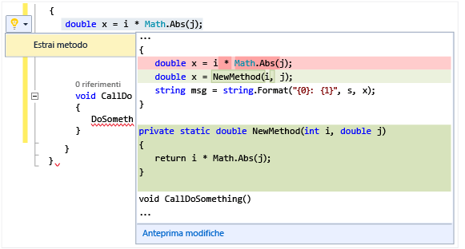

# Eseguire azioni rapide con le lampadine
Le lampadine sono una funzionalità per la produttività di Visual Studio. Si tratta di icone visualizzate nell'editor di Visual Studio, su cui si può fare clic per eseguire azioni rapide, tra cui refactoring e correzione degli errori. Grazie alle lampadine è possibile accedere a informazioni e strumenti utili per la correzione degli errori e il refactoring, nella maggior parte dei casi direttamente sulla riga in cui si sta digitando.  

   

 In C# e Visual Basic la lampadina viene visualizzata se è presente una sottolineatura ondulata rossa e in Visual Studio è disponibile un suggerimento per correggere l'errore. Ad esempio, se è presente un errore indicato da una sottolineatura rossa ondulata, verrà visualizzata una lampadina quando sono disponibili correzioni per tale errore. Quando in C++ si aggiunge una nuova funzione a un file di intestazione, viene visualizzata una lampadina in cui viene proposta la creazione automatica di un'implementazione stub della funzione. Nel caso in cui terze parti forniscano diagnostiche e suggerimenti personalizzati, ad esempio includendoli in SDK, per un qualsiasi linguaggio, le lampadine di Visual Studio si illumineranno sulla base di tali regole.  

## Per visualizzare una lampadina  

1.  In molti casi le lampadine vengono visualizzate spontaneamente quando si posiziona il puntatore del mouse su un errore oppure sul margine destro dell'editor, quando si sposta il cursore su una riga che contiene un errore. Quando è presente una sottolineatura ondulata rossa, è possibile passarvi sopra con il puntatore del mouse per visualizzare la lampadina. È anche possibile fare in modo che la lampadina venga visualizzata quando si usa il mouse o la tastiera per spostarsi nel punto della riga in cui si verifica l'errore.  

2.  Premere **Ctrl+.** in un punto qualsiasi della riga per richiamare la lampadina e passare direttamente all'elenco delle correzioni potenziali.  

   

## Per visualizzare le potenziali correzioni  
 Fare clic sulla freccia GIÙ o sul collegamento Mostra correzioni potenziali per visualizzare un elenco delle azioni rapide eseguibili automaticamente dalla lampadina.  

   

## Per eseguire un refactoring  
 Per eseguire i refactoring, oltre a fare clic con il pulsante destro del mouse per attivare il menu di scelta rapida, è anche possibile premere CTRL+. per visualizzare le opzioni di refactoring. Nella figura seguente il refactoring Estrai metodo diventa disponibile dopo che si è premuto CTRL+. in un punto qualsiasi della riga che contiene la chiamata a `Math.Abs`:  

 

