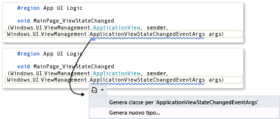
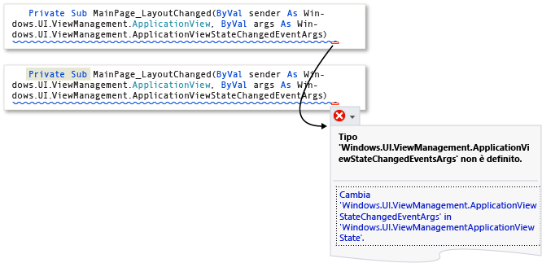
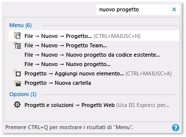

# Suggerimenti relativi alla produttività per Visual Studio
Seguendo questi suggerimenti, è possibile scrivere, esplorare ed eseguire il debug del codice in Visual Studio in modo più rapido ed efficiente. Per altre informazioni sui tasti di scelta rapida comuni, vedere [Tips and Tricks](../ide/tips-and-tricks-for-visual-studio.md) (Suggerimenti). Per un elenco più completo vedere [Identifying and Customizing Keyboard Shortcuts](../ide/identifying-and-customizing-keyboard-shortcuts-in-visual-studio.md) (Identificazione e personalizzazione dei tasti di scelta rapida) e [Default Keyboard Shortcuts](../ide/default-keyboard-shortcuts-in-visual-studio.md) (Tasti di scelta rapida predefiniti).  
  
 Questo argomento include le sezioni seguenti:  
  
 [Accesso agli strumenti di Visual Studio](../ide/productivity-tips-for-visual-studio.md#BKMK_Access)  
  
 [Scrittura di codice](../ide/productivity-tips-for-visual-studio.md#BKMK_Writing)  
  
 [Spostamento all'interno del codice](../ide/productivity-tips-for-visual-studio.md#BKMK_Navigating)  
  
 [Ricerca di elementi più veloce](../ide/productivity-tips-for-visual-studio.md#BKMK_Finding)  
  
 [Debug del codice](../ide/productivity-tips-for-visual-studio.md#BKMK_Debugging)  
  
 [Gestione di file, barre degli strumenti e finestre](../ide/productivity-tips-for-visual-studio.md#BKMK_Managing)  
  
##   Accesso agli strumenti di Visual Studio  
 È possibile accedere facilmente al prompt dei comandi per gli sviluppatori o a un altro strumento se lo si aggiunge nella schermata iniziale o nella barra delle applicazioni.  
  
1.  Nella schermata iniziale immettere `Visual Studio Tools` e quindi premere INVIO.  
  
2.  In **Esplora file** aprire il menu di scelta rapida per l'elemento desiderato:  
  
    -   Notifiche di compilazione  
  
    -   Debuggable Package Manager  
  
    -   Prompt dei comandi per gli sviluppatori per VS2013  
  
    -   Microsoft Feedback Client 2013  
  
    -   Prompt dei comandi degli strumenti ARM di VS2013  
  
    -   Prompt dei comandi degli strumenti di VS2013 x64  
  
    -   Prompt dei comandi degli strumenti nativi di VS2013 x64  
  
    -   Prompt dei comandi degli strumenti nativi di VS2013 x86  
  
3.  Scegliere **Aggiungi a Start** o **Aggiungi alla barra delle applicazioni**.  
  
##   Scrittura di codice  
 È possibile scrivere il codice più rapidamente tramite le seguenti funzionalità.  
  
-   **Uso di applicazioni di esempio**. È possibile velocizzare lo sviluppo di applicazioni scaricando e installando gli esempi da MSDN Code Gallery. È inoltre possibile capire un particolare concetto di programmazione o tecnologico, scaricando e esplorando un Pacchetto di esempi di un'area.  
  
-   **Uso di IntelliSense**. Quando si immette il codice nell'editor, vengono visualizzate alcune informazioni di IntelliSense, come Elenca membri, Informazioni sul parametro, Informazioni rapide, Supporto firma e Completa parola. Queste funzionalità supportano la corrispondenza fuzzy del testo. Ad esempio, gli elenchi di risultati per Elenca membri includono non solo le voci che iniziano con i caratteri immessi ma anche le voci contenenti la combinazione di caratteri presente in qualsiasi posizione del nome. Per altre informazioni, vedere [Using IntelliSense](../ide/using-intellisense.md) (Uso di IntelliSense).  
  
-   **Modifica dell'inserimento automatico delle opzioni IntelliSense durante l'immissione del codice**. Se si attiva la modalità di suggerimento di IntelliSense, è possibile specificare che le opzioni IntelliSense vengano inserite solo se si scelgono in modo esplicito.  
  
     Per abilitare la modalità di suggerimento, scegliere la combinazione di tasti CTRL + ALT + BARRA SPAZIATRICE o scegliere **Modifica**, **IntelliSense**, **Attiva/disattiva modalità di terminazione** nella barra dei menu.  
  
-   **Uso di frammenti di codice**. È possibile utilizzare frammenti di codice predefiniti o creare frammenti di codice personalizzati.  
  
     Per inserire un frammento di codice, scegliere **Modifica**, **IntelliSense**, **Inserisci frammento di codice** nella barra dei menu o aprire il menu di scelta rapida in un file e scegliere **Inserisci frammento di codice**. Per altre informazioni, vedere [Code Snippets](../ide/code-snippets.md) (Frammenti di codice).  
  
-   **Correzione di errori di codice inline**. Gli smart tag vengono visualizzati come caselle blu o rosse sotto una riga di codice. È possibile visualizzare le opzioni degli smart tag puntando a una delle caselle o posizionando il cursore nella riga di codice e scegliendo i tasti CTRL + . (punto).  
  
     Nelle caselle blu vengono forniti suggerimenti per risolvere gli errori nel codice.  
  
     Figura 1: errori di smart tag  
  
       
  
     Nelle caselle rosse vengono forniti suggerimenti per effettuare il refactoring del codice.  
  
     Figura 2: refactoring degli smart tag  
  
       
  
-   **Visualizzazione e modifica della definizione di un elemento di codice**. È possibile visualizzare e modificare rapidamente il modulo in cui viene definito un elemento di codice, ad esempio un membro, una variabile o un elemento locale.  
  
     Per aprire una definizione in una finestra popup, evidenziare l'elemento e quindi premere ALT+F12 o aprire il menu di scelta rapida per l'elemento e scegliere **Visualizza definizione**. Per aprire una definizione in una finestra di codice separata, aprire il menu di scelta rapida per l'elemento e quindi scegliere **Vai a definizione**.  
  
##   Spostamento all'interno del codice  
 È possibile utilizzare varie tecniche per trovare e spostarsi in punti specifici del codice più rapidamente.  
  
-   **Inserimento di un segnalibro per le righe di codice**. È possibile utilizzare i segnalibri per passare rapidamente alle righe di codice specifiche in un file.  
  
     Per impostare un segnalibro scegliere **Modifica**, **Segnalibri**, **Attiva/disattiva segnalibro** nella barra dei menu. È possibile visualizzare tutti i segnalibri per una soluzione nella finestra **Segnalibri**. Per altre informazioni, vedere [Setting Bookmarks in Code](../ide/setting-bookmarks-in-code.md) (Impostazione di segnalibri nel codice).  
  
-   **Ricerca delle definizioni dei simboli in un file**. Sebbene sia possibile cercare all'interno di una soluzione definizioni di simboli e nomi file, i risultati della ricerca non includono gli spazi dei nomi o le variabili locali.  
  
     Per accedere a questa funzionalità, scegliere **Modifica**, **Passa a** nella barra dei menu.  
  
-   **Esplorazione della struttura generale del codice**. In **Esplora soluzioni** è possibile cercare e visualizzare le classi e i relativi tipi e membri nei progetti. È anche possibile cercare simboli, visualizzare la gerarchia di chiamata di un metodo, trovare i riferimenti dei simboli ed eseguire altre attività. Se si sceglie un elemento di codice in **Esplora soluzioni**, il file associato viene visualizzato nella scheda **Anteprima** e il cursore si sposta sull'elemento nel file. Per altre informazioni, vedere [Viewing the Structure of Code](../ide/viewing-the-structure-of-code.md) (Visualizzazione della struttura del codice).  
  
##   Ricerca di elementi più veloce  
 È possibile cercare nell'IDE comandi, file e opzioni, oltre a filtrare il contenuto delle finestre degli strumenti per visualizzare solo informazioni rilevanti per l'attività corrente.  
  
-   **Applicazione di filtri al contenuto delle finestre degli strumenti**. È possibile eseguire ricerche nel contenuto di molte finestre degli strumenti, come **Casella degli strumenti**, finestra **Proprietà** ed **Esplora soluzioni**, ma visualizzare solo gli elementi i cui nomi contengono i caratteri specificati.  
  
-   **Visualizzazione dei soli errori da risolvere**. Se si sceglie il pulsante **Filtro** nella barra degli strumenti **Elenco errori**, è possibile ridurre il numero di errori visualizzati nella finestra **Elenco errori**. È possibile visualizzare solo gli errori nei file aperti nell'editor, solo gli errori nel file corrente o solo gli errori nel progetto corrente. È inoltre possibile eseguire ricerche nella finestra Elenco errori per trovare errori specifici.  
  
-   **Ricerca di finestre di dialogo, comandi di menu e opzioni**. Nella casella [Avvio veloce, Ambiente, finestra di dialogo Opzioni](../ide/reference/quick-launch-environment-options-dialog-box.md) immettere le frasi o le parole chiave per gli elementi da trovare. Ad esempio, se si immette `new project` vengono visualizzate le opzioni seguenti:  
  
     Figura 3: elenco risultati di Avvio veloce per `new project`  
  
       
  
     **Avvio veloce** consente di visualizzare i collegamenti alla finestra di dialogo **Nuovo progetto**, alla finestra di dialogo **Aggiungi nuovo elemento** e alla pagina Progetti e soluzioni nella finestra di dialogo **Opzioni**. I risultati di Avvio veloce possono anche includere file di progetto e finestre degli strumenti.  
  
##   Debug del codice  
 Il debug può richiedere molto tempo, ma i suggerimenti seguenti consentono di velocizzare il processo.  
  
-   **Verifica della stessa pagina, applicazione o sito in diversi browser**. Quando si esegue il debug del codice, è possibile passare facilmente da un Web browser installato all'altro, compreso [Controllo pagina (Visual Studio)](http://msdn.microsoft.com/Library/65880969-1ad2-47be-85b9-bb12c81bf209), senza dover aprire la finestra di dialogo **Esplora con**. È possibile usare l'elenco **Destinazione di debug**, che si trova nella barra degli strumenti **Standard** accanto al pulsante **Avvia debug**, per verificare rapidamente il browser usato durante il debug o la visualizzazione delle pagine.  
  
       
  
-   **Impostazione di punti di interruzione temporanei**. È possibile creare un punto di interruzione temporaneo nella riga di codice corrente e avviare contemporaneamente il debugger. Quando si raggiunge la riga di codice, viene attivata la modalità di interruzione del debugger. Per altre informazioni, vedere [Navigating through Code with the Debugger](../debugger/navigating-through-code-with-the-debugger.md) (Spostarsi nel codice con il Debugger).  
  
     Per usare questa funzionalità, scegliere la combinazione di tasti CTRL + F10 o aprire il menu di scelta rapida per la riga di codice in corrispondenza della quale si intende interrompere l'esecuzione e quindi scegliere **Esegui fino al cursore**.  
  
-   **Spostamento del punto di esecuzione durante il debug**. È possibile spostare il punto di esecuzione corrente in un'altra sezione del codice e quindi riavviare il debug da tale punto. Questa tecnica è utile se si desidera eseguire il debug di una sezione di codice senza dover ricreare tutti i passaggi necessari per raggiungere la sezione. Per altre informazioni, vedere [Navigating through Code with the Debugger](../debugger/navigating-through-code-with-the-debugger.md) (Spostarsi nel codice con il Debugger).  
  
     Per spostare il punto di esecuzione, trascinare la freccia gialla in una posizione in cui si desidera impostare l'istruzione successiva nello stesso file di origine e quindi premere il tasto F5 per continuare il debug.  
  
-   **Acquisizione di informazioni sui valori per le variabili**. È possibile aggiungere un suggerimento dati a una variabile nel codice e bloccarlo in modo da poter accedere all'ultimo valore noto della variabile al termine del debug. Per altre informazioni, vedere [View data values in Data Tips](../debugger/view-data-values-in-data-tips-in-the-code-editor.md) (Visualizzare i valori di dati nei suggerimenti dati).  
  
     Per aggiungere un suggerimento dati, il debugger deve essere in modalità di interruzione. Posizionare il cursore sulla variabile e quindi scegliere il pulsante del blocco sul suggerimento dati visualizzato. Quando il debug viene arrestato, viene visualizzata un'icona a forma di puntina da disegno blu nel file di origine accanto alla riga di codice che contiene la variabile. Se si posiziona il puntatore del mouse su tale icona, viene visualizzato il valore della variabile della sessione di debug più recente.  
  
-   **Cancellazione della finestra di controllo immediato**. È possibile cancellare il contenuto della [Finestra di controllo immediato](../ide/reference/immediate-window.md) in fase di progettazione immettendo `>cls` o `>Edit.ClearAll`  
  
     Per altre informazioni su comandi aggiuntivi, vedere [Visual Studio Command Aliases](../ide/reference/visual-studio-command-aliases.md) (Alias di comandi di Visual Studio).  
  
##   Gestione di file, barre degli strumenti e finestre  
 In qualsiasi momento, durante lo sviluppo di un'applicazione è possibile che sia necessario lavorare in più file di codice e spostarsi tra diverse finestre degli strumenti. I suggerimenti riportati di seguito consentono di organizzare al meglio le attività da eseguire.  
  
-   **Blocco della visualizzazione dei file usati di frequente nell'editor**. È possibile bloccare i file nel lato sinistro della scheda in modo che rimangano visibili indipendentemente dal numero di file aperti nell'editor.  
  
     Per bloccare un file, scegliere la scheda del file e quindi scegliere il pulsante **Attiva/disattiva stato di blocco**.  
  
-   **Spostamento di documenti e finestre in altri monitor**. Se si utilizza più di un monitor durante lo sviluppo delle applicazioni, è possibile gestire più facilmente le parti dell'applicazione spostando i file aperti nell'editor in un altro monitor. È anche possibile spostare le finestre degli strumenti, ad esempio le finestre del debugger, in un altro monitor e ancorare le finestre degli strumenti e dei documenti per creare raggruppamenti. Per altre informazioni, vedere [Personalizzazione del layout delle finestre in Visual Studio](../ide/customizing-window-layouts-in-visual-studio.md).  
  
     È anche possibile gestire i file più facilmente creando un'altra istanza di **Esplora soluzioni** e spostandola in un altro monitor. Per creare un'altra istanza di **Esplora soluzioni**, aprire un menu di scelta rapida in **Esplora soluzioni** e quindi scegliere **Nuova visualizzazione Esplora soluzioni**.  
  
-   **Personalizzazione di tipi di carattere in Visual Studio**. È possibile modificare il tipo di carattere, la dimensione e il colore usato per il testo nell'IDE. Ad esempio, è possibile personalizzare il colore degli elementi di codice specifici nell'editor e il tipo di carattere nelle finestre degli strumenti o nell'IDE. Per altre informazioni, vedere [How to: Change Fonts and Colors](../ide/how-to-change-fonts-and-colors-in-visual-studio.md) (Procedura: Modificare i tipi di carattere e i colori) e [How to: Change Fonts and Colors in the Editor](../ide/reference/how-to-change-fonts-and-colors-in-the-editor.md) (Procedura: Modificare i tipi di carattere e i colori nell'editor).  
  
## Vedere anche  
 [Default Keyboard Shortcuts for Frequently Used Commands](../ide/default-keyboard-shortcuts-for-frequently-used-commands-in-visual-studio.md)  (Tasti di scelta rapida predefiniti per i comandi usati di frequente)  
 [How to: Customize Menus and Toolbars](../ide/how-to-customize-menus-and-toolbars-in-visual-studio.md)  (Procedura: Personalizzare menu e barre degli strumenti)  
 [Walkthrough: Create a Simple Application](../ide/walkthrough-create-a-simple-application-with-visual-csharp-or-visual-basic.md)  (Procedura dettagliata: creare un'applicazione semplice)  
 [Accessibility Tips and Tricks](../ide/reference/accessibility-tips-and-tricks.md) (Suggerimenti sull'accessibilità)
