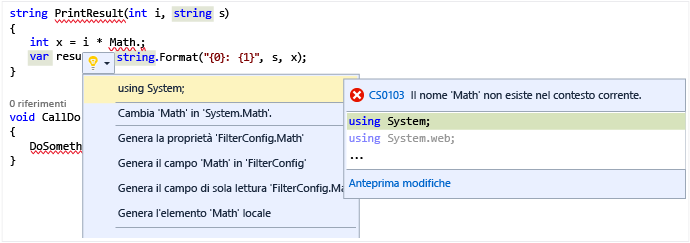

# Azioni rapide
<a id="quick-actions" class="xliff"></a>

Le [azioni rapide](refactoring-code-generation-quick-actions.md#quick-actions) consentono di generare codice, effettuarne il refactoring o modificarlo in altro modo con facilità tramite un'unica azione.  Molte Azioni rapide sono specifiche dei progetti C# o Visual Basic, mentre alcune sono valide per entrambi i tipi di progetti.  Queste azioni possono essere applicate tramite l'icona Lampadina  o premendo **Ctrl + .** quando il cursore si trova sulla riga di codice appropriata.

La lampadina viene visualizzata se è presente una sottolineatura ondulata rossa e in Visual Studio è disponibile un suggerimento per correggere l'errore. Ad esempio, se è presente un errore indicato da una sottolineatura rossa ondulata, verrà visualizzata una lampadina quando sono disponibili correzioni per tale errore. Nel caso in cui terze parti forniscano diagnostiche e suggerimenti personalizzati, ad esempio includendoli in SDK, per un qualsiasi linguaggio, le lampadine di Visual Studio si illumineranno sulla base di tali regole.  

### Per visualizzare una lampadina
<a id="to-see-a-light-bulb" class="xliff"></a>  

1. In molti casi le lampadine vengono visualizzate spontaneamente quando si posiziona il puntatore del mouse su un errore oppure sul margine destro dell'editor, quando si sposta il cursore su una riga che contiene un errore. Quando è presente una sottolineatura ondulata rossa, è possibile passarvi sopra con il puntatore del mouse per visualizzare la lampadina. È anche possibile fare in modo che la lampadina venga visualizzata quando si usa il mouse o la tastiera per spostarsi nel punto della riga in cui si verifica l'errore.  

2. Premere **Ctrl+.** in un punto qualsiasi della riga per richiamare la lampadina e passare direttamente all'elenco delle correzioni potenziali.  

     

### Per visualizzare le potenziali correzioni
<a id="to-see-potential-fixes" class="xliff"></a>  
Fare clic sulla freccia GIÙ o sul collegamento Mostra correzioni potenziali per visualizzare un elenco delle azioni rapide eseguibili automaticamente dalla lampadina.  



## Azioni rapide comuni
<a id="common-quick-actions" class="xliff"></a>
Ecco alcune delle azioni rapide comuni applicabili sia a codice C# che a codice Visual Basic.

### Aggiungere elementi case mancanti, un'istruzione case predefinita o entrambi
<a id="add-missing-casesdefault-caseboth" class="xliff"></a>
Quando si crea un'istruzione `switch` in C# o un'istruzione `Select Case` in Visual Basic, è possibile usare un'azione codice per aggiungere automaticamente elementi case mancanti, un'istruzione case predefinita o entrambi.  Per un'istruzione vuota come la seguente:

```CSharp
enum MyEnum
{
    Item1,
    Item2,
    Item3
}

...

MyEnum myEnum = MyEnum.Item1;

switch(myEnum)
{
}
```

```VB
Enum MyEnum
    Item1
    Item2
    Item3
End Enum

...

Dim myEnum as MyEnum = MyEnum.Item1

Select Case myEnum
End Select
```

l'uso dell'azione rapida **Aggiungi entrambi** per inserire sia elementi case mancanti che un'istruzione case predefinita consente di creare quanto segue:

```CSharp
switch(myEnum)
{
    case MyEnum.Item1:
        break;
    case MyEnum.Item2:
        break;
    case MyEnum.Item3:
        break;
    default:
        break;
}
```

```VB
Select Case myEnum
    Case MyEnum.Item1
        Exit Select
    Case MyEnum.Item2
        Exit Select
    Case Else
        Exit Select
End Select
```

### Correggere un tipo con errori di ortografia
<a id="correct-misspelled-type" class="xliff"></a>
Se si digita accidentalmente un tipo con errori di ortografia in Visual Studio, questa azione rapida consente di correggerlo automaticamente.  Questi elementi vengono visualizzati nel menu Lampadina come **"Modifica '*tipo con errore*' in '*tipo corretto*'**.  Ad esempio:

```CSharp
// Before
private viod MyMethod()
{
}

// Change 'viod' to 'void'

// After
private void MyMethod()
{
}
```

```VB
' Before
Function MyFunction as Intger
End Function

' Change 'Intger' to 'Integer'

' After
Function MyFunction as Integer
End Function
```

### Rimuovere un cast non necessario
<a id="remove-unnecessary-cast" class="xliff"></a>
Se si esegue il cast di un tipo a un altro tipo che non richiede un cast, l'azione rapida **Rimuovi cast non necessario** consente di rimuovere il cast dal codice.

```CSharp
// before
int number = (int)3;

// Remove Unnecessary Cast

// after
int number = 3;
```

```VB
' Before
Dim number as Integer = CType(3, Integer)

' Remove Unnecessary Cast

' After
Dim number as Integer = 3
```

### Sostituire un metodo con una proprietà o una proprietà con un metodo
<a id="replace-method-with-property--replace-property-with-method" class="xliff"></a>
Queste azioni rapide consentono di convertire un metodo in una proprietà o viceversa.  L'esempio seguente illustra la modifica da un metodo a una proprietà.  Nel caso opposto è sufficiente invertire le sezioni *Prima* e *Dopo*.

```CSharp
private int MyValue;

// Before
public int GetMyValue()
{
    return MyValue;
}

// Replace 'GetMyValue' with property

// After
public int MyValue
{
    get { return MyValue; }
}
```

```VB
Dim MyValue As Integer

' Before
Function GetMyValue() As Integer
    Return MyValue
End Function

' Replace 'GetMyValue' with property

' After
ReadOnly Property MyValue As Integer
    Get
        Return MyValue
    End Get
End Property
```

### Rendere sincrono un metodo
<a id="make-method-synchronous" class="xliff"></a>
Quando si usa la parola chiave `async` / `Async` su un metodo, si prevede che venga usata anche la parola chiave `await` / `Await` in un punto all'interno del metodo stesso.  Se tuttavia ciò non avviene, viene visualizzata un'azione rapida che consente di impostare il metodo come sincrono rimuovendo la parola chiave `async` / `Async` e modificando il tipo restituito.  Usare l'opzione **Imposta il metodo come sincrono** dal menu Azioni rapide.

```CSharp
// Before
async Task<int> MyAsyncMethod()
{
    return 3;
}

// Make method synchronous

// After
int MyAsyncMethod()
{
    return 3;
}
```

```VB
' Before
Async Function MyAsyncMethod() As Task(Of Integer)
    Return 3
End Function

' Make method synchronous

' After
Function MyAsyncMethod() As Integer
    Return 3
End Function
```

### Rendere asincrono un metodo
<a id="make-method-asynchronous" class="xliff"></a>
Quando si usa la parola chiave `await`/`Await` all'interno di un metodo, si prevede che il metodo stesso sia contrassegnato dalla parola chiave `async`/`Async`.  Se tuttavia ciò non avviene, viene visualizzata un'azione rapida che consente di impostare il metodo come asincrono.  Usare l'opzione **Rendi asincrono il metodo/Rendi asincrona la funzione** dal menu Azioni rapide.

```CSharp
// Before
int MyAsyncMethod()
{
    return await Task.Run(...);
}

// Make method synchronous

// After
async Task<int> MyAsyncMethod()
{
    return await Task.Run(...);
}
```

```VB
' Before
Function MyAsyncMethod() as Integer
    Return  Await Task.Run(...)
End Function

' Make method synchronous

' After
Async Function MyAsyncMethod() As Task(Of Integer)
    Return Await Task.Run(...)
End Function
```

### Rimuovere istruzioni using/Imports non necessarie
<a id="remove-unnecesary-usingsimports" class="xliff"></a>
L'azione rapida **Rimuovi istruzioni using non necessarie/Rimuovi istruzioni Imports non necessarie** consente di rimuovere eventuali istruzioni `using` e `Import` dal file corrente.  Quando si seleziona questo elemento, le istruzioni Imports di spazi dei nomi non usate vengono rimosse immediatamente.

### Aggiungere istruzioni using o Imports per i tipi in assembly di riferimento, pacchetti NuGet o altri tipi nella soluzione
<a id="add-usingsimports-for-types-in-reference-assemblies-nuget-packages-or-other-types-in-your-solution" class="xliff"></a>
Se si usano tipi situati in altri progetti della soluzione, l'azione rapida viene visualizzata automaticamente, ma gli altri devono essere abilitati da **Strumenti > Opzioni > C#** o nella scheda **Base > Avanzate**:  

* Suggerisci le direttive using/import per i tipi in assembly di riferimento
* Suggerisci le direttive using/import per i tipi in pacchetti NuGet

Dopo l'abilitazione, se si usa un tipo in uno spazio dei nomi non ancora importato, ma esistente in un assembly di riferimento o in un pacchetto NuGet, l'istruzione using/Imports viene creata.

```CSharp
// Before
Debug.WriteLine("Hello");

// using System.Diagnostics;

// After
using System.Diagnostics;

Debug.WriteLine("Hello");
```

```VB
' Before
Debug.WriteLine("Hello")

' Imports System.Diagnostics

// After
Imports System.Diagnostics

Debug.WriteLine("Hello")
```

### Convertire in una stringa interpolata
<a id="convert-to-interpolated-string" class="xliff"></a>
Le [stringhe interpolate](/dotnet/csharp/language-reference/keywords/interpolated-strings) rappresentano un modo semplice, simile al metodo **[String.Format](https://msdn.microsoft.com/library/system.string.format.aspx)**, per esprimere stringhe con variabili incorporate.  Questa azione rapida riconosce i casi in cui le stringhe sono concatenate o usano **String.Format** e ne modifica l'utilizzo in quello di una stringa interpolata.

```CSharp
// Before
int num = 3;
string s = string.Format("My string with {0} in the middle", num);

// Convert to interpolated string

// After
int num = 3;
string s = $"My string with {num} in the middle";
```

```VB
' Before
Dim num as Integer = 3
Dim s as String = String.Format("My string with {0} in the middle", num)

' Convert to interpolated string

' After
Dim num as Integer = 3
Dim s As String = $"My string with {num} in the middle"
```

### Rimuovere marcatori di conflitti di unione
<a id="remove-merge-conflict-markers" class="xliff"></a>
Queste azioni rapide consentono di risolvere conflitti di unione apportando una modifica che rimuove i marcatori e il codice in conflitto. Disponibile solo in Visual Studio 2017 (versione 15.3 - anteprima)


### Aggiungere controlli null per i parametri
<a id="add-null-checks-for-parameters" class="xliff"></a>
Questa azione rapida consente di aggiungere un controllo nel codice per indicare se un parametro è null. Disponibile solo in Visual Studio 2017 (versione 15.3 - anteprima)


### Miglioramenti allo strumento di generazione costruttori
<a id="constructor-generator-improvements" class="xliff"></a>
Quando si crea un costruttore, questa azione rapida consente di selezionare le proprietà o i campi da generare o di scegliere di generare il costruttore da un corpo vuoto. È possibile usarla anche per aggiungere parametri a un costruttore esistente dal sito di chiamata. Disponibile solo in Visual Studio 2017 (versione 15.3 - anteprima)


### Rimuovere variabili non usate
<a id="remove-unused-variables" class="xliff"></a>
Questa azione rapida consente di rimuovere le variabili dichiarate che non sono mai state usate nel codice. Disponibile solo in Visual Studio 2017 (versione 15.3 - anteprima)


### Generare sostituzioni
<a id="generate-overrides" class="xliff"></a>
Questa azione rapida consente di creare una sostituzione da una riga vuota in una classe o uno struct. La finestra di dialogo **Pick Members** (Seleziona membri) consente di scegliere i membri da sostituire. Disponibile solo in Visual Studio 2017 (versione 15.3 - anteprima)


### Modificare la base per i valori letterali numerici
<a id="change-base-for-numeric-literals" class="xliff"></a>
Questa azione rapida consente di convertire un valore letterale numerico da un sistema numerico di base a un altro. È possibile, ad esempio, convertire un numero in formato esadecimale o binario. Disponibile solo in Visual Studio 2017 (versione 15.3 - anteprima)


### Inserire separatori di cifre in valori letterali
<a id="insert-digit-separators-into-literals" class="xliff"></a>
Questa azione rapida consente di aggiungere caratteri separatori nei valori letterali. Disponibile solo in Visual Studio 2017 (versione 15.3 - anteprima)


### Convertire il costrutto **if** in **switch**
<a id="convert-if-construct-to-switch" class="xliff"></a>
Questa azione rapida consente di convertire un costrutto **if-then-else** in un costrutto **switch**. Disponibile solo in Visual Studio 2017 (versione 15.3 - anteprima)

```CSharp
// Before
if (obj is string s)
{
  Console.WriteLine("obj is a string: " + s);  
}

else if (obj is int i && i > 10)
{
  Console.WriteLine("obj is an int greater than 10");
}

// Convert to switch

// After
switch (obj)
{
  case string s:
    Console.WriteLine("Obj is a string: " + s);
    break;
  case int i when i > 10:
    Console.WriteLine("obj is an int greater than 10");
    break;
}
```

```VB
' Before
If TypeOf obj Is String s Then
    Console.WriteLine("obj is a string: " + s)
Else If TypeOf obj Is Integer i And i > 10 Then
    Console.WriteLine("obj is an int greater than 10")
End If

' Convert to switch

' After
Select Case obj
  Case String s
    Console.WriteLine("Obj is a string: " + s)
    Exit Sub
  Case Integer i when i > 10
    Console.WriteLine("obj is an int greater than 10")
    Exit Sub
End Select
```

# Vedere anche
<a id="see-also" class="xliff"></a>
* [Stili di codice e azioni rapide](code-styles-and-quick-actions.md)

