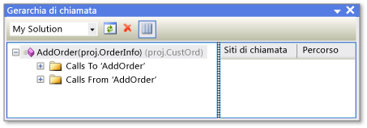

# Gerarchia delle chiamate
[!INCLUDE[vs2017banner](../../code-quality/includes/vs2017banner.md)]

La gerarchia delle chiamate consente di spostarsi nel codice visualizzando tutte le chiamate da e verso un metodo, una proprietà, o un costruttore selezionato.  In questo modo è possibile comprendere meglio il flusso del codice e valutare gli effetti delle modifiche al codice.  Si possono esaminare diversi livelli di codice per visualizzare le complesse catene di chiamate al metodo e gli altri punti di ingresso al codice che consentono di esplorare tutti i possibili percorsi di esecuzione.  
  
 La gerarchia di chiamata è disponibile in fase di progettazione, a differenza dello stack di chiamate che viene visualizzato dal debugger.  
  
## Utilizzo della finestra Gerarchia di chiamata  
 Per visualizzare la finestra **Gerarchia di chiamata** fare clic con il pulsante destro del mouse sul nome di un metodo, una proprietà o una chiamata al costruttore, quindi scegliere **Visualizza gerarchia di chiamata**.  
  
 Il nome del membro viene visualizzato in un riquadro di visualizzazione ad albero nella finestra **Gerarchia di chiamata**.  Se si espande il nodo del membro vengono visualizzati i sottonodi **Chiamate a** *nome del membro* e **Chiamate da** *nome del membro*.  Nell'illustrazione seguente vengono mostrati questi nodi nella finestra **Gerarchia di chiamata**.  
  
   
Finestra Gerarchia di chiamata  
  
-   Se si espande il nodo **Chiamate a**, vengono visualizzati tutti i membri che chiamano il membro selezionato.  
  
-   Se si espande il nodo **Chiamate da**, vengono visualizzati tutti i membri che vengono chiamati dal membro selezionato.  
  
 Successivamente è possibile espandere ognuno dei membri del sottonodo in nodi **Chiamate a** e **Chiamate da**.  Questa operazione consente di spostarsi nello stack di chiamanti, come mostrato nell'illustrazione seguente.  
  
   
Finestra Gerarchia di chiamata  
  
 Per i membri definiti virtuali o astratti, viene visualizzato un nodo **Esegui override nome metodo**.  Per i membri di interfaccia, viene visualizzato un nodo **Implementa nome metodo**.  Questi nodi espandibili vengono visualizzati allo stesso livello dei nodi **Chiamate a** e **Chiamate da**.  
  
 La casella **Ambito di ricerca** nella barra degli strumenti include opzioni per **Soluzione personale**, **Progetto corrente** e **Documento corrente**.  
  
 Quando si seleziona un membro figlio nel riquadro di visualizzazione ad albero **Gerarchia di chiamata**:  
  
-   Il riquadro dettagli **Gerarchia di chiamata** visualizza tutte le righe di codice nelle quali il membro figlio viene chiamato dal membro padre.  
  
-   **Finestra Definizione codice**, se aperta, viene visualizzato il membro selezionato.  Questa finestra è disponibile in c\# e C\+\+.  Per ulteriori informazioni su questa finestra, vedere [Visualizzazione della struttura del codice](../../ide/viewing-the-structure-of-code.md).  
  
> [!NOTE]
>  Gerarchia di chiamata non consente di individuare riferimenti al gruppo di metodi, che includono posizioni dove un metodo viene aggiunto come gestore eventi o viene assegnato a un delegato.  Per trovare tutti i riferimenti a un metodo, è possibile utilizzare il comando **Trova tutti i riferimenti**.  
  
## Voci di menu di scelta rapida  
 Nella tabella seguente vengono descritte diverse opzioni del menu di scelta rapida, disponibili quando si fa clic con il pulsante destro del mouse su un nodo nel riquadro della visualizzazione struttura ad albero.  
  
|Voce di menu di scelta rapida|Descrizione|  
|-----------------------------------|-----------------|  
|**Aggiungi come nuova radice**|Consente di aggiungere il nodo selezionato al riquadro della visualizzazione struttura ad albero come un nuovo nodo radice.  Consente di concentrarsi su un sottoalbero specifico.|  
|**Rimuovi radice**|Consente di rimuovere il nodo radice selezionato dal riquadro della visualizzazione struttura ad albero.  Questa opzione è disponibile solo da un nodo radice.   Per rimuovere il nodo radice selezionato si può utilizzare anche il pulsante della barra degli strumenti **Rimuovi radice**.|  
|**Vai a definizione**|Consente di eseguire il comando Vai a definizione nel nodo selezionato.  Questa operazione consente di passare alla definizione originale per una chiamata al membro o a una definizione di variabile.   Per eseguire il comando Vai a definizione nel nodo selezionato, è inoltre possibile fare doppio clic sul nodo selezionato o premere F12.|  
|**Trova tutti i riferimenti**|Consente di eseguire il comando Trova tutti i riferimenti nel nodo selezionato.  Questa operazione permette di trovare tutte le righe di codice del progetto che fanno riferimento a una classe o un membro.   Per eseguire il comando Trova tutti i riferimenti nel nodo selezionato è possibile utilizzare anche MAIUSC\+F12.|  
|**Copia**|Consente di copiare il contenuto del nodo selezionato \(ma non i relativi sottonodi\).|  
|**Aggiorna**|Consente di comprimere il nodo selezionato in modo che una volta riespanso vengano visualizzate le informazioni correnti.|