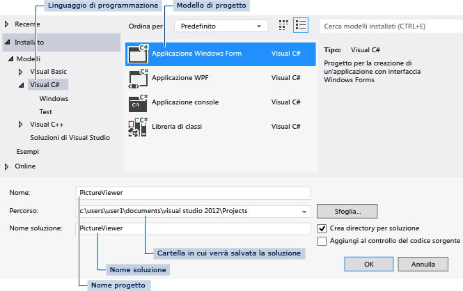

# Passaggio 1: creare un progetto di applicazione Windows Form
[!INCLUDE[vs2017banner](../code-quality/includes/vs2017banner.md)]

Quando si crea un visualizzatore di immagini, il primo passaggio consiste nella creazione di un progetto di applicazione Windows Form.  
  
  Per una versione video di questo argomento, vedere [Esercitazione 1: creare un visualizzatore di immagini in Visual Basic \- Video 1](http://go.microsoft.com/fwlink/?LinkId=205209) oppure [Esercitazione 1: creare un visualizzatore di immagini in C\# \- Video 1](http://go.microsoft.com/fwlink/?LinkId=205199).  In questi video viene utilizzata una versione precedente di Visual Studio, pertanto vi sono piccole differenze in alcuni comandi di menu e altri elementi dell'interfaccia utente.  Tuttavia, i concetti e le procedure funzionano in modo analogo nella versione corrente di Visual Studio.  
  
### Per creare un progetto Applicazione Windows Form  
  
1.  Sulla barra dei menu scegliere **File**, **Nuovo**, **Progetto**.  Verrà visualizzata una finestra di dialogo simile alla seguente.  
  
       
Finestra di dialogo Nuovo progetto  
  
2.  Scegliere **Visual C\#** o **Visual Basic** dall'elenco **Modelli installati**.  
  
3.  Nell'elenco di modelli scegliere l'icona **Applicazione Windows Form**.  Assegnare il nome PictureViewer al nuovo form, quindi scegliere il pulsante **OK**.  
  
     Visual Studio crea una soluzione per il programma.  Una soluzione funge da contenitore per tutti i progetti e i file richiesti dal programma.  Questi termini verranno spiegati dettagliatamente più avanti in questa esercitazione.  
  
4.  Nella figura seguente viene illustrato ciò che si dovrebbe vedere nell'interfaccia di Visual Studio.  
  
    > [!NOTE]
    >  Il layout delle finestre potrebbe non essere esattamente uguale a questa illustrazione.  Il layout preciso della finestra dipende dalla versione di Visual Studio, dal linguaggio di programmazione in uso e da altri fattori.  Tuttavia, è necessario verificare che tutte e tre le finestre siano visualizzate.  
  
       
Finestra IDE  
  
     L'interfaccia contiene tre finestre: una finestra principale, **Esplora soluzioni** e **Proprietà**.  
  
     Se manca una di queste finestre, ripristinare il layout di finestra predefinito, scegliendo **Finestra**, **Reimposta layout finestra** dalla barra dei menu.  È inoltre possibile visualizzare le finestre tramite i comandi di menu.  Sulla barra dei menu scegliere **Visualizza**, **Finestra proprietà** o **Esplora soluzioni**.  Se sono aperte altre finestre, chiuderle scegliendo il pulsante **Chiudi** \(x\) negli angoli in alto a destra.  
  
5.  Nella figura sono illustrate le finestre seguenti \(in senso orario dall'angolo superiore sinistro\):  
  
    -   **Finestra principale** In questa finestra viene eseguita la maggior parte del lavoro, come l'utilizzo dei form e la modifica del codice.  Nella finestra illustrata nella figura viene visualizzato un form nell'Editor di form.  Nella parte superiore della finestra vengono visualizzate la scheda **Pagina iniziale** e la scheda **Form1.cs \[Progettazione\]**. In Visual Basic il nome della scheda termina con .vb anziché .cs.  
  
    -   **Finestra Esplora soluzioni** In questa finestra è possibile visualizzare tutti gli elementi della soluzione e spostarsi tra di essi.  Se si sceglie un file, cambia il contenuto della finestra **Proprietà**.  Se si apre un file di codice \(che termina con l'estensione CS in Visual C\# e VB in Visual Basic\), viene visualizzato il file stesso o la relativa finestra di progettazione.  Una finestra di progettazione è una superficie visiva in cui è possibile aggiungere controlli quali pulsanti ed elenchi.  Per i form di Visual Studio, la finestra di progettazione è denominata Progettazione Windows Form.  
  
    -   **Finestra Proprietà** In questa finestra si modificano le proprietà degli elementi scelti in altre finestre.  Ad esempio, se si sceglie Form1, è possibile modificarne il titolo impostando la proprietà **Text** e il colore di sfondo impostando la proprietà **Backcolor**.  
  
    > [!NOTE]
    >  Nella riga superiore in **Esplora soluzioni** è riportata la dicitura **Soluzione "PictureViewer" \(1 progetto\)** per indicare che è stata creata una soluzione in Visual Studio.  Una soluzione può contenere più progetti, ma per ora verranno utilizzate soluzioni che contengono un solo progetto.  
  
6.  Sulla barra dei menu scegliere **File**, **Salva tutto**.  
  
     In alternativa, scegliere il pulsante **Salva tutto** sulla barra degli strumenti, come illustrato nella figura seguente.  
  
       
Pulsante della barra degli strumenti Salva tutto  
  
     In Visual Studio il nome della cartella e il nome del progetto vengono compilati automaticamente. Il progetto viene quindi salvato nella cartella dei progetti.  
  
### Per continuare o rivedere l'esercitazione  
  
-   Per andare al passaggio successivo dell'esercitazione, vedere [Passaggio 2: eseguire il programma](../ide/step-2-run-your-program.md).  
  
-   Per tornare all'argomento introduttivo, vedere [Esercitazione 1: creare un visualizzatore immagini](../ide/tutorial-1-create-a-picture-viewer.md).