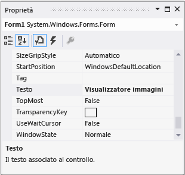

# Passaggio 3: impostare le propriet&#224; del form
[!INCLUDE[vs2017banner](../code-quality/includes/vs2017banner.md)]

In questo passaggio si utilizza la finestra **Proprietà** per modificare l'aspetto del form.  
  
  Per una versione video di questo argomento, vedere [Esercitazione 1: creare un visualizzatore di immagini in Visual Basic \- Video 1](http://go.microsoft.com/fwlink/?LinkId=205209) oppure [Esercitazione 1: creare un visualizzatore di immagini in C\# \- Video 1](http://go.microsoft.com/fwlink/?LinkId=205199).  In questi video viene utilizzata una versione precedente di Visual Studio, pertanto vi sono piccole differenze in alcuni comandi di menu e altri elementi dell'interfaccia utente.  Tuttavia, i concetti e le procedure funzionano in modo analogo nella versione corrente di Visual Studio.  
  
### Per impostare le proprietà del form  
  
1.  Assicurarsi che sia visualizzato Progettazione Windows Form.  Nell'ambiente di sviluppo integrato \(IDE\) di Visual Studio, scegliere la scheda **Form1.cs \[Progettazione\]** \(o **Form1.vb \[Progettazione\]** in Visual Basic\).  
  
2.  Fare clic in qualsiasi punto all'interno del form **Form1** per selezionarlo.  Analizzare la finestra **Proprietà**, che ora visualizza le proprietà per il form.  I form dispongono di diverse proprietà.  Ad esempio, è possibile impostare il colore primo piano e di sfondo, il testo del titolo visualizzato all'inizio del form, le dimensioni del form e altre proprietà.  
  
    > [!NOTE]
    >  Se la finestra **Proprietà** non è visualizzata, arrestare il programma facendo clic sul pulsante quadrato **Interrompi debug** sulla barra degli strumenti o semplicemente chiudere la finestra.  Se il programma viene arrestato e la finestra **Proprietà** non viene visualizzata, sulla barra dei menu scegliere **Visualizza**, **Finestra proprietà**.  
  
3.  Dopo aver selezionato il form, individuare la proprietà **Text** nella finestra **Proprietà**.  A seconda di come è ordinato l'elenco, potrebbe essere necessario scorrere verso il basso.  Scegliere **Text**, digitare Visualizzatore immagini, quindi premere INVIO.  Nella barra del titolo del form dovrebbe ora essere presente il testo **Visualizzatore immagini** e la finestra **Proprietà** dovrebbe essere simile a quella riportata nell'immagine seguente.  
  
       
Finestra Proprietà  
  
    > [!NOTE]
    >  Le proprietà possono essere ordinate in base alla visualizzazione Per categoria o In ordine alfabetico.  È possibile passare da una visualizzazione all'altra tramite i pulsanti nella finestra **Proprietà**.  In questa esercitazione è più facile trovare le proprietà tramite la visualizzazione In ordine alfabetico.  
  
4.  Tornare a Progettazione Windows Form.  Fare clic sul quadratino di trascinamento nella parte inferiore destra del form, ovvero il quadratino bianco in basso a destra del form il cui aspetto è il seguente.  
  
       
Quadratino di trascinamento  
  
     Trascinare il punto di controllo per ridimensionare il form in modo che sia più largo e leggermente più alto.  
  
5.  Analizzare la finestra **Proprietà** e notare che la proprietà **Size** è stata modificata.  La proprietà **Size** viene modificata ogni volta che si ridimensiona il form.  Provare a trascinare il punto di controllo del form per ridimensionarlo approssimativamente alle dimensioni 550, 350 \(non occorre essere precisi\), che dovrebbero essere adatte per questo progetto.  In alternativa, è possibile immettere i valori direttamente nella proprietà **Size**, quindi premere INVIO.  
  
6.  Eseguire di nuovo il programma.  È possibile utilizzare uno qualsiasi dei seguenti metodi per eseguire il programma.  
  
    -   Premere **F5**.  
  
    -   Sulla barra dei menu scegliere **Debug**, **Avvia debug**.  
  
    -   Sulla barra degli strumenti scegliere il pulsante **Avvia debug** visualizzato di seguito.  
  
           
Pulsante Avvia debug della barra degli strumenti  
  
     Esattamente come in precedenza, l'IDE compila ed esegue il programma e viene visualizzata una finestra.  
  
7.  Prima di andare al passaggio successivo, arrestare il programma, perché l'IDE non consente di modificare il programma mentre è in esecuzione.  È possibile utilizzare uno qualsiasi dei seguenti metodi per arrestare il programma.  
  
    -   Sulla barra degli strumenti scegliere il pulsante **Interrompi debug**.  
  
    -   Sulla barra del menu scegliere **Debug**, **Interrompi debug**.  
  
    -   Scegliere il pulsante X nell'angolo superiore della finestra **Form1**.  
  
### Per continuare o rivedere l'esercitazione  
  
-   Per andare al passaggio successivo dell'esercitazione, vedere [Passaggio 4: creare il layout del form con un controllo TableLayoutPanel](../ide/step-4-lay-out-your-form-with-a-tablelayoutpanel-control.md).  
  
-   Per tornare al passaggio precedente dell'esercitazione, vedere [Passaggio 2: eseguire il programma](../ide/step-2-run-your-program.md).