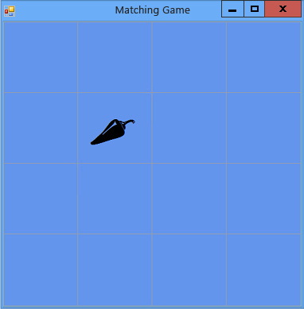

# Passaggio 5: aggiungere riferimenti alle etichette
[!INCLUDE[vs2017banner](../code-quality/includes/vs2017banner.md)]

Il programma deve tenere traccia dei controlli etichetta scelti dal giocatore.  Al momento il programma mostra tutte le etichette scelte dal giocatore,  ma è possibile modificare questa impostazione.  Una volta scelta la prima etichetta, il programma dovrebbe visualizzarne l'icona.  Una volta scelta la seconda etichetta, il programma dovrebbe visualizzare entrambe le icone per un istante, quindi renderle nuovamente invisibili.  Il programma terrà ora traccia del controllo etichetta scelto per primo e per secondo utilizzando *variabili di riferimento*.  
  
### Per aggiungere riferimenti alle etichette  
  
1.  Aggiungere i riferimenti alle etichette nel form utilizzando il codice seguente.  
  
     [!CODE [VbExpressTutorial4Step5#5](../CodeSnippet/VS_Snippets_VBCSharp/vbexpresstutorial4step5#5)]  
  
     Queste variabili di riferimento sono simili alle istruzioni utilizzate in precedenza per aggiungere oggetti \(ad esempio oggetti `Timer`, `List` e `Random`\) al form.  Tuttavia, tramite queste istruzioni non vengono visualizzati due controlli etichetta aggiuntivi nel form poiché, nessuna delle due istruzioni contiene la parola chiava `new`.  Senza la parola chiave `new` non viene creato alcun oggetto.  Per questo motivo `firstClicked` e `secondClicked` sono definiti variabili di riferimento: tengono semplicemente traccia di \(o fanno riferimento a\) oggetti `Label`.  
  
     Quando una variabile non tiene traccia di un oggetto, viene impostata su un valore riservato: `null` in Visual C\# e `Nothing` in Visual Basic.  Quando il programma viene avviato, quindi, `firstClicked` e `secondClicked` vengono impostati su `null` o `Nothing`, il che significa che le variabili non tengono traccia di alcun oggetto.  
  
2.  Modificare il gestore degli eventi Click per utilizzare la nuova variabile di riferimento `firstClicked`.  Rimuovere l'ultima istruzione nel metodo del gestore degli eventi `label_Click()` \(`clickedLabel.ForeColor = Color.Black;`\) e sostituirla con l'istruzione `if` seguente. Assicurarsi di includere il commento e l'intera istruzione `if`.  
  
     [!CODE [VbExpressTutorial4Step5#6](../CodeSnippet/VS_Snippets_VBCSharp/vbexpresstutorial4step5#6)]  
  
3.  Salvare ed eseguire il programma.  Scegliere uno dei controlli etichetta; verrà visualizzata la relativa icona.  
  
4.  Scegliere il controllo etichetta successivo. Non accadrà nulla.  Il programma sta già tenendo traccia della prima etichetta scelta dal giocatore, pertanto `firstClicked` non è uguale a `null` in Visual C\# o `Nothing` in Visual Basic.  Quando l'istruzione `if` controlla `firstClicked` per stabilire se sia uguale a `null` o `Nothing`, rileva che non lo è e non esegue le istruzioni contenute nell'istruzione `if`.  Per cui soltanto la prima icona scelta diventa nera, mentre le altre icone sono invisibili, come mostrato nell'immagine seguente.  
  
       
Gioco delle coppie con un'icona visualizzata  
  
     Questa situazione verrà corretta nel passaggio successivo dell'esercitazione aggiungendo un controllo **Timer**.  
  
### Per continuare o rivedere l'esercitazione  
  
-   Per andare al passaggio successivo dell'esercitazione, vedere [Passaggio 6: aggiungere un timer](../Topic/Step%206:%20Add%20a%20Timer.md).  
  
-   Per tornare al passaggio precedente dell'esercitazione, vedere [Passaggio 4: aggiungere un gestore degli eventi Click a ogni etichetta](../Topic/Step%204:%20Add%20a%20Click%20Event%20Handler%20to%20Each%20Label.md).