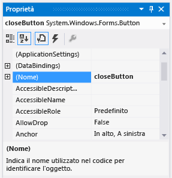

# Passaggio 6: assegnare un nome ai pulsanti
Nel form esiste un solo controllo PictureBox. Quando è stato aggiunto, l'IDE lo ha automaticamente denominato **pictureBox1**. Esiste solo un controllo CheckBox, denominato **checkBox1**. Presto si scriverà del codice che farà riferimento ai controlli CheckBox e PictureBox. Poiché è presente uno solo di ognuno di questi controlli, sarà possibile riconoscerlo quando si vedrà **pictureBox1** o **checkBox1** nel codice.  
  
> [!NOTE]
>  In Visual Basic, l'impostazione predefinita per la prima lettera di qualsiasi nome di controllo è la maiuscola, pertanto i nomi sono **PictureBox1**, **CheckBox1**e così via.  
  
 Vi sono quattro pulsanti nel form e l'IDE li ha denominati **button1**, **button2**, **button3**e **button4**. Da un semplice sguardo ai nomi correnti non è possibile capire quale pulsante corrisponda al pulsante **Chiudi** e quale corrisponda al pulsante **Visualizza immagine** . È questo il motivo per cui è utile assegnare nomi più descrittivi ai pulsanti.  
  
 Per una versione video di questo argomento, vedere [Tutorial 1: Create a Picture Viewer in Visual Basic - Video 3](http://go.microsoft.com/fwlink/?LinkId=205213) (Esercitazione 1: creare un visualizzatore di immagini in Visual Basic) o [Tutorial 1: Create a Picture Viewer in C# - Video 3](http://go.microsoft.com/fwlink/?LinkId=205202) (Esercitazione 1: creare un visualizzatore di immagini in C# - Video 3). In questi video viene usata una versione precedente di Visual Studio, pertanto vi sono piccole differenze in alcuni comandi di menu e altri elementi dell'interfaccia utente. Tuttavia, i concetti e le procedure funzionano in modo analogo nella versione corrente di Visual Studio.  
  
### Per assegnare un nome ai pulsanti  
  
1.  Nel form scegliere il pulsante **Chiudi** . Se sono ancora selezionati tutti i pulsanti, premere ESC per annullare la selezione. Scorrere nella finestra **Proprietà** fino a quando non viene visualizzata la proprietà **(Name)**. La proprietà **(Name)** è disponibile nella parte iniziale quando le proprietà sono ordinate alfabeticamente. Impostare il nome su **closeButton**, come mostrato nell'immagine seguente.  
  
       
Finestra Proprietà con il nome closeButton  
  
    > [!NOTE]
    >  Se si prova a modificare il nome del pulsante in **closeButton**, con uno spazio tra le parole close e Button, l'IDE visualizza un messaggio di errore: "Valore di proprietà non valido". Gli spazi (e alcuni altri caratteri) non sono consentiti nei nomi dei controlli.  
  
2.  Rinominare gli altri tre pulsanti **backgroundButton**, **clearButton**e **showButton**. È possibile verificare i nomi facendo clic sull'elenco a discesa del selettore dei controlli nella finestra **Proprietà** . Vengono visualizzati i nuovi nomi dei pulsanti.  
  
3.  Fare doppio clic sul pulsante **Visualizza immagine** nel form. In alternativa, scegliere il pulsante **Visualizza immagine** nel form, quindi premere INVIO. Quando si esegue questa operazione, nell''IDE viene aperta una scheda aggiuntiva nella finestra principale denominata **Form1.cs** (**Form1.vb** se si usa Visual Basic). In questa scheda è riportato il file di codice sottostante del form, come illustrato nell'immagine seguente.  
  
       
Scheda Form1.cs con codice Visual C#  
  
4.  Concentrare l'attenzione su questa parte del codice. Se si usa Visual Basic, scegliere la scheda **VB** nell'area sottostante per visualizzare la versione Visual Basic del codice.  
  
     [!code-vb[VbExpressTutorial1Step6#1](../ide/codesnippet/VisualBasic/step-6-name-your-button-controls_1.vb)]
     [!code-cs[VbExpressTutorial1Step6#1](../ide/codesnippet/CSharp/step-6-name-your-button-controls_1.cs)]  
  
     Si tratta del codice denominato `showButton_Click()` È stato aggiunto dall'IDE nel codice del form quando si è aperto il file di codice per il pulsante **showButton** . In fase di progettazione, quando si apre il file di codice per un controllo in un form, il codice, se non esiste già, viene generato per il controllo. Questo codice, noto come *metodo*, viene eseguito quando si esegue il programma e si sceglie il controllo, in questo caso il pulsante **Visualizza immagine** .  
  
    > [!NOTE]
    >  In questa esercitazione, il codice di Visual Basic che viene generato automaticamente è stato semplificato rimuovendo tutto il contenuto compreso tra le parentesi, (). Ogniqualvolta si verifica ciò, è possibile rimuovere lo stesso codice. Il programma funzionerà in entrambi i casi. Per il resto delle esercitazioni, eventuale codice generato automaticamente verrà semplificato, se possibile.  
  
5.  Scegliere nuovamente la scheda Progettazione Windows Form (**Form1.cs [Progettazione]** in Visual C#, **Form1.vb [Progettazione]** in Visual Basic) e aprire il file di codice per il pulsante **Cancella immagine** per creare un metodo per tale pulsante nel codice del form. Ripetere questa operazione per i restanti due pulsanti. L'IDE aggiunge ogni volta un nuovo metodo al file del codice del form.  
  
6.  Per aggiungere un ulteriore metodo, aprire il file di codice per il controllo CheckBox in Progettazione Windows Form, in modo che tramite l'IDE venga aggiunto un metodo `checkBox1_CheckedChanged()` . Tale metodo viene chiamato ogni volta che l'utente seleziona o deseleziona la casella di controllo.  
  
    > [!NOTE]
    >  Quando si crea un programma, si passa spesso dall'editor di codice a Progettazione Windows Form e viceversa. L'IDE facilita lo spostamento nel progetto. Usare **Esplora soluzioni** per aprire Progettazione Windows Form facendo doppio clic su **Form1.cs** in Visual C# o **Form1.vb** in Visual Basic oppure scegliere **Visualizza**, **Finestra di progettazione**sulla barra dei menu.  
  
     Di seguito viene mostrato il nuovo codice visualizzato nell'editor di codice.  
  
     [!code-vb[VbExpressTutorial1Step6#2](../ide/codesnippet/VisualBasic/step-6-name-your-button-controls_2.vb)]
     [!code-cs[VbExpressTutorial1Step6#2](../ide/codesnippet/CSharp/step-6-name-your-button-controls_2.cs)]  
  
     I cinque metodi aggiunti sono denominati *gestori di eventi*, perché vengono chiamati dal programma ogni volta che si verifica un evento, ad esempio, quando un utente sceglie un pulsante o seleziona una casella.  
  
     Quando si visualizza il codice per un controllo nell'IDE in fase di progettazione, in Visual Studio viene aggiunto un metodo del gestore eventi per il controllo, se non è presente. Ad esempio, quando si fa doppio clic su un pulsante, nell'IDE viene aggiunto un gestore dell'evento per il relativo evento Click, che viene chiamato ogni volta che l'utente fa clic sul pulsante. Quando si fa doppio clic su una casella di controllo, l'IDE aggiunge un gestore dell'evento per il relativo evento CheckedChanged (che viene chiamato ogniqualvolta l'utente seleziona o deseleziona la casella).  
  
     Dopo aver aggiunto un gestore dell'evento per un controllo, è possibile tornarvi in qualsiasi momento da Progettazione Windows Form facendo doppio clic sul controllo o scegliendo **Visualizza**, **Codice**sulla barra dei menu.  
  
     I nomi sono importanti quando si compilano programmi e i metodi (inclusi i gestori di eventi) possono avere qualsiasi nome si desideri. Quando si aggiunge un gestore dell'evento con l'IDE, viene creato un nome basato sul nome del controllo e sull'evento gestito. Ad esempio, l'evento Click per un pulsante denominato **showButton** viene chiamato metodo del gestore dell'evento `showButton_Click()` . Inoltre, vengono generalmente aggiunte le parentesi di apertura e chiusura () dopo il nome del metodo, per indicare che si tratta di metodi. Se si decide di modificare il nome di una variabile di codice, fare clic con il pulsante destro del mouse sulla variabile nel codice, quindi scegliere **Refactoring**, **Rinomina**. Tutte le istanze della variabile nel codice vengono rinominate. Per altre informazioni, vedere [Refactoring di ridenominazione (C#)](../csharp-ide/refactoring/rename.md) o [Refactoring di ridenominazione (Visual Basic)](../vb-ide/refactoring/rename.md).
  
### Per continuare o rivedere l'esercitazione  
  
-   Per andare al passaggio successivo dell'esercitazione, vedere [Passaggio 7: aggiungere componenti della finestra di dialogo al form](../ide/step-7-add-dialog-components-to-your-form.md).  
  
-   Per tornare al passaggio precedente dell'esercitazione, vedere [Passaggio 5: aggiungere controlli al form](../ide/step-5-add-controls-to-your-form.md).

<!--HONumber=Feb17_HO4-->

