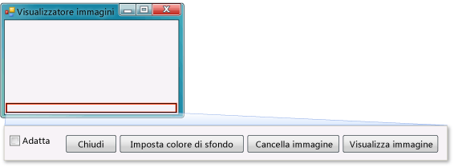

# Passaggio 9: rivedere, commentare e testare il codice
[!INCLUDE[vs2017banner](../code-quality/includes/vs2017banner.md)]

Successivamente si aggiunge un commento al codice.  Un commento è una nota che non modifica il comportamento del programma  Facilita la comprensione del codice da parte di altri utenti.  L'aggiunta di commenti al codice è un'operazione consigliabile.  In Visual C\# due barre \(\/\/\) contrassegnano una riga come commento.  In Visual Basic viene utilizzata una virgoletta singola \('\) per contrassegnare una riga come commento.  Dopo aver aggiunto un commento, si testa il programma.  È consigliabile eseguire frequentemente e testare il codice mentre si lavora sui progetti, in modo che sia possibile intercettare e correggere eventuali problemi, prima che il codice diventi più complesso.  Ciò è detto *test iterativo*.  
  
 Si è appena compilato un programma che funziona e sebbene non sia ancora finito, è già in grado di caricare un'immagine.  Prima di aggiungere un commento al codice e di testarlo, prendere tempo per rivedere i concetti di codifica, poiché tali concetti si utilizzeranno frequentemente:  
  
-   Quando si è fatto doppio clic sul pulsante **Visualizza immagine** in Progettazione Windows Form, l'IDE ha aggiunto automaticamente un *metodo* al codice del programma.  
  
-   I metodi rappresentano la modalità di organizzazione del codice, vale a dire il modo in cui viene raggruppato il codice.  
  
-   Nella maggior parte dei casi, un metodo esegue un piccolo numero di operazioni in un ordine specifico, come ad esempio il metodo `showButton_Click()`, che visualizza una finestra di dialogo e quindi carica un'immagine.  
  
-   Un metodo è costituito da *istruzioni* o righe di codice.  Un metodo può essere considerato un modo per raggruppare istruzioni d codice.  
  
-   Quando un metodo viene eseguito, o *chiamato*, le istruzioni nel metodo vengono eseguite in ordine, una dopo l'altra, a cominciare dalla prima.  
  
     Di seguito è riportato un esempio di istruzione.  
  
    ```c#  
    pictureBox1.Load(openFileDialog1.FileName);  
    ```  
  
    ```vb#  
    pictureBox1.Load(openFileDialog1.FileName)  
    ```  
  
     Le istruzioni consentono ai programmi di eseguire azioni.  In Visual C\# un'istruzione termina sempre con un punto e virgola.  In Visual Basic la fine di una riga è la fine di un'istruzione. In Visual Basic non sono necessari punti e virgola. L'istruzione precedente indica al controllo `PictureBox` di caricare il file selezionato dall'utente con il componente **OpenFileDialog**.  
  
  Per una versione video di questo argomento, vedere [Esercitazione 1: creare un visualizzatore di immagini in Visual Basic \- Video 5](http://go.microsoft.com/fwlink/?LinkId=205216) oppure [Esercitazione 1: creare un visualizzatore di immagini in C\# \- Video 5](http://go.microsoft.com/fwlink/?LinkId=205206).  In questi video viene utilizzata una versione precedente di Visual Studio, pertanto vi sono piccole differenze in alcuni comandi di menu e altri elementi dell'interfaccia utente.  Tuttavia, i concetti e le procedure funzionano in modo analogo nella versione corrente di Visual Studio.  
  
### Per aggiungere commenti  
  
1.  Aggiungere il seguente commento al codice.  
  
     [!code-vb[VbExpressTutorial1Step9_10#1](../ide/codesnippet/VisualBasic/step-9-review-comment-and-test-your-code_1.vb)]
     [!code-cs[VbExpressTutorial1Step9_10#1](../ide/codesnippet/CSharp/step-9-review-comment-and-test-your-code_1.cs)]  
  
    > [!NOTE]
    >  Il gestore dell'evento Click del pulsante **showButton** è ora completato e funziona.  Si è iniziato a scrivere codice, iniziando con l'istruzione `if`.  L'istruzione `if` indica al programma di eseguire le operazioni seguenti: "Controlla questa condizione e se è vera, esegui queste azioni". In questo caso si indica al programma di aprire la finestra di dialogo **Apri file** e se l'utente seleziona un file e sceglie il pulsante **OK**, di caricare tale file in PictureBox.  
  
    > [!TIP]
    >  L'IDE è compilato in modo da semplificare la scrittura del codice anche tramite i *frammenti di codice*.  Un frammento è un collegamento che viene espanso in un piccolo blocco di codice.  
    >   
    >  È possibile visualizzare tutti i frammenti disponibili.  Sulla barra dei menu scegliere **Strumenti**, **Gestione frammenti di codice**.  Per Visual C\# il frammento `if` si trova in **Visual C\#**.  Per Visual Basic i frammenti di codice `if` si trovano in **Istruzioni condizionali e cicli**, **Modelli di codice**.  È possibile utilizzare questo strumento di gestione per esplorare frammenti esistenti o aggiungere frammenti personalizzati.  
    >   
    >  Per attivare un frammento quando si digita il codice, digitarlo e premere TAB.  Molti frammenti vengono visualizzati nella finestra di **IntelliSense**, ragion per cui si sceglie il tasto TAB due volte: prima per selezionare il frammento dalla finestra di **IntelliSense**, quindi per indicare all'IDE di utilizzare il frammento. Si noti che IntelliSense supporta il frammento `if`, ma non il frammento `ifelse`.  
  
2.  Prima di eseguire il programma, salvarlo facendo clic sul pulsante della barra degli strumenti **Salva tutto**, visualizzato di seguito.  
  
       
Pulsante Salva tutto  
  
     In alternativa, sulla barra dei menu scegliere **File**, **Salva tutto** per salvare il proprio programma.  Una procedura consigliata consiste nel salvare presto e spesso.  
  
     Quando viene eseguito, il programma sarà analogo all'immagine riportata di seguito.  
  
       
Visualizzatore immagini  
  
### Per eseguire il programma  
  
1.  Premere F5 o fare clic sul pulsante della barra degli strumenti **Avvia debug**.  
  
2.  Scegliere il pulsante **Visualizza immagine** per eseguire il codice appena scritto.  Il programma apre prima la finestra di dialogo **Apri file**.  Verificare che i filtri vengano visualizzati nell'elenco a discesa **Tipo file** nella parte inferiore della finestra di dialogo.  Passare quindi a un'immagine e aprirla.  In genere è possibile trovare immagini di esempio che vengono fornite con il sistema operativo Windows nella cartella **Documenti**, che si trova all'interno della cartella **Immagini\\Immagini campione**.  
  
    > [!NOTE]
    >  Se nella finestra di dialogo relativa alla selezione di un file immagine non sono presenti immagini, assicurarsi che il filtro "Tutti i file \(\*.\*\)" sia selezionato nell'elenco a discesa sul lato inferiore destro della finestra di dialogo.  
  
3.  Caricare un'immagine. L'immagine viene visualizzata in PictureBox.  Provare quindi a ridimensionare il form trascinandone i bordi.  Poiché PictureBox è ancorato all'interno di TableLayoutPanel, il quale è a sua volta ancorato all'interno del form, l'area dell'immagine verrà ridimensionata in modo da eguagliare la larghezza del form e da riempire il 90% del form nella parte superiore.  È per questo motivo che sono stati utilizzati i contenitori TableLayoutPanel e FlowLayoutPanel: mantengono le dimensioni corrette del form quando l'utente lo ridimensiona.  
  
     A questo punto le immagini più grandi superano i bordi del visualizzatore immagini.  Nel prossimo passaggio verrà aggiunto il codice per adattare le immagini alla finestra.  
  
### Per continuare o rivedere l'esercitazione  
  
-   Per andare al passaggio successivo dell'esercitazione, vedere [Passaggio 10: scrivere codice per pulsanti aggiuntivi e una casella di controllo](../Topic/Step%2010:%20Write%20Code%20for%20Additional%20Buttons%20and%20a%20Check%20Box.md).  
  
-   Per tornare al passaggio precedente dell'esercitazione, vedere [Passaggio 8: scrivere il codice per il gestore dell'evento del pulsante Visualizza immagine](../ide/step-8-write-code-for-the-show-a-picture-button-event-handler.md).